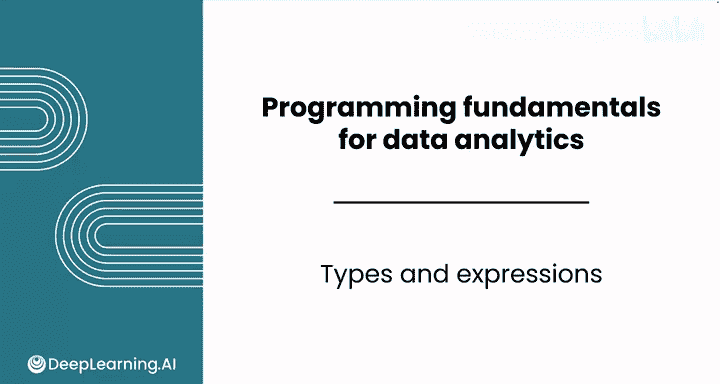
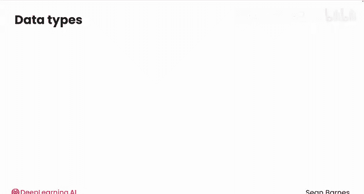
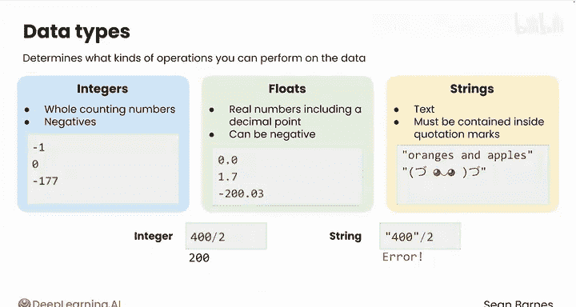
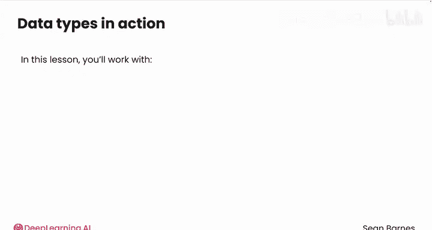
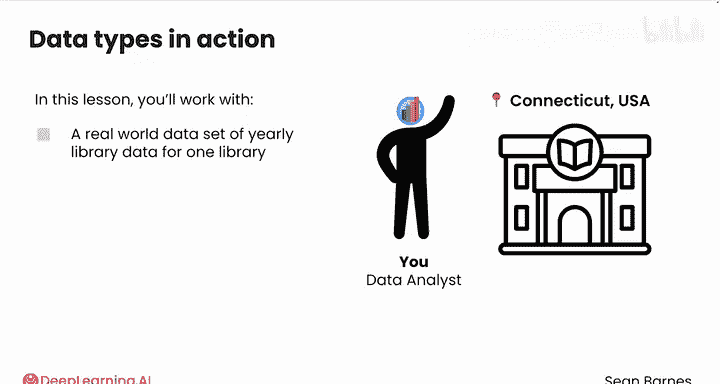
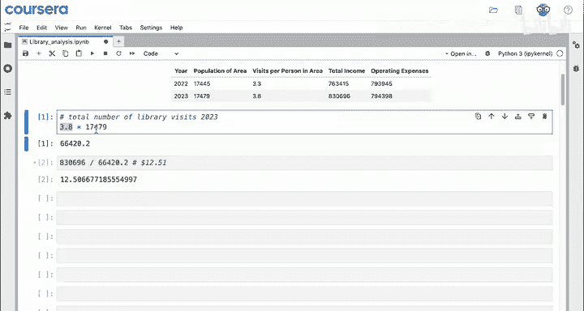
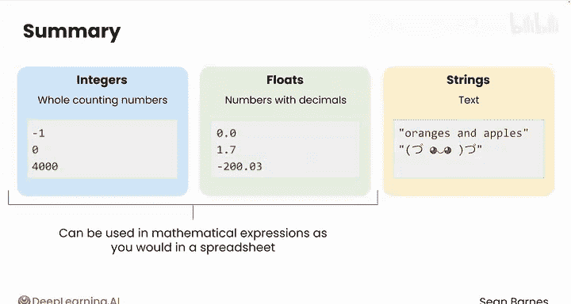

# 008：Python数据类型与表达式 🧱

在本节课中，我们将学习Python代码的基础构建块——数据类型。我们将了解三种核心数据类型：整数、浮点数和字符串，并学习如何对它们进行基本的数学运算。课程将使用一个真实的图书馆年度数据集作为示例，演示如何像使用电子表格一样在Python中执行计算。

---

## 数据类型简介

上一节我们介绍了数据分析的基本流程，本节中我们来看看构成代码的基础元素——数据类型。

在Python中，你可以处理不同类型的数据，并根据其类型执行不同的操作。目前，你将主要使用三种核心数据类型：**整数**、**浮点数**和**字符串**。

*   **整数**：代表整数，包括负数。例如：`-10`, `177`。
*   **浮点数**：代表实数，包含小数点，也可以是负数。例如：`0.0`, `1.7`, `-200.03`。
*   **字符串**：代表文本。在Python中，文本必须包含在引号内，这样Python才能将其识别为文本而非命令。例如：`"oranges and apples"` 或 `":-)"`。

数据类型的重要性可能远超初看时的印象，因为**类型决定了你可以对数据执行何种操作**。

---

## 类型的重要性：一个例子

理解了基本概念后，我们通过一个例子来看看类型如何影响操作。

请看下图中的两个值，你能分辨它们的类型吗？






左边的 `400` 是一个**整数**。而右边带引号的 `"400"` 是一个**字符串**。

尽管它们在你我看来相似，但计算机对它们的处理方式截然不同。例如，将左边的数字除以2会得到结果 `200`：

```python
400 / 2  # 输出: 200.0
```

而尝试将右边的字符串除以2则会导致错误，因为你无法对一段文本执行除法运算：

```python
"400" / 2  # 这将引发 TypeError（类型错误）
```

---

## 实战演练：图书馆数据分析



现在，让我们将这些知识应用到实际数据分析中。本节中，我们将使用美国康涅狄格州一家图书馆的真实年度数据集。






假设你收到了来自美国康涅狄格州哈特福德普莱恩维尔公共图书馆的邮件。他们发送了一些数据，其中每一行代表图书馆一年的运营情况，每一列是该年的某项特征。

图书馆向你提出了两个问题：
1.  2023年的图书馆访问总人次是多少？
2.  2023年每次图书馆访问的平均收入是多少？

你会发现，在Python中执行这些操作与你已经熟悉的电子表格操作非常相似。

---

### 任务一：计算总访问人次

首先，我们来计算2023年的总访问人次。公式是：
**总访问人次 = 人均访问次数 × 总人数**

在Python中，你可以像在电子表格中一样，使用星号 `*` 进行乘法运算：

```python
3.8 * 17479
```

运行这行代码，得到结果 **66420.2**，即约66，000次总访问。

---

### 任务二：计算每次访问的平均收入

接下来，我们使用刚刚计算出的结果来完成第二个任务。公式是：
**每次访问收入 = 总收入 / 总访问人次**

```python
830000 / 66420.2
```

运行代码，得到结果 **12.51**，即每次图书馆访问的平均收入约为12.51美元。

---

## 回顾与总结



在本节课中，我们一起学习了Python的三种核心数据类型及其在表达式中的应用。

你能指出在上述每个表达式中使用了哪些数据类型吗？回顾第一个代码单元格：
*   `3.8` 是一个**浮点数**（有小数点的数字）。
*   `17479` 是一个**整数**（没有小数点的数字）。

以下是Python中你将经常使用的三种关键数据类型总结：

*   **整数**：整数。
*   **浮点数**：带小数的数字。
*   **字符串**：文本。

你可以像在电子表格中一样，在数学表达式中使用整数和浮点数，来计算诸如利润或每次访问收入等指标。

对于当前这个任务，使用电子表格或许看起来更简单。但随着任务变得复杂，Python的优势将变得非常明显。



---

做得好！你已经认识了每次用Python编写代码时都会用到的核心数据类型。

在接下来的课程中，我们将学习更多关于打印输出和代码注释的知识。