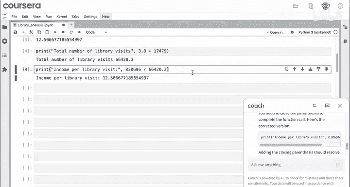
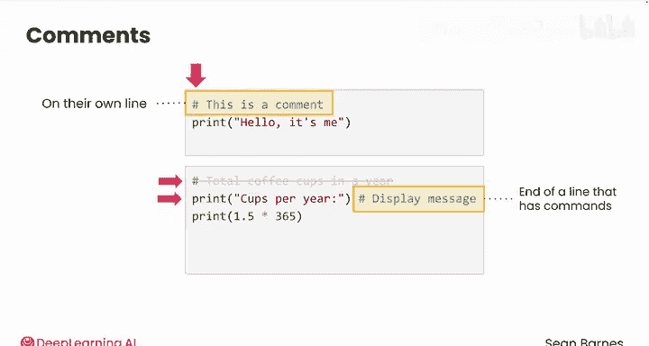
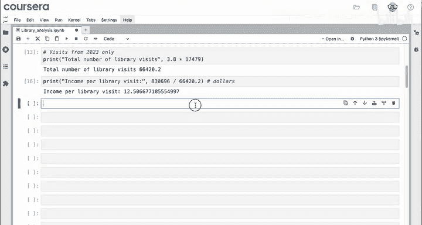

# 009：打印输出与注释 📝

在本节课中，我们将学习如何通过打印输出和注释来增强代码的可读性。编程不仅仅是进行计算，我们经常需要为自己或他人添加信息说明。我们将学习使用 `print` 语句来显示信息，以及使用注释来为代码添加说明。

## 打印输出

上一节我们介绍了基本的计算，本节中我们来看看如何将计算结果清晰地展示出来。在Jupyter Notebook中，默认会显示单元格中最后一个计算的值。然而，使用 `print` 命令可以更灵活地控制信息的显示。

`print` 命令可以将信息输出到屏幕上。你可以通过逗号分隔来打印多个信息片段。


以下是使用 `print` 命令的基本语法：

```python
print("标签文本", 表达式)
```

这种策略允许你在代码中为信息片段添加标签。例如，你可以先打印一段文本作为标签，然后打印计算结果。

运行包含此代码的单元格，你会得到一个格式清晰的输出。你能看出这个 `print` 命令中使用了哪些数据类型吗？这里有一个字符串标签和一个浮点数结果。

`print` 命令会将它们显示在同一行，并用一个空格分隔。

对于第二个任务，你可以这样做：

```python
print("Income per library visit", 表达式)
```

同样，你也会得到一个格式清晰的输出。😊

良好的实践是使用 `print` 语句来显示信息，而不是依赖Jupyter Notebook显示最后一个值。`print` 语句的格式通常更美观，并且你可以在一个单元格中使用多个 `print` 语句。

## 处理错误

假设你在编写这些任务的代码时遇到了错误。

你可能会注意到，这个错误是由于缺少右括号引起的。对你我来说，这段代码的意思可能仍然相同。但计算机没有那个括号就无法完成任务。

顺便说一下，忘记括号是一个非常常见的错误。

首先，你可以尝试通过阅读错误信息并修复代码来自行解决这个错误。

然而，错误信息可能会变得冗长而复杂。如果你遇到困难，可以随时向你的LLM（大语言模型）求助。

例如，你可以说：“嘿，我在编码时遇到了这个错误。你能帮我理解为什么会发生这个错误吗？”然后复制整个错误信息，甚至可以使用 Shift+Enter 在聊天窗口中添加新行。

然后它可能会说：“你遇到的错误是一个语法错误，这意味着你的代码结构有误。查看你的代码，问题在于缺少一个右括号。因此，你需要添加那个右括号来纠正这个问题。”你可以复制它建议的代码，看看是否能解决问题。

好的，看起来修复成功了。错误是编码过程中完全正常的一部分。

看似微小的事情，比如漏掉这个逗号，或者不小心在 `print` 这个词里加了一个空格，都会导致错误。




别忘了，你随时可以请你的LLM帮助解决它们。

## 代码注释

注释是给你自己或你的协作者看的笔记。在Python中，注释以井号 `#` 开头。它们可以独占一行，也可以放在已有命令的行的末尾。当计算机看到井号时，它会完全忽略该行井号之后的所有内容，直接转到下一行。

你将在本课程的练习实验、评分实验以及所有视频中看到注释。

假设你要把这部分代码发送给同事，并想用更多信息来标记它。你可以添加一个注释。




注释以井号 `#` 开头。计算机会完全忽略该行井号之后的所有文本。下一行将正常执行。所以，注释可以从一行的开头开始，也可以放在一行的末尾。

例如，你可能想说：“仅2023年的访问量”，所以这个信息只是给你（人类）看的。计算机会完全忽略注释文本。

再举一个例子，你可以在这里末尾添加一个注释，写上“这应该以美元为单位”，即 `# dollars`。

计算机会执行井号之前的所有内容，忽略“dollars”，然后执行下一行（如果有的话）。如果你再次用 Shift+Enter 运行该单元格，你会得到相同的输出。无论你添加多少注释，都不会影响代码执行。

你也可以在两行代码之间放置注释，这也是完全可以的。例如，在这里你可以保存“仅2022年的访问量”，然后在下一行计算总数。



两行代码都会按预期工作。


## 总结

本节课中我们一起学习了如何使用 `print` 语句来格式化输出信息，以及如何使用 `#` 符号添加注释来增强代码的可读性和可维护性。我们还了解了如何处理常见的语法错误，并知道在遇到困难时可以寻求LLM的帮助。你已经看到了注释和代码是如何结合的，接下来请跟随我到下一个视频，学习如何在Python中使用变量来存储信息。