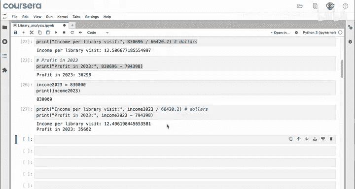
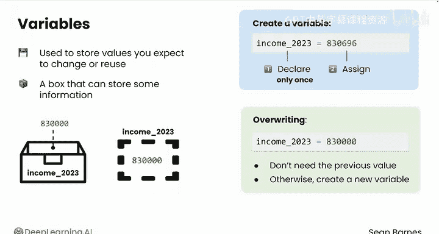
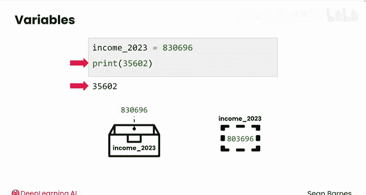

# 010：变量存储 📦

在本节课中，我们将要学习编程中的一个核心概念：变量。变量允许我们存储和重复使用数据，从而提高代码的可读性、可维护性和效率。

---


## 概述

编程的一个关键优势是可重复性。实现可重复性的一个重要特性是通过变量来复用数据。假设你再次为普莱恩维尔图书馆工作，需要计算2023年的利润。


你编写了这行代码来完成计算。你注意到最后两个单元格中重复使用了哪个值？2023年的总收入被使用了两次。重复的值正是在代码中使用变量的好机会。

这有几个原因。首先，多次输入这个长数字很麻烦。其次，它可能引发错误，比如拼写错误。另一个常见情况是，如果图书馆发现这个数字记录有误，实际值应为830,000。目前，你必须手动在它出现的每个地方重新输入这个值。想象一下，如果你的代码中有数百处使用了这个值，该如何避免这种繁琐的工作？

---

## 创建与使用变量

让我们回到原始的正确值。你可以创建一个变量来存储这个值一次，但多次使用它。

你可以创建一个名为 `income_2023` 的变量，并在该变量中存储值 `830696`。你在这里所做的，是将这个整数存储在一个带有此名称的“盒子”中。

```python
income_2023 = 830696
```

如果你打印 `income_2023`，会发生什么？

```python
print(income_2023)
```

你会得到 `830696`，即存储在这个名称下的数字。现在，你可以在任何需要此值的代码行中使用这个名称。

如果你复制使用这个数字的单元格，可以将所有 `830696` 的实例替换为 `income_2023`。

```python
# 替换前
profit_2023 = 830696 - 794398
print(profit_2023)
print(830696)



# 替换后
profit_2023 = income_2023 - 794398
print(profit_2023)
print(income_2023)
```

运行单元格时，你期望发生什么？你应该会看到打印出两行，每行对应一个打印命令。结果如下，2023年的利润和总收入都与之前的结果一致。

现在，如果图书馆意识到这个数字实际上应该是830,000，你只需在一个地方更改它，再次运行，所有相关结果都会更新。


---

## 变量的工作原理

顺便说一下，这个过程与电子表格中的操作非常相似。现在，你有一个包含830696的单元格，它就像一个名为 `I4` 的变量。盒子 `I4` 中的值可以改变，但无论内容如何，这个盒子始终被称为 `I4`。因此，在任何涉及830696的计算中，你都可以使用这个变量名 `I4`。如果你将 `I4` 中的值更新为830,000，这里的所有计算都会相应更新。

让我们更详细地看看这里发生了什么，以及变量是如何工作的。

变量用于存储值，特别是那些你预期会更改或复用的值。你可以将每个变量视为一个可以存储某些信息的盒子。

创建变量时，发生两件事：**声明**它（选择其名称）和**赋值**（赋予它一个值）。

```python
# 声明变量 income_2023 并赋值为 830696
income_2023 = 830696
```

你只声明一个特定的变量一次，但可以随意多次为其分配新值。

考虑你刚才看到的代码行。`income_2023 = 830696`。你有一个标记为 `income_2023` 的盒子，并将值 `830696` 存储在其中。当你想在代码中使用这个值时，你告诉计算机检查标记为 `income_2023` 的盒子，并使用里面的任何值。

Python变量类似于电子表格中的单元格。你有一个单元格，在其中存储一个值，并且该单元格有一个名称。在这种情况下，名称是 `income_2023`，而不是行和列的引用。

如果这个值需要更新为830,000，之前的值会被完全丢弃并替换。你不再在任何地方保存之前的值。这个过程称为**覆盖**。只有当你确信不需要之前的值时，才应该这样做；否则，你应该创建一个新变量。

---

## 变量在表达式中的求值

你还看到了这个计算：`print(income_2023 - 794398)`。




刚才，这里到底发生了什么？在这种情况下，你已经为 `income_2023` 赋值，现在你在一个表达式中使用它。当Python执行到这行代码并看到 `income_2023` 时，它会寻找具有该名称的盒子（或可以将其视为具有该名称的单元格），并用其当前值替换变量名。在本例中，当前值是 `830696`。然后，Python继续进行减法运算，将整个表达式替换为 `35602`，并最终打印出该值作为计算结果。

---

## 总结

本节课中，我们一起学习了变量的核心概念。变量是存储数据的“盒子”，通过声明名称和赋值来创建。它们允许我们避免重复输入，轻松更新数据，并使代码更清晰、更易于维护。变量是几乎所有程序中都会出现的强大工具。

在下一个视频中，我们将了解如何避免变量可能引入的常见错误。



