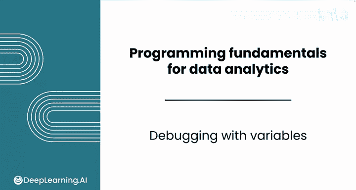
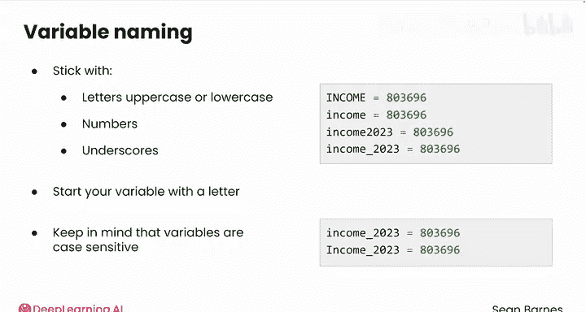
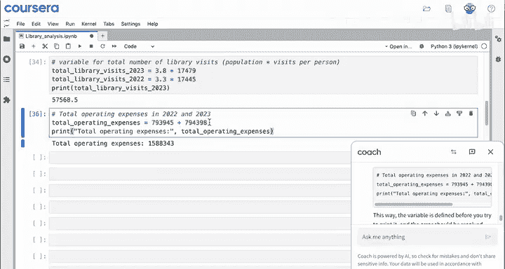
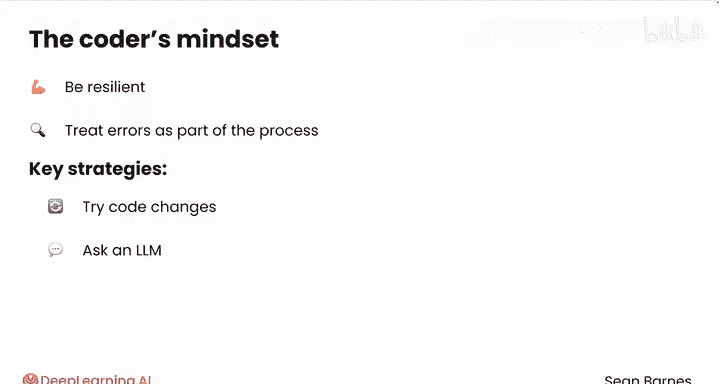

# 011：Python数据分析（第3课）｜使用变量与调试 🐛

在本节课中，我们将学习变量的使用以及如何调试代码中的错误。变量是编程中的基础工具，但使用不当也可能引入错误。我们将探讨变量命名的规则、常见错误类型以及有效的调试策略。



---

## 变量命名规则 📝

上一节我们介绍了变量的基本概念，本节中我们来看看如何正确地为变量命名。变量命名需要遵循特定规则，以确保代码的可读性和正确性。

以下是变量命名的主要规则：



*   变量名只能包含字母（大写或小写）、数字和下划线（`_`）。
*   变量名必须以字母开头。
*   变量名是区分大小写的。例如，`income2023` 和 `Income2023` 是两个完全不同的变量。

你可以通过公式来理解命名规则：**有效的变量名 = 字母 + (字母/数字/下划线)\***。

关于更具体的命名规则，你可以在接下来的阅读材料中了解更多。

---

## 使用描述性变量名 🏷️

理解了命名规则后，我们来看看如何为变量选择一个好名字。使用描述性的变量名至关重要，它能让你的代码更容易被理解。

假设我们需要计算图书馆的总访问量，其值为 `人口数 * 人均访问次数`。

理论上，你可以将变量命名为 `x`：
```python
x = 3.8 * 17479
```
运行这段代码完全没有问题，结果也与预期一致。然而，使用像 `total_library_visits` 这样的描述性名称会更好。虽然名字更长，但对阅读代码的人（包括未来的你）帮助巨大。计算机并不关心变量名是什么，但清晰的命名能显著提升代码的可维护性。

---

## 变量区分大小写与调试 🔍

在使用描述性变量名时，一个常见的错误来源是忽略了大小写敏感性。让我们通过一个例子来理解这一点。

如果你打印 `total_library_visits`，会得到正确的数字。但如果你尝试打印 `Total_library_visits`（首字母大写），代码将无法运行并报错。

记住，对计算机而言，大写字母 `T` 和小写字母 `t` 是完全不同的字符。如果你遇到此类错误，可以随时向大型语言模型（LLM）求助。例如，你可以提问：“我试图打印 total_library_visits 但遇到了这个错误，请帮我理解原因。” LLM 通常会指出错误是由于变量名大小写不匹配造成的。

---

## 变量值的覆盖与逻辑顺序 ⏱️

调试不仅涉及语法错误，也涉及逻辑错误。变量值的意外覆盖就是一种常见的逻辑错误。

假设图书馆要求你计算2022年的总访问量。如果你重用同一个变量名：
```python
total_library_visits = 3.3 * (17479 - 34)
```
然后打印 `total_library_visits`，输出结果将是2022年的新值（约57,000），而不是之前2023年的值（约66,000）。这是因为代码按顺序执行，后面的赋值操作会完全覆盖变量之前的值。

如果你后续需要同时使用这两个值，就应该创建两个独立的变量，例如 `total_library_visits_2022` 和 `total_library_visits_2023`。

---

## 变量定义与使用的顺序 🔄

另一个关键点是变量必须先定义后使用。请看以下两行代码：
```python
print(total_operating_expenses)
total_operating_expenses = 385000
```
运行它们会导致错误。原因是你试图在变量 `total_operating_expenses` 被定义之前就打印它的值。简而言之，你必须确保定义变量的代码出现在任何使用该变量的代码之前。在 Jupyter Notebooks 中，这些代码可以出现在不同的单元格里，但保持逻辑顺序（先定义后使用）是最佳实践，这能使代码更易读，并避免令人困惑的错误。



---

## 调试策略与心态调整 🛠️

在编程中，调试（寻找并修复错误）是一项核心技能。错误是编码过程中正常的一部分，就像写文章时也会使用退格键修改一样。请将错误视为学习过程中的常规环节。

以下是三种关键的调试策略：

*   **尝试修改代码并测试**：测试你的代码是完全免费的，只需按 `Shift + Enter` 运行。你可以主动思考如何“破坏”代码，例如，如果漏掉一个引号或括号会发生什么？然后进行测试，看看结果是否符合你的预测。
*   **向 LLM 求助**：即使是很短的提示也可能非常有效。例如，直接询问“这个错误信息是什么意思？”并粘贴错误信息。LLM 在大量互联网代码上训练过，是优秀的编程伙伴。
*   **搜索网络并加入社区**：如果你想与他人交流代码问题，我鼓励你搜索网络并加入相关社区（例如 DeepLearning.AI 社区）。你随时可以就本课程的任何问题发起新的话题讨论。

---

## 总结 📚

本节课中我们一起学习了变量的高级用法和调试技巧。我们探讨了变量命名的规则、使用描述性名称的重要性，以及变量区分大小写和顺序执行可能带来的错误。最后，我们介绍了三种实用的调试策略：主动测试、利用 LLM 以及参与社区讨论。培养强大的故障排除技能至关重要，因为错误是编程中完全正常且经常遇到的部分。



请跟随我进入下一个视频，开始学习一种新的数据类型：列表。