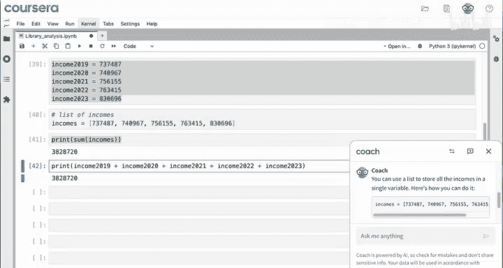
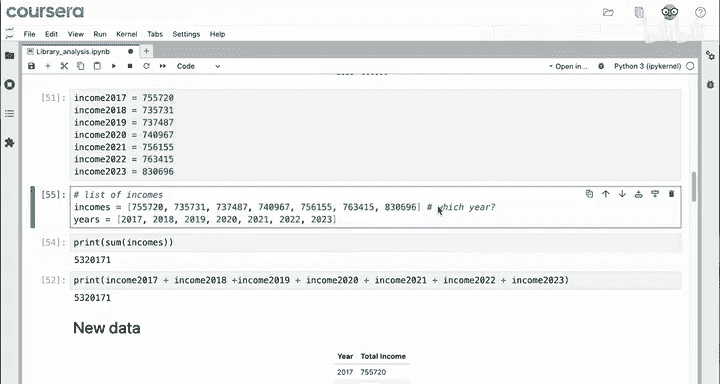
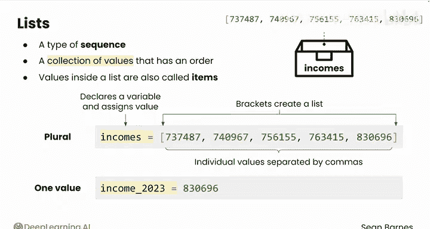

# 012：创建列表 📝

在本节课中，我们将要学习Python中一种非常重要的数据结构——列表。列表用于存储有序的数据集合，在数据分析中极为常见。我们将通过一个图书馆收入分析的例子，了解为什么需要列表、如何创建列表，以及列表带来的便利。

---

## 为什么需要列表？🤔

单个的整数、浮点数或字符串本身很有用。但在数据分析中，你经常会遇到序列，即有序的值集合。列表是最常见的序列之一。

假设公共图书馆希望你分析过去五年的总收入。数据如下：


如何用Python代码存储这些信息？

一种方法是使用你刚学过的变量：

```python
income_2019 = 723540
income_2020 = 876123
income_2021 = 934567
income_2022 = 1012345
income_2023 = 1123456
```

但这似乎效率低下。目前只有五年数据，但回顾之前的电子表格，哈特福德康涅狄格州普莱恩维尔图书馆的数据总共有28年。为28年分别创建28个变量非常低效。

让我们询问大语言模型（LLM）：“我目前在Python中使用多个变量仅存储收入。我可以用什么替代？”并粘贴这些变量。

LLM建议可以使用列表。

---

## 创建你的第一个列表 🛠️

以下是LLM建议的代码：

```python
incomes = [723540, 876123, 934567, 1012345, 1123456]
```

我们来逐步分析：
*   变量名 `incomes` 是复数形式，因为它代表许多收入，而不仅仅是一个。
*   方括号 `[]` 表示这是一个列表。
*   每个值都包含在方括号内，用逗号分隔。

这个列表很有用，因为现在你只有一个变量就包含了所有数据。运行这个单元格，你就声明并赋值了这个变量，可以在代码中使用它。

---

## 列表的威力：使用内置函数 ⚡

创建列表后，你可以对它进行很酷的操作。例如，可以使用专门处理列表的特殊函数，比如 `sum` 函数。

如果你需要计算这些年的总收入，可以这样做：

```python
print(sum(incomes))
```

运行后，你会得到约380万。这非常快。

如果你想对所有这些单独的变量求和，则必须这样做：

```python
total = income_2019 + income_2020 + income_2021 + income_2022 + income_2023
print(total)
```

这两种方法结果等价，但使用列表的那一种更快、更容易，且更不易出错。



---

## 列表的灵活性：添加新数据 ➕

假设图书馆又找到了2017年和2018年的数据：


现在怎么办？

如果使用变量，你必须创建两个新变量并输入这些值，然后将其加入计算，以获得新的总和530万。

你认为如何将这些数字添加到你的列表中？在这种情况下，因为这是一个有序的数据结构，你可以将它们添加到列表的开头（对应2017年，然后是2018年）。

看看这行对列表求和的代码：`sum(incomes)`，它会如何变化？答案是它不会变。`sum(incomes)` 将求和列表中的所有收入，无论列表有多大。运行后，你可以看到这些值是匹配的。

---

## 列表的局限性（及暂时解决方案）⚠️

你可能已经注意到列表的一个缺点：将数据放入列表后，你无法知道哪个数字对应哪一年。你只能希望自己按正确顺序输入了数据。

目前，你可以通过创建第二个按顺序包含年份的列表来解决这个问题，如下所示：

```python
years = [2017, 2018, 2019, 2020, 2021, 2022, 2023]
incomes = [654321, 712345, 723540, 876123, 934567, 1012345, 1123456]
```

这种策略是一种权宜之计。对于这样的小数据集来说还可以，但你将在下一个模块学习更好的选项。

---

## 列表概念总结 📚

列表是一种序列，即具有顺序的值集合。让我们分解这行代码中发生了什么：

`incomes = [723540, 876123, 934567, 1012345, 1123456]`

在这里使用列表存储收入是合适的，因为你有一个项目集合（多个数字），它们都代表相同的事物（图书馆收入），并且应该按年份顺序存储。

关注等号右侧片刻：
*   方括号 `[]` 创建了一个列表。
*   方括号内是用逗号分隔的单个值。

为了以后使用这个列表，你需要将其保存在一个变量中。因此，`incomes =` 声明了一个名为 `incomes` 的新变量，并为其赋值为右侧列表的值。你创建了一个标记为 `incomes` 的新“盒子”，并将这个列表存储在里面。

列表通常使用复数变量名，因为它们代表值的集合，而不是像 `income_2023` 这样的单个值。




有时，列表内的这些值也被称为**项**。




---

## 本节总结 🎯

本节课中我们一起学习了列表。你已经看到，当你有一个代表同类型数据的有序值集合时，列表极其有价值。这种价值来自于能够使用像 `sum` 这样酷且有用的函数。

列表是存储和处理数据序列的基础工具。在接下来的视频中，我们将学习可以对列表执行的更多任务。