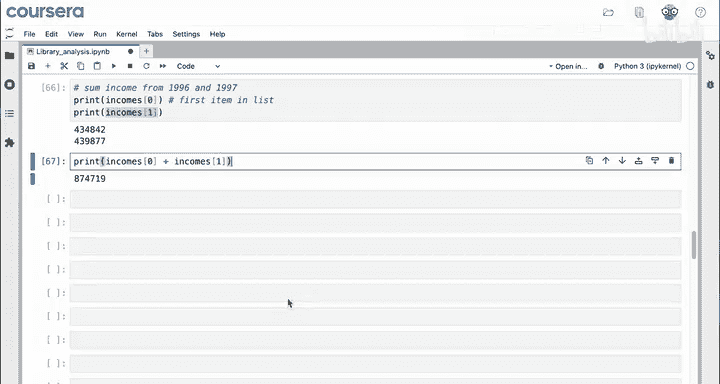
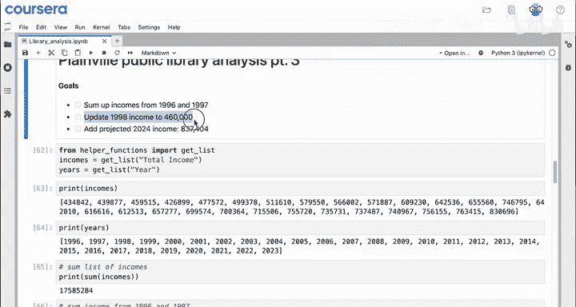
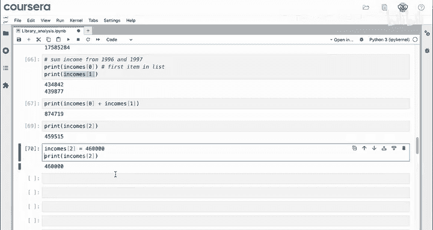
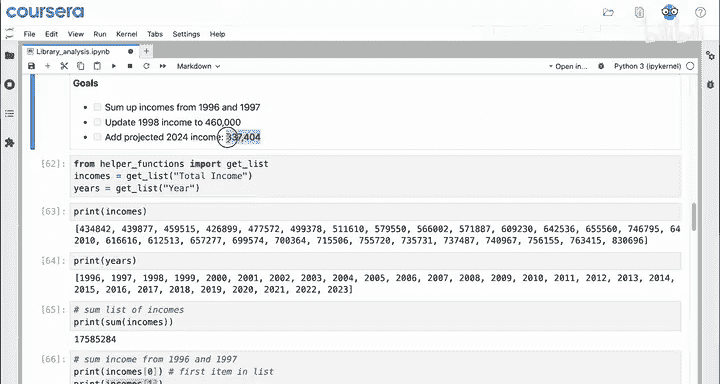
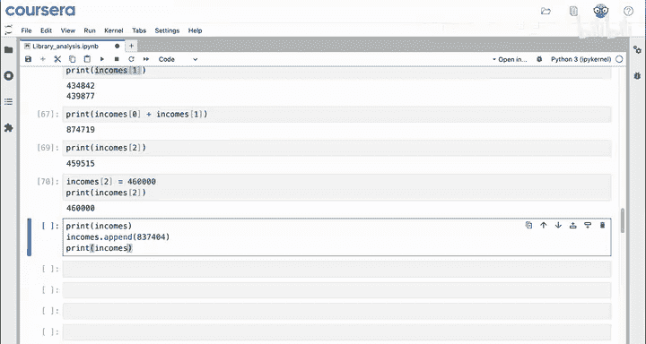
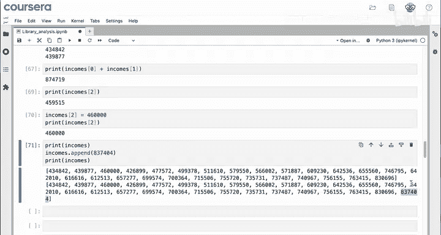
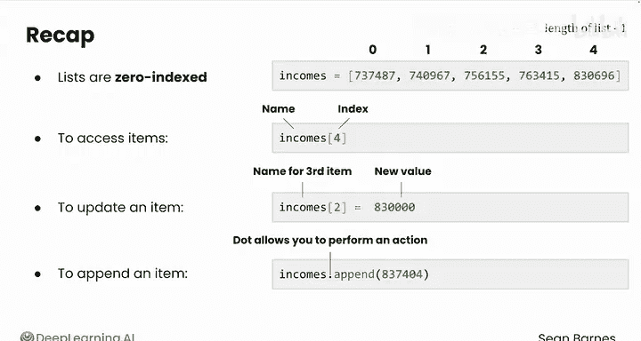

# 013：Python列表操作 📋


在本节课中，我们将学习Python中列表的基本操作。列表是存储多个数据项的有序集合，是数据分析中处理数据列的核心工具。我们将通过一个图书馆收入数据的实例，探索如何访问、修改和扩展列表。

---

## 从CSV加载数据

首先，我们通过一段代码从CSV文件中加载数据。目前你无需深入理解这段代码的细节，因为在下一个模块中你将学习如何自己编写代码来加载CSV数据。现在只需知道，这段代码从普莱恩维尔公共图书馆的数据中创建了两个列表：一个包含收入数据，另一个包含对应的年份。

每个列表都对应之前电子表格中的一列。现在，我们可以用更多的数据来进行操作了。

## 列表求和与访问元素

你还记得如何对列表中的所有值求和吗？例如，对 `incomes` 这个收入列表求和，你可以使用 `sum()` 函数。

```python
print(sum(incomes))
```

这将输出超过1700万美元的总和。

现在，图书馆交给你的第一个任务是：计算1996年和1997年的收入总和。为此，你需要分别访问这两年的收入。

在Python（以及绝大多数编程语言）中，列表使用“零基索引”。这意味着列表中的第一个元素位于位置0（索引0）。对人类而言，从零开始计数可能感觉很奇怪（毕竟没有人过“零岁”生日），但由于计算机的底层构建方式，零是第一个索引。

因此，1996年的数据在索引0，1997年的数据在索引1。你可以通过以下方式访问它们：

```python
print(incomes[0])  # 输出1996年收入
print(incomes[1])  # 输出1997年收入
```





假设输出分别是434,000和439,000，那么要计算总和，只需使用加号运算符：

```python
print(incomes[0] + incomes[1])
```

结果约为874,000。这样，你就完成了列表操作的第一个任务。

## 更新列表元素





接下来，你需要将1998年的收入更新为460,000。1998年对应索引2。

你可以先打印当前值确认：

```python
print(incomes[2])
```

有趣的是，`incomes[2]` 的行为就像一个变量名。这意味着你可以像给普通变量赋值一样，为它分配一个新值。

使用等号进行赋值：

```python
incomes[2] = 460000
```





然后在新的一行打印 `incomes[2]`，可以看到它的值确实已经改变。恭喜，你又完成了一个任务。

## 向列表添加新元素

现在，你需要添加一个2024年的预测收入。这个任务需要考虑的是，列表将从28个项目扩展到29个项目，并且新值需要添加到列表的末尾。

要向列表添加值，需要使用 `.append()` 方法。具体操作是：以列表名开头，使用点号 `.`，然后跟上 `append()`，并在括号内放入要添加的项目。

```python
incomes.append(837404)
```

这里的点号 `.` 是一个新的代码元素，它代表一个“方法”或“函数”。这行代码的意思是：对 `incomes` 这个列表执行 `append` 操作，将值 `837404` 添加到它的末尾。

运行这行代码后，列表将包含之前所有的数据，并在最后新增一项代表2024年预测收入的数据。

## 核心概念回顾与总结

我知道上面的演示节奏很快。请记住，你可以随时回看这些演示，并根据自己的理解速度调整视频播放速度。

以下是本节核心概念的总结：

1.  **列表是零基索引的**：列表中每个项目的索引从0开始，而不是1，这需要一些时间来适应。列表中最后一个项目的索引是 `列表长度 - 1`。例如，一个有10个项目的列表，其索引范围是0到9。
2.  **访问元素**：使用 `列表名[索引]` 的格式来访问特定位置的元素。
3.  **更新元素**：`incomes[2]` 这样的表达式就像一个变量名，它始终指向列表中的第三个项目。使用 `incomes[2] = 新值` 的命令可以更新列表中的值。
4.  **添加元素**：使用 `.append()` 方法在列表末尾添加新元素。点号 `.` 允许你对某个数据（如列表）执行一个操作（这里是 `append` 函数）。在数据分析和本课程中，你会经常看到这个点号，因此值得花时间练习。

在结束本节课之前，让我们简单看一下函数。到目前为止，你已经见过几个函数，如 `print()`、`sum()` 和 `append()`。在接下来的视频中，我们将进一步扩展你的知识库。

---



**本节课总结**：在本节课中，我们一起学习了Python列表的基本操作。我们了解了列表的零基索引特性，掌握了如何使用索引访问特定元素，如何更新列表中已有的值，以及如何使用 `.append()` 方法在列表末尾添加新元素。这些是处理数据序列的基础技能，在后续的数据分析工作中将经常用到。