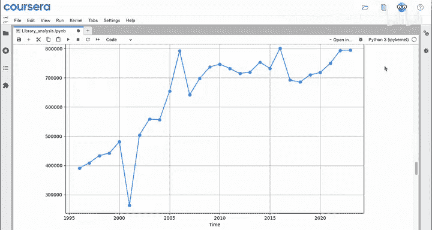

# 014：Python数据分析 - 函数调用 🧮

在本节课中，我们将学习Python中函数调用的核心概念。函数是执行特定任务的代码块，它们接收输入（称为参数），进行处理，并返回输出。我们将通过具体的例子来理解如何调用函数，以及如何利用它们来处理数据。

---

## 函数的基本概念

上一节我们介绍了变量和列表，本节中我们来看看如何使用函数对数据进行操作。在Python中，函数对数据执行操作。计算机程序本质上接收一些输入，进行处理，然后产生输出。函数也是如此：它们接收你提供的输入，进行处理，并产生输出。

例如：
*   `print` 函数接收你想要打印的内容（可以是一个或多个值或表达式），进行处理，并将其显示在屏幕上。
*   `sum` 函数接收一个列表作为输入，将其中的所有内容相加，并输出总和。
*   `append` 函数则有些不同，它实际上有两个输入。

以下是`append`函数的两个输入：
1.  列表本身。
2.  你想要追加到列表末尾的项目。

然后，它通过将项目追加到列表来处理这些输入，并输出新的、更长的列表。

---

## 函数调用的语法

现在，让我们进一步分解其中两个函数的代码。

对于 `print` 和 `sum` 这类函数，调用语法如下：
```python
函数名(参数)
```
你从函数名开始，加上开括号，输入参数，然后加上闭括号。如果参数有多个，可以用逗号分隔。

**函数的输入被称为参数**。这个术语来源于数学。如果你觉得它令人分心，可以简单地将其理解为“输入”，但正式术语是“参数”。

`append` 函数的调用方式则有所不同：
```python
列表变量.函数名(参数)
```
在左边，你有一个列表变量，然后是一个点 `.`，接着是函数名 `append`、开括号、你想要追加的项目，最后是闭括号。

为什么 `append` 不同？如你所见，其中一个输入（列表）并不在括号内。但点 `.` 告诉函数也要将列表作为一个输入。在处理列表和其他集合时，你会经常看到这种格式。

---

## 函数实战：分析图书馆数据

现在你已经近距离观察了几个函数的代码，让我们看看更多函数在实际中的应用。

我们回到普莱恩维尔公共图书馆的场景。他们分享了过去几年的运营开支数据。以下是将运营开支数据加载到两个列表中的代码，以及这些列表的内容。

首先，图书馆希望你找出开支的最高金额。使用 `max` 函数可以非常直接地完成这个任务。

以下是具体步骤：
1.  使用 `print` 函数，并为其添加一个数据标签。
2.  在 `print` 函数内部，使用 `max` 函数，并将 `expenses` 列表作为其参数。

运行代码后，你会发现所有年份中的最高开支是 **801,000**。无论列表有多长，`max` 函数都能高效地找到最大值。

接下来，计算最早的年份。你可以通过查找 `years` 列表中的最小值来实现。

以下是具体步骤：
1.  使用 `print` 函数并添加标签。
2.  在 `print` 函数内部，使用 `min` 函数，并将 `years` 列表作为其参数。

运行代码后，最早的年份是 **1996**。同样，如果列表很长或未排序，使用函数比手动查找更高效。

---

## 计算平均值

现在，让我们尝试一个稍微复杂一点的任务：计算平均开支。要找到平均值，你需要将所有开支相加，然后除以开支的数量。

以下是计算平均值的步骤：
1.  **相加所有开支**：使用 `sum` 函数对 `expenses` 列表求和，并将结果保存到一个变量（例如 `total`）中。
2.  **计算数量**：使用 `len` 函数获取 `expenses` 列表中的项目数量（`len` 代表长度）。
3.  **计算平均值**：将总和 `total` 除以数量 `len(expenses)`，并将结果保存到另一个变量（例如 `average`）中。
4.  **打印结果**：使用 `print` 函数输出平均值。

运行代码后，你得到的平均值大约为 **640,000**。这个值落在所列开支的中间范围，符合预期。

---

## 数据可视化初探

最后一步，只是为了有趣。这里有一个辅助函数叫 `create_line_chart`，它接收两个参数：一个年份列表和一个数字列表，并创建一张折线图。这能帮助你直观地了解开支随时间的变化情况。

Python 是数据可视化的一个极其强大的工具，你将在本课程的第三个模块中深入学习。

---

## 总结




本节课中我们一起学习了Python函数调用的核心知识。我们从函数的基本概念出发，了解了它们如何接收输入、处理并产生输出。我们学习了两种主要的函数调用语法：直接调用（如 `print()`、`sum()`）和通过点号调用（如 `list.append()`）。通过分析图书馆运营数据的实战案例，我们练习了使用 `max`、`min`、`sum` 和 `len` 等内置函数来提取最大值、最小值、总和、长度并计算平均值。最后，我们简要接触了数据可视化，看到了函数如何帮助生成图表以理解数据趋势。掌握从类型、表达式、变量、列表到函数这些核心工具，是你日常作为数据分析师工作的基础。