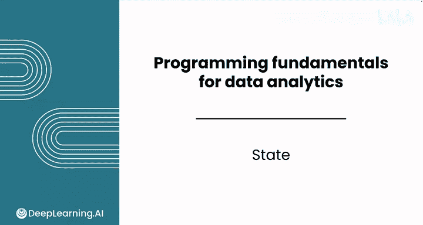
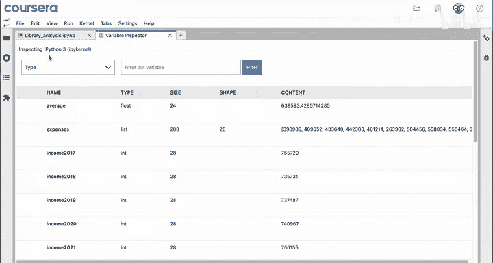
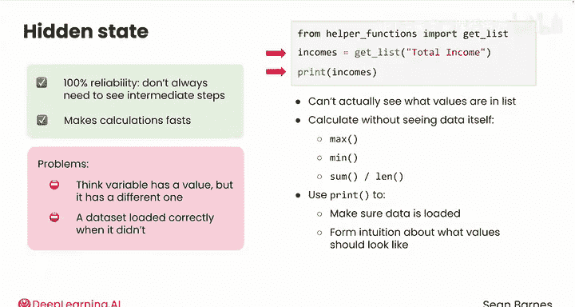

# 015：Python数据分析中的状态管理 🧠

在本节课中，我们将要学习Python程序运行时的核心概念——**状态管理**。理解计算机如何跟踪变量和数据，是编写可靠、高效代码的基础。

---

## 概述：什么是程序状态？

当计算机运行Python代码的每一行、每一个单元格时，它会追踪代码产生的所有影响。具体来说，它会记住你创建的变量及其值，以便你在后续代码中使用它们。这种被记住的信息集合，就构成了程序的**当前状态**。

上一节我们介绍了如何计算数据的总和，本节中我们来看看计算机是如何在幕后记住这些结果的。

---

## 查看程序状态：变量检查器

与电子表格不同，在电子表格中你可以直接看到所有数据，而Python默认将变量及其值隐藏在视图之外。虽然这使得Python在处理大型数据集时更高效，但也意味着你需要主动检查变量的值，以避免错误。

以下是查看程序状态的两种主要方法：



1.  **使用变量检查器**：在Jupyter Notebook中，右键点击并选择“打开变量检查器”，会弹出一个新窗口。这个窗口会显示你创建的所有变量、它们的类型、内容或值以及其他信息。这就像是当前笔记本状态的一个快照。
    



2.  **使用打印语句**：你可以使用 `print()` 命令在代码的特定点显示变量的值。

你可以将变量检查器窗口拖到右侧，以便并排查看变量和代码。例如，当你运行 `total = sum(expenses)` 这行代码后，变量检查器中会新增一行，显示变量 `total` 的当前值是1790万。


---

## 理解状态：计算的快照

程序状态是计算中一个非常重要的概念，因为它告诉你：“我的计算进行到哪一步了？我创建了哪些变量？”

**计算机状态**就像是其当前所有信息的快照。在你关闭Jupyter Notebook或手动重启内核之前，你创建的变量都会被保存。这就是当前的状态。

在电子表格中，你直接查看状态，因为所有数据和计算都显示在单元格里。然而，在Jupyter Notebook中，除非你打开变量检查器，否则你无法直接看到这个状态。变量及其值不会显示给你。

这种设计有两个好处：
*   帮助你专注于程序的**输出**，而不是所有中间步骤。
*   使计算更快，因为计算机无需耗费资源来显示中间结果。

---

## 隐藏状态的利与弊

让我们通过一个例子来理解隐藏状态。你之前见过这几行代码：

```python
git_list = load_column_from_csv('data.csv')
max_value = max(git_list)
min_value = min(git_list)
average_value = sum(git_list) / len(git_list)
```

你知道 `git_list` 从CSV文件加载了一列数据，但你实际上看不到列表里有哪些值。你可以在不看到数据本身的情况下计算最大值、最小值和平均值。

当然，你可以选择使用 `print(git_list)` 命令来确保数据加载正确，并帮助你直观感受最大值、最小值和平均值应该是什么样子。

**隐藏状态的优势**在于它是Python能够**高效扩展**的核心。如果你有一台能100%可靠执行计算的计算机，你并不总是需要像在电子表格中那样看到中间步骤。这使得计算非常快速。

**同时，隐藏状态也是常见问题的根源**。你可能会认为一个变量有某个值，而它实际上有另一个值。你可能认为数据加载正确了，但实际上并没有。

---

## 最佳实践：主动管理你的状态

因此，由你来负责探查程序的隐藏状态，通常是通过使用打印语句。`print()` 语句帮助你在代码的特定点显示变量的值。你之前看到的变量检查器也是一个选择。

**关键建议是**：不要对你的程序状态做假设。当你的代码运行结果不符合你的预期时，使用打印语句或变量检查器来查看你实际在处理哪些值。

---

## 总结与下一步

本节课中，我们一起学习了Python中的**状态管理**。我们了解到：
1.  程序状态是计算机记住的所有变量和值的集合。
2.  与电子表格不同，Python的状态默认是**隐藏的**。
3.  我们可以使用**变量检查器**和 **`print()`语句**来主动查看和管理状态。
4.  理解并检查状态是避免错误、编写可靠代码的关键。



一旦你完成了本课的练习实验和作业，请跟随我进入下一课，学习更多关于**控制流**的知识——如何在程序中重复执行代码和创建分支代码。下次见！😊
