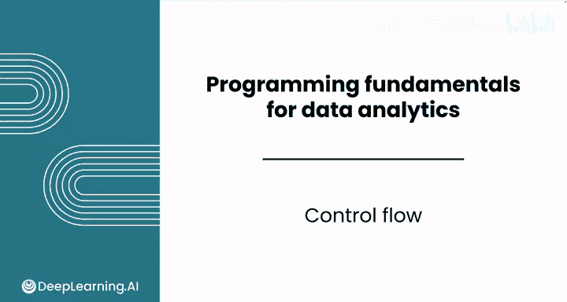
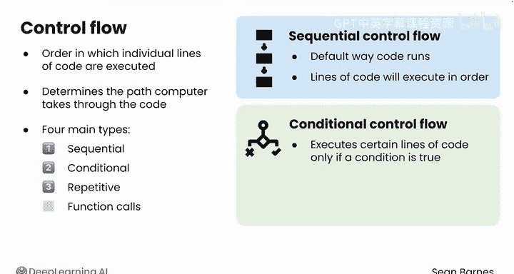
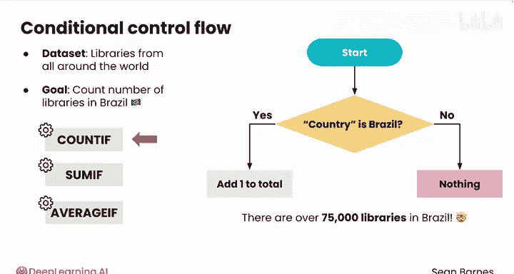
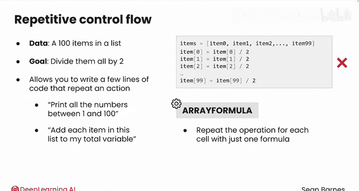

# 016：控制流

在本节课中，我们将要学习Python中的**控制流**。控制流决定了代码执行的顺序，它让程序能够做出决策和重复执行任务，而不仅仅是按顺序从上到下运行每一行代码。

---

## 什么是控制流？ 🔄

在您目前编写的程序中，单元格里的每一行代码都是按顺序从上到下执行的。然而，您经常需要程序能够做出决策或重复执行任务。这些模式就称为**控制流**。

控制流是代码中各个语句被执行或运行的顺序。它决定了计算机执行代码的路径。

控制流主要有四种类型：**顺序执行**、**条件执行**、**重复执行**和**函数调用**。本节课我们将重点学习前三种，函数调用将在后续课程中详细介绍。

---

## 顺序控制流 📜

您目前编写的代码中已经见过了顺序控制流。这是代码运行的默认方式。除非您引入了本节课将要学习的一些控制结构，否则您的代码行将按顺序执行。

---

## 条件控制流 🚦

上一节我们介绍了顺序执行，本节中我们来看看条件控制流。条件控制流仅在指定条件为真时，才执行特定的代码行。它在您的代码中创建了分支路径，有点像道路上的分叉口，您的代码可以选择走一条路或另一条路，但不会同时走两条。



让我们举一个现实世界的例子。假设您正在处理一个包含世界各地图书馆的数据集，您想统计位于巴西的图书馆数量。



对于第一个图书馆，您会查看其国家字段，然后根据该值采取行动：
*   如果国家字段的值是“巴西”，那么您就在总数上加1。
*   如果值是其他任何内容，那么您什么都不做。

顺便一提，巴西有超过75，000个图书馆。

您可能已经在电子表格中遇到过条件语句。像 `COUNTIF`、`SUMIF` 和 `AVERAGEIF` 这样的函数可以处理不同的条件。例如，`COUNTIF` 可以处理这个精确的图书馆统计任务，计算国家为“巴西”的行数。

在Python中，条件控制流通常使用 `if`、`elif` 和 `else` 语句来实现。其核心逻辑可以用以下伪代码描述：

```python
if 条件为真:
    执行这段代码
else:
    执行另一段代码
```

---

## 重复控制流 🔁



接下来是重复控制流。如果您有一个包含100个项目的列表，并且需要将它们全部除以2，您肯定不想写100行代码。

重复控制流允许您编写几行代码来重复执行某个操作。例如：打印1到100之间的所有数字，或者将列表中的每个项目加到我的总数变量中。

重复控制流类似于电子表格中的**数组公式**函数。您有一个操作（比如文本处理），并且希望在许多单元格上执行它，而不必手动将公式添加到每个单元格。数组公式只需一个公式，就能为每个单元格重复该操作。

在Python中，这通常通过 `for` 循环或 `while` 循环来实现。例如，对一个列表中的每个元素进行操作：

```python
for 项目 in 列表:
    对项目执行操作
```

控制流为您设计程序提供了极大的灵活性。

---



## 总结 📝

本节课中我们一起学习了Python控制流的三种基本类型：
1.  **顺序控制流**：代码默认的、按行顺序执行的方式。
2.  **条件控制流**：使用 `if` 等语句，让程序根据条件判断选择执行不同的代码分支。
3.  **重复控制流**：使用 `for` 或 `while` 循环，让程序能够高效地重复执行特定任务。

掌握这些概念是编写动态、高效Python程序的基础。在接下来的视频中，我们将学习Python中的比较操作，这是构建条件判断的关键。