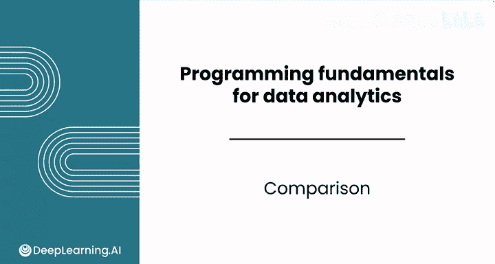
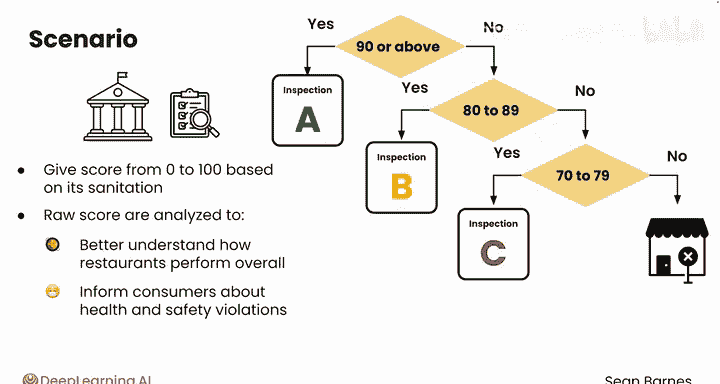
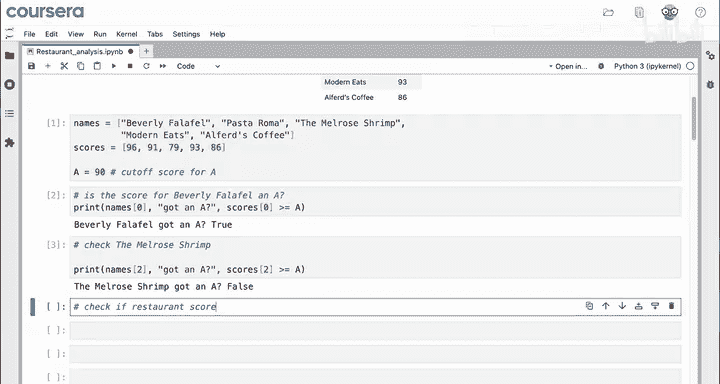
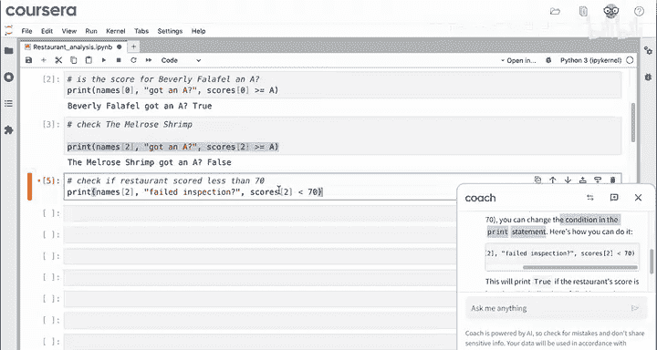
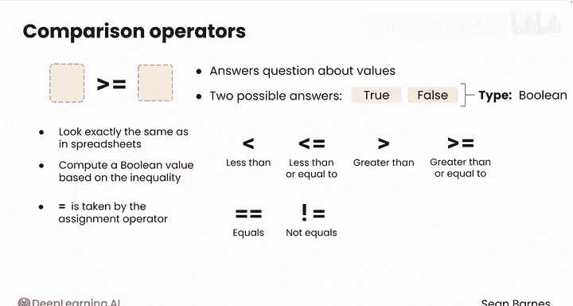
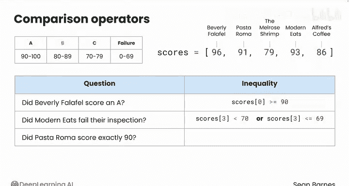
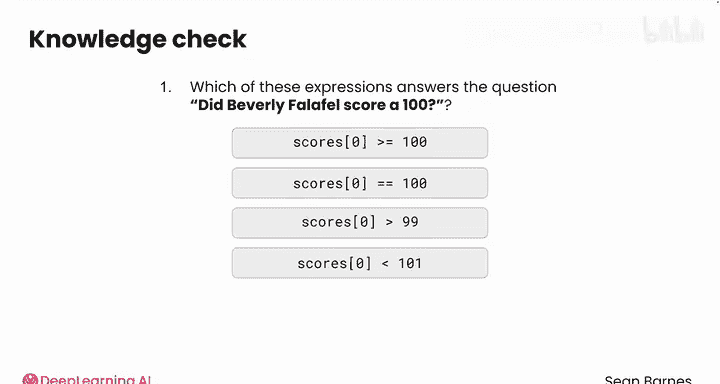

# 017：Python数据分析基础 - 比较运算 🔍



在本节课中，我们将要学习如何在Python中使用比较运算符。这些运算符能帮助我们根据数据做出判断，例如，根据餐厅的卫生检查分数来评定等级。

---

## 概述

在数据分析的基础中，数据是任何可用于决策的信息。那么，如何在Python中基于数据做出决策呢？

假设你正在与一个执行餐厅检查的政府机构合作。检查员巡视餐厅，并根据其卫生状况给出0到100的分数。这些原始分数随后被分析，以更好地了解餐厅的整体表现，并告知顾客有关健康和安全违规行为。

*   如果分数为90或以上，则被视为A级。餐厅可以公开展示A级，并且通常检查频率较低。
*   80到89分为B级。餐厅必须展示B级，并且可能被更频繁地检查。
*   70到79分为C级。餐厅必须展示C级，并且需要立即采取纠正措施，否则将面临关闭。
*   任何低于70分的都被视为不合格，将导致立即关闭。

请注意，不同的分数如何导致不同的行动方案。假设你获得了一个类似这样的数据集（改编自美国加利福尼亚州洛杉矶县发布的数据集），其中有一列分数。但这些分数需要转换为评级，以便发送正确的标识并安排必要的检查或关闭。

这个数据有67000行，每一行代表一次检查。因此，尽管你可以手动完成这项工作，但你肯定不想这样做。让我们使用一个包含五行的随机样本来看看如何将这些分数转换为评级，然后稍后可以扩展到整个数据集。

---

## 开始进行比较

以下是代表两列数据的两个列表：餐厅名称和对应的分数。

```python
names = ["Beverly falafel", "De Paoverma", "Melrose shrimp", "Modern E's", "The Original Pantry"]
scores = [96, 90, 79, 82, 69]
```



所以，`names[0]` 是 "Beverly falafel"，而 `scores[0]` 是96，即Beverly falafel的分数。

顺便说一下，像这样存储多行数据的列表是完全可行的。你也可以将A级的分数线存储在变量 `a` 中，即90。

你可能会问的第一个问题是：Beverly falafel的分数是A级吗？要回答这个问题，可以这样写：

```python
print(names[0], "got an A?", scores[0] >= a)
```

你认为应该打印什么？`scores[0]` 的值是96，`a` 的值是90，96确实大于90。因此，当你运行这个单元格时，会得到值 `True`。

`True` 是一种特殊类型的值，稍后我们会进一步探讨。现在，你可以对其他分数进行同样的检查。让我们检查一下Melrose shrimp是否得了A。

```python
print(scores[2] >= a)
```

答案是 `False`。Melrose shrimp的分数是79，实际上是C级，很不幸。

因此，**大于或等于**（`>=`）是一种比较运算符。

---

## 使用其他比较运算符

你如何检查一家餐厅的分数是否低于70分，这将意味着立即关闭？



你可以请你的LLM（大语言模型）帮助修改这段代码。LLM建议你可以更改打印语句中的条件，并给出了一些代码来进行这个新的比较。你可以试试那段代码：Melrose shrimp没有不及格。

请注意，LLM选择了一个不同的比较运算符：**小于**（`<`）。



让我们看看Python中可用的比较运算符选项。

大于或等于（`>=`）只是众多比较运算符中的一个。比较运算符接受两个值，一个在左边，一个在右边，并回答关于这些值的问题。这些问题只能有两个可能的答案：`True` 或 `False`，没有中间状态。这种类型的输出值称为**布尔值**。

布尔值听起来很高级，但它只意味着真/假值。它只是Python中的另一种数据类型，就像整数（`int`）、浮点数（`float`）和列表（`list`）一样。

Python中有六种比较运算符：
1.  **小于**（`<`）
2.  **小于或等于**（`<=`）
3.  **大于**（`>`）
4.  **大于或等于**（`>=`）
5.  **等于**（`==`）
6.  **不等于**（`!=`）

前四个在电子表格和计算机中看起来完全一样，根据不等式返回布尔值 `True` 或 `False`。

接下来是**等于**，它用两个等号（`==`）表示，以及**不等于**，用感叹号加等号（`!=`）表示。

为什么相等运算符要用两个等号？这是因为单个等号（`=`）已经被赋值运算符占用了，赋值运算符用于给变量赋值。请务必记住：如果你要检查相等性，请始终写两个等号。

---

## 应用比较运算符

以下是不同等级的分数范围（左侧）以及餐厅分数的随机样本（右侧）。

| 等级 | 分数范围 |
| :--- | :--- |
| A | >= 90 |
| B | 80 - 89 |
| C | 70 - 79 |
| 不合格 | < 70 |

| 餐厅 | 分数 |
| :--- | :--- |
| Beverly falafel | 96 |
| De Paoverma | 90 |
| Melrose shrimp | 79 |
| Modern E's | 82 |
| The Original Pantry | 69 |

以下是一些你可能提出的问题，以及可以回答每个问题的不等式：



*   **Beverly falafel的分数是A吗？** 你已经看到这可以用 `scores[0] >= 90` 来回答。
*   **Modern E's检查不及格吗？** 在这种情况下，你可以使用代码 `scores[3] < 70`。你能想到另一种回答同样问题的方法吗？那将是 `scores[3] <= 69`。这个不等式回答了完全相同的问题（假设分数是整数类型）。请注意，如果分数是浮点数，第二个表达式就不起作用，因为像69.5这样的值会被算作通过检查。
*   **De Paoverma的分数正好是90吗？** 你可以使用代码 `scores[1] == 90`。

---

## 小测试

让我们测试一下你的知识。如何检查Beverly falafel的分数是否正好是100分？

正确答案是：`scores[0] == 100`。



---

## 总结



本节课中，我们一起学习了Python中的比较运算和布尔值。这些运算符允许你在代码中使用条件语句来做出决策。掌握了如何比较数值并得到真或假的答案，是编写智能、自动化程序的关键一步。

在接下来的课程中，我们将学习如何利用这些布尔值，通过 `if`、`else` 等条件语句来控制程序的执行流程，从而根据不同的数据情况执行不同的操作。