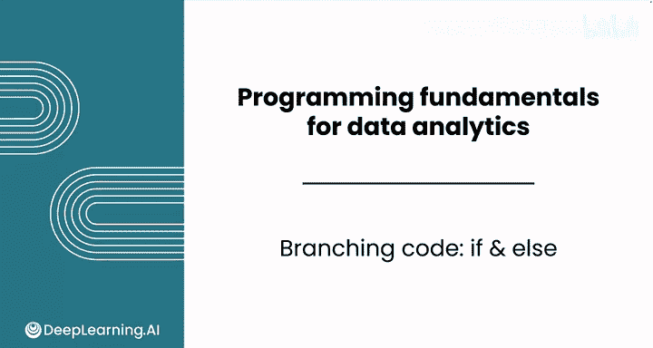
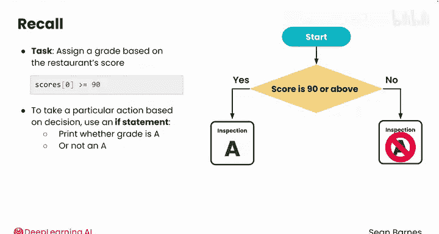
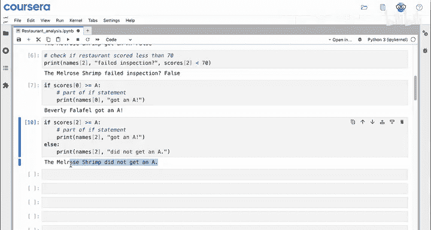
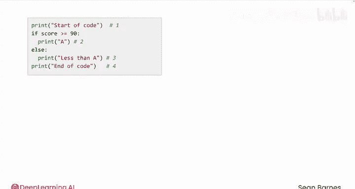
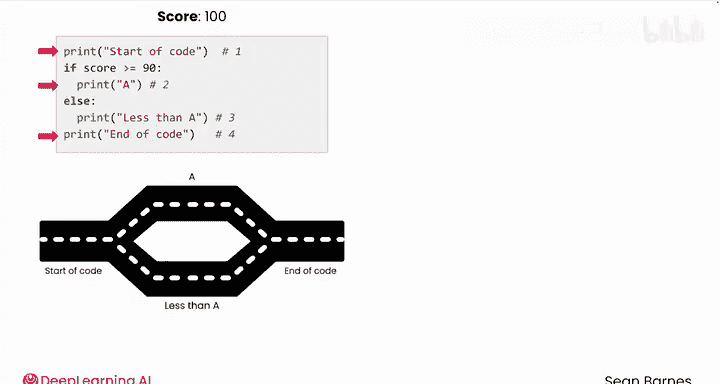
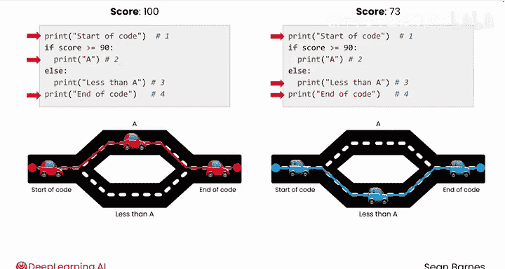
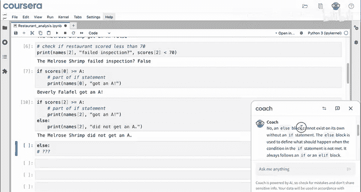

# 018：if-else 🧭

在本节课中，我们将要学习如何使用 `if-else` 语句在代码中做出决策。我们将基于餐厅的评分来分配等级，并逐步构建能够处理大量数据的逻辑。

---

## 从比较到决策

上一节我们介绍了如何使用比较运算符。本节中我们来看看如何利用这些比较结果，在代码中执行不同的操作。

你的任务是根据餐厅的评分来分配等级。你已经看到了判断评分是否达到A级（大于等于90分）的代码。为了基于这个判断执行特定操作，你需要使用 `if` 语句。





例如，第一步可以先简单地打印出该餐厅是否获得了A级评分。使用 `print` 语句来验证分支代码是否正确运行是一种常见做法。

你的任务是检查每家餐厅是否获得了A级评分。

---

## 构建第一个 `if` 语句

我们以列表中的第一家餐厅“Beverly Falafel”为例。你已经知道，以下比较用于检查其评分是否大于等于A级标准（90分）：
```python
score >= 90
```
要基于这个比较结果执行操作，可以编写一个 `if` 语句。

1.  输入 `if`，然后粘贴你刚才看到的比较表达式。
2.  接着输入一个冒号 `:`。
3.  按下回车后，你会看到代码自动缩进。

冒号和缩进表明，接下来的所有代码都属于这个 `if` 语句的一部分。只有缩进的代码行会在条件（`score >= 90`）为真时运行。

以下是具体的代码示例：
```python
if scores[0] >= 90:
    print(names[0] + " got an A.")
```
运行这段代码，会输出：`Beverly falafel got an A.`

---

## 引入 `else` 处理其他情况

现在，让我们看看评分未达到A级的餐厅“Melrose Shrimp”（评分为79分）。如果你对 `scores[2]` 和 `names[2]` 运行上面的代码，会发生什么？

实际上，什么也不会发生。因为条件 `scores[2] >= 90` 评估为 `False`，`if` 语句块内的代码不会执行。

为了处理条件为假的情况，你可以在代码中添加一个单独的分支，即 `else` 语句。

以下是添加 `else` 分支后的代码：
```python
if scores[2] >= 90:
    print(names[2] + " got an A.")
else:
    print(names[2] + " did not get an A.")
```
现在，无论 `scores[2]` 的值是多少，这两块代码中总有一块会执行。运行后，代码会打印：`Melrose shrimp did not get an A.`

---



## 理解代码的执行路径

观察以下代码片段，思考它有多少种可能的执行路径？



```python
print("Start of code")
if score >= 90:
    print("A")
else:
    print("Less than A")
print("End of code")
```
这段代码有两条不同的执行路径，具体取决于 `score` 的值：

*   如果 `score` 大于等于90，将执行第1、2、4行 `print` 语句。程序输出：
    ```
    Start of code
    A
    End of code
    ```
*   如果 `score` 小于90，计算机将走另一条路径，执行第1、3、4行 `print` 语句。程序输出：
    ```
    Start of code
    Less than A
    End of code
    ```

因此，你可以使用 `if` 语句在代码中做出决策并创建分支路径。你可以单独使用 `if` 语句在特定情况下执行某些代码，也可以在 `if` 块后面添加一个 `else` 块。

---

## 关于 `else` 的要点

一个常见的问题是：能否在没有 `if` 语句的情况下单独使用 `else` 块？



答案是否定的。`else` 块不能独立存在，它必须跟在 `if` 语句（或 `elif` 语句）之后。`else` 块用于定义当 `if` 语句中的条件不满足时应发生的情况。



---



## 总结与展望

本节课中我们一起学习了 `if-else` 分支结构。我们掌握了如何根据条件判断执行不同的代码块，并理解了代码的两种基本执行路径。

分支代码是编程的基础。在数据分析中，并非所有数据都与你试图回答的问题相关，不同类型的数据也需要不同的处理方式。

在接下来的课程中，我们将学习如何将条件判断扩展到整个数据集。