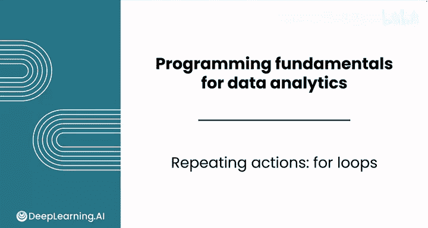
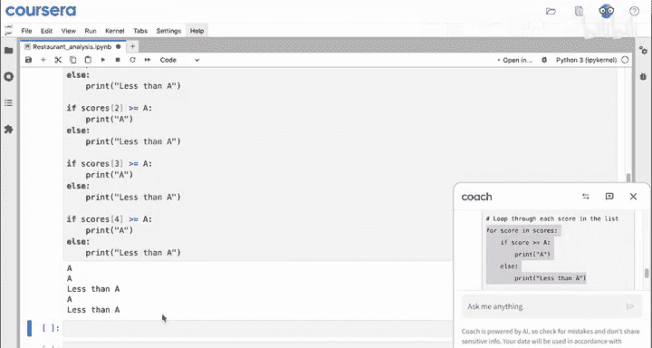
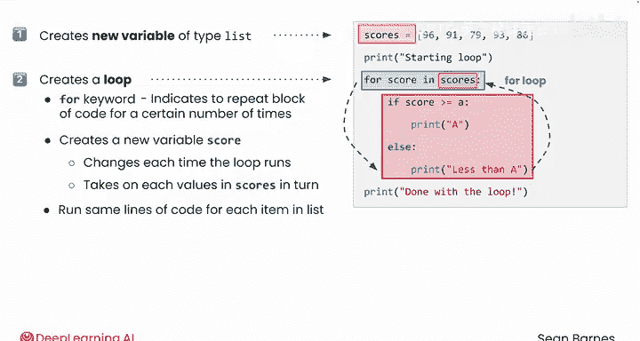
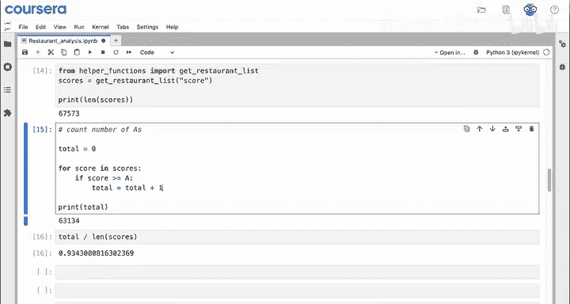

# 019：for循环

在本节课中，我们将要学习Python中的**for循环**结构。循环是编程中用于重复执行代码块的核心工具，它能极大提升代码效率，避免重复劳动。我们将从基础概念开始，逐步理解for循环的工作原理及其强大之处。

---

## 循环的必要性



到目前为止，你已经学会了如何编写条件语句来一次检查一个数据。但这是一个繁琐的过程，无法体现Python的效率。为了实现高效编程，你需要编写能够重复执行动作的代码。

请看以下两个代码块，它们是上一视频中代码的简化版本：

```python
if scores[0] > 90:
    print("A")
else:
    print("Less than A")

if scores[1] > 90:
    print("A")
else:
    print("Less than A")
```

你注意到了什么？它们看起来非常相似，实际上，它们仅在一个字符上不同：列表的索引号。那么，有没有办法重写这段代码，使其能为列表中的每一项运行呢？

---

## 引入for循环

你可以向大语言模型提问：“我有一个餐厅评分列表，并编写了以下代码来检查它们的分数是否为A或更低。我想检查所有分数，如何重写代码以避免重复？”

大语言模型会回复：你可以创建一个**循环**来遍历列表中的所有分数。

好的，假设`scores`和`A`已经定义，你可以跳过那部分，直接复制循环代码并运行看看会发生什么。

以下是使用for循环的代码：

```python
scores = [96, 91, 85, 88, 93]
for score in scores:
    if score > 90:
        print("A")
    else:
        print("Less than A")
```

这段代码打印了五次，对应列表中的每一项。如果分数高于90，它执行第一个分支（if分支），打印“A”；否则，执行else分支，打印“Less than A”。

注意，`for score in scores`是唯一新增的代码行。这创建了一个称为**for循环**的控制结构。

---

## for循环的工作原理

for循环会为列表`scores`中的每一项运行一次缩进的代码块。每次运行时，变量`score`会取列表中的一个新值，依次遍历。



首先，`score`将是96，然后是91，依此类推。实际上，你可以再写一个循环来打印`score`，以观察循环内部发生了什么：

```python
for score in scores:
    print(score)
```

这样你就能得到列表中的每一个值。

编写这个循环几乎等同于拥有五份相同的代码副本。事实上，以下是不使用循环的等效代码：

```python
score = scores[0]
if score > 90:
    print("A")
else:
    print("Less than A")

score = scores[1]
if score > 90:
    print("A")
else:
    print("Less than A")
# ... 为scores[2], scores[3], scores[4]重复
```

运行这段代码会得到相同的输出，但使用循环无疑节省了大量时间。

---

## 解析for循环的组成部分

让我们仔细看看刚才使用的代码，每个部分的作用是什么？

1.  **`scores = [96, 91, 85, 88, 93]`**
    这行代码你之前见过，它创建了一个类型为**列表**的新变量，用于存储所有餐厅评分。

2.  **`for score in scores:`**
    这行代码创建了一个循环。循环会重复执行一个代码块。
    *   `for` 是一个Python关键字，表示你将重复执行代码块一定次数。
    *   `score in scores` 创建了一个新变量`score`，它在每次循环运行时都会改变，并依次取`scores`中的每一个值。

退一步看，这行被称为**for循环**的代码，允许你为列表中的每个项目运行相同的代码行，而无需每次都创建新变量。

它之所以被称为“循环”，是因为一旦你执行到缩进代码块的末尾，就会**循环**回到它的顶部。当所有操作完成后（在本例中，即循环处理完列表中的最后一项），循环停止，计算机继续执行循环之后的代码行。



---

## for循环的强大之处：处理大规模数据

以下是一个快速演示，说明for循环为何如此强大。

让我们导入一个辅助函数，从整个数据集中读取分数并将其保存在变量`scores`中。现在，如果你打印`scores`的长度，会得到超过67,000。这是完整的数据集。

你可以编写一个循环来计算这些数据中A级评分的数量：

```python
total = 0
for score in scores:
    if score >= 90:
        total = total + 1
print(total)
```

1.  从变量`total`开始，值为0。表示尚未开始计数。
2.  `for score in scores:` 依次检查每个分数。
3.  如果分数大于或等于A（90分），你将给`total`加1。即 `total = total + 1`。
4.  循环结束后（注意`print`不在缩进内），打印`total`。

这段代码统计了获得A级评分的餐厅数量。你猜猜在67,000家餐厅中有多少家？超过63,000家！几乎是95%。

请注意，从处理5个项目的列表扩展到处理超过60,000个项目的列表是多么容易。你根本不需要更改任何循环代码。这段代码运行也仅需几分之一秒（通常约2-3毫秒），尽管数据集如此庞大，它可能导致Google Sheets延迟或Excel工作簿崩溃。通过创建循环来处理数万行数据，你开始看到Python效率的强大之处。

---

## 总结



本节课中，我们一起学习了Python中的**for循环**结构。我们了解了其基本语法 `for item in list:`，并理解了它是如何通过遍历列表中的每个元素来重复执行代码块，从而避免重复劳动、提升代码效率的。我们还通过一个统计大规模数据中A级评分数量的实例，亲眼见证了for循环在处理海量数据时的强大性能和可扩展性。掌握for循环是迈向高效数据分析的关键一步。