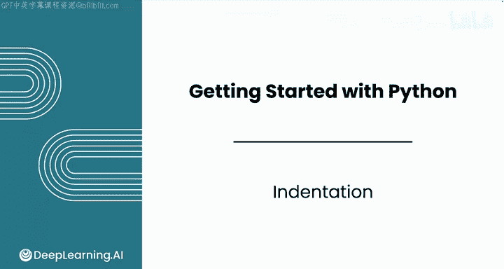
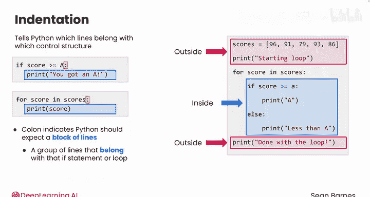
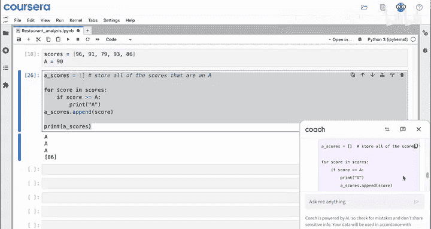
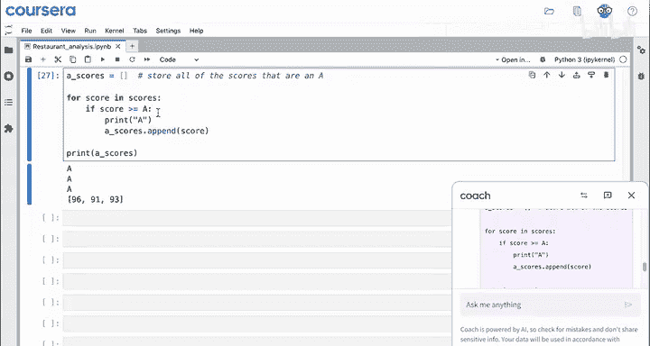
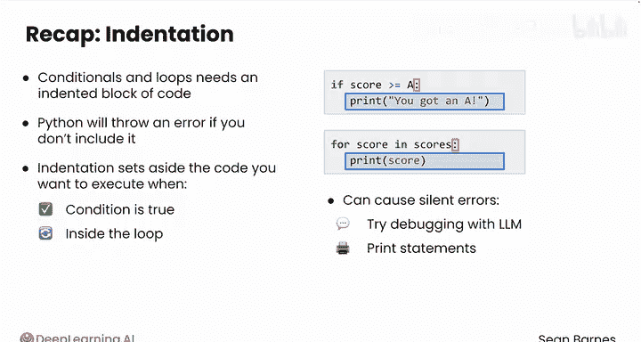

# 020：缩进规则 📐



在本节课中，我们将要学习Python中一个至关重要的概念——**缩进**。缩进是Python语法结构的一部分，尤其在条件语句和循环中扮演着关键角色。我们将探讨缩进的工作原理、常见的错误类型，以及如何避免和调试这些错误。

---

## 缩进是什么？

上一节我们介绍了条件语句和循环，它们能帮助你创建复杂的工作流程。本节中我们来看看这些控制结构都涉及的一个共同特性：**缩进**。

缩进是指在代码行前添加空格（通常是4个），用于告诉Python哪些代码行属于同一个代码块。在Python中，**缩进本身就是语法的一部分**，而不仅仅是让代码看起来美观。

当你编写一个 `if` 语句或一个 `for` 循环时，该行以冒号 `:` 结尾。这个冒号表示Python期望后面跟着一个**缩进的代码块**，即属于该控制结构的一组代码行。

以下是上一节视频中使用过的一个 `for` 循环示例：

```python
for item in list:
    # 这是循环内部的代码
    print(item)
# 这是循环外部的代码
```

人们常说代码在循环“内部”或“外部”。在上面的例子中，所有缩进的代码都在循环内部，这是你希望为列表中的每个项目执行的代码。没有缩进的代码则在循环外部。

---

## 缩进错误示例



缩进错误可能导致程序无法运行，或者更隐蔽地，导致程序运行结果与预期不符。让我们通过一些代码示例来看看缩进可能出错的方式。

### 错误类型一：缺少缩进块

在之前的视频中，你见过类似下面的循环代码：

```python
scores = [96, 85, 91, 78, 93]
a_scores = []
for score in scores:
    if score >= 90:
        print("A")
        a_scores.append(score)
```

这段代码遍历每个分数，检查是否为A（>=90分），如果是，则执行两件事：打印“A”并将该分数添加到 `a_scores` 列表中。

现在，想象一下 `if` 语句没有正确缩进，如下所示：

```python
for score in scores:
if score >= 90:  # 错误：这行应该缩进
    print("A")
    a_scores.append(score)
```

**会发生什么？**
你会得到一个错误：`IndentationError: expected an indented block`。这是因为Python看到了冒号 `:`，它期望你提供属于这个 `for` 循环内部的代码。从技术上讲，现在这行代码在循环外部。

### 错误类型二：条件语句内部缺少缩进

如果 `print` 行没有缩进呢？

```python
for score in scores:
    if score >= 90:
    print("A")  # 错误：这行应该缩进
        a_scores.append(score)
```

同样，你会得到一个缩进错误：`IndentationError: expected an indented block`。因为Python看到 `if` 语句后的冒号，期望你提供当条件为真时要执行的代码。

---

## 隐蔽的“静默错误”

有时，你的代码能运行，不会抛出错误，但做的事情却是错的。这被称为“静默错误”。

以下是一个正确工作的代码示例：

```python
scores = [96, 85, 91, 78, 93]
a_scores = []
for score in scores:
    if score >= 90:
        print("A")
        a_scores.append(score)
print(a_scores)
```

运行后，你期望看到什么？
我们有5个分数，但只有3个是A。所以应该打印三次“A”，并且 `a_scores` 列表应该包含 `[96, 91, 93]`。结果确实如此。

现在，如果 `append` 这行代码没有正确缩进，会发生什么？

```python
scores = [96, 85, 91, 78, 93]
a_scores = []
for score in scores:
    if score >= 90:
        print("A")
    a_scores.append(score)  # 注意：这行现在只在for循环内，不在if语句内
print(a_scores)
```

**结果：**
代码没有报错。“A”打印了三次，这正确。但**所有分数**都被添加到了 `a_scores` 列表中，而不仅仅是三个A。输出会是 `[96, 85, 91, 78, 93]`。

**原因：**
`a_scores.append(score)` 这行代码不再位于 `if` 语句内部。它只在 `for` 循环内部。因此，`print(“A”)` 这行只会在分数>=90时执行，但 `append` 这行会对**每一个**分数都执行。

### 更极端的错误

如果这行代码完全缩进到最左边呢？

```python
scores = [96, 85, 91, 78, 93]
a_scores = []
for score in scores:
    if score >= 90:
        print("A")
a_scores.append(score)  # 注意：这行现在完全在循环外部
print(a_scores)
```

**结果：**
代码再次运行，但工作不正常。`append` 这行现在完全不在循环内部。因此，无论 `score` 的最后一个值是什么（在这个例子中是93），它都会被添加到列表中。循环结束后，列表 `a_scores` 只包含 `[93]`。



---

## 如何调试缩进问题



如果你需要关于缩进的第二意见，不要害怕向你的LLM（大语言模型）求助。

你可以这样说：
> “我写了这段代码，目的是将所有高于A阈值的分数添加到列表 `a_scores` 中。然而，它只添加了值86。为什么？”
> 然后粘贴你的代码。

LLM可能会指出：
> “代码的问题与 `a_scores.append(score)` 这行的缩进有关。因为这行在 `if` 语句外部，它只在循环结束后追加了分数列表中的最后一个分数。”

然后它会提供一个修正方案。你可以复制粘贴这个代码块，看看是否纠正了你的问题。

除了求助LLM，使用 `print` 语句也是调试的好方法。通过在关键位置打印变量的值，你可以观察程序的实际执行流程。

---

## 本节总结

本节课中我们一起学习了Python的缩进规则：

1.  **缩进是语法**：条件语句和循环都需要包含一个缩进的代码块。这个代码块位于冒号 `:` 之后，如果你不包含它，Python会抛出错误。
2.  **缩进定义范围**：缩进用于划定当条件为真时或在循环内要执行的代码。
3.  **警惕静默错误**：有时缩进会导致静默错误。即你的代码能运行，不会用红色的错误框警告你，但它没有正常工作或没有做你期望它做的事。
4.  **学会调试**：你可以尝试用LLM调试，或使用 `print` 语句来帮助你找到错误。请记住，并非所有错误都会停止你的程序，代码可以运行但仍然做错事。



现在你对缩进更加熟悉了，可以扩展你在代码中创建分支路径的能力。到目前为止，你已经学会了如何创建两条路径（if/else），但在Python中，你可以创建三条或更多路径。请跟随下一节视频学习如何实现。