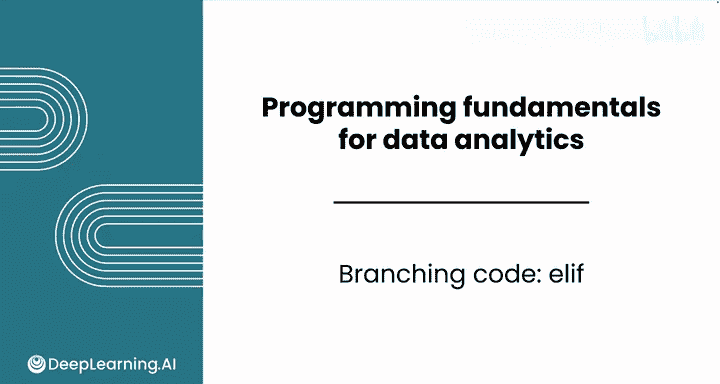
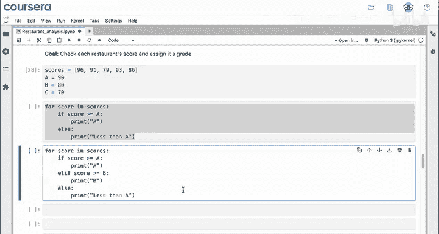
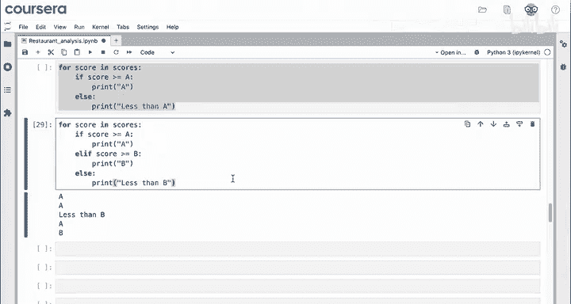
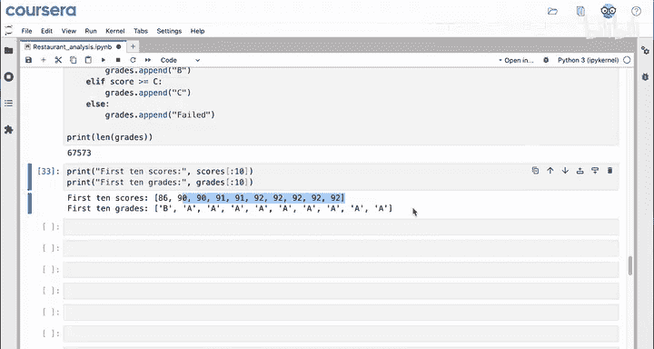
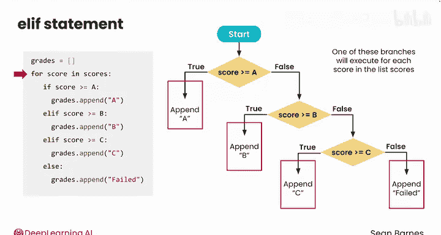
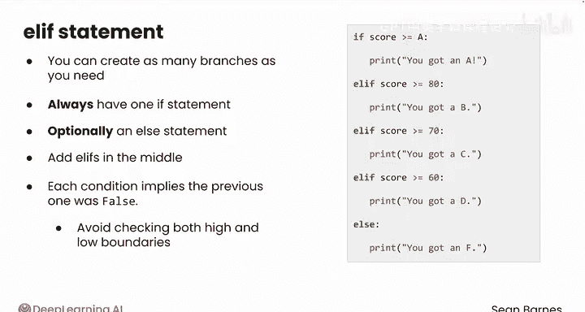

# 021：elif 🧩

## 概述

在本节课中，我们将学习如何结合循环和条件语句，为餐厅食品安全评分分配等级。核心内容是使用`elif`创建多分支代码结构，实现更复杂的逻辑判断。

---



## 回顾与引入

上一节我们介绍了使用`if-else`进行简单的二分支判断。本节中，我们来看看如何创建两个以上的分支路径。

在之前的视频中，我们编写了检查每个餐厅评分并分配等级的代码。以下是当时的代码状态：

```python
if score >= 90:
    print("A")
else:
    print("Less than A")
```

这段代码打印出评分是“A”还是“低于A”。目前，代码只有两个分支：A或低于A。

为了分配B和C等级，我们需要创建多于两个的分支路径。



---

## 使用`elif`添加新分支

你可以使用`elif`来添加新的分支。`elif`代表“else if”，其含义是“为我检查另一个条件”。

如果评分大于或等于B级分数线，我们希望打印“B”。以下是修改后的代码结构：

```python
if score >= 90:
    print("A")
elif score >= 80:
    print("B")
else:
    print("Less than B")
```

这三个分支为代码执行提供了独特的路径。对于每个评分，代码只能选择其中一条路径执行。

你可以将它们想象成一个渐进式过滤器：
*   任何大于等于90的评分，会进入第一个分支并打印“A”。
*   `elif`会检查另一个条件：评分是否大于等于80。如果是，则打印“B”。
*   现在，`else`成为了捕获所有低于B评分的“兜底”分支。



运行此代码，你将得到A、A、低于B、A和B等输出。

---

## 添加更多分支

你可以根据需要添加任意数量的`elif`语句，直到创建出代码所需的所有分支。

例如，我们可以再添加一个`elif`来检查C级：

```python
if score >= 90:
    print("A")
elif score >= 80:
    print("B")
elif score >= 70:
    print("C")
else:
    print("Failed")
```

现在，你需要将`else`语句的含义改为“未通过”：如果你没有得到A、B或C，那就是未通过。

运行该代码后，你的数据中也会出现C等级。

---

## 在循环中进行数据操作

现在你已经在循环内创建了不同的分支，可以进行一些很酷的操作。

例如，假设你正在处理之前用辅助函数创建的完整数据集，你可能想创建一个包含所有餐厅分配等级的新列表。

你可以创建一个新的空列表`grades`，并在循环内部为每个评分追加新分配的等级。

所以，与其`print("A")`，不如写成`grades.append("A")`。

如何完成这段代码的修改？你只需在每个条件分支内追加相应的等级即可：B、C和Failed。

最后一个问题：假设这个循环运行完毕，之后你打印`grades`列表的长度。你预计这个列表有多长？

它应该与`scores`列表的长度相同，大约67,000条。你应该检查一下数据，确认你的代码是否正常工作。请记住，代码能运行并不代表它正确无误。

---

## 验证代码结果



你可以尝试询问你的大语言模型来协助验证。这里有一个提示词示例：

> “请为我编写代码，打印出列表`scores`和列表`grades`的前10项。”

运行该代码，你可以检查数据。如果结果显示第一个等级是B，其余都是A（且评分都在90分以上），那么看起来是正确的。这也符合你的直觉，因为之前你已经看到大约95%的评分都是A。

---

## 用流程图巩固理解

让我们用流程图来模拟你刚刚编写的分支代码，以巩固所学知识。

1.  第一个`if`语句检查评分是否大于等于A级标准（90分）。如果为真，则代码将“A”追加到等级列表中。
2.  如果为假，则代码沿此路径向下，检查第二个`elif`语句的真假。
3.  如果为真，则代码追加“B”。
4.  如果该语句为假，则代码进入下一个`elif`，检查是否追加“C”。
5.  如果最后的条件也为假，则进入`else`代码块，追加“Failed”。

这段代码为每个评分创建了四种可能的分支路径。对于列表`scores`中的每个评分，代码将选择这四条路径中的一条执行。

请记住，所有这些都发生在`for`循环内部。因此，对于列表中的每个评分，都会执行一次这条决策链。如果有5个条目，这个决策链就发生5次。如果有60,000个条目，它就发生60,000次。



---

## 核心模式总结

你可以根据需要创建任意多的分支。你总是有一个`if`语句，以及一个可选的`else`语句。如果你需要两个以上的分支，可以在中间添加`elif`语句：1个`elif`，2个`elif`，或任意多个。

你也可以只有`if`和`elif`语句，这是一种在末尾不需要“兜底”分支时可以使用的模式。

请注意评分条件中递减的模式。这种模式利用了`if`语句的顺序特性。每个条件都只在**前一个条件为假**时才被应用。这样，你就避免了为每个等级同时检查评分的高边界和低边界。

---

## 总结



本节课中，我们一起学习了如何使用`elif`创建多分支代码。我们掌握了如何将循环与复杂的条件判断结合，为数据分配多个类别，并通过创建新列表来存储结果。我们还探讨了验证代码正确性的方法，并用流程图可视化了多分支逻辑的执行过程。

在下一个视频中，你将学习本模块的最后一个关键概念：如何同时遍历多个列表。我们下节课见。