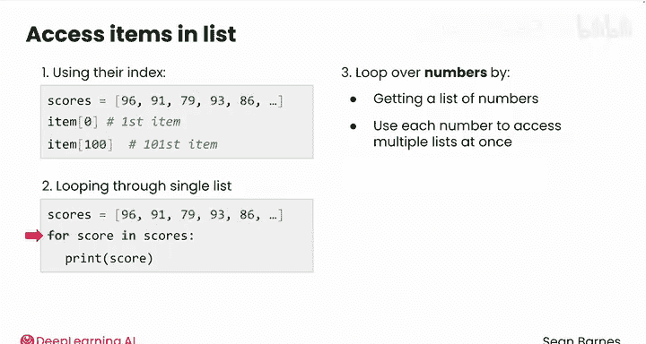
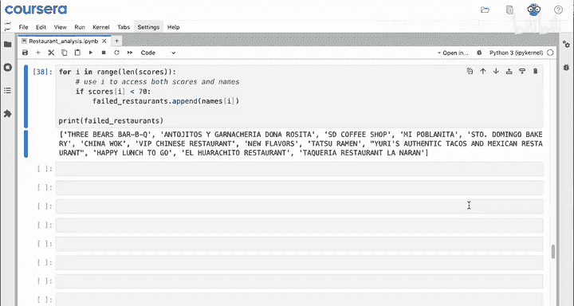
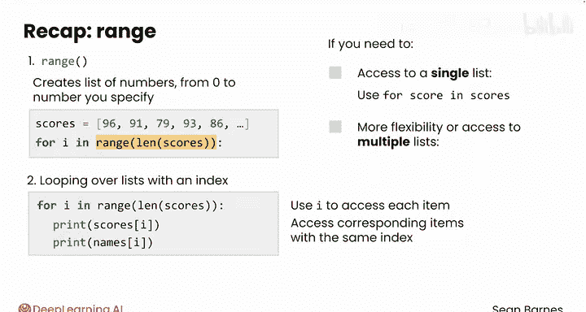

# 022：使用range函数进行循环 🔄

在本节课中，我们将学习如何使用 `range` 函数和索引来同时遍历多个列表。这种方法在处理相关联的多列数据时非常有用。

---

## 概述

你已经见过如何编写循环来遍历单个列表。然而，`for` 循环非常灵活。在查看代码之前，我们先了解一下如何同时遍历多个列表。

回想一下，你可以使用索引来访问列表中的元素。例如，`scores[0]` 访问第一个元素，`scores[100]` 访问第101个元素，依此类推。

这里的核心思想是，你不仅可以像 `for score in scores:` 这样遍历单个列表，还可以通过获取一个数字列表来遍历数字，并用每个数字同时访问多个列表。这种策略允许你同时访问多个列表中相同位置的元素。

---

## 问题场景：找出不合格的餐厅




假设你需要创建一个所有未通过检查的餐厅名单。这个名单可能很短，因为95%的餐厅都获得了A级评分。

首先，从餐厅数据中获取两个列表：`scores`（分数）和 `names`（名称）。你已经见过 `scores` 列表的样子。如果你打印 `names` 列表的前10个值，会得到一系列不同餐厅的名称。

现在你有了数据中的两列。这个问题的挑战在于，你需要遍历 `scores` 列表，但要根据分数保存对应的餐厅名称，而不是分数本身。

如果你从 `for score in scores:` 这样的循环开始，在循环内部你只能访问分数，无法访问名称。让我们来规划一下：
*   你可以判断 `if score < 70`，这是一个不合格的分数。
*   然后你想将餐厅名称添加到一个失败餐厅的列表中。

因此，在顶部创建一个空列表：`failed_restaurants = []`。但问题在于，在循环的任何时刻，你如何知道正在处理的是哪家餐厅？这种循环结构无法解决这个问题。

---

## 解决方案：使用索引同时遍历

不过，你还有另一个选择。你可能记得这段代码，它有一个简短的名称和分数列表，并通过索引（即元素在列表中的位置）来访问这两个值。

```python
names = ["Alice", "Bob", "Charlie"]
scores = [85, 92, 78]
print(names[0], scores[0])  # 输出: Alice 85
```

所以，如果你能遍历一个数字列表，就可以使用相同的数字来同时访问 `names` 和 `scores` 列表。这听起来有点抽象，让我们来写代码。

---

## 认识 `range` 函数

我们将要这样做：`for i in range(10):`（这里 `i` 代表索引）。然后 `print(i)`。

```python
for i in range(10):
    print(i)
# 输出: 0, 1, 2, 3, 4, 5, 6, 7, 8, 9
```

这里的新内容是 `range` 函数。`range` 本质上会创建一个数字列表，默认从0开始，直到（但不包括）你输入的这个值。在这个例子中，就是0到9。这些数字将是循环中 `i` 所取的不同值。

这些数字正好与一个长度为10的列表的索引相同。你的列表索引从0开始，一直到9。

---

## 同时遍历两个列表

因此，要同时遍历这两个列表，你可以这样做：
`for i in range(len(scores)):`（使用 `len(scores)` 获取列表长度，两个列表都可以，因为它们长度相同）。

`range` 函数会创建一个从0到67,573的范围（假设 `scores` 列表长度为67,574）。这些就是你访问列表所需的所有索引。



现在，你可以在循环内部使用相同的索引 `i` 来同时访问 `scores` 和 `names`。这样你就可以同步遍历两个列表，同时访问 `scores[i]` 和 `names[i]`。如果你访问第10个分数，你也在访问第10个餐厅名称。

于是，你可以这样写：
```python
failed_restaurants = []
for i in range(len(scores)):
    if scores[i] < 70:  # 如果分数不合格
        failed_restaurants.append(names[i])  # 将对应的名称添加到列表
```

循环结束后，你可以打印 `failed_restaurants` 来查看结果。运行速度会非常快，你将得到一个分数低于70的餐厅名称列表。

---

## 本节总结

在本视频中，你学习了两个新概念：`range` 函数和使用索引遍历列表。

*   **`range` 函数**：本质上创建一个你可以遍历的数字列表，默认从0开始，直到（但不包括）你指定的数字。
*   **常见模式**：你会经常看到 `for i in range(len(scores)):` 这样的模式，用于遍历列表中的所有索引（本例中是分数列表）。
*   **索引访问**：一旦你用 `for i in range(len(scores)):` 创建了循环，就可以使用 `i` 来访问列表中的每个元素，如 `scores[i]`。
*   **处理多列表**：如果你有两个对应的列表，可以用相同的索引访问对应的元素，如 `scores[i]` 和 `names[i]`。

所以，总结一下：
*   如果你只需要访问单个列表，可以使用之前学过的 `for score in scores:` 代码。
*   如果你需要更大的灵活性，或者需要访问多个列表，可以使用本课学习的基于索引的循环。

你在处理多列数据方面做得很好！在下一个模块中，你将学习更多细节。



现在，请跟随我进入本课的最后一个视频，我们将深入探讨代码的执行顺序。我们那里见。