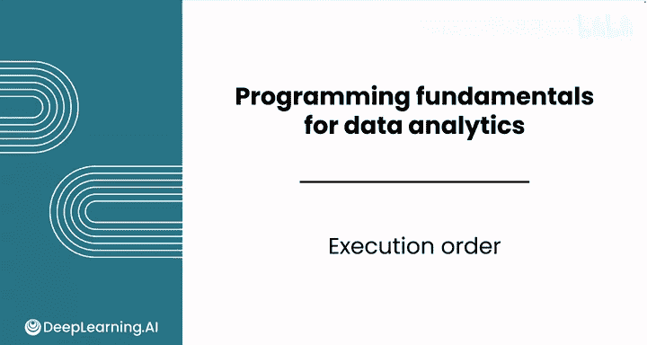
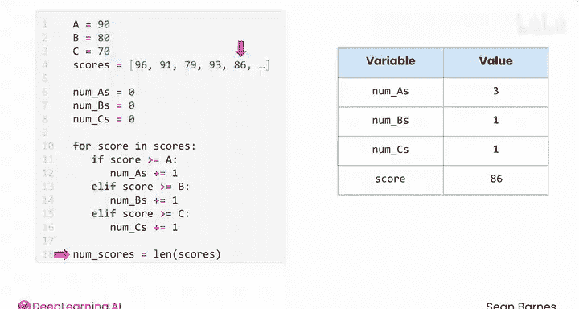

# 023：Python数据分析 - 执行顺序 🧭

在本节课中，我们将要学习程序执行顺序的概念。执行顺序是指程序运行代码行的先后序列。理解这一点对于调试代码和预测程序行为至关重要。

---

## 什么是执行顺序？

执行顺序是你的程序逐行运行代码的序列。

你已经了解了控制流如何允许你重复代码或选择不同的执行分支。现在，让我们通过一个例子来追踪代码的执行过程。

---

## 代码追踪示例

以下是一段统计数据中A、B、C等级数量的代码。在调试时，逐行跟踪代码会很有帮助。

以下是你可以采用的方法。让我们在遍历列表前五个值时，跟踪每个变量的值。请特别注意控制结构。

首先，你需要明确在代码运行过程中，哪些变量的值你预期会保持不变。

变量 `A`、`B`、`C` 和 `scores` 将保持不变。因为分数线是常量，并且你不会对列表进行追加或其他操作。

与此同时，变量 `num_A`、`num_B` 和 `num_C` 会随着分数统计而改变。变量 `score` 的值也会随着循环运行而改变。

因此，你可以观察每个计数器和 `score` 在循环中的值变化。

---

## 逐步执行分析

在第一个循环周期或迭代中，`score` 获得值 `96`。

然后，计算机检查 `score` 是否大于或等于 `A`（`A` 的值为 `90`）。由于 `96` 大于 `90`，条件为真。

因此，计算机将执行下一行代码，将变量 `num_A` 的值加 `1`。现在 `num_A` 等于 `1`。

接着，计算机跳过后续的 `elif` 和 `else` 代码块，并返回到循环的第一行。

在下一个迭代中，`score` 获得值 `91`。计算机首先检查该值是否大于或等于 `A`（`90`）。由于表达式为真，它执行下一行，将变量 `num_A` 加 `1`。现在 `num_A` 等于 `2`。

`elif` 和 `else` 代码块被跳过，循环返回顶部。

在下一个迭代中，`score` 的值为 `79`。计算机首先检查 `score` 是否大于或等于 `A`（`90`），但该表达式为假。因此，下一行代码被跳过。

然后，计算机检查下一个条件：`elif score >= B`。由于 `B` 是 `80`，这个表达式也为假。所以计算机跳过下一行，移动到下一个 `elif` 代码块。

这个条件（`elif score >= C`）为真。因此，计算机执行 `elif` 下的代码行，将 `num_C` 加 `1`。现在 `num_C` 等于 `1`。

循环然后返回顶部。现在 `score` 的值为 `93`。第一个条件为真，因此计算机执行下一行，将 `num_A` 加 `1`。现在 `num_A` 等于 `3`。

循环返回顶部。最后，`score` 获得值 `86`。第一个条件为假，因为 `86` 不大于等于 `90`。下一行被跳过。

然后计算机检查 `elif` 条件：`score` 是否大于等于 `80`，该条件为真。

因此，执行第一个 `elif` 下的代码行，将 `num_B` 加 `1`。现在 `num_B` 等于 `1`。

循环继续这个过程，直到到达列表的末尾。然后，计算机可以继续执行下一行代码，这涉及到计算列表的长度。

---

## 核心模式总结

干得好，你刚刚构建了一个常见的编码模式：**统计列表中不同类型项目的数量**。

这与你可能在电子表格中使用的 `SUMIF` 操作类似。

---

## 课程总结

在本节课中，我们一起学习了Python计算机编程所需的核心技能：数据类型、变量、条件语句和循环。

你仅在一个模块中就涵盖了大量内容。接下来的作业和评分实验将让你尝试应用这些知识。请跟随我进入下一个视频，了解如何完成你的第一个评分实验。