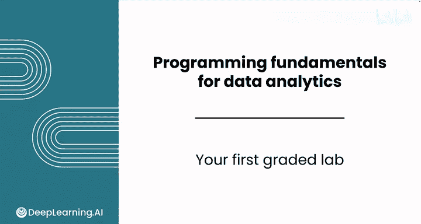
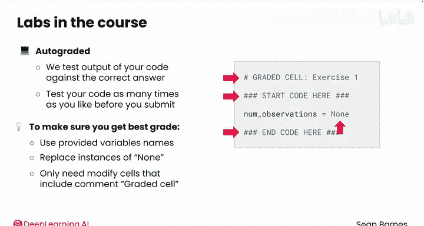
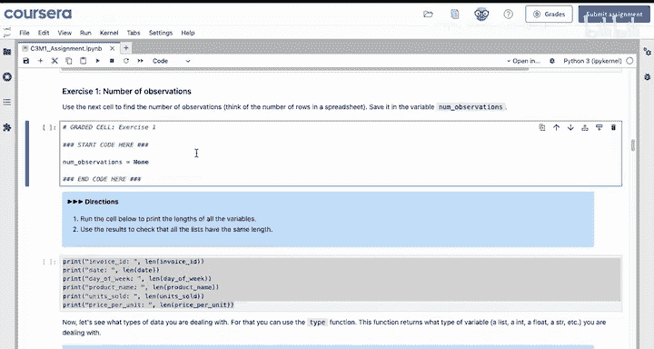
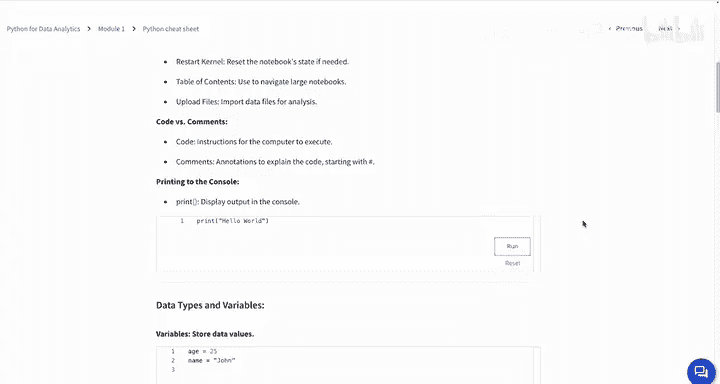

# 024：你的首次分级实验 📝

在本节课中，我们将学习如何完成本课程的第一次分级Python实验。你将分析一个真实世界的数据集来测试你的Python技能。课程中的所有实验都是自动评分的，这意味着我们会将你的代码输出与正确答案进行比对。



## 实验环境与规则

上一节我们介绍了实验的目标，本节中我们来看看实验的具体环境和需要遵守的规则。

实验在Coursera平台上的Jupyter Lab环境中进行，其界面与你在此模块视频中看到的相同，但顶部多了一些Coursera选项。

以下是完成实验时需要注意的几个关键点：

*   **使用提供的变量名**：例如，你不应更改变量名 `num_observations`，因为自动评分器将无法识别它。
*   **替换 `None` 占位符**：代码中出现的 `None` 仅作为占位符。如果你看到 `None`，那就表示你需要在那里添加自己的代码。
*   **仅修改指定单元格**：你只需要修改包含 `# GRADED CELL` 注释的单元格。
*   **可以添加新单元格**：你可以添加新的单元格进行实验，但只有被标记为分级的单元格才会被评估。

## 实验界面详解

了解了基本规则后，我们来看看实验界面的具体功能。


在界面顶部，有几个重要的按钮：
*   **Coursera Coach**：点击此按钮可以与一个大型语言模型（LLM）聊天，无论是提问还是寻求帮助解决错误信息。
*   **Grades**：查看你的成绩。
*   **Submit Assignment**：提交作业。

例如，如果你问“如何在Python中定义一个新变量？”，教练会给出包含示例的回复。聊天记录会被保存，方便你后续查阅。



为了获得更多工作空间，你可以点击左侧的**文件浏览器按钮**将其隐藏。


## 如何完成与提交

现在，让我们具体看看如何填写答案并提交作业。

在每个练习中，你会看到标有 `# GRADED CELL` 的注释，这意味着你需要填写该单元格。你的代码必须写在 `# YOUR CODE HERE` 和 `### END CODE HERE` 这两行注释之间。

**代码示例：**
```python
# GRADED CELL
# YOUR CODE HERE
result = calculate_total(data)  # 替换此处的 None
### END CODE HERE
```

如果你将代码写在这些注释之外，自动评分器将无法识别。

完成所有分级单元格后，即可提交。点击右上角的 **Submit Assignment** 按钮，你可能需要在提交前确认荣誉准则。提交后，评分可能需要几分钟。你可以通过 **Grades** 选项卡查看结果。

## 查看成绩与反馈

提交后，你将获得详细的成绩反馈，这有助于你改进。




成绩页面会显示：
*   你是否通过了该练习。
*   你获得的分数以及通过所需分数（通常是70%或更高）。
*   你的代码运行后的输出，这为你提供了改进的反馈。

你可以根据需要多次重新提交。**重要提示**：在关闭窗口前，请务必点击 **Save** 按钮，否则你将丢失进度。

## 课程资源与准备

在开始实验前，请善用课程提供的学习资源。

本课程的下一个项目是 **Python速查表**，它包含了你在本课程中学到的所有概念的便捷参考。你可以结合Coursera Coach来帮助你完成作业。在本课程的每个分级实验之前，你都会获得一份更新版的速查表，其中包含你在每个模块中学到的新概念。




准备好开始你的第一次实验了吗？你将使用一家本地商店的数据来计算不同类型产品的销售额。完成实验后，我们将在下一个模块中一起探索如何在代码中处理整个电子表格。

**本节课总结**：我们一起学习了如何在本课程的Jupyter Lab环境中完成并提交第一次分级Python实验，了解了自动评分的规则、界面功能、代码填写规范以及如何查看成绩和利用学习资源。现在，你可以自信地开始你的数据分析实践了。到目前为止做得很好，我们下一个模块见！