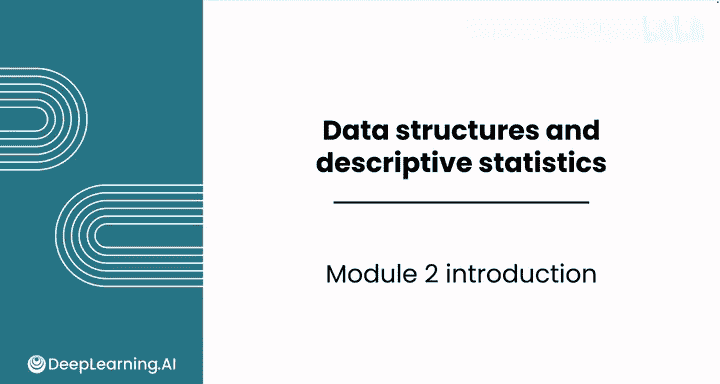
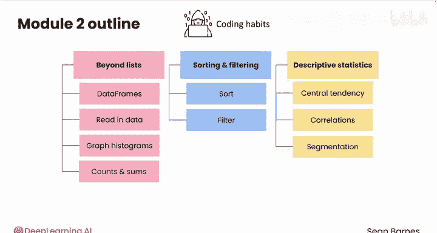

# 025：数据结构和描述性统计 📊

在本课程中，我们将学习如何使用Python的Pandas库来组织、分析数据，并从数据中提取有意义的见解。我们将探索核心的数据结构，学习排序、筛选以及计算描述性统计量的方法，最终能够将庞大的数据集转化为可操作的洞察。

---

## 欢迎来到模块2：数据结构和描述性统计

在本模块中，你将学习如何使用一个名为Pandas的强大Python库来组织、分析数据，并从中提取有意义的见解。

你将学习如何使用核心的数据结构，包括数据框（DataFrame）和序列（Series），这些结构能让你高效地处理大型数据集。

在整个模块中，你将使用一个关于编码习惯的真实调查问卷数据集。

---

## 第一课：探索数据结构

上一节我们介绍了本模块的目标，本节中我们来看看具体的学习内容。在第一课中，我们将探索列表之外的数据结构，学习数据框如何像电子表格一样存储和组织复杂数据，但具备更强大的分析能力。

以下是本课你将学习的具体技能：
*   学习如何读取数据。
*   学习如何绘制直方图。
*   学习如何计算数据的计数和总和。

---

## 第二课：排序与筛选

掌握了基本的数据操作后，我们需要学习如何聚焦于关键信息。第二课的重点是排序和筛选，这些关键技能能让你精确找到所需的信息。

以下是本课你将学习的具体技能：
*   学习如何以有意义的方式对数据进行排序。
*   学习如何筛选数据以精确查找目标内容。

---

## 第三课：计算描述性统计与可视化

在能够有效组织和筛选数据之后，我们将深入分析数据本身。在最后一课中，你将学习如何使用Pandas计算描述性统计量，从集中趋势的度量到特征间的相关性及数据分割。

你还会创建可视化图表来有效地传达你的发现。

以下是本课你将学习创建的可视化图表：
*   条形图
*   散点图

---

## 总结

在本节课中，我们一起学习了如何利用Python和Pandas库处理数据。到本模块结束时，你将能够使用Python将海量数据集转化为可操作的洞察。

请跟随我进入第一课，开始探索这些强大的数据结构。