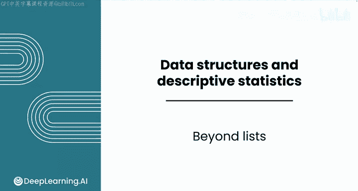
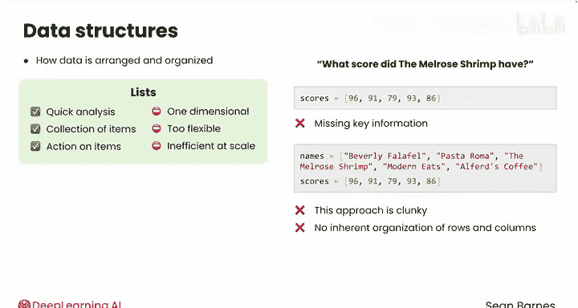
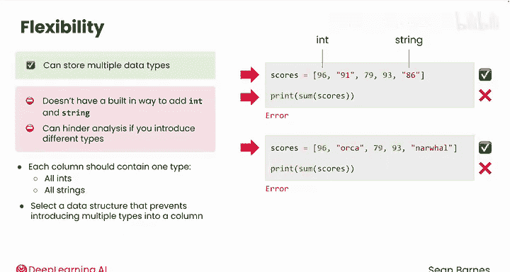
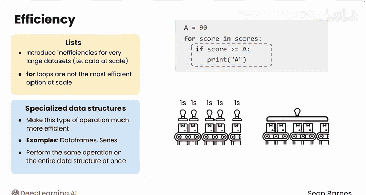

# 026：Python数据分析进阶列表操作 📊



在本节课中，我们将要学习列表在数据分析中的局限性，并了解为什么需要其他数据结构来处理更复杂的数据场景。我们将探讨列表的维度限制、类型灵活性以及在大规模数据下的效率问题，并简要介绍向量化的概念。

## 列表的回顾与数据存储的重要性

在之前的模块中，我们广泛使用了列表来按顺序存储数据。


事实证明，在编程时存储信息的方式非常重要。在Python中，你可以使用不同的结构在代码中存储数据。数据结构只是数据如何排列和组织的一个专业术语，而列表只是其中一种类型的数据结构。

## 列表的局限性

上一节我们介绍了列表的基本用途，本节中我们来看看列表在数据分析中的几个关键限制。在之前的模块中，你处理了28年的图书馆数据或大约600万条餐厅评分。列表帮助你执行快速分析，并且你暂时不需要扩展到数百万行。当你有一个项目集合并且需要通过对这些项目进行存储来对它们采取行动时，列表非常有用，这使得采取行动变得更加方便。

然而，列表有几个关键的限制。具体来说，它们是**一维的**、**过于灵活**，并且在**大规模时效率低下**。一旦你理解了这些限制，你就会更从容地从其他可用的数据结构中进行选择。

### 维度限制

关于维度，列表本质上只能存储一列数据。假设你有一个餐厅评分列表，你想回答诸如“Melrose Shrimp得了多少分”这样的问题。你缺少一些关键信息。你能看出是什么吗？那就是餐厅名称。

对于某些应用，仅有一个分数列表是有用的，例如计算平均餐厅分数。但大多数时候，你将处理二维数据，即具有行和列的数据。

你在上一个模块中看到了解决此维度约束的一种变通方法，即维护两个独立但相关的列表，如`names`和`scores`。然而，这种方法很笨拙，因为没有固有的行和列组织，只有两个独立的列表。其他数据结构是二维的，允许你将多列数据存储在一起，就像在电子表格中一样。

### 类型灵活性限制

列表也非常灵活。例如，Python中的列表实际上可以存储多种数据类型。以下列表完全有效：



```python
my_list = [1, 2, "hello", 4.5]
```

但是，当你运行这行代码来对值求和时，你认为会发生什么？


它会抛出一个错误。这是因为Python没有内置的方法让你将整数和字符串类型相加。就Python而言，你的列表可能只包含数字和字符串的混合，因此它不支持混合数字和非数字类型的操作。

这种灵活性在某些应用中是理想的，但在数据分析中，它会阻碍你的分析。数据中的每一列应包含一种类型的数据，例如全部是整数或全部是字符串。你希望选择一种数据结构，以防止意外地将多种类型引入一列。

### 大规模效率限制

列表对于非常大的数据集（即大规模数据）也会引入低效率。例如，在之前的模块中，你使用`for`循环为列表中的每个项目运行代码。这个解决方案非常有效，并且`for`循环是Python编程中非常常见的工具。

然而，它们不是最高效的扩展选项。当这个`for`循环运行时，它基本上按顺序逐步执行每个操作，依次为每个分数运行缩进的代码。想象一条分数的传送带一个接一个地从你面前经过，你的工作是依次为每个分数盖章，如果它是A的话。




然而，一些用于数据分析的专用数据结构使这种类型的操作更加高效。你将在接下来的几个视频中遇到其中两个：**数据帧（DataFrame）** 和 **序列（Series）**。

你可以对整个数据结构一次性执行相同的操作，而不是单独对数据结构中的每个项目进行操作。如果你想象分数的传送带在这个例子中经过，你有一个非常宽的印章，如果需要，可以一次性盖住所有五个分数。

在第一个例子中，如果每个任务需要一秒钟，`for`循环代码将需要五秒钟，而更高效的代码只需要一秒钟。当然，这其中有更多的复杂性，但在大规模处理非常大的数据集时，这种效率会显著累积。

这种对整个数据结构一次性执行操作的过程称为**向量化（Vectorization）**。不要太担心这个术语，你不需要编写向量化代码，它是你将使用的数据结构的内置功能。

## 总结与展望

所以，虽然列表非常有用，但它们并不是唯一的数据结构。




本节课中我们一起学习了列表在数据分析中的三个主要局限性：一维性、类型过于灵活以及大规模处理时的效率问题。我们还了解了向量化的概念，它允许对整个数据集进行高效操作。

在下一节视频中，我们将开始学习如何从笔记本外部的文件导入代码，这将允许你使用由他人开发的数据结构。我们下节课见。