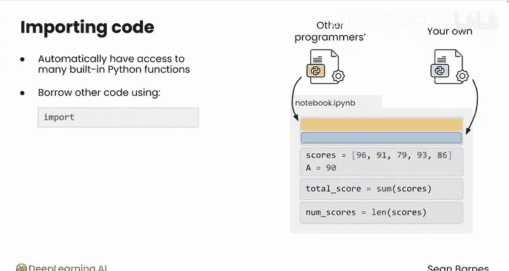
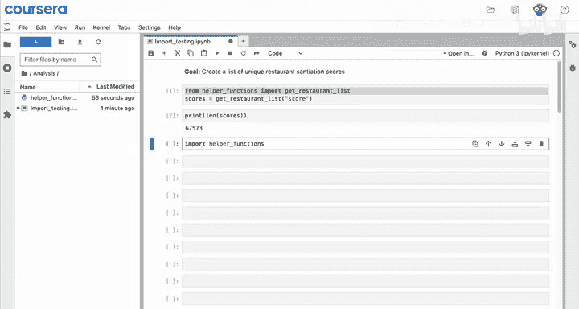
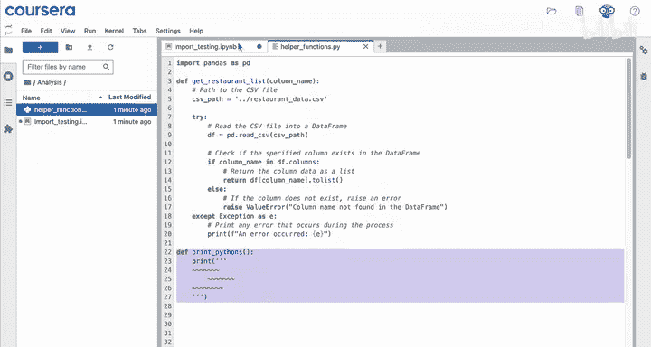
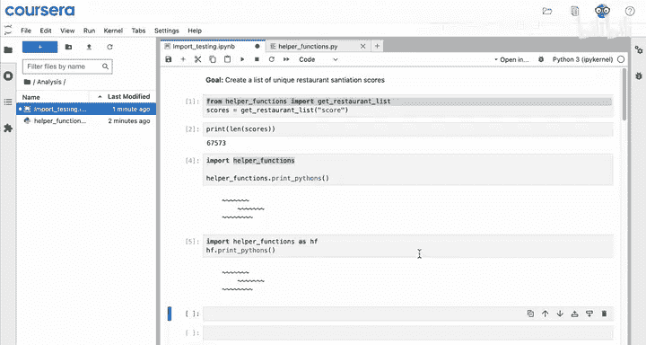
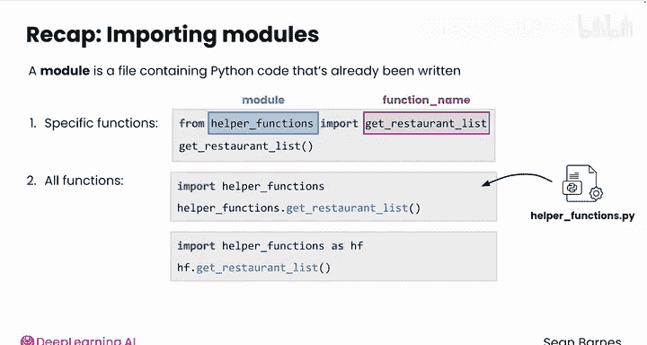

# 027：Python数据分析（第3课）｜模块导入 📦

## 概述

在本节课中，我们将要学习如何在Python中导入模块。模块是包含已编写好的Python代码的文件，通过导入模块，我们可以复用自己或他人编写的代码，从而提升开发效率。我们将介绍几种不同的导入方式，并通过具体示例演示其用法。

---

## 模块导入的基本概念

当你在Notebook中工作时，你当然可以访问该Notebook内的所有代码。


但你也可以通过从其他文件引入代码来增强你的程序。

这些文件可以是你自己编写的，也可以是他人编写的。除了你已编写的代码，你还可以自动访问许多内置函数，例如 `sum` 和 `len`。




你也可以借用其他程序员的代码，包括你自己以前编写的代码，这需要使用 `import` 命令。


---

## 导入模块的实践示例

假设你仍在处理上一个模块中的餐厅评分数据，并且你想创建一个列表，包含所有不同餐厅获得的唯一评分。

在上一个模块中，你看到了这两行代码，它们将餐厅数据的评分列加载到一个名为 `scores` 的列表变量中。

```python
from helper_functions import get_restaurant_list
scores = get_restaurant_list('restaurant_scores.csv', 'score')
```

在第一行中，你从名为 `helper_functions` 的模块中导入了 `get_restaurant_list` 函数。

这是如何工作的？`helper_functions` 在哪里？

首先，在这个Notebook所在的同一文件夹中，有另一个名为 `helper_functions.py` 的文件。

它是一个Python文件，包含一些有用的函数。以下是这些函数的样子：

```python
# helper_functions.py 文件内容
def get_restaurant_list(filename, column_name):
    # ... 函数实现细节 ...
    pass

def print_pythons():
    print("🐍🐍🐍")
```

这是 `helper_functions.py` 文件的全部内容。现在不必过于担心这段代码，你只是要借用这个函数在你的Notebook中使用。

你可以直接将所有这些代码复制并粘贴到你的Notebook中。然而，如果你想借用大量代码，或者无法轻松访问该文件，这样做可能会很笨拙。

相反，你可以导入这段代码。在这个 `import` 命令之后，你就可以访问 `get_restaurant_list` 这个函数了。

你可以调用那个函数。这是从你自己那里借用代码的好方法。

你在另一个文件中有一些代码，并且你想在这个文件中使用它。

---

## Python中的不同导入方式

Python中有几种不同的导入选项。

**1. 导入特定函数**



`from module import function` 这个选项允许你选择想要导入的函数。

```python
from helper_functions import get_restaurant_list
```



**2. 导入整个模块**

你也可以通过使用 `import helper_functions` 来导入此模块中的所有函数。


所以，使用 `import module`。

现在，你可以尝试使用文件中的其他函数，比如 `print_pythons`。


嘿，这个错误是什么？`print_pythons` 未定义。

让我们用LLM（大语言模型）来检查如何修复这个问题。假设我正在尝试使用 `helper_functions.py` 中的 `print_pythons` 函数。为什么会出现这个错误？

看起来，你需要引用模块名称才能访问其函数。它给出了你可以复制并粘贴回单元格中运行的正确代码。

你可以看到，它通过引用模块名称来调用函数。

```python
import helper_functions
helper_functions.print_pythons()
```

好的，非常可爱的Python（🐍）。每次你想打印Python时都必须写这么长的 `helper_functions` 部分，这有点烦人。

---



## 使用别名简化代码

你可以使用 `as` 给这个模块起一个昵称。

```python
import helper_functions as hf
```

现在你可以说 `hf.print_pythons()`，这样就完成了。这个昵称只是让你的代码更短。


---

## 核心概念总结

模块是一个包含已编写好的Python代码的文件。

你刚刚看到了两种在Notebook中导入模块的方法：

1.  **导入特定函数**：使用类似 `from helper_functions import get_restaurant_list` 的代码行。然后你就可以直接在代码中使用 `get_restaurant_list`。
    *   **通用命令格式**：`from module import function_name`

2.  **导入整个模块**：如果你想导入模块中的所有函数，而不是列出特定的函数，可以使用 `import helper_functions` 这样的命令。这个命令允许你借用 `helper_functions.py` 中包含的所有函数。
    *   如果你使用这种风格的命令，调用特定函数时也必须使用模块名称，例如 `helper_functions.get_restaurant_list()`。
    *   你也可以使用 `as` 给模块起一个昵称，这样可以节省一些输入。例如，你可以使用 `import helper_functions as hf` 来给 `helper_functions` 一个更短的昵称。



---

## 扩展与过渡


你可以从计算机上的另一个文件导入代码，也可以从互联网、其他程序员编写的代码中导入。

在下一节中，我们将看看如何导入 `pandas` 模块，它为数据分析提供了强大的数据结构。请跟随我到下一个视频学习。

---

## 总结

本节课中，我们一起学习了Python模块导入的核心知识。我们了解了模块是什么，掌握了使用 `from ... import ...` 导入特定函数和使用 `import ...` 导入整个模块的方法，并学会了使用 `as` 关键字为模块设置别名以简化代码。理解这些导入方式是有效复用代码、构建复杂程序的基础。