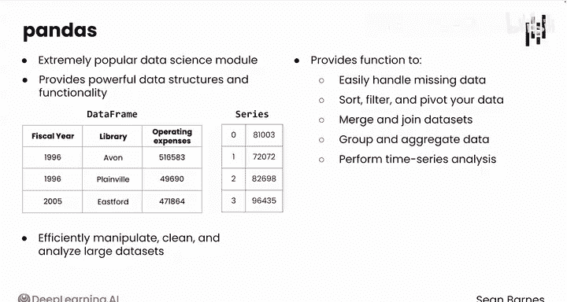

# 028：Pandas库应用 🐼

在本节课中，我们将要学习Python数据分析中一个极其重要的库——Pandas。我们将了解Pandas是什么，它为何如此重要，以及如何利用它来高效地处理和分析数据。

---

全球有数百万的Python程序员，你就是其中之一。

事实证明，你可以借用其他程序员发布的代码。

对于数据分析而言，最重要的模块之一，你将借用的，就是名为Pandas的模块。作为一名数据分析师，你很可能会每天使用Pandas模块。

Pandas最初于2008年编写，是一个非常流行的数据科学模块，它提供了强大的数据结构和功能。

它提供的两个基础数据结构是：**DataFrame**（存储表格数据）和**Series**（类似于列表的增强版）。

Pandas允许你高效地操作、清理和分析大型数据集。

它提供了多种函数，可以轻松处理缺失数据、排序、筛选和数据透视，合并或连接数据集，对数据进行分组和聚合，以及执行时间序列分析。

它还支持从各种文件格式（如CSV、Excel甚至数据库）中导入数据。

遗憾的是，Pandas这个名字与现实世界中可爱、毛茸茸的动物“熊猫”无关。但这里有一张熊猫的图片来弥补这个事实。

回想之前，你曾尝试使用餐厅数据创建一个唯一的卫生评分列表。你可以使用Pandas来完成这个任务。

Pandas并非由你或你认识的人编写。这是Python社区中其他人编写的一大堆代码，实际上有数十万行。

你通常会看到Pandas以 `import pandas as pd` 的方式导入，并给它一个昵称 `pd`。

现在Pandas已经导入，你可以使用所有这些强大的代码了。举一个简单的例子（在接下来的视频中你会探索更多），你可以使用 `pd.unique()` 函数来获取一个唯一值的列表。

这完全类似于电子表格中的 `UNIQUE` 函数。试想一下，如果你必须从头开始编写这段代码，这个操作会有多复杂。它可能需要循环和一两个条件判断，而且那可能还不是寻找这些唯一值的最佳或最快方法。

因此，从Pandas库中借用这个 `unique` 函数，就像从朋友那里借用一件电动工具。你以零成本获得了一种超能力。

Pandas有很多很酷的函数。要开始使用，你很可能需要从CSV文件中读取你的数据。

请跟随我到下一个视频，看看具体如何操作。

---

本节课中，我们一起学习了Pandas库的基础知识。我们了解到Pandas是数据分析的核心工具，它提供了DataFrame和Series两种强大的数据结构，以及一系列高效的数据处理功能。通过导入Pandas并利用其现成的函数（如 `pd.unique()`），我们可以极大地简化数据分析任务，无需重复造轮子。下一节，我们将学习如何使用Pandas读取数据文件。