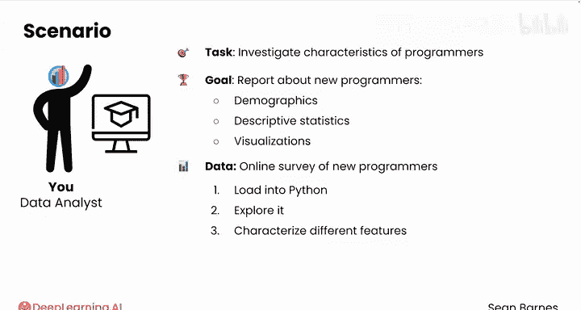
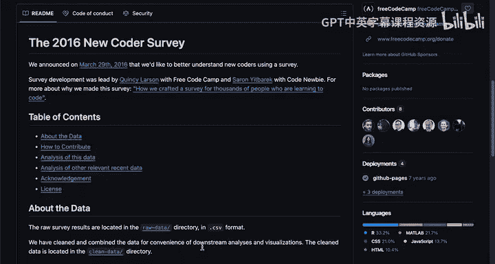
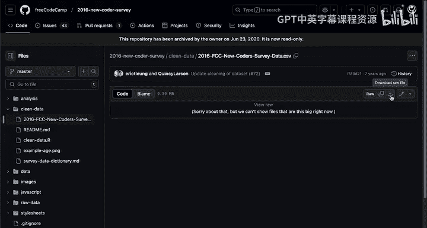
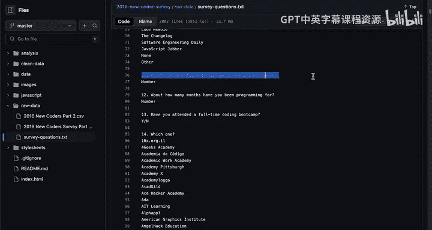
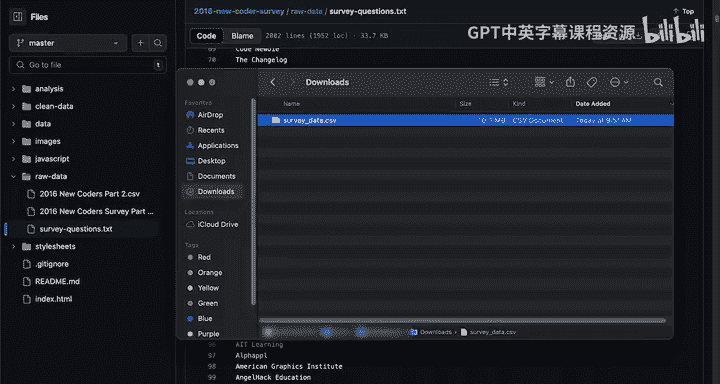
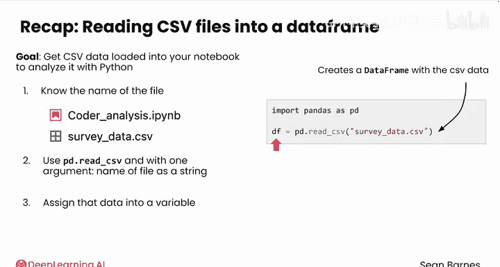

# 029：将CSV数据读入Python 📊


在本节课中，我们将学习如何使用Python的pandas库来读取和分析CSV格式的数据文件。我们将通过一个关于新程序员调查数据的实际案例，演示从获取数据到将其加载到Python环境中的完整流程。

---

## 测试Pandas：分析新程序员数据

上一节我们介绍了数据分析的基本概念，本节中我们来看看如何将实际数据加载到Python中进行分析。

假设你在一家为新手程序员提供教育产品的公司工作。你被要求调查全球程序员的特点，以辅助市场营销工作。这项计划的目标是创建一份关于新程序员特征的报告。你的团队对人口统计数据感兴趣，并希望在报告中包含描述性统计和可视化图表。

你在网上找到了一些关于新程序员的调查数据。你需要将这些数据加载到Python中，进行探索，并描述其不同特征，从而得出关于什么样的人开始学习编程的结论。

你对这些数据一无所知，所以第一步是查看数据来源。

## 检查数据来源

这是公开可用的数据，存储在Github上。Github是一个用于共享代码的网站。不必过于担心Github的具体细节，你只是在调查数据本身。

这些数据由freeCodeCamp和CodeNewbie于2016年收集。数据本身位于“clean_data”目录中。进入该目录，你会发现这里唯一的CSV文件就是新程序员调查数据。



点击这个文件，你可以直接使用下载按钮来下载它。





你还可以在“raw_data”文件夹中看到调查的问题，例如“你是否已经是一名软件开发者？”、“你每周花多少小时学习？”等等。

## 准备数据文件

下载文件后，你会发现它有一个很长的文件名。你可以将文件重命名为更短的名称，例如“survey_data.csv”。

现在，如何将这个文件导入到你的代码中呢？在本课程的实验环节，这一步已经为你完成，但你需要了解其工作原理。



你需要确保“survey_data.csv”文件与你的Jupyter笔记本文件位于同一个文件夹中。在这个演示中，文件需要被上传到Coursera的Jupyter Lab环境中，并且与笔记本在同一文件夹。

请注意，在本演示中，你将看到原始数据集的修改版本，它包含了原始特征的一个子集，并且列名更短。

## 将CSV文件读入Python

因为这两个文件在同一个文件夹中，你可以仅使用文件名来访问CSV文件。

首先，导入pandas库，通常缩写为`pd`。习惯上，将所有导入语句放在代码的顶部。



```python
import pandas as pd
```

然后，你将使用`pd.read_csv()`函数，并将文件名`‘survey_data.csv’`作为唯一的参数传入。注意，文件名是一个字符串。

```python
df = pd.read_csv('survey_data.csv')
```

将此函数的结果存储在一个变量中，我们称它为`df`。`df`是“dataframe”的常用缩写。

这个数据的类型是什么？让我们使用Python的`type()`函数来查看。

```python
type(df)
```

`df`的类型是pandas的DataFrame。DataFrame类似于Python版本的电子表格。

## 初步查看数据

加载数据后，你的第一步应该是查看它。例如，你可以直接输入`df`并按Shift+Enter来查看你的DataFrame。

每一行代表一个人提交的调查问卷，每一列代表该调查中的一个问题。查看输出的底部，有超过15000份调查回复，你正在处理16个特征。

你可能还会注意到，其中一些回复有`NaN`，代表“Not a Number”（非数字）。这些单元格是空的，没有信息。另外，DataFrame的索引从0开始，就像列表一样。

顺便说一下，你也可以使用`print(df)`，但得到的输出格式不如Jupyter笔记本默认的DataFrame显示方式美观。

## 构想研究问题

你可能已经在思考一些研究问题了。例如：
*   这份调查中年龄的分布是怎样的？
*   人们在学习编程上花了多少钱？
*   他们编程了多少个月？（这个列可以帮助你判断这是否真的是针对初学者的调查。）

你可能还对数据中特征之间的关系感到好奇。例如：
*   每周学习编码的小时数与个人收入之间有什么关系？
*   个人收入与编程月数之间有什么关系？也许编程时间越长，收入越高。

这里有很多值得探索的内容。

## 快速回顾：使用Pandas读取CSV数据

你的目标是将一些CSV数据加载到笔记本中，以便用Python进行分析。

以下是需要遵循的步骤：

1.  **获取文件**：知道你正在处理的文件名。最简单的情况是，该文件与你的笔记本位于同一文件夹。在Coursera的实验环节，这一步已为你完成。
2.  **使用读取函数**：使用命令`pd.read_csv()`，并给该函数一个参数——文件名（字符串形式），例如`‘survey_data.csv’`。
3.  **存储数据**：将此函数创建的数据框（DataFrame）赋值给一个变量，以便后续使用。在演示中，变量是`df`，这是DataFrame的常用缩写。你也可以使用`data`、`survey_data`或其他你认为有意义的名称。

```python
# 完整代码示例
import pandas as pd
df = pd.read_csv('survey_data.csv')
```

现在你已经加载了数据，可以开始研究你感兴趣的问题了。

请跟随我进入下一个视频，学习如何探索你的DataFrame。

---

**本节课总结**



在本节课中，我们一起学习了如何将外部的CSV数据文件读入Python环境。我们了解了查看数据来源、准备文件路径的重要性，并掌握了使用`pd.read_csv()`函数加载数据到pandas DataFrame的核心操作。最后，我们初步查看了数据，并构想了一些可以基于此数据集进行探索的分析问题。这是进行任何数据分析项目的第一步。