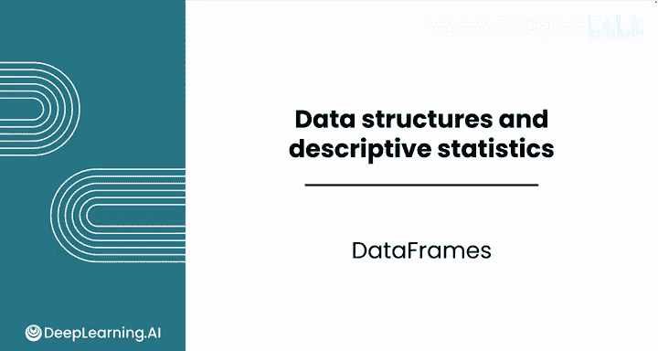
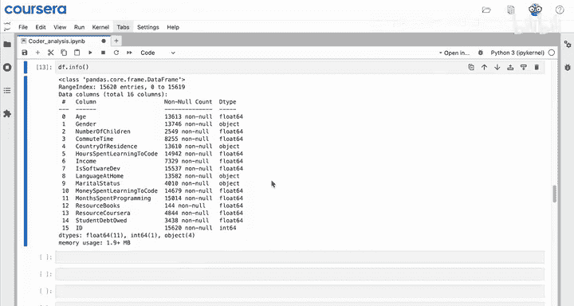
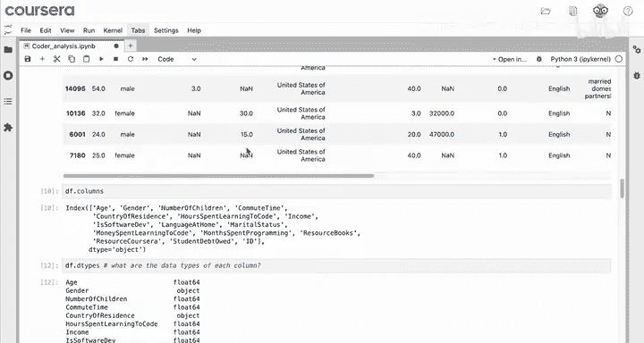
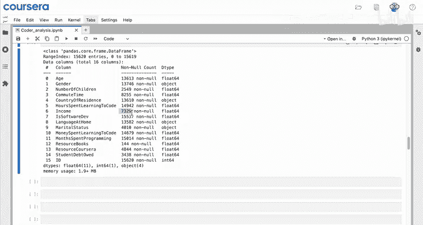

# 030：Python数据分析（第3课）｜数据框基础 📊

在本节课中，我们将要学习Python数据分析的核心工具——数据框（DataFrame）。我们将探索如何查看、总结和理解数据框的基本结构，包括其列名、数据类型以及如何处理缺失值。通过本课，你将掌握初步探索数据框的实用方法。

---

## 探索数据框的基本方法 🔍

数据框是Python中用于表示行列数据的主要工具。Pandas库提供了多种选项来探索和总结这类数据。

上一节我们介绍了数据框的基本概念，本节中我们来看看如何开始探索一个数据框。如果你不确定如何开始，可以尝试向大语言模型提问，例如：“在Python中，如何获取数据框的一些基本信息？”

以下是几种探索数据框的实用方法：

*   **`df.head()`**：此方法返回数据框的前五行。你也可以传入一个数字参数来指定查看的行数，例如 `df.head(3)` 查看前三行。
*   **`df.sample()`**：此方法随机返回数据框中的一行。与 `head()` 类似，你也可以传入数字参数，例如 `df.sample(5)` 会随机抽取五行。对数据框进行抽样可以让你看到更多样化的响应，从而更好地了解数据中值的范围。

---

## 查看数据框的结构 📐

了解数据的基本结构是分析的第一步。除了查看具体数据行，我们还需要知道数据包含哪些列以及每列的数据类型。

以下是获取数据框结构信息的方法：

*   **`df.columns`**：此命令会简洁地显示所有列的名称。
*   **`df.dtypes`**：此命令用于查询数据框中每一列的数据类型。在Python和数据框中，数据类型至关重要，每一列都有指定的数据类型，意味着该列中的每个值都是同一类型。你会看到 `float64` 和 `object` 等类型。`float64` 本质上是浮点数或小数。
*   **`df.info()`**：此命令提供了所有列及其类型的摘要信息。你还会看到一个新的信息：非空值计数。这个数字越低，表示该列的缺失数据点越多。例如，如果超过一半的受访者没有分享他们的收入，该列的非空计数就会相对较低。

---

## 理解数据框与数据类型 🧩

让我们更仔细地看看数据框在Python中是如何工作的。数据框是一种数据结构，它以行和列的形式存储数据。你可以将数据框想象成多个存储在一起的列表，每个列表代表一列。

你之前看到数据框中的一些列具有 `object` 类型。`object` 类型用于存储比简单数字或布尔值更复杂的数据。你可以将这种复杂性类比为选择运输包裹：数字就像标准信封，总是占用相同的空间；但文本则不同，可能需要标准信封，也可能需要大箱子。Pandas使用 `object` 类型来处理文本，因为它需要这种灵活性来应对任意长度的字符串。目前，当你看到 `object` 类型时，可以假定该列包含文本。

---

## 总结 📝

本节课中我们一起学习了数据框的基础知识。我们掌握了如何使用 `head()` 和 `sample()` 初步查看数据，学会了通过 `columns`、`dtypes` 和 `info()` 来了解数据框的结构、列名和数据类型，并理解了 `object` 类型通常用于存储文本数据。数据框拥有许多高级功能，我们将在本模块的后续课程中继续探索。