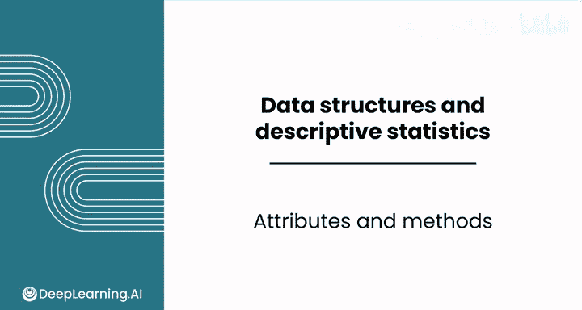
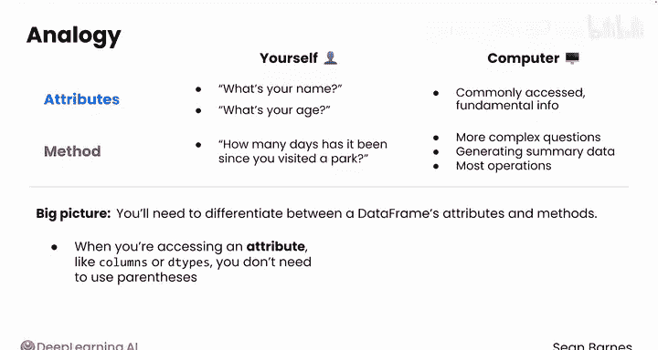

# 031：Python数据分析（第3课）｜Python for Data Analytics
## 课程编号：P31
### 章节标题：属性与方法 🧩

在本节课中，我们将要学习数据框（DataFrame）的两个核心概念：**属性**与**方法**。理解它们的区别对于高效操作和分析数据至关重要。

---

数据框以行和列的形式存储数据。除了数据本身，数据框还附带一些额外的信息，这些信息分为两类：**属性**（或称为特征）和**方法**。属性描述了数据框**拥有**什么，而方法描述了数据框可以**执行**什么操作。

在上一节视频中，我们学习了几个不同的命令。你注意到它们之间的区别了吗？

以下是几个命令示例：
*   `df.columns` 和 `df.dtypes` 后面不需要括号。
*   `df.info()` 后面则需要括号。

这些命令之所以不同，是因为 `columns` 和 `dtypes` 是**属性**，而 `info` 是一个**方法**。属性描述了数据框具有的特征，例如它的列名。方法则描述了数据框可以执行的动作，例如生成数据摘要。方法本质上就是“函数”的一种更专业的说法，虽然技术上略有不同，但本课程中我们不做严格区分。

像 `sum`、`max` 和 `len` 这样的命令都需要括号，因为它们代表需要执行的动作。以 `sum` 为例，计算机需要去将所有值相加才能得到结果。而对于 `df.dtypes` 这类属性，数据框已经存储了这些信息，计算机只需直接获取并展示给你，无需进行计算。

用一个现实世界的类比来理解：思考你如何回答关于自己的不同问题。例如，“你叫什么名字？”或“你多大了？”。你可能不需要思考就能回答，这些是你的**属性**或特征。但如果我问你：“距离你上次去公园已经过去多少天了？”，我猜你不会把这个答案记在脑子里以备有人提问。你可能需要回想上次是什么时候，然后计算从那以后过去了多少天。这个过程更类似于使用一个**方法**或函数，你需要进行计算才能得到答案。

计算机在处理数据框时也采用了类似的策略。对于经常访问的基础信息（如列名、数据类型），Python将其存储为**属性**，以便快速访问。对于更复杂的问题，如生成数据摘要、查找唯一值、求和或生成直方图等，这些都属于**方法**。计算机需要执行某些动作或计算才能为你提供答案。

因此，总的来说，你需要区分数据框的属性和方法。当你访问一个**属性**（如 `columns` 或 `dtypes`）时，不需要使用括号。当你使用一个**方法**时，则需要使用括号，并且通常还会向方法传递参数。

幸运的是，属性并不多。你可能会经常用到的属性包括 `columns`、`dtypes`，以及其他少数几个，如数据框的维度（行数和列数）。

---

现在你已经探索了作为数据框的数据，接下来很可能需要将分析范围缩小到少数几列。在下一节视频中，我们将学习如何选择特定的列。