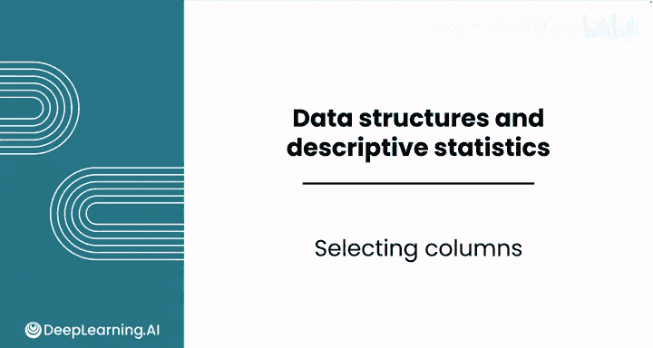
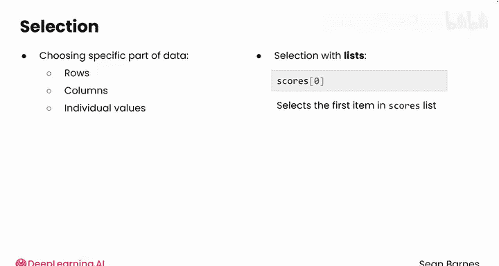
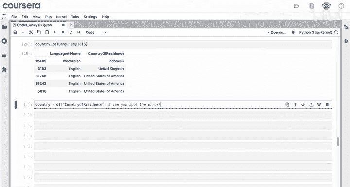
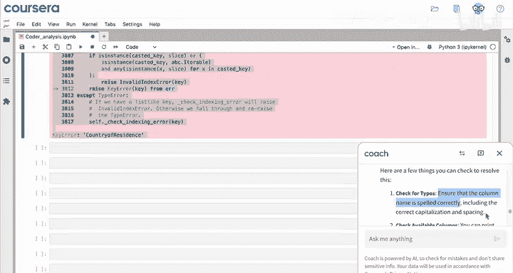
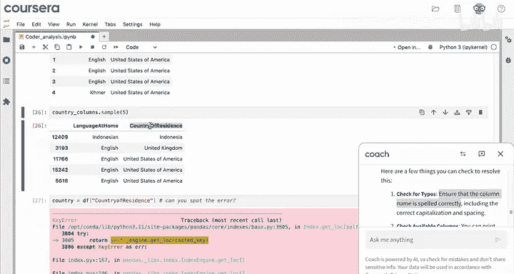
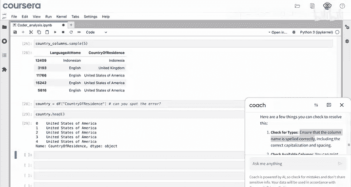
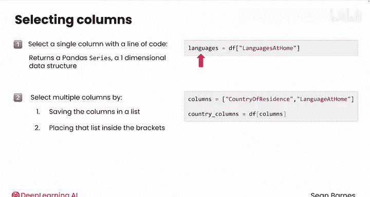

# 032：列选择 📊

在本节课中，我们将要学习如何在Python中从大型数据集中选择特定的列进行分析。这是数据分析中缩小数据范围、聚焦于特定特征的关键操作。

## 概述

在数据分析过程中，经常需要从大型数据集中提取出你关心的特定特征（列）来进行分析。在Python中，这个操作被称为“选择”。选择数据的具体部分，如行、列或单个值，都称为选择。你已经见过几次选择操作，例如在列表中使用类似 `scores[0]` 的代码来选择列表中的第一个项目。从数据框中选择列使用类似的命令。

## 选择单列

假设在你的分析中，你已经将数据加载到变量 `df` 中，并查看了列名和一些样本行。现在，你正在处理报告中的“地理分布”部分，想了解受访者在家中使用的不同语言数量。你可能只对“家中语言”这一列感兴趣。



以下是选择“家中语言”列的步骤：



1.  从数据框的名称 `df` 开始。
2.  使用方括号 `[]` 选择列，就像从列表中选择一样。
3.  在方括号内，使用要选择的列名作为字符串。在本例中是 `‘language_at_home’`。
4.  如果想稍后使用结果，将其赋值给一个变量，例如 `languages`。

对应的代码如下：
```python
languages = df[‘language_at_home’]
```
运行该代码后，让我们查看一下 `languages`。它的数据类型是什么？

你可以使用 `type()` 函数来查看数据类型。`languages` 是一个 **Series**。数据框中的每一列都是一个 Series，这是一种一维的、类似列表的数据结构。和数据框一样，你可以使用 `.head()` 或 `.sample()` 来查看部分值。`languages.head()` 会显示前几个值。

使用 `len()` 函数，你期望 `languages` 变量的长度是多少？你会得到 15620，这与数据中的回答数量相同。这很合理，每一行对应一个回答。

你还记得如何获取唯一语言的列表吗？你可以使用 `pd.unique(languages)`。将其存储在一个变量中并打印。看起来确实有很多独特的语言，其中一些是世界上相对小众的语言，这看起来像是一个相当多样化的全球调查。唯一语言列表 `l` 的长度是 149。

## 选择多列

你也可以选择多个列。例如，你可能想同时分析“居住国家”和“家中语言”，以查看它们之间的关系。

你将使用与选择单个“家中语言”列类似的命令，但需要使用列名列表，而不是单个列名。

1.  创建一个新变量 `columns`，其中包含你感兴趣的列名（作为字符串）。
2.  `columns` 的类型只是一个列表，其长度为 2。
3.  要从数据框中选择这两列，使用 `df[columns]`。
4.  将结果赋值给一个变量，例如 `country_cols`。

对应的代码如下：
```python
columns = [‘country_of_residence’, ‘language_at_home’]
country_cols = df[columns]
```
运行该单元格。你认为 `country_cols` 的类型是什么？这是一个 **DataFrame**。为什么不是 Series？让我们看看 `country_cols.head()`。现在你有两个维度，两列。每一行都包含国家和家中使用的语言。你也可以对 `country_cols` 进行抽样，以查看一些不同的回答。看起来有一些来自印度尼西亚、英国和美国的受访者。

## 常见错误与调试

现在你已经使用数据框一段时间了，你能发现下面这段代码中的错误吗？提示：这是一个拼写错误。
```python
# 错误示例
df[‘country of residence’]
```
编写这段代码会导致错误。向下滚动查看，这是一个 **KeyError**。



让我们请大语言模型帮助调试，因为这是一个非常常见的错误，尤其是对于像这样长的列名。你可以询问错误的来源，然后粘贴错误信息。

大语言模型会指出你遇到了一个 KeyError，并告诉你这通常发生在尝试访问数据框中不存在的列时。在本例中，数据框 `df` 中找不到名为 `‘country of residence’` 的列。然后它会给出一些建议，例如检查拼写错误，确保列名拼写正确。

回到你的代码，你会发现代码中确实有一个拼写错误：`‘of’` 中的 `‘o’` 实际上是大写的。所以，这里一个小小的拼写错误就会导致代码中断。

**和变量名一样，列名是区分大小写的。**



## 回顾与总结





回顾一下，你可以使用像 `df[‘language_at_home’]` 这样的代码行来选择单个列，它会返回一个 pandas **Series**，这是一个包含每个受访者家中语言答案的一维数据结构。然后，你可以将返回的内容保存在一个变量中，如 `languages`。

你也可以通过将列名保存在一个列表中，然后将该列表放在方括号内来选择多个列。

**请记住，列名是区分大小写的，因此需要与数据框中的名称完全匹配。**

本节课中我们一起学习了如何从Pandas DataFrame中选择单列和多列，理解了Series和DataFrame在选择操作后的区别，并认识了因列名拼写错误（包括大小写）导致的常见KeyError及其调试方法。



接下来，让我们进入一些计数、排序和可视化操作，为你的报告生成见解。我们下个视频见。😊