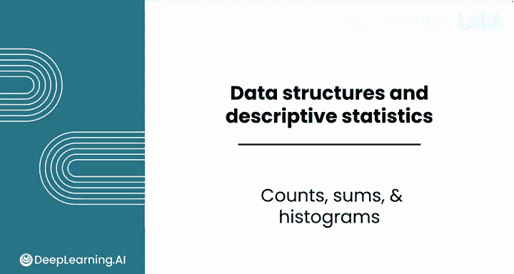
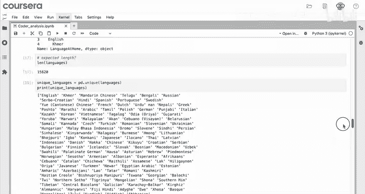
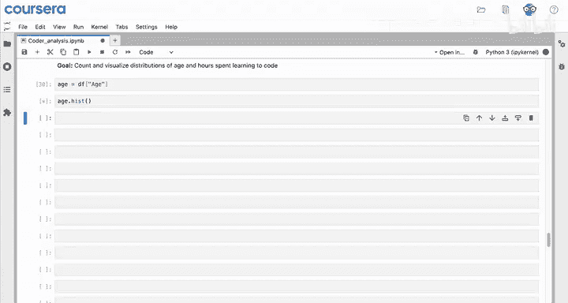
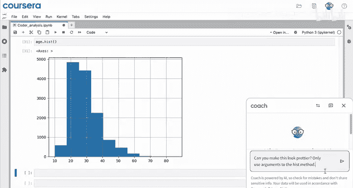
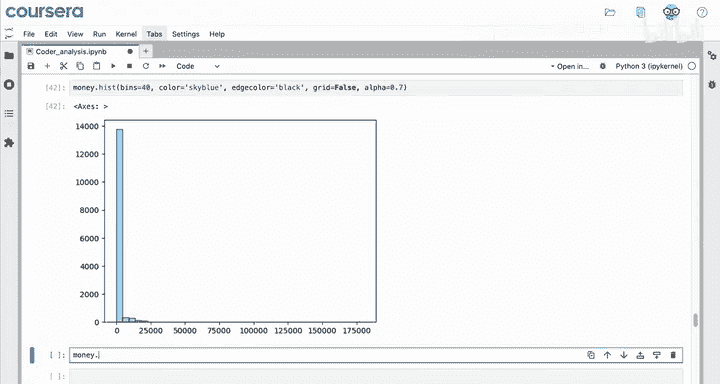
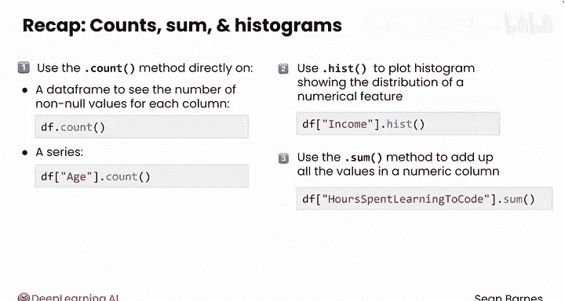

# 033：计数、求和与直方图 📊



在本节课中，我们将要学习数据分析中的核心描述性统计方法：计数、求和以及使用直方图进行数据可视化。这些是理解数据分布和特征的基础工具。

---



上一节我们介绍了如何加载和初步查看数据。本节中我们来看看如何对数据进行基础的统计分析和可视化。

首先，我们直接选择数据集中的“年龄”列，并将其保存到一个名为 `age` 的变量中。



```python
age = df['Age']
```

为了可视化年龄的分布，我们可以使用 `.hist()` 方法来绘制直方图。运行代码后，我们就能清晰地看到这个特征的分布情况。



从直方图可以看出，大多数受访者的年龄在20到30岁之间，整体分布呈现一定的偏态。

以下是绘制基础直方图的代码：

```python
age.hist()
```

在下一个模块中，我们将学习如何自定义这些直方图。不过现在，你可以随时向你的大语言模型助手提问，例如：“你能让这个图看起来更美观吗？请只使用 `.hist()` 方法的参数。” 注意，我们不希望助手导入新的模块。

尝试生成的代码后，图表看起来更好了。请记住，在调查中，受访者可能在某些问题上留空。因此，每一列的空值数量是不同的。

要计算在调查中提供了年龄信息的人数（即非空值的数量），可以使用 `age.count()`。这将返回一个整数，例如 13613。这里的 `int64` 是一种整数数据类型。`count` 方法与 `len` 不同，因为它**不包含空值**，而 `len` 会包含。

虽然我们经常需要详细检查某个特征，但实际上我们也可以对整个数据框使用 `count` 方法。这个快捷方式可以让你一眼看出每一列的非空值数量。例如，你可能发现“resource_books”（通过书籍学习编程的资源）这一列的响应最少，这可能是因为并非每个人都通过书籍学习。

你还可以看到“marital_status”、“student”和“income”等列的响应也相对较少，“number_of_children”列也是如此，这可能是因为没有那么多受访者有孩子或愿意分享该信息。

假设你正在为你的教育产品制定定价和功能策略，你可能需要计算学习编程的总小时数和花费的总金额。

首先，检查它们的分布。将“学习编程花费的小时数”列保存到变量 `hours` 中。

```python
hours = df['HoursLearning']
```

然后，你可以使用 `.hist()` 方法绘制数据。如果你愿意，可以使用之前从助手那里得到的参数让图表更美观。

从直方图可以看到，超过一半的人每周花费0到20小时学习编程。顺便提一下，如果你将 `bins` 参数设置为40，会发现一个有趣的现象：许多答案恰好是10、15、20等整数，而更精确的答案则较少。

现在，要对学习编程的总小时数求和，使用 `hours.sum()`。你会得到一个 `float64` 类型的十进制数，总和超过20万小时。这表明，受访者们在学习编程上总共投入了大量时间。

对于学习编程的花费，将该列保存到变量 `money` 中。

```python
money = df['MoneySpent']
```



用 `.hist()` 绘制这个序列的直方图，你会得到一个极度偏斜的分布。将 `bins` 增加到40，可以看到绝大多数人花费相对较少，但存在少数极高的异常值。`money.sum()` 的结果显示，受访者们总共花费了超过1600万美元，总金额非常庞大。

---

本节课中我们一起学习了数据分析的基础操作。

总结一下，你可以直接在数据框上使用 `.count()` 方法来查看每列的非空值数量，也可以在单个序列上使用。我们还看到，可以使用 `.hist()` 方法快速绘制简单的直方图，以展示数值特征的分布。最后，只要列是数值型的，就可以使用 `.sum()` 方法对列中的所有值进行求和。

计数和求和是任何分析的基础，而 pandas 的直方图方法能帮助你快速可视化数值特征。请继续练习使用数据框和序列。



接下来，你将完成本课的练习作业以及一个实践实验室，以测试你的 pandas 技能。完成后，我们将在下一节关于排序和筛选的课程中再见。