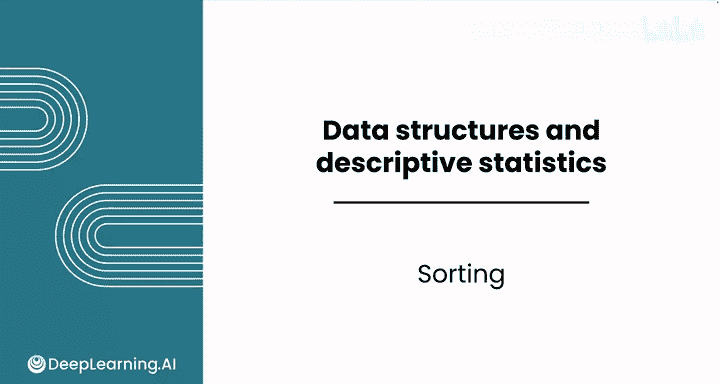
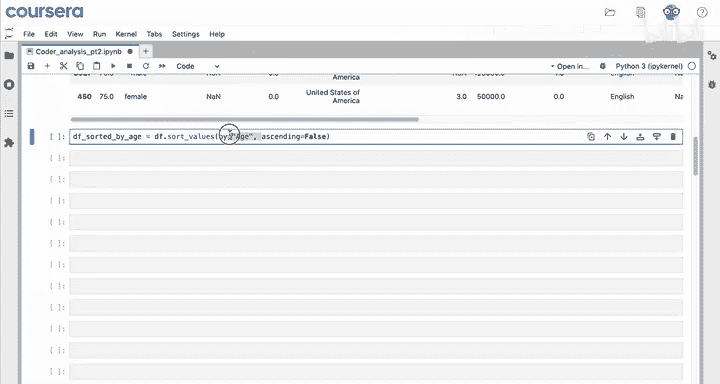
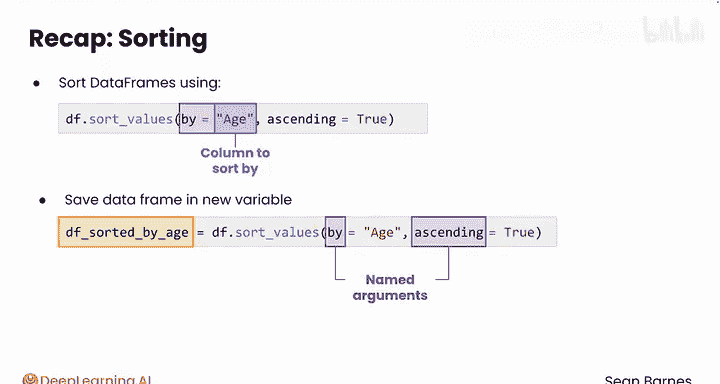

# 034：Python数据分析 第3课 - 数据排序 📊

在本节课中，我们将要学习如何使用Python的Pandas库对数据进行排序。排序是数据分析中一项强大且灵活的操作，能够帮助我们快速整理和理解数据。

---

## 导入数据与基础排序

上一节我们介绍了数据清洗，本节中我们来看看如何对数据进行排序。首先，我们需要导入Pandas库并读取数据。

```python
import pandas as pd
df = pd.read_csv('survey_data.csv')
```

你的第一个目标是将受访者按年龄从大到小排序。以下是实现此目标的基本步骤：

1.  从数据框开始。
2.  使用 `sort_values` 方法。
3.  默认情况下，`sort_values` 不会改变原始数据框，而是创建一个新的。
4.  你需要将排序操作的结果存储在一个变量中。



以下是实现代码：

```python
df_sorted_by_age = df.sort_values(by='age')
```

在这行代码中，`by` 是一个**命名参数**，用于指定要排序的列。执行后，`df_sorted_by_age` 是一个新的数据框，其行数应与原始数据框相同，只是顺序发生了变化。

查看排序后数据框的前几行，你会发现最年轻的受访者（例如10岁、11岁）。

```python
print(df_sorted_by_age.head())
```

---

## 降序排序与命名参数

目前我们得到的是升序排列的结果，但我们的目标是从大到小排序。你可以通过修改代码来实现降序排序。

以下是修改后的代码：

```python
df_sorted_by_age = df.sort_values(by='age', ascending=False)
```

在这行代码中，我们添加了第二个**命名参数** `ascending` 并将其设置为 `False`。默认情况下，`ascending=True` 表示升序。通过设置 `ascending=False`，我们覆盖了默认值，实现了降序排序。

现在查看数据框的头部，你将看到最年长的受访者。

关于 `by` 和 `ascending` 这类命名参数，其主要好处是你可以以任意顺序提供它们。例如，以下两行代码是等效的：



```python
df_sorted = df.sort_values(by='age', ascending=False)
df_sorted = df.sort_values(ascending=False, by='age')
```

---

## 本节总结

本节课中我们一起学习了在Pandas中进行数据排序的基础知识。



*   我们学会了使用 `sort_values()` 方法对数据框进行排序。
*   我们了解到必须使用命名参数 `by=` 来指定要排序的列名。
*   我们明白了 `sort_values()` 会创建一个新的数据框，因此需要将其保存到一个新变量中。
*   我们掌握了通过设置 `ascending=False` 来实现降序排序。
*   我们认识了命名参数，它们允许我们以任意顺序传递参数，这在Pandas中很常见。

现在你已经熟悉了Pandas排序的基础。在下一个视频中，你将学习如何同时按多列进行排序。