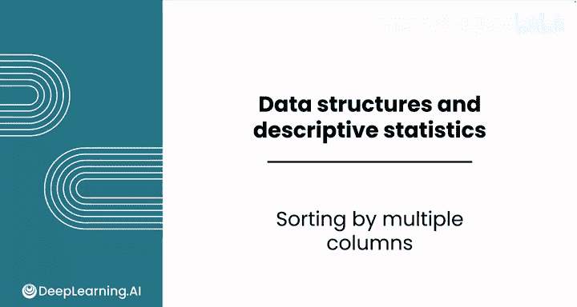
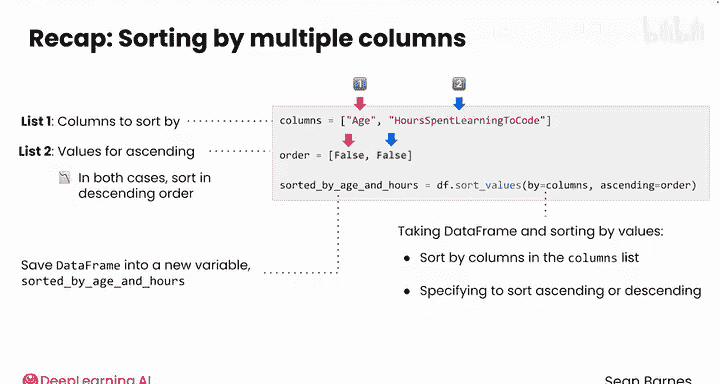

# 035：Pandas多列排序 📊

在本节课中，我们将要学习如何在Pandas中对数据框（DataFrame）进行多列排序。这是一种强大的功能，允许我们根据多个条件来组织和查看数据。

上一节我们介绍了单列排序，本节中我们来看看如何根据多个列的组合条件来排序数据。

## 概述

如果你需要在Pandas中根据多列进行排序，可以使用与之前类似的方法，但需要向`sort_values`方法提供一个列名的列表。

假设在加载数据并创建了一个按年龄排序的新数据框后，你可能想进一步研究每个年龄段中学习时间最长的人。例如，你想先按年龄降序排列，再按每周学习编码的小时数降序排列，以找出每个年龄段中学习最刻苦的人。



以下是实现多列排序的步骤：

首先，创建一个包含你想要排序的列的列表。列表的顺序很重要，第一个元素是你想首先排序的列，即先按年龄，再按学习编码的小时数。

```python
columns = ['age', 'hours_spent_learning_to_code']
```

然后，你还需要为`ascending`参数创建一个列表。在本例中，你希望这两列都按降序排列。

因此，你需要一个布尔值列表。将其命名为`order`，包含两个`False`值。

```python
order = [False, False]
```

接着，调用数据框的`sort_values`方法。

```python
sorted_df = df.sort_values(by=columns, ascending=order)
```

在这里，你通过一个长度为2的列名列表进行排序。同时，你通过另一个长度为2的列表告诉Pandas这两列都按降序排序。最后，将结果保存到一个新变量中，例如`sorted_by_age_and_hours`。

这段代码初看可能有些复杂，我们稍后会逐步分解。现在，让我们先执行它。

你预期这个结果的数据类型是什么？它应该是一个数据框。并且，其长度应该与原始数据框完全相同。你并没有添加或删除任何数据，只是改变了行的顺序。

当你查看前五行数据时，你预期会看到什么？运行该单元格后，前两行确实与之前相同，但现在你有了按年龄和小时数降序排列的75行数据，其中第1846行以每周6小时的学习时间位居榜首。

## 代码分解

让我们一起来分解这几行代码，因为其中包含了许多操作。

首先，你创建了两个列表：
*   第一个列表`columns`包含了你想要排序的列，本例中是`age`，然后是`hours`。
*   第二个列表`order`包含了`ascending`参数的值。在本例中，你希望按降序排序（数值大的排在前面），因此两个值都是`False`。

第三行代码，在等号右侧，你调用了数据框的`sort_values`方法。
*   你通过`columns`列表中的列进行排序，即先按年龄，再按学习编码的小时数。
*   然后，你使用`order`列表指定每列是按升序还是降序排序。因此，年龄先按降序排序，然后小时数也按降序排序。

`sort_values`方法会创建一个新的数据框，所以你将其保存到新变量`sorted_by_age_and_hours`中。



## 总结


本节课中我们一起学习了Pandas中的多列排序。你掌握了如何通过提供一个列名列表和对应的排序顺序列表，来根据多个条件对数据进行排序。这是一个非常实用的技能，能帮助你在数据分析中更精确地组织和筛选数据。

关于排序的出色工作就到这里。接下来，你将学习如何过滤数据，以仅选择你感兴趣的行。我们下个视频再见。


