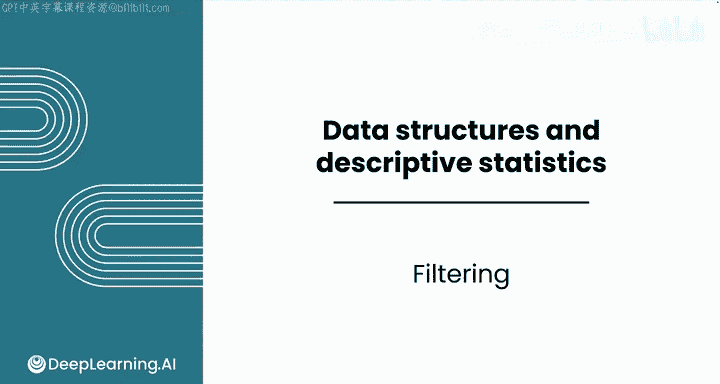
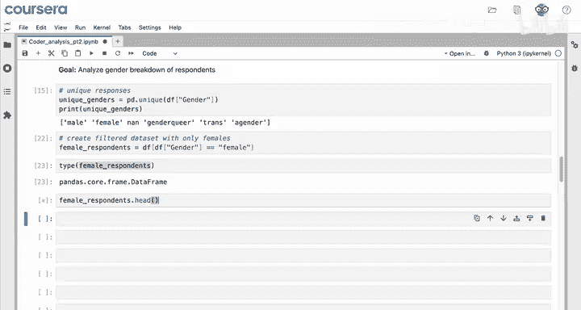
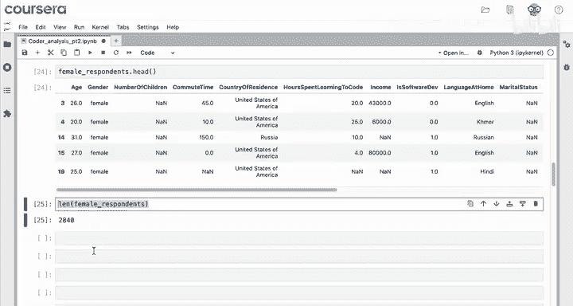
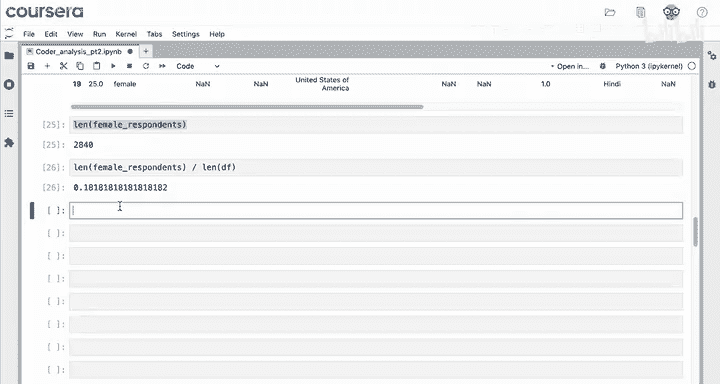
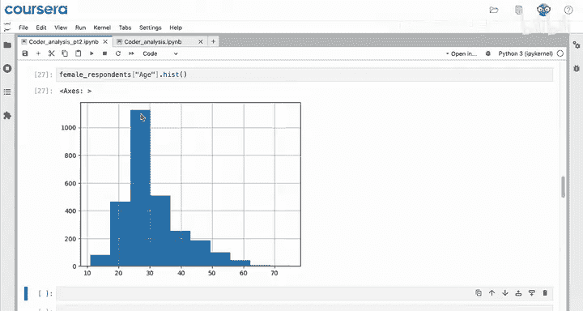
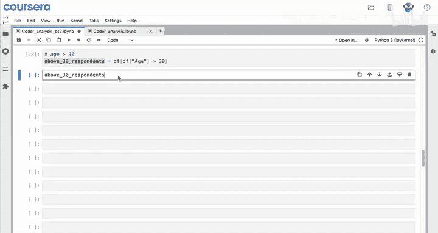
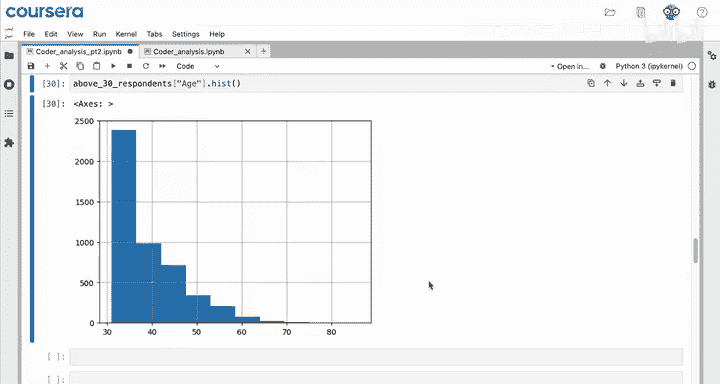
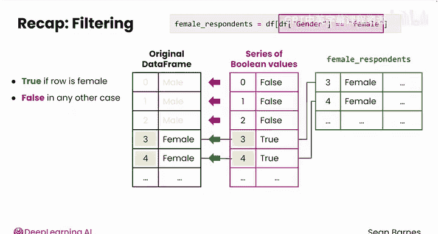

# 036：Python数据分析 第3课 - 数据筛选 🎯

在本节课中，我们将要学习如何在Python中使用Pandas库对数据进行筛选。数据筛选是数据分析中的一项核心技能，它允许我们根据特定条件从数据集中选取感兴趣的行，从而专注于分析特定的数据子集。

## 概述 📋

你已经了解如何在电子表格中筛选数据，即只选择满足特定条件的行。那么，如何在Python中完成这项任务呢？在接下来的报告部分，你将分析受访者的性别构成。理解这一构成将有助于你制定营销策略和产品功能。



## 分析性别构成 👥

首先，我们需要分析“性别”列中的唯一响应值。以下是具体步骤。

以下是分析性别列唯一值的代码：

```python
pd.unique(df['gender'])
```

然后，你可以打印结果。选项包括男性、女性、性别酷儿、跨性别者、无性别者以及`NaN`（非数字）。`NaN`是空值，表示受访者将该字段留空。

你可能会注意到这些值被单引号包围，但在Python中它们仍然是字符串。在Python中，你也可以使用单引号来定义字符串。

## 创建筛选数据集 🔍

如果你想比较例如男性和女性的编码习惯，你可以创建一个仅包含女性的筛选数据集。

因此，你需要从数据框中选择那些“性别”列等于“女性”的受访者。

以下是筛选女性受访者的代码：

```python
female_respondents = df[df['gender'] == 'female']
```

那么，这行代码将做什么？它会遍历数据框中的每一个响应。对于每个响应，它会查看“性别”列中的值。如果性别等于“女性”，那么该行将被包含在筛选后的数据框中；如果不等于，则不会被包含。

例如，在按年龄和小时数排序的数据框中，只有第三行和第四行会被包含进来。将这个结果保存到一个变量中，例如`female_respondents`。

`female_respondents`的类型是什么？它是一个数据框。



让我们查看该数据框的前五行。





你可以看到已成功筛选出仅包含女性的受访者。注意，原始的整数索引被保留了下来，因此你知道第0、1、2行的性别值不同，依此类推。

## 分析筛选后的数据 📊



现在，如果你只想对女性受访者进行分析，就可以进行了。例如，`female_respondents`的长度是2840。这个值是数据框中的行数。在总共约15,000名受访者中，女性受访者大约有3000名。

你还可以绘制她们年龄的直方图。

如果你还记得上一课中包含所有年龄的直方图，你可以看到在这个20多岁的年龄段中，女性受访者更多。

## 使用数值列进行筛选 🔢

上一节我们介绍了如何根据文本条件筛选数据，本节中我们来看看如何处理数值列。

如果你处理的是数值列，可以使用其他条件运算符进行筛选，例如大于或等于。



例如，要选择“学习编码小时数”大于30的行，请使用以下代码：

```python
above_30_respondents = df[df['hours_spent_learning_to_code'] > 30]
```



同样，要选择年龄大于30的行，请使用以下代码：

```python
above_30_respondents = df[df['age'] > 30]
```

然后，将该结果存储在`above_30_respondents`中，并在直方图中绘制年龄列。

你应该看到X轴的下限应该是30。在电子表格中，这将是一个复杂得多的操作，需要一种自定义筛选器。

## 筛选原理详解 ⚙️

为了总结，为了筛选你的数据，即选择符合特定条件的行，你需要使用布尔表达式从数据框中进行选择。

例如，你看到了如何使用命令`df[df[‘gender’] == ‘female’]`来选择调查参与者回答性别为“女性”的响应。你正在从整个数据框中选择“性别”列中的值与字符串“女性”匹配的行。

你还看到括号内的布尔表达式可以是等于、大于，也可以是小于。在下一个视频中，你将看到更多筛选选项。

看看这段代码。你正在选择匹配这个布尔表达式的行。那么，这对于原始数据框的前五行实际上做了什么？

前五行的性别是男性、男性、男性、女性、女性。右侧这个表达式`df[‘gender’] == ‘female’`的类型是一个序列。它是一个布尔值序列，起始值为`False`、`False`、`False`、`True`、`True`。

如果该行的性别是女性，则每个值为`True`，否则为`False`。

当你使用这个表达式从数据框中进行选择时，计算机将逐个查看序列中的每个值。如果序列中的值为`False`，它将不包含该行，并将其丢弃。如果值为`True`，它将把该行包含在选择中。

这就是为什么在`female_respondents`中，前两个索引是3和4。这些是序列中前两个值为`True`的行的索引。



## 总结 📝

本节课中我们一起学习了如何在Python中使用Pandas进行数据筛选。筛选为你分析数据的子集提供了极大的灵活性。在下一个视频中，你将学习使用多个条件进行筛选。我们下节课再见。