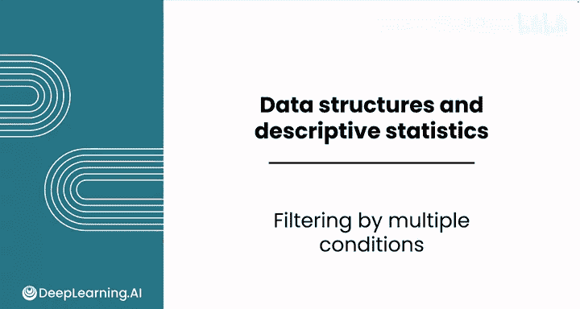
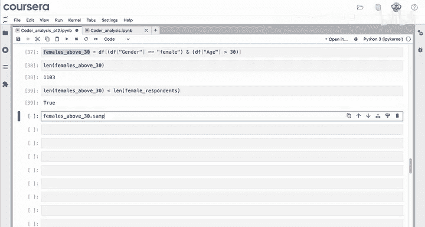
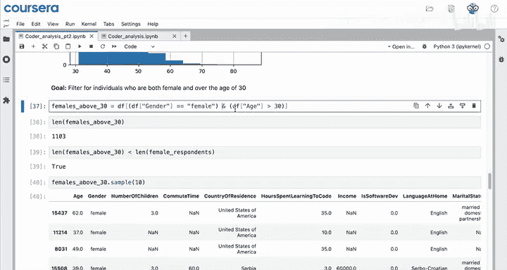
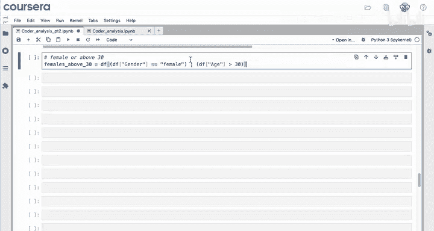
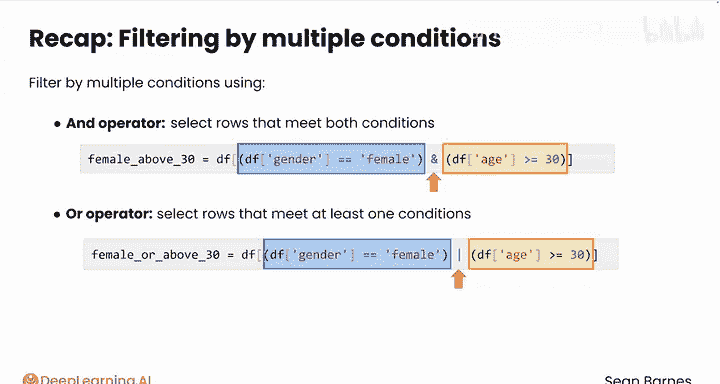

# 037：Python数据分析（第3课）｜多条件筛选 🎯

在本节课中，我们将学习如何使用pandas库进行多条件数据筛选。多条件筛选允许我们基于多个标准从数据集中提取更复杂的子集，例如同时满足“女性”和“年龄大于30岁”的受访者。

---



## 多条件筛选的应用场景

上一节我们介绍了单条件筛选，本节中我们来看看如何组合多个条件。假设你正在为报告构建用户画像，需要分析同时满足“女性”和“年龄大于30岁”这两个条件的个体数据。

## 使用LLM辅助生成代码

在编写多条件筛选代码时，你可以借助大型语言模型（LLM）获取帮助。以下是向LLM提问的示例提示：

> 我在代码中创建了两个独立的数据框：一个仅包含女性，另一个仅包含年龄大于30岁的受访者。如何组合这两个筛选条件，得到一个仅包含同时满足“女性”和“年龄大于30岁”的受访者的数据框？请分享代码。

LLM会建议你直接在单个数据框上组合条件，并提供如下示例代码：

```python
female_and_above_30 = df[(df['gender'] == 'female') & (df['age'] > 30)]
```

你可以尝试运行这段代码，并将变量名改为更简洁的形式，例如`female_above_30`。注意，LLM可能使用“大于或等于”条件，但你可能只需要“大于”条件。

## 理解筛选结果

以下是关于筛选结果的预期：

*   筛选后的数据框行数应少于仅包含女性的数据框，因为它是后者的子集。
*   实际结果符合预期：筛选后数据框大约有1100行。
*   随机抽样10行进行验证，确认筛选条件已正确应用。

## 代码结构解析

这段代码有几个新特点，但也有一些相似之处：

*   两个条件与之前相同：`gender == 'female'` 和 `age > 30`。
*   每个条件都用括号括起来。
*   条件之间用**&**符号连接，表示“且”关系，即两条件必须同时满足。

## 使用“或”条件筛选

你也可以筛选满足至少一个条件的行。例如，如果你对“女性”或“年龄大于30岁”的受访者感兴趣，只需将**&**改为**|**（管道符）：

```python
female_or_above_30 = df[(df['gender'] == 'female') | (df['age'] > 30)]
```



管道符通常位于键盘回车键上方，表示“或”关系。将结果变量命名为`females_or_above_30`并抽样查看，你会发现结果中包含了：
*   年龄大于30岁的男性受访者。
*   年龄小于30岁的女性受访者。
*   年龄大于30岁的女性受访者。





所有这些都是至少满足一个指定条件的受访者。

## 核心要点总结

以下是多条件筛选的核心要点：



*   使用**&**（且）和**|**（或）运算符进行多条件筛选。
*   每个条件都应放在括号内。
*   **&**用于选择同时满足所有条件的行。
*   **|**用于选择至少满足一个条件的行。

---

本节课中我们一起学习了如何使用pandas进行多条件数据筛选，掌握了“且”与“或”运算符的应用。现在你已经熟悉了数据的排序和筛选，接下来可能希望选择数据中的特定行或数据切片。我们将在下一个视频中学习如何实现。