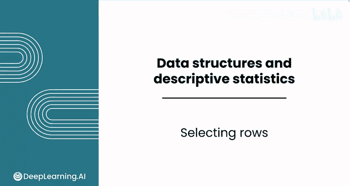
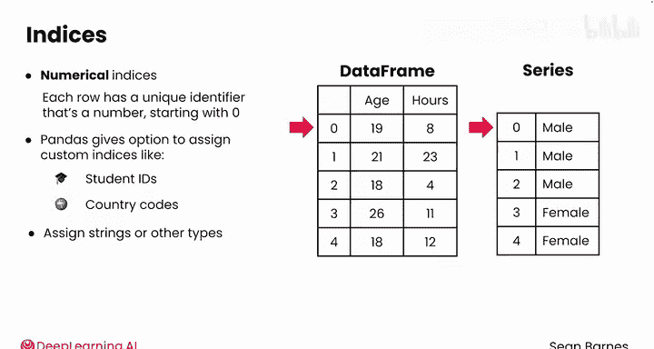
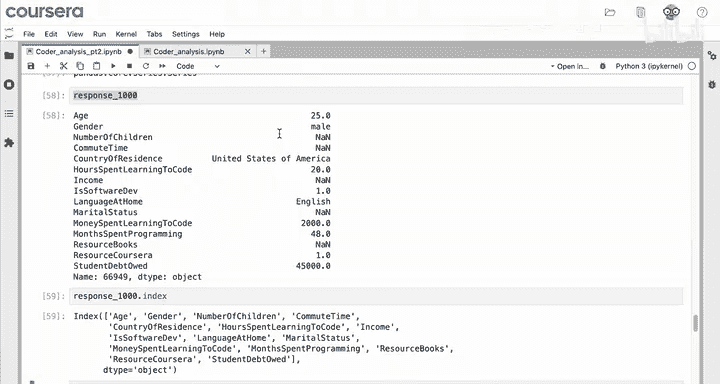
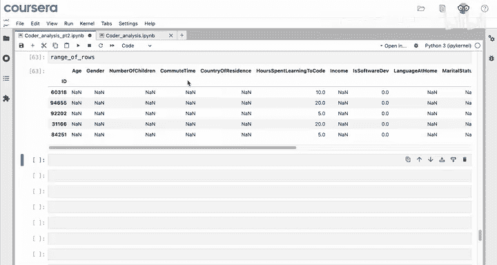
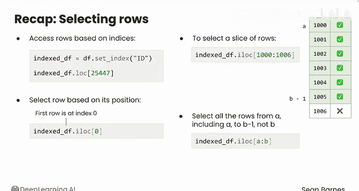
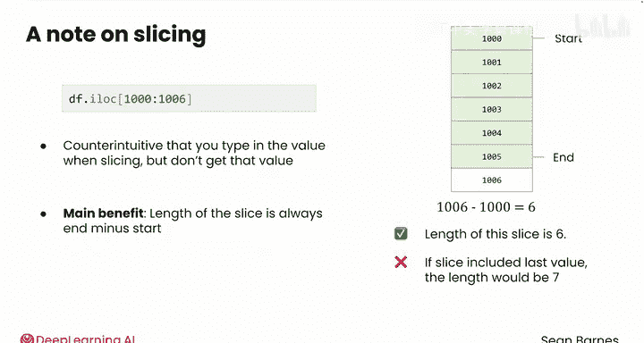

# 038：行选择 📊

在本节课中，我们将学习如何在Pandas数据框中选择特定的行。我们将探讨如何设置自定义索引，以及如何使用`.loc`和`.iloc`两种方法来精确地选取数据行。

---

## 概述

处理数据时，除了筛选列，分析数据行的子集也很常见。你可以更新数据框的索引，为行选择提供更大的灵活性。目前我们使用的数据框和序列都具有数字索引，即每行都有一个从0开始的唯一数字标识符。然而，Pandas也允许你分配自己的索引。

如果你的数据包含唯一标识符，如学生ID或国家代码，通常的做法是分配自定义索引。你也可以将字符串甚至日期时间等类型作为索引，这对于时间序列数据尤其有用。

---

## 设置自定义索引

你可能已经注意到，这个调查数据集包含一个“ID”列，它是每位受访者的唯一标识符。你可以用这些唯一的ID替换左侧的数字索引，从而允许你根据受访者的ID来选择特定的行。

> 注：此“ID”列并非原始公开数据集的一部分，我们为本次演示创建了它。原始调查是匿名的。

要将唯一的ID设置为索引，你可以使用`set_index`方法，并传入一个参数：列名（字符串形式）。





**代码示例：**
```python
indexed_df = df.set_index('ID')
```

检查数据框的前五行。现在，索引不再是整数，而是ID，并且ID列已从数据框中移除。

---

## 使用 `.loc` 按索引选择行

现在，如果你的团队说他们正在采访ID为25447的受访者，并希望你提取该人的信息以帮助生成一些面试问题，你可以使用`.loc`方法通过索引来选择该行。

**代码示例：**
```python
indexed_df.loc[25447]
```

这将提取出该个体的信息：一位来自孟加拉国的35岁男性。

---

## 使用 `.iloc` 按位置选择行

无论索引如何设置，你始终可以使用`.iloc`（整数位置）根据行在数据框中的位置来选择行。即使你刚才将索引设置为ID列，这个数据框仍然有从0开始的整数行号。

例如，如果要求你找到索引为1000的行，你可以使用：

**代码示例：**
```python
indexed_df.iloc[1000]
```

结果显示，该受访者是一位来自美国的25岁男性。

你可以将此值保存到一个变量中，例如`response_1000`。请记住，这些行是从0开始计数的，所以这实际上是第1001行。

现在，`response_1000`变量的类型是什么？输入`type(response_1000)`。它也是一个序列。

它相对较短，因为每列只有一个值，总共有16列。这位受访者是一位25岁的男性，居住在美国，说英语，每周花费大约20小时学习编程，等等。

这个序列看起来有点不寻常，不是吗？左侧的列名实际上是右侧值的索引。这是一个使用字符串作为索引的例子。

由于这个序列的结构，你可以使用“Age”作为索引来选择此人的年龄。

**代码示例：**
```python
response_1000['Age']
```

这将直接返回数字25。

---

## 使用切片选择多行

你的同事要求你调查从整数位置8664开始的五行数据，因为他们认为这些响应可能存在问题，包含大量缺失值。



为此，你可以使用冒号运算符来切片数据，这与你在之前模块中对列表使用的操作类似。

**代码示例：**
```python
range_of_rows = indexed_df.iloc[8664:8669]
```

这将选择从8664开始（包括8664）到8669结束（不包括8669）的五行数据。你可以将选择结果保存在一个变量中，如`range_of_rows`。

`range_of_rows`的类型是什么？它是一个数据框。这是因为你选择了多个行的所有列，构成了一个二维结构。

查看这些响应，你的同事是对的，确实存在一个包含大量缺失值的异常数据块。

这个操作被称为数据框切片，因为你切出了一部分数据来进一步检查。这就像为自己切一块蛋糕：你进行两次切割来定义切片的起点和终点，然后得到整个切片。

---

## 行选择方法回顾

刚开始接触行选择时可能会感到复杂。我们来回顾一下：

*   如果你使用`.set_index`方法设置了列名作为索引，可以使用`.loc`基于索引访问行。
*   你也可以使用`.iloc`基于行在数据框中的位置来选择行，类似于列表。
*   数据框是0索引的，所以第一行的索引是0。
*   要选择一行切片或一个行范围，你将使用一个非常相似的命令，但这次使用冒号来选择范围。



因此，如果你有一行代码像`indexed_df.iloc[1000:1006]`，它将选择第1000行到第1005行（不包括第1006行）。

更一般地说，如果你有一个像`indexed_df.iloc[a:b]`的命令，它将选择从`a`（包括`a`）到`b-1`的所有行，即不包括`b`。

---

## 为什么切片不包括最后一个值？

在切片时输入值`1006`却得不到该行，这可能看起来有违直觉。为什么切片不包括最后一个值？这样做有几个好处，但主要好处之一是切片的长度始终是 `end - start`。



例如，`1006 - 1000 = 6`。所以切片的长度是6。



如果切片包括最后一个值，长度将是7，这会更 awkward（不直观/不方便）。

---

## 总结

本节课中，我们一起学习了如何在Pandas数据框中选择行。我们掌握了设置自定义索引的方法，并学会了使用`.loc`通过索引选择行，以及使用`.iloc`通过整数位置选择行。我们还探讨了如何使用切片操作来选择连续的多行数据，并理解了切片范围“左闭右开”的设计原理。

你现在已经熟悉了数据框和序列，包括排序、筛选以及选择行和列。你将在接下来的实践练习和作业中测试这些技能。完成后，请跟随我进入本模块关于描述性统计的最后一课。我们那里见。😊