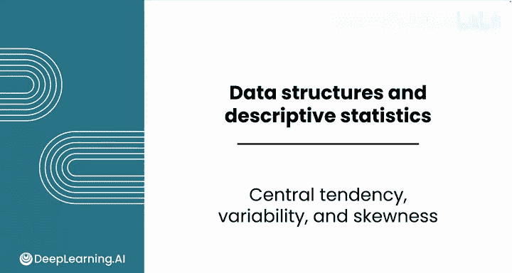
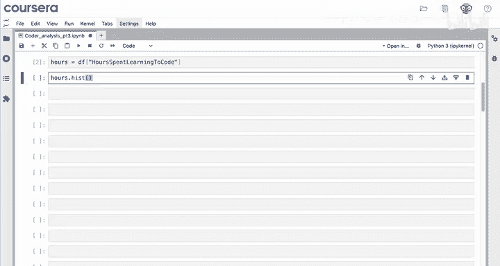
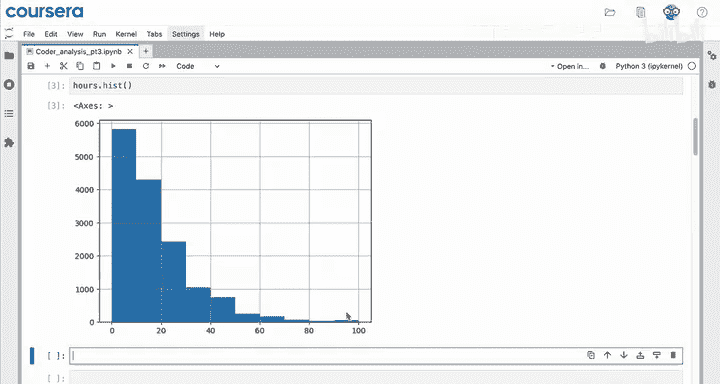
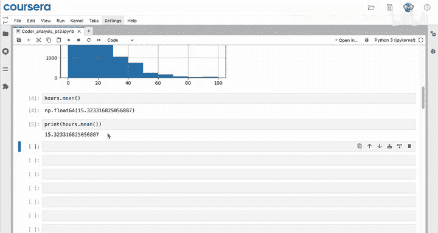
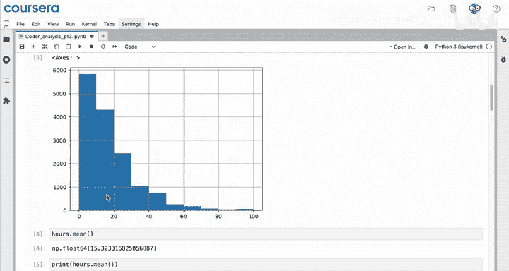
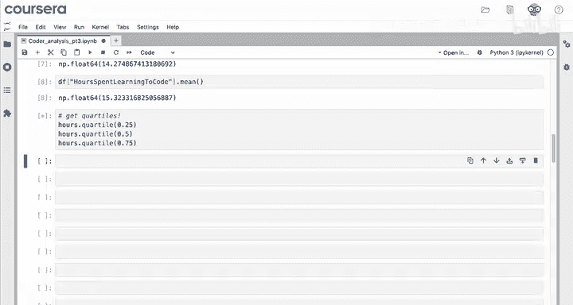
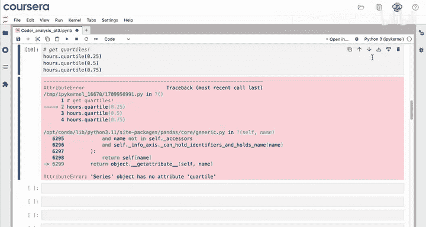
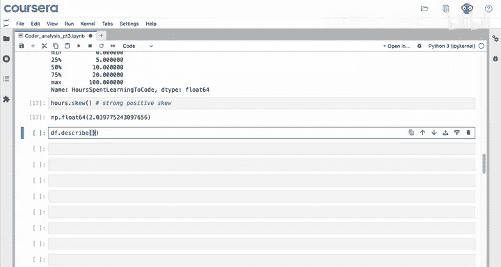
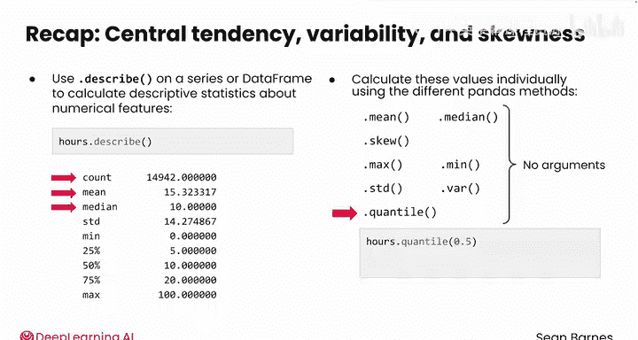

# 039：Python数据分析（第3课）｜集中趋势、离散度与偏态 📊

## 概述

在本节课中，我们将要学习如何使用Pandas库来分析数据集中数值型特征的分布。具体来说，我们将探索如何计算和解读数据的集中趋势（如均值、中位数）、离散度（如标准差）以及偏态。这些描述性统计量是理解数据基本特征的关键第一步。

---

在完成了数据计数、求和、图表绘制以及筛选之后，你很可能希望获取每个特征分布的更多信息。

我们从数值型特征开始分析。首先，创建一个新的笔记本。

导入Pandas库并读取数据，同时设置索引。这只是常规的数据准备工作。

```python
import pandas as pd
df = pd.read_csv('your_data.csv')
df.set_index('some_column', inplace=True)
```

## 分析分布与计算统计量

上一节我们完成了数据导入，本节中我们来看看如何分析单个数值特征的分布。

分析的下一个步骤可能是描述“每周编码小时数”这一特征的分布情况。

请记住，`.hist()`方法可以用于生成直方图。

```python
df['HoursLearningToCode'].hist()
```



这个分布呈现出强烈的**正偏态**。你可以看到，大多数受访者每周编码时间少于20小时，而花费更多时间编码的受访者数量则越来越少。





现在，你可以计算描述性统计量了。首先计算平均小时数。



```python
mean_hours = df['HoursLearningToCode'].mean()
```

均值大约是每周15小时。这相当于一份兼职工作的时间。

因此，这项调查似乎主要捕捉的是那些通常在业余时间学习编程的人，而非进行正规学习的人。

请注意，这个值的类型是`numpy.float64`。所以`numpy`又出现了。它只是一个带小数点的数字。如果你愿意，可以使用`print`来避免看到`numpy.float`部分。

```python
print(mean_hours)
```

你也可以使用`.median()`方法检查中位数，其值为10。

```python
median_hours = df['HoursLearningToCode'].median()
```

这个值是有意义的，因为在偏态分布中，均值会被拉向分布尾部——在本例中是更高的数值方向。

你还可以使用`.std()`获取标准差，其值大约为14。对于偏态分布的数据，标准差的意义不如对更接近正态分布的数据那么明确。

以下是计算这些常见描述性统计量的方法总结：

*   **均值**：`.mean()`
*   **中位数**：`.median()`
*   **标准差**：`.std()`

所有这些常见的描述性统计量计算起来都非常直接。你不需要在这些函数中提供任何参数，可以直接在你的Series上调用它们。



作为一个快速提醒，所有这些计算与直接在列名上使用这些方法会产生相同的结果。





## 计算分位数

你可能还想获取分位数，即数据在25%、50%和75%位置的值。

如何做到这一点呢？如果你尝试像在电子表格中那样，用这三个值调用`hours.quartile`，你会得到一个错误：`Series`对象没有`quartile`属性。

让我们向大语言模型寻求一些调试帮助。我尝试了这段代码来获取Series的25、50和75百分位数，但我得到了下面的错误。正确的代码是什么？

然后粘贴错误信息。注意，你不需要复制代码，因为该行已经是错误信息的一部分。

大语言模型纠正了你的代码，你需要使用`.quantile`方法，而不是`.quartile`。

尝试提供的代码，你会得到这些漂亮的整数：5、10和20。

```python
q25 = df['HoursLearningToCode'].quantile(0.25)
q50 = df['HoursLearningToCode'].quantile(0.50) # 等同于中位数
q75 = df['HoursLearningToCode'].quantile(0.75)
```

正如你在之前的视频中看到的，大多数人对这个问题的回答都是整数，所以这些值是合理的。

你还可以通过传入一个列表作为参数，而不是单个数字，来一次性获取多个分位数。

例如，你可能希望一次性获取所有三个分位数。

```python
quantiles = df['HoursLearningToCode'].quantile([0.25, 0.50, 0.75])
```

查看这个结果的类型，你可以看到返回的是一个Series。你可以通过引用相关的索引来访问每个分位数。

## 使用`.describe()`方法

正如你刚才看到的，你可以分别计算所有这些描述性统计量，或者你也可以使用`hours.describe()`非常容易地获取它们。

```python
df['HoursLearningToCode'].describe()
```

这个方法与`df.info()`类似，因为它能立即为你提供大量有用的统计信息：有多少个值、均值、标准差、最小值、最大值、不同的分位数（包括中位数）。这是一个非常方便的快捷方式。

你可能注意到偏度没有被包含在`.describe()`中。但是，你可以使用`.skew()`方法。



```python
skewness = df['HoursLearningToCode'].skew()
```

这个方法给出的值与电子表格中`SKEW`函数的解释相同。对于`hours.skew()`，你的结果大约是2。因此，这个值表明数据存在强烈的正偏态。

## 应用于整个DataFrame

你现在已经看到了`.describe()`方法应用于一个Series。请记住，任何给定列的类型都是一个Series，它是一维的。

你也可以在整个DataFrame上使用`.describe()`。

```python
df.describe()
```

这会给出大量信息。`df.describe()`为你提供了一个非常美观的表格，列出了所有特征及其分布统计量——只要它们是数值型特征。你无法计算分类特征的标准差。

因此，这里有很多可以研究的内容，你可以快速获取大量信息。

## 总结

本节课中我们一起学习了用于分析数值型特征的中心趋势、变异性和偏态的工具。



你可以对一个Series或整个DataFrame使用`.describe()`来快速计算数据中数值特征的描述性统计量，包括计数、均值、中位数等。

你也可以使用Pandas提供的不同方法单独计算这些值：`mean`、`median`、`std`、`max`、`min`、`var`和`quantile`。这些方法大多不需要参数，除了`quantile`方法，你需要为其指定一个数字或一个数字列表以一次性获取多个分位数。

你可以轻而易举地获取关于数据特征的众多信息。

一旦处理完数值型特征，你将希望继续处理分类特征。请跟随我进入下一个视频了解如何操作。