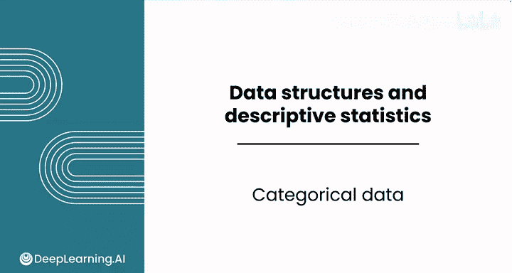
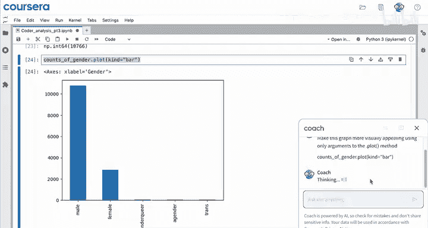
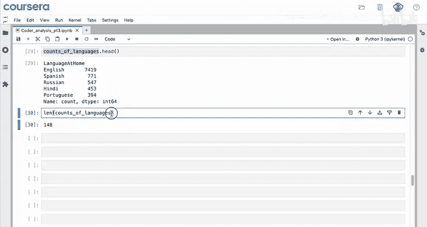
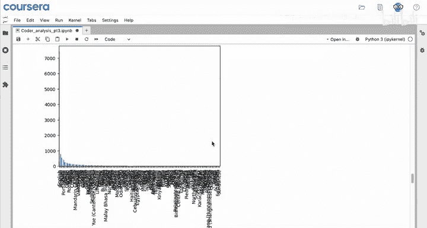
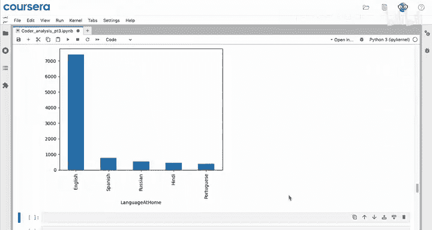
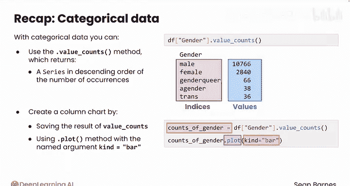

# 040：Python数据分析 第3课 - 分类数据处理 📊



在本节课中，我们将要学习如何处理和分析分类数据。分类数据与数值型数据的分析方法不同，Python提供了一些关键工具来执行这些分析，包括`value_counts`方法和绘图功能。

---

## 概述

分类数据通常指文本或类别型数据，例如性别、国家、语言等。分析这类数据时，我们主要关注不同类别的分布情况。本节将介绍如何使用`value_counts`方法统计类别频次，以及如何通过条形图直观展示这些分布。

---

## 选择分类数据列

上一节我们介绍了如何计算数值型数据的描述性统计量。本节中我们来看看如何分析分类数据。首先，需要确定数据集中哪些列是分类数据。如果记不清所有列，可以使用`df.dtypes`来查看列的数据类型。在Pandas中，`object`类型通常表示文本数据，即分类数据。


例如，性别、居住国家、家庭语言等列很可能就是分类数据。我们将首先选择要分析的列，例如“性别”列。

---

## 使用 value_counts 方法

分析分类数据的主要方法是`value_counts`。该方法返回一个Series，其中包含该列中每个唯一值及其出现的次数。由于我们可能要用这些计数来生成图表或进行其他分析，建议将结果保存到变量中以便后续使用。

以下是具体操作步骤：

1.  选择目标列并应用`value_counts`方法。
2.  将结果保存到一个变量中。



例如，对于性别列：
```python
counts_of_gender = df['gender'].value_counts()
```
查看`counts_of_gender`，可以看到男性约占非空响应的78%，女性约占21%，其他性别多样性答案约占1%。

`counts_of_gender`是一个Series类型。该Series的索引是不同的性别类别（如“男性”、“女性”等），而值则是每个类别对应的计数。

---

## 绘制条形图

对于数值型列，我们可以直接绘制直方图。对于非数值型列，我们需要使用保存的计数Series来绘图。具体方法是调用`plot`方法，并通过`kind`参数指定图表类型为条形图。

运行以下代码可以生成一个基础的条形图：
```python
counts_of_gender.plot(kind='bar')
```
这个图表以易于理解的方式直观展示了性别分布信息。

为了使图表更美观，可以调整`plot`方法的参数。例如，可以添加标题、调整颜色和图形尺寸。以下是优化后的代码示例：
```python
counts_of_gender.plot(
    kind='bar',
    title='Distribution of Gender',
    color='skyblue',
    figsize=(10, 6)
)
```
请注意，这里使用的是`kind='bar'`。虽然生成的图表是柱状图，但在Pandas绘图方法中它被称为条形图。如果尝试使用`kind='column'`，将会收到错误提示。

---

## 分析家庭语言数据

接下来，我们想找出调查受访者在家中使用的五大语言。

首先，选择“家庭语言”列并应用`value_counts`方法：
```python
counts_of_languages = df['language_at_home'].value_counts()
```
`counts_of_languages`同样是一个Series。我们可以对它进行Series支持的任何操作。

例如，使用`.head()`方法查看前五个最常见的语言：
```python
counts_of_languages.head()
```
结果显示，英语是最常用的家庭语言，其出现频率几乎是第二名西班牙语的十倍。俄语、印地语和葡萄牙语位列前五。



我们还可以检查这个Series的长度，它表示该列中出现了多少种不同的语言：
```python
len(counts_of_languages)
```
在这个数据集中，有148种不同的语言被列为家庭语言。

---

## 可视化语言数据

如果直接对包含148种语言的完整Series绘制条形图：
```python
counts_of_languages.plot(kind='bar')
```
生成的图表会非常庞大且难以解读。



由于我们只关心前五大语言，可以先使用`.head()`方法获取前五个数据，然后直接在其上调用`plot`方法：
```python
top_five_languages = counts_of_languages.head()
top_five_languages.plot(kind='bar')
```
这样就能得到一个清晰、简洁的条形图，直观展示家庭中使用最多的五种语言。



---

## 总结

本节课中我们一起学习了如何处理分类数据。核心方法是使用`value_counts`，它返回一个按出现次数降序排列的Series，其中分类特征的唯一值作为索引，计数作为值。我们可以通过先保存`value_counts`的结果，再使用`df.plot(kind='bar')`方法来创建条形图，从而直观展示分类数据的分布情况。



理解分类特征的分布后，我们就可以进一步深入挖掘数据中的关系了。