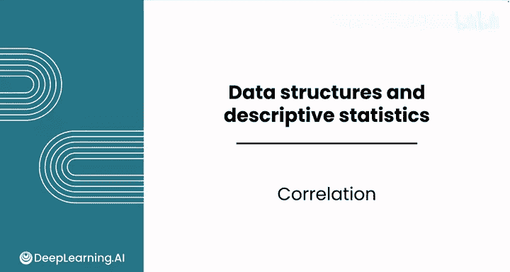
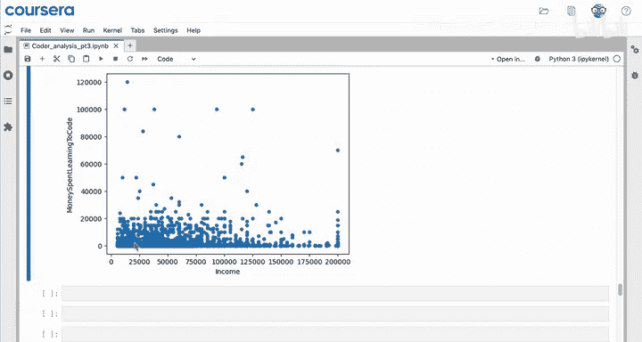
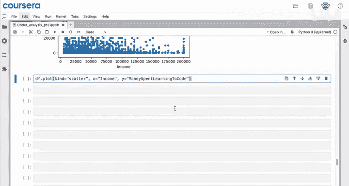
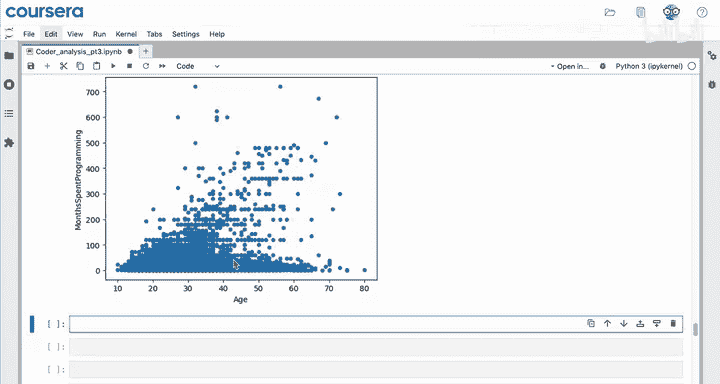
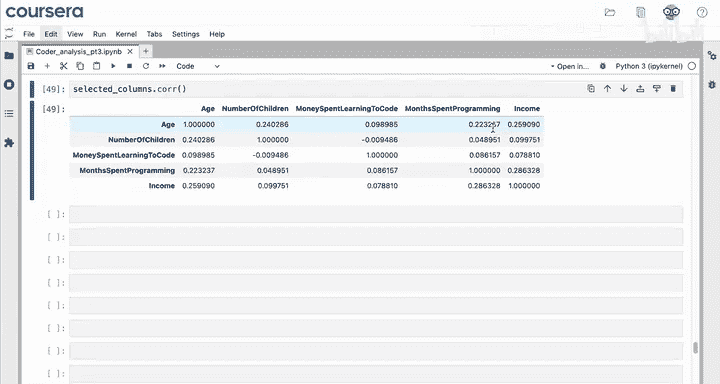
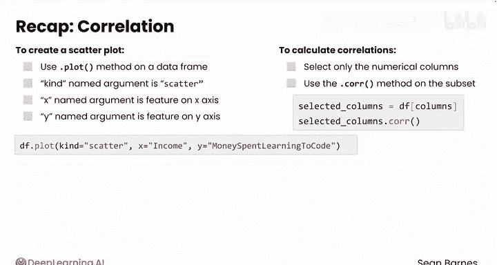

# 041：Python数据分析（第3课）｜ 相关分析 📊

## 概述



在本节课中，我们将要学习如何使用Pandas进行相关分析。相关分析是量化两个数值型特征之间关系强度和方向的重要工具。我们将学习如何创建散点图来直观地观察关系，以及如何计算皮尔逊相关系数来精确地量化这种关系。


---

## 散点图：可视化关系

上一节我们介绍了如何对数据进行描述性统计和绘制直方图、条形图。本节中我们来看看如何可视化两个数值变量之间的关系。

散点图是观察两个数值特征之间关系的首选方法。在绘制散点图时，你需要同时指定两个列，因此需要从DataFrame开始操作，而不是单个Series。

以下是创建散点图的步骤：

1.  使用DataFrame的`.plot()`方法。
2.  将`kind`参数设置为`‘scatter’`。
3.  通过`x`和`y`参数分别指定X轴和Y轴对应的列名。

例如，我们想探究“收入”和“学习编程的花费”之间的关系：

```python
df.plot(kind='scatter', x='income', y='money_spent_learning_code')
```

观察生成的图表，可能并未发现预期的明显模式。X轴上的“收入”似乎对Y轴上的“学习编程的花费”影响不大。

接下来，我们复制代码来观察“年龄”和“编程月数”之间的关系：





```python
df.plot(kind='scatter', x='age', y='months_spent_programming')
```



这个图表显示出更有趣的关系。可以看到许多人的“编程月数”为零，表明他们是初学者。但同时，似乎存在一种正向关系：有一组受访者年龄越大，编程的月数也越多。此外，还有一大群初学者分布在各个年龄段。

---

## 计算相关系数

散点图提供了直观感受，而皮尔逊相关系数则能精确量化关系的强度和方向。为了计算它，我们将使用Pandas的`.corr()`方法。

`.corr()`方法用于DataFrame，而非单个列，因为计算相关性需要两个列。与`.describe()`方法类似，当你在DataFrame上调用`.corr()`时，它会显示所有特征对之间的相关性。

如果你直接在包含非数值列（如分类数据）的原始DataFrame上调用`.corr()`，会导致错误。因此，你需要首先选择所有感兴趣的数值型列。

以下是计算相关系数的步骤：

1.  创建一个包含你感兴趣的数值型列名的列表。
2.  使用这个列表从DataFrame中选取这些列，生成一个只包含数值数据的新DataFrame。
3.  在这个新的DataFrame上调用`.corr()`方法。

```python
# 1. 创建数值列列表
columns_of_interest = ['age', 'number_of_children', 'money_spent_learning_code', 'months_spent_programming', 'income']

# 2. 从原始DataFrame中选取这些列
selected_columns = df[columns_of_interest]

# 3. 计算相关系数矩阵
correlation_matrix = selected_columns.corr()
correlation_matrix
```

运行后会得到一个大的相关性结果表。对角线上的值都是1，表示每个特征与自身完全相关。

在结果中，我们可以找到之前感兴趣的关系：
*   “收入”和“学习编程的花费”之间的相关系数约为 **0.08**，这是一个非常弱的相关性。
*   “年龄”和“编程月数”之间的相关系数约为 **0.22**，这是一个稍强但仍属弱相关的正相关性。这意味着年龄可以解释约22%的编程月数变化。



---

## 关键要点总结

本节课中我们一起学习了如何使用Pandas进行相关分析。

当调查两个数值变量之间的关系时：
*   要创建散点图，你需要在DataFrame上使用`.plot()`方法，将`kind`参数设为`‘scatter’`，并通过`x`和`y`参数指定特征。
*   要计算相关系数，你需要在DataFrame上调用`.corr()`方法。如果DataFrame包含分类列会导致错误，因此你需要先从中选取感兴趣的数值型列构成子集，然后在这个新DataFrame上使用`.corr()`方法，从而得到相关性表格。

请注意，相关性表格中超过一半的结果是冗余的，因为每个特征与自身的完美相关性（1）以及相关性计算的对称性（A与B的相关性等于B与A的相关性）使得每个结果在表中出现了两次。

---



## 后续内容

你已经接近本模块的尾声，学习了Pandas中许多有用的方法，从读取数据、选择、排序、筛选、计算描述性统计量，到绘制直方图、柱状图和散点图。

现在你已经在Python中学习了这么多计算和可视化技能，你可能希望将它们应用到数据的各个细分部分中。请跟随我进入本模块最后两个关于数据分段的视频。