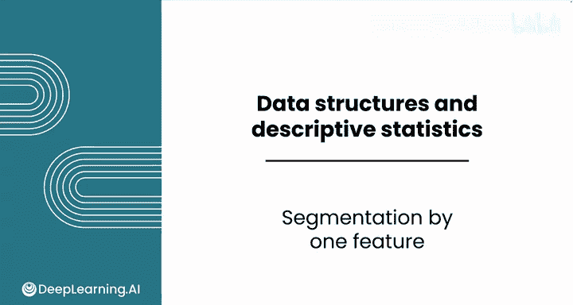
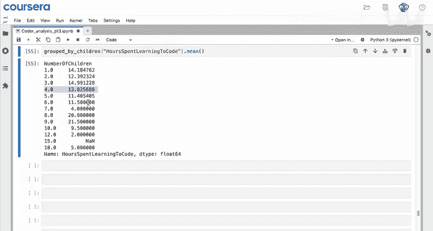
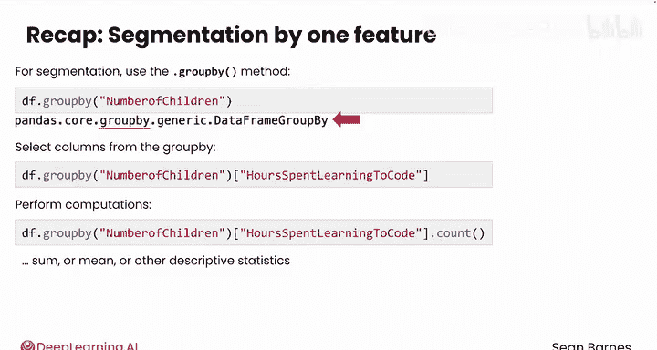

# 042：Python数据分析（第3课）｜单特征分群 🎯

在本节课中，我们将要学习如何使用`pandas`库中的`groupby`方法，基于一个特征对数据进行分群。分群能帮助我们观察一个特征如何随另一个特征的变化而变化，是分析特征间交互作用的强大工具。

---

## 数据分群概述 📊

数据分群允许你基于另一个特征来观察某个特征的模式。这是一个分析特征如何相互作用的强大工具。让我们看看如何使用`pandas`在Python中进行分群。

假设在你的报告的最后部分，你感兴趣的是确定学习编码的时间是否因一个人所拥有的孩子数量而异。因此，你需要基于一个特征（孩子数量）进行分群，然后分析学习编码的时间。

## 开始分群：使用`groupby`方法

由于你需要同时访问“孩子数量”和“学习编码时间”这两列数据，你需要从整个`DataFrame`开始操作。从一个`Series`开始是不行的，因为那样你会缺失所需的其中一列。

以下是开始分群的步骤：

1.  **使用`groupby`方法**：通过`df.groupby('number_of_children')`这行代码，你的数据会根据“孩子数量”的值被切割成多个子集。
2.  **保存结果**：将结果保存到一个变量中，例如`group_by_children`。

当你运行这段代码并查看结果时，你可能期望看到一个类似`DataFrame`的表格。然而，你只会得到一个类似`pandas.core.groupby.generic.DataFrameGroupBy`的对象。这是因为`groupby`本身并不立即进行计算，它只是将数据分好组。要看到任何结果，你需要执行下一步：对这些分组结果进行某种计算。

## 计算分组统计量

为了生成有意义的结果，你需要执行几个中间步骤，包括选择你想要探索的列，并应用一个函数来计算某种描述性统计量。

以下是具体操作：

*   从`groupby`对象中选择你感兴趣的列，例如“学习编码时间”。
*   然后应用一个计算函数，比如`.count()`（计数）或`.mean()`（平均值）。

通过执行这些步骤，你将得到基于孩子数量分群后的学习编码时间数据。例如，调查结果显示，约有100名受访者有一个孩子，938名受访者有两个孩子，依此类推。当孩子数量超过四个时，响应数据变得非常稀疏；超过六个时，由于样本量太小，几乎无法得出有意义的结论。

更有趣的可能是查看不同孩子数量下学习编码的平均时间。例如，有一个孩子的受访者平均学习时间为14.1小时，有两个孩子的为12.4小时，之后略有波动。对于孩子数量超过四个的组，由于样本量小，评估价值较低。

## `groupby`方法的核心概念总结

对于分群，你可以从你的`DataFrame`开始使用`groupby`方法。

*   **`groupby`对象的类型**：调用`groupby`方法的结果类型是一个`GroupBy`对象，它不是一个`DataFrame`，但有一些相似之处。
*   **选择列**：你可以从这个`GroupBy`对象中选择列，就像刚才演示中选择“学习编码时间”列一样。
*   **执行计算**：选择列后，你可以执行计算，如计算计数、总和、平均值或其他描述性统计量。这些结果将按每个分组进行汇总展示。

**核心要点**：`groupby`本身不会计算任何均值、计数，甚至不会明确划分出不同的组。只有当你实际执行下一步计算操作（如选择一列并计算其均值或总和）时，这些计算才会发生。

---

## 课程总结 🎓

本节课中，我们一起学习了**单特征分群**。我们了解到，`pandas`的`groupby`方法是一个强大的工具，它能将数据按指定列的值进行分组。关键在于，`groupby`本身只创建分组结构，必须后续结合聚合函数（如`.mean()`， `.count()`）才能计算出每个组的统计结果。这种方法对于探索一个变量如何随另一个分类变量变化非常有用。

然而，如果你想要基于**多个特征**进行分群，则需要使用不同的方法——数据透视表。我们将在下一个视频中学习如何使用它。