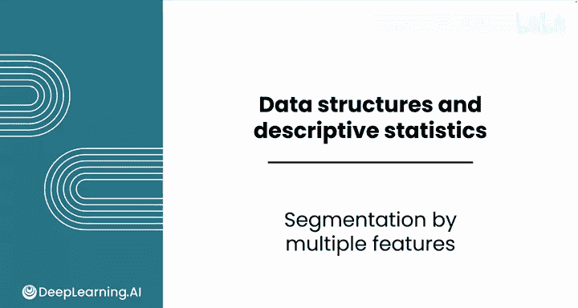
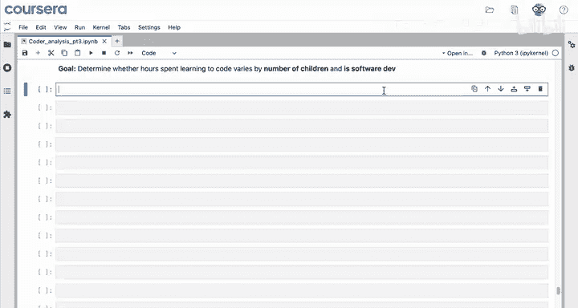
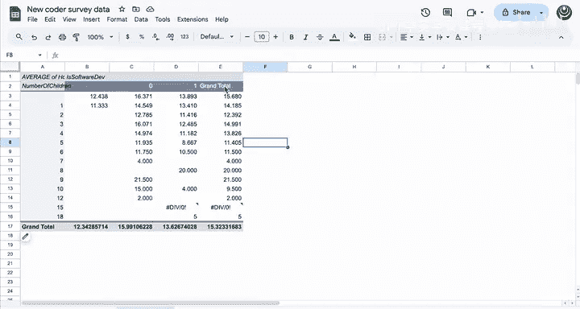
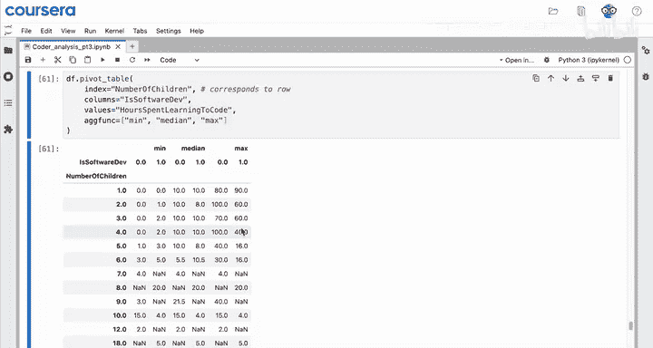
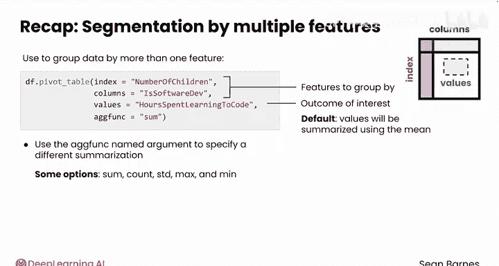

# 043：多特征分群 📊

在本节课中，我们将学习如何使用Pandas库对数据进行多特征分群。这是数据描述性分析的最后一项任务，能帮助我们同时基于多个类别特征来观察数据的变化。

上一节我们介绍了如何按单个特征（如子女数量）对数据进行分组。本节中，我们来看看如何同时基于两个类别特征进行分群，例如，分析每周学习编码的时间是否同时受“子女数量”和“当前是否为软件开发人员”这两个因素的影响。



## 使用数据透视表进行分群



如果你想基于两个类别特征对数据进行分群，数据透视表是最合适的工具。

以下是创建数据透视表的基本步骤：

1.  在电子表格软件中，选择你的数据。
2.  插入数据透视表。
3.  将“子女数量”字段拖入“行”区域。
4.  将“是否为软件开发人员”字段拖入“列”区域。
5.  将“每周学习编码时间”字段拖入“值”区域。
6.  默认的汇总函数是求和，但通常我们更关心平均值，因此需要将值字段的汇总方式改为“平均值”。

通过这个操作，你可以得到每个特征组合（例如，有一个孩子且不是开发者，有一个孩子且是开发者）对应的平均学习时间。

## 在Python中使用Pandas实现

在Python的Pandas库中，我们可以通过`pivot_table`方法快速实现类似的功能，其逻辑与电子表格中的数据透视表非常相似。

```python
import pandas as pd



# 假设df是你的DataFrame
pivot_result = df.pivot_table(
    index='number_of_children',   # 对应行
    columns='is_software_dev',    # 对应列
    values='hours_spent_learning_code'  # 要分析的值
)
```

运行以上代码后，`pivot_result`将是一个数据透视表，默认使用**均值**作为每个特征组合的汇总值。例如，表格会显示“有一个孩子且不是开发者”的群体的平均学习时间，以及“有一个孩子且是开发者”的群体的平均学习时间。

## 自定义汇总函数

与电子表格一样，`pivot_table`方法也允许你指定不同的汇总（聚合）函数。这是通过`aggfunc`参数实现的。

`aggfunc`参数的默认值是`‘mean’`（均值）。你可以将其更改为其他函数：

*   `aggfunc=‘sum’`：计算每组的总和。
*   `aggfunc=‘std’`：计算每组的标准差。
*   `aggfunc=‘min’` / `aggfunc=‘max’`：找出每组的最小值或最大值。

例如，要计算总学习时间，代码如下：

```python
pivot_sum = df.pivot_table(
    index='number_of_children',
    columns='is_software_dev',
    values='hours_spent_learning_code',
    aggfunc='sum'  # 改为求和
)
```

## 使用多个汇总函数

一个更强大的功能是，你可以为`aggfunc`参数传入一个函数列表，从而一次性计算多个统计量。

例如，如果你同时想了解每组的最小值、中位数和最大值，可以这样做：

```python
pivot_multi = df.pivot_table(
    index='number_of_children',
    columns='is_software_dev',
    values='hours_spent_learning_code',
    aggfunc=['min', 'median', 'max']  # 传入函数列表
)
```

运行后，你将得到一个包含多级列索引的数据透视表，分别展示了每个特征组合下的最小值、中位数和最大值。这能提供比单一均值更丰富的数据分布信息。

## 总结

本节课中我们一起学习了如何使用Pandas的`pivot_table`方法进行多特征分群分析。



*   **核心方法**：`df.pivot_table(index, columns, values, aggfunc)`
*   **应用场景**：当你需要基于两个或更多类别特征对数据进行分组和汇总时。
*   **关键参数**：
    *   `index` 和 `columns`：对应你想要分组的特征。
    *   `values`：你关心的结果数值。
    *   `aggfunc`：指定汇总函数，如 `‘mean’`（默认）、`‘sum’`、`‘std’`、`[‘min’, ‘max’]`等。



数据透视表是进行多维数据探索和生成汇总报告的强大工具。掌握它，能让你更高效地从数据中发现有价值的模式和洞察。

至此，本模块关于数据读取、分析和可视化的核心内容已接近尾声。接下来，你将通过分级作业和实验来巩固所学。在实验中，你将有机会运用本模块学到的所有Python技巧，深入分析零售销售数据。

期待在下一个关于数据可视化的模块中与你再见！😊