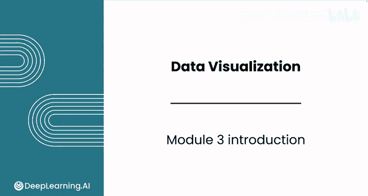
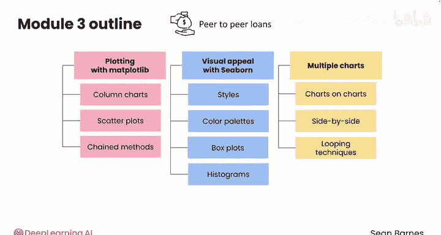

# 044：数据可视化 📊

在本课程中，我们将学习如何使用Python进行数据可视化。数据可视化是将数据转化为图表的过程，它能帮助我们更直观地理解数据背后的故事。我们将重点掌握两个核心库：**Matplotlib** 用于创建高度自定义的图表，以及 **Seaborn** 用于制作更具视觉吸引力的统计图形。整个课程中，我们将通过分析一个真实的P2P贷款数据集，来帮助一家初创公司制定产品策略。

## 第一课：Matplotlib绘图基础 📈

上一段我们概述了本课程的目标，本节中我们来看看如何使用Matplotlib进行基础绘图。Matplotlib是Python中最基础的绘图库，它提供了强大的灵活性来创建各种类型的图表。

以下是本课将涵盖的核心内容：
*   学习创建美观的图表，包括柱状图（单个、分组和堆叠柱状图）以及散点图。
*   学习如何阅读链式方法，即在同一行命令中链接多个方法。

## 第二课：使用Seaborn提升图表美观度 🎨

掌握了基础的绘图方法后，本节我们将专注于使用Seaborn库来创建更具视觉吸引力的图表。Seaborn基于Matplotlib，提供了更高级的接口和精美的默认样式。

以下是本课将学习的技能：
*   通过设置样式和调色板来增强图表的美观度。
*   掌握专业统计图形的绘制，如箱线图、直方图等。

## 第三课：高级绘图技巧 🔄

在学习了单个图表的创建后，本节我们将发展同时绘制多个图表的技能。这在对比分析不同数据维度时非常有用。

以下是本课的核心内容：
*   学习绘制复合图表，包括叠加图表和并排图表。
*   学习使用高级循环技术，仅用几行代码即可创建多个图表。

---

在本节课中，我们一起学习了数据可视化的完整流程：从使用Matplotlib进行基础绘图，到利用Seaborn提升图表的视觉表现力，最后掌握了同时创建多个图表的高级技巧。课程结束后，你将能够创建具有专业质量的数据可视化作品，从而从数据中提炼出有意义的见解。

接下来，请跟随我进入第一课，开始使用Matplotlib模块探索绘图世界。我们课堂上见。