# 045：Python数据分析 第3课 - Matplotlib绘图 📊

## 概述

在本节课中，我们将要学习Python中最常用的可视化库之一——Matplotlib。我们将了解其核心概念，并通过一个实际的贷款数据分析案例，学习如何使用Matplotlib来创建和美化图表，从而更清晰地向客户展示数据分析结果。

---

## Matplotlib简介

Python中最常用的可视化库之一是Matplotlib。程序员尤其看重其灵活性和高度可定制性。

Matplotlib是一个可视化模块，你可以将其导入到代码中。它允许你在Pandas创建的基础图表之上进行扩展，添加诸如标题、注释、颜色、坐标轴限制、标签格式化等自定义功能。与Pandas类似，Matplotlib包含了数十万行已为你编写好的代码。当你进行探索性数据分析或为报告开发精美的可视化图表时，你很可能会用到Matplotlib。


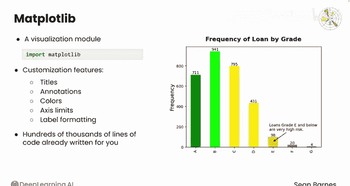

上一节我们介绍了Matplotlib的基本概念，本节中我们来看看它的核心组成部分。

Matplotlib可视化图表由几个核心组件构成。

*   **图形（Figure）**：你可以将其想象为绘图的画布。一个图形可以容纳一个或多个绘图。它本质上是一个容器。
*   **绘图（Axes）**：在Matplotlib中，绘图被称为“坐标轴”。每个坐标轴都有自己的一套绘图元素，如标签、数据、图例、网格等。

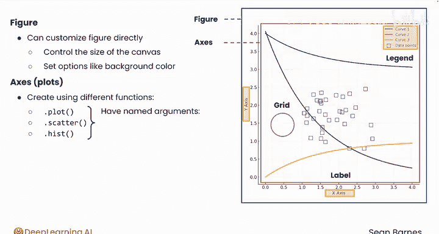

你可以直接创建一个图形，尽管这不是必须的。例如，你可能希望控制画布的大小或设置其他选项，如背景颜色。

以下是创建和定制图表的基本步骤：

1.  使用不同的函数（如 `plot`、`scatter`、`hist` 等）创建一组坐标轴，这些函数生成你认为是图形或图表的东西。
2.  这些函数也有命名参数，你可以在其中指定用于绘图的数据以及该图表类型的数据墨水，如边界、标记、颜色、线条样式和其他参数。
3.  然后，你还可以使用添加标题、X轴和Y轴标签、注释、图例等功能的函数，在图表上叠加额外的图表元素。

---

## 实战案例：贷款数据分析

现在，让我们通过一个实际案例来应用这些知识。你正在为一家希望通过新产品颠覆点对点借贷的初创公司工作。他们的计划是开发一种先进的风险管理策略，为美国各地的不同社区提供贷款。

你正在处理来自点对点借贷平台Lending Tree的贷款数据集，你可能在前面的课程中还记得它。你的任务是进行探索性数据分析，以更好地了解不同风险等级贷款的特征。你需要撰写一份包含你发现的报告，与银行分享。你的计划是开发富有洞察力的可视化图表，帮助你的客户理解不同的风险状况。毕竟，一图胜千言。

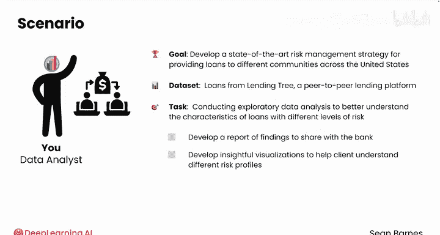

首先，从文件 `loan_data.csv` 中导入这个数据集。请记住，这行代码之所以有效，是因为CSV文件与你的笔记本文件位于同一文件夹中。在本课程的实验中，你不需要进行任何文件管理，但你应该能够解释这行代码为何有效。

```python
import pandas as pd
loans = pd.read_csv('loan_data.csv')
```

数据整体看起来相当干净，列名格式良好。似乎没有唯一的标识符，因此你可以为此分析保留数值索引。

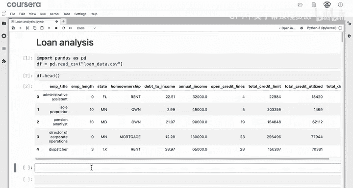

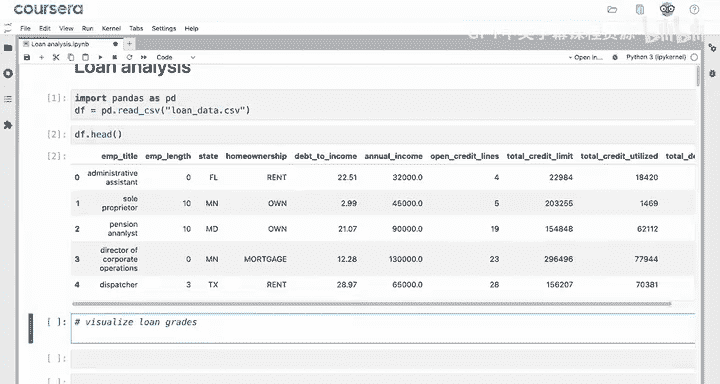

---

## 可视化贷款等级分布

首先可视化贷款等级，以便更好地了解整个贷款组合的构成。贷款被分配从A到G的等级，A级贷款的预期损失风险最低，通常利率也最低。

使用 `pd.unique` 函数检查 `grade` 列中出现的值。

```python
pd.unique(loans['grade'])
```

要绘制不同贷款等级的频率，你可以使用 `value_counts` 方法创建一个包含数据集中每个等级计数的序列。然后使用 `plot` 方法并设置 `kind='bar'` 来创建图表。请记住，没有“柱状图”这种说法，在Pandas中，条形图就是柱状图。

```python
grade_counts = loans['grade'].value_counts()
grade_counts.plot(kind='bar')
```

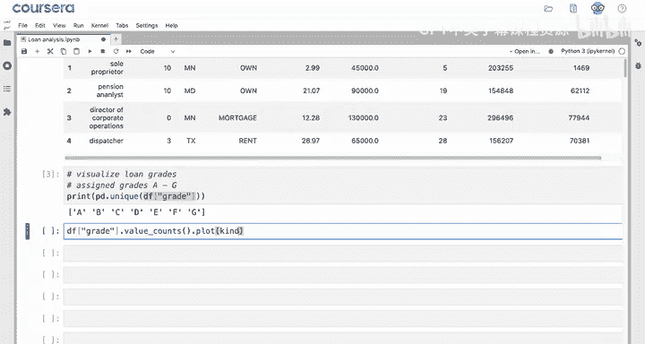

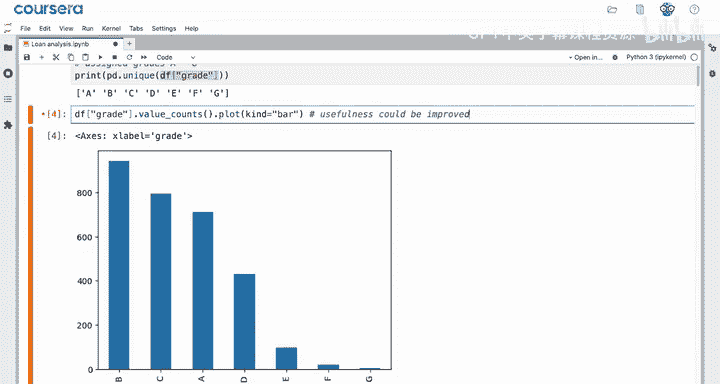

你可以看到B级贷款最常见，其次是C级，然后是A级，而E、F和G级的贷款只有少数几笔。这个可视化可能是一个很好的选择，可以帮助你的利益相关者了解整个投资组合中风险是如何平衡的。

然而，它的实用性可以显著提高。首先，`grade` 列是有顺序的。因此，适当地排序这些等级会很有帮助。

你可以使用 `sort_index` 方法，正如你可能猜到的，它按索引对数据进行排序。它很像 `sort_values`，只是它按索引排序。如果你在 `value_counts` 的结果（这是一个序列）上调用 `sort_index` 方法，你将按字母等级A到G对这个序列进行排序。将其保存到一个变量中，例如 `sorted_grades`，或者任何对你来说最有意义的名称。

```python
sorted_grades = loans['grade'].value_counts().sort_index()
sorted_grades.plot(kind='bar')
```

现在，你得到了一个排序良好的图表，能更好地可视化等级的分布。因此，你的客户可能会得出结论，他们应该谨慎发放被评为E、F或G级的贷款，因为他们的竞争对手Lending Tree很少发放这类贷款。

---

## 使用Matplotlib增强图表

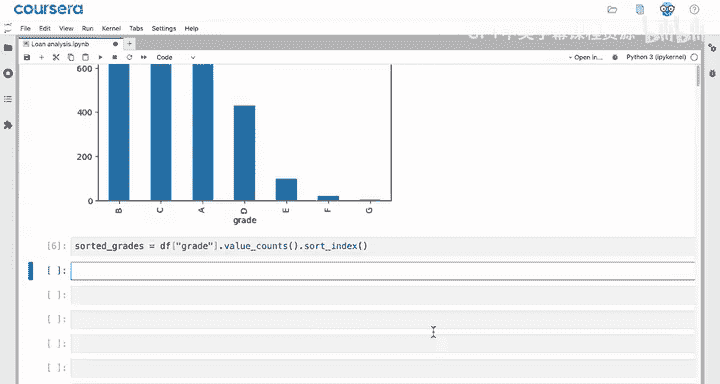

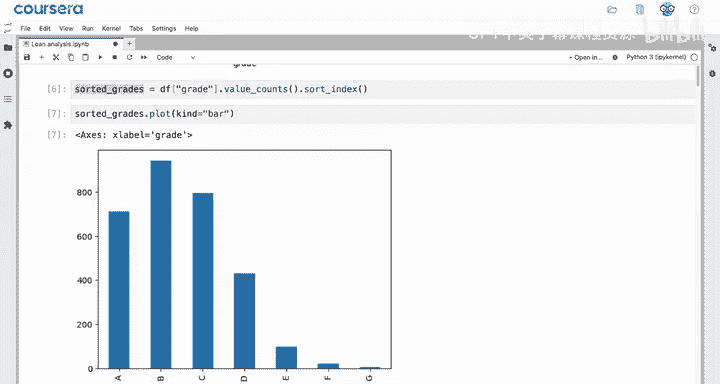

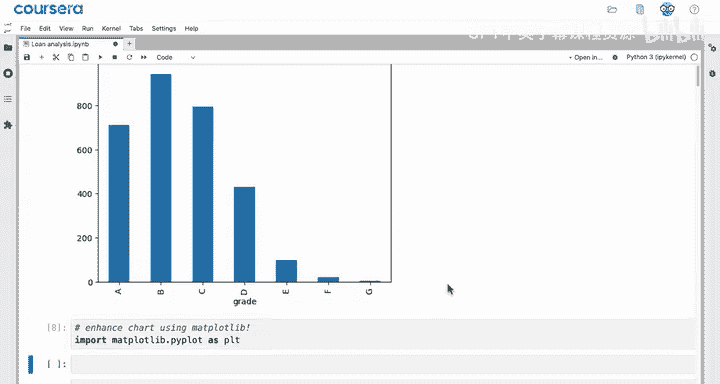

目前这是一个相当简陋的图表，你可以使用Matplotlib来增强它。首先，你需要导入 `matplotlib.pyplot` 作为 `plt`。请记住，`as plt` 创建了一个昵称，你通常会看到 `plt` 作为 `matplotlib.pyplot` 的别名。你可以在笔记本的任何位置添加导入命令，尽管你会看到许多程序员将它们分组放在顶部。只需确保你运行了它们。

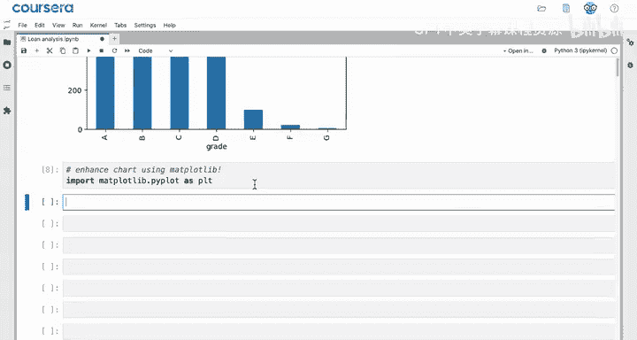

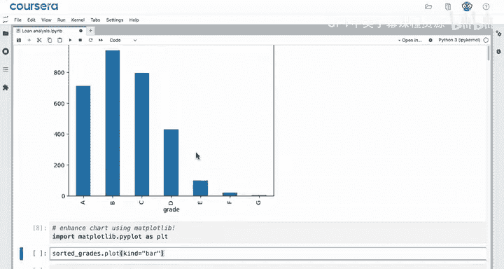

你可以从之前相同的图表开始，现在为其添加更多图层。如果你看这个图表，这里已经有一个图形（或画布）供你绘图，并且已经有一个绘图。你可以使用例如 `plot.title` 命令来增强这个绘图。这个命令将在这个图表上叠加一个标题，几乎是作为另一个图层。

```python
import matplotlib.pyplot as plt
sorted_grades.plot(kind='bar')
plt.title('Frequency of Loan by Grade')
```

你也可以使用 `plt.xlabel` 和 `plt.ylabel` 来标记你的坐标轴。“贷款等级”有点不言自明，也许标签是多余的，所以你可以添加一个空字符串（`''`）来移除X轴标签。`plt.ylabel` 可以是“频率”。

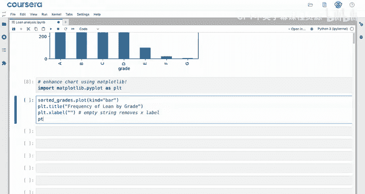

请注意，当你运行这段代码时，你会得到一个标签清晰的图表，但你也会得到一行输出，写着“Text(…)”之类的。在使用Matplotlib时，你还需要添加 `plt.show()` 命令。这个命令明确告诉计算机显示绘图。

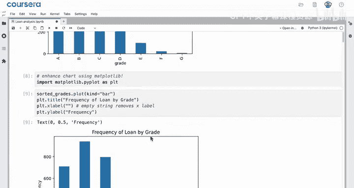

```python
sorted_grades.plot(kind='bar')
plt.title('Frequency of Loan by Grade')
plt.xlabel('')
plt.ylabel('Frequency')
plt.show()
```

它有两个副作用。首先，它隐藏了你在Jupyter笔记本中得到的额外输出（显示单元格中的最后一个项目）。其次，它显示Matplotlib当前正在处理的绘图，然后从计算机内存中清除该绘图，以便你可以重新开始（如果你愿意的话）。因此，`plt.show()` 允许你在同一个单元格中显示多个绘图（如果需要的话）。在每个绘图后使用 `plt.show()` 是一个好习惯，可以使你的代码更易于阅读。

---

## 总结

本节课中我们一起学习了如何使用Matplotlib来增强数据可视化。

首先，我们通过选择想要在柱状图中绘制的数据并使用Pandas的 `sort_index` 方法对其进行排序来开始分析。

然后，我们学习了如何将Matplotlib命令叠加到图表上以增强可视化效果。我们导入了 `matplotlib.pyplot` 并使用了昵称 `plt`。接着，我们使用Pandas的 `plot` 方法创建了一个图表。之后，我们使用了Matplotlib的 `xlabel`、`ylabel` 和 `title` 函数来使我们的可视化更加清晰。

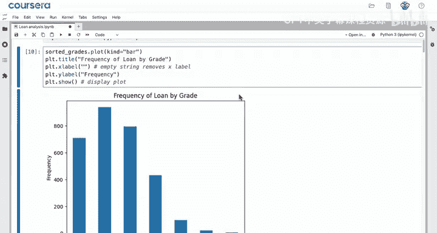

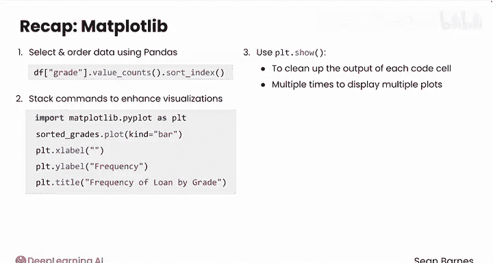

最后，我们学习了使用 `plt.show()` 函数来清理每个代码单元的输出。如果你希望在一个单元格中显示多个绘图，可以多次使用 `plt.show()`。

Matplotlib具有很大的实用性和强大的功能。它非常适合进行定制，而Pandas自带的简单可视化功能则非常适合快速将图表呈现在页面上。跟随我到下一个视频，看看柱状图的一些出色增强功能。