# 046：图表颜色、网格与保存 📊

在本节课中，我们将学习如何通过添加颜色和网格线来增强基础图表的可读性，并最终将图表保存为图像文件，以便用于报告或演示。

上一节我们介绍了如何创建和标注一个基础的柱状图。本节中，我们来看看如何通过颜色和网格等特性，让图表更具表现力和实用性。

## 为图表添加颜色 🎨


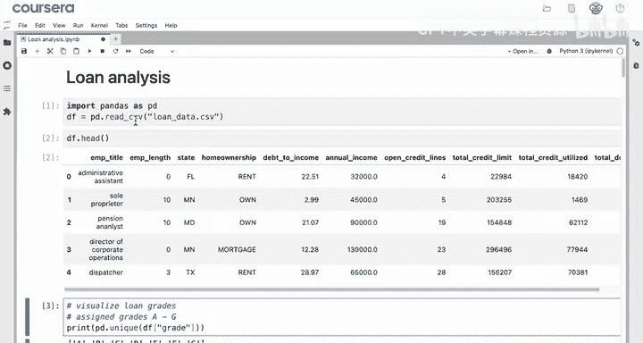

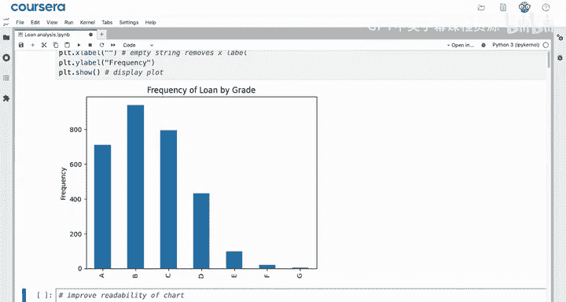

创建并标注好基础图表后，你可以使用颜色等附加功能来增强其可解释性。

假设你已导入数据、Pandas和Matplotlib，并创建了一个展示成绩频率的柱状图。现在，你想提升其可读性，并将此图表保存为图像添加到报告中。

你可以向 `plot` 方法添加额外的命名参数来美化图表。例如，如果你的客户品牌主色调是紫色，你可以为图表选择该颜色。

`plot` 方法有很多参数，你可以选择将每个参数放在单独一行以提高代码可读性，如下所示：


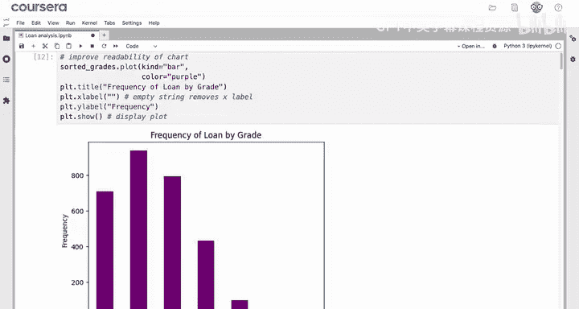

```python
grades.plot(kind='bar',
            color='purple')
```


`color` 参数有很多选项。你可以提供十六进制颜色代码，也可以使用任何HTML颜色名称。HTML颜色代码网站维护了一个可用颜色名称列表，例如 `salmon`（鲑鱼红）和 `deep pink`（深粉色）。

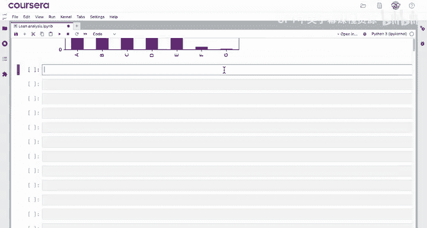

```python
# 使用HTML颜色名称
grades.plot(kind='bar', color='salmon')
# 使用十六进制颜色代码
grades.plot(kind='bar', color='#FF6347')
```

`color` 参数也可以接受一个颜色列表。如果你能为这个图表选择一个渐变色，你会选什么？

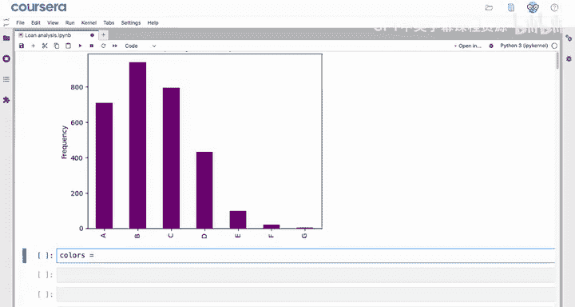

一个从绿色到红色或从蓝色到橙色的渐变，可以为“贷款等级”添加双重编码，这很有用。要实现这一点，你可以创建一个颜色名称或十六进制代码的列表。

手动创建这样的列表可能有些繁琐，因此你可以向你的大语言模型（LLM）寻求帮助。

以下是向LLM提问的示例：“使用HTML颜色名称，创建一个包含七种颜色的Python列表，颜色需从绿色渐变到红色，中间经过橙色和黄色。”

然后，将生成的 `colors` 列表添加到你的笔记本中，并将 `color` 命名参数的值改为这个列表。

```python
colors = ['green', 'chartreuse', 'yellow', 'gold', 'orange', 'darkorange', 'red']
grades.plot(kind='bar',
            color=colors)
```

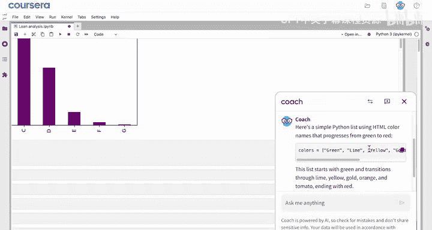

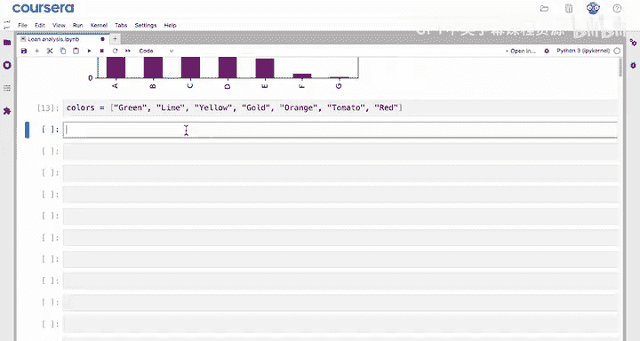

这个渐变色将帮助你的客户快速解读图表。

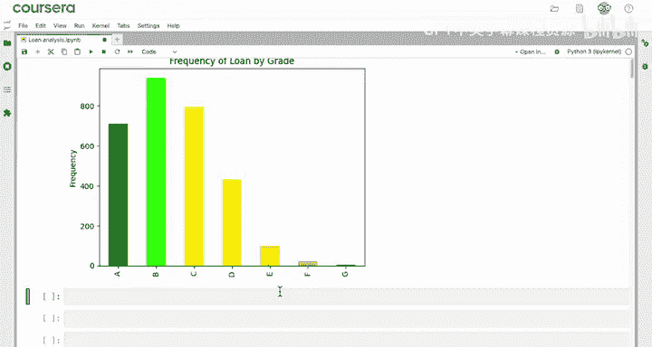

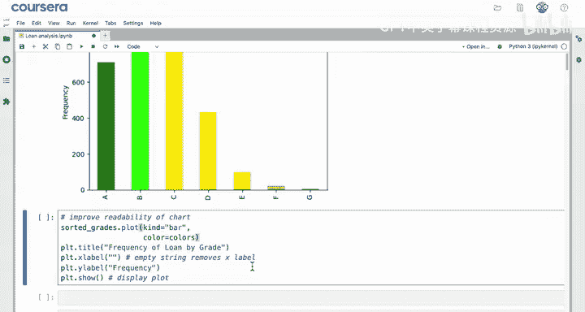

## 添加网格线 📐

你可能会注意到，对于靠右侧的柱状条，从Y轴读取数值有点困难。为了进一步提高图表的可读性，你可以添加网格线。

添加网格线非常简单，只需调用 `plot.grid()` 方法。

```python
grades.plot(kind='bar', color=colors)
plt.grid()
```

`grid` 函数也有很多命名参数可供使用。首先，在X轴上显示网格线是多余的，因为柱状条的颜色和标签已经帮助观察者理解贷款等级。因此，你可以使用 `axis='y'` 参数来移除X轴的网格线。

```python
plt.grid(axis='y')
```

这个函数的默认值是 `'both'`，这就是为什么最初会显示两组网格线。你会发现Matplotlib函数的一个共同特点：几乎每个方面都可以自定义。

例如，你可能想让网格线颜色更深一些，比如黑色，但透明度（`alpha`）设为0.7。你也可以改变线条样式，虚线写作 `'--'`。

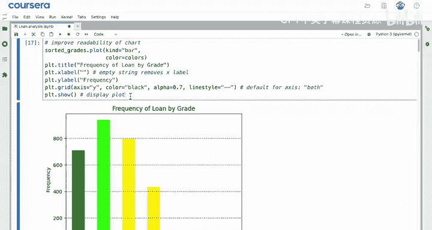

```python
plt.grid(axis='y',
         color='black',
         alpha=0.7,
         linestyle='--')
```

如果你想进一步自定义这个图表，随时可以向你的LLM寻求灵感。

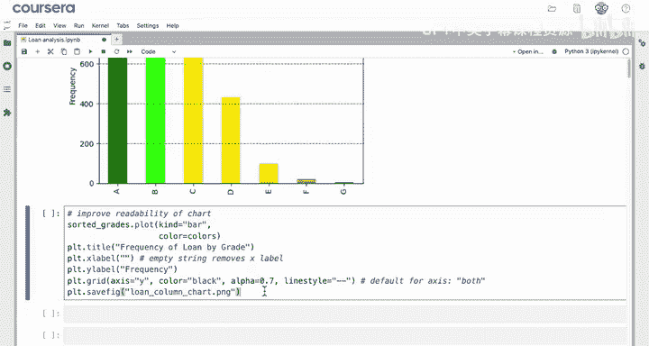

## 保存图表为图像 💾

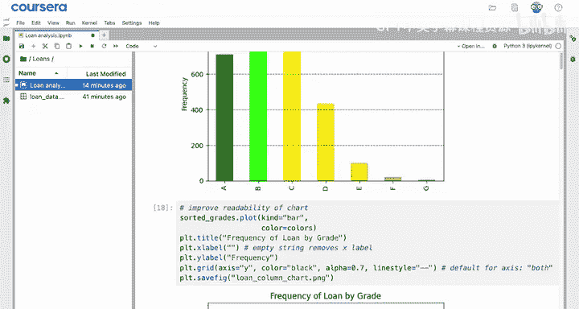

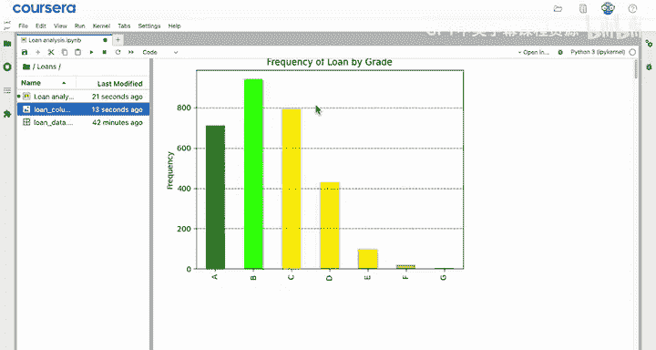

Matplotlib最后一个很酷的功能是，你可以使用 `plot.savefig()` 函数将图形保存到文件。

你唯一需要的参数是想要保存的文件名，包括文件扩展名（它指示了你保存的文件类型，如 `.png` 或 `.jpeg` 等）。

```python
plt.savefig('loan_column_chart.png')
```

该图形将作为一个图像文件，保存在与你的笔记本相同的位置。

执行上述代码后，你就得到了一个精美的图像，可以将其包含在给客户的报告中。

## 课程总结 📝

本节课中我们一起学习了如何美化并保存Matplotlib图表。

*   **使用颜色**：你学会了使用 `plot` 方法的 `color` 命名参数来指定图表颜色。你可以使用十六进制代码或HTML颜色名称（如 `salmon` 或 `mediumseagreen`）作为 `color` 参数的值。
*   **使用颜色列表**：你还学会了如何使用颜色列表为每个柱状条赋予独立的颜色，并利用LLM来生成这样的列表。
*   **添加网格线**：你使用 `plot.grid()` 为图表添加了网格线。`axis` 参数允许你指定在X轴、Y轴或两者上都显示网格线。你还可以使用 `grid` 函数的命名参数来自定义线条样式、颜色等特性。
*   **保存图像**：最后，你学会了如何使用 `plot.savefig()` 保存图像。该函数的参数是你想要使用的文件名，并且需要包含文件扩展名。我们使用了 `.png`，但任何常见的图像格式都适用，如 `.jpeg`、`.svg`、`.pdf` 等。

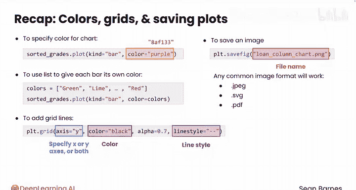

现在，你已经创建了一个可读性显著提升的图表。在下一个视频中，我们将学习如何进一步提高图表中文本的清晰度，并添加文本注释。