# 047：Matplotlib 文本标注与美化

在本节课中，我们将学习如何通过调整文本样式和添加标注来提升 Matplotlib 图表的可读性与信息传达效果。我们将从基本的文本样式控制开始，逐步学习如何添加指向性标注和柱状图标签，最终使图表更加清晰、专业。

---

## 🎨 文本样式控制

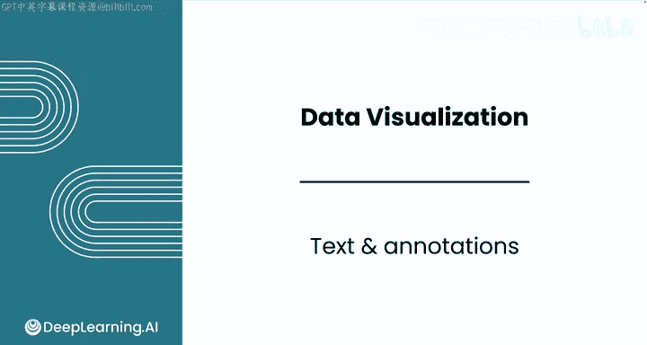

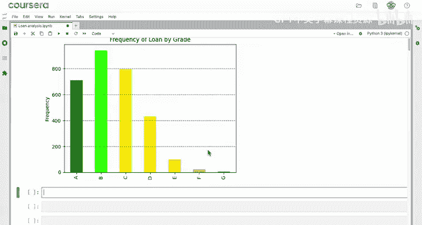

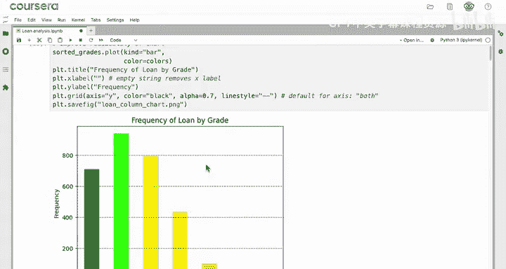

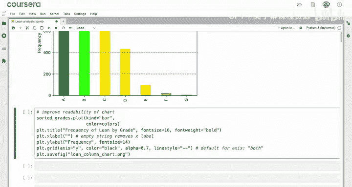

上一节我们介绍了如何创建和自定义 Matplotlib 图表。本节中，我们来看看如何控制图表中文本元素的样式，例如标题和坐标轴标签。

对于标题、X轴标签、Y轴标签等文本元素，可以使用命名参数控制字体大小、粗细等属性。

以下是常用参数示例：

*   `fontsize`：控制字体大小，例如 `fontsize=16`。
*   `fontweight`：控制字体粗细，例如 `fontweight='bold'` 可使文本加粗。
*   `pad`：为元素周围添加额外空间（内边距），例如 `pad=15`。

**代码示例：**
```python
# 设置标题样式
plt.title('Loan Grades Frequency', fontsize=16, fontweight='bold', pad=15)
# 设置Y轴标签样式
plt.ylabel('Frequency', fontsize=14)
```

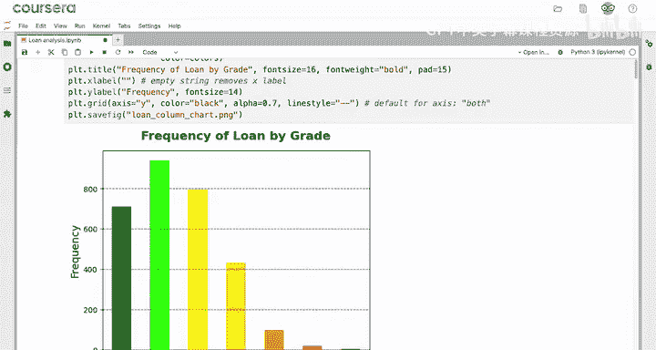

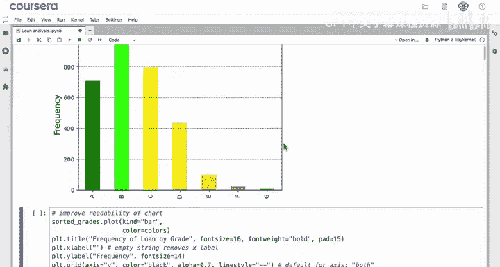

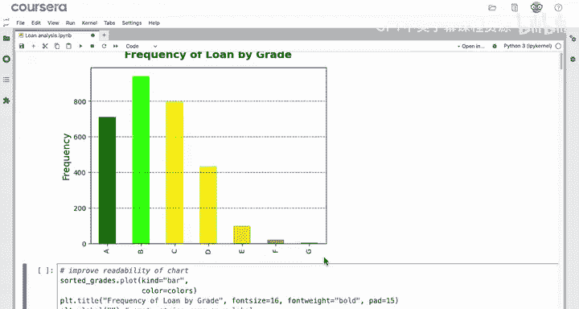

应用这些样式后，图表文本的辨识度会显著提高。

---

## 📝 添加图表标注

调整好基础文本样式后，我们可以通过添加标注来突出图表中的关键信息，帮助观众理解数据背后的含义。

例如，在展示不同等级贷款频率的柱状图中，研究发现等级低于 D 的贷款违约风险极高。我们可以添加一个标注来说明这一点。

使用 `plt.annotate()` 函数添加标注。该函数包含多个参数，核心参数如下：

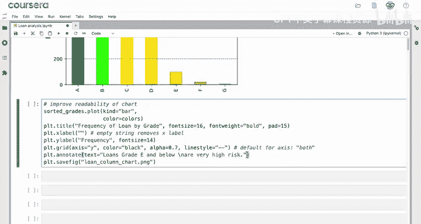

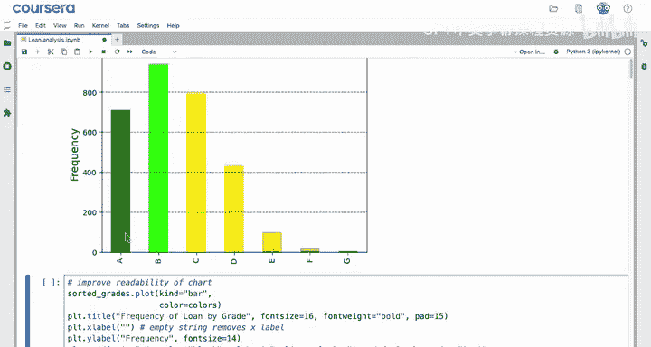

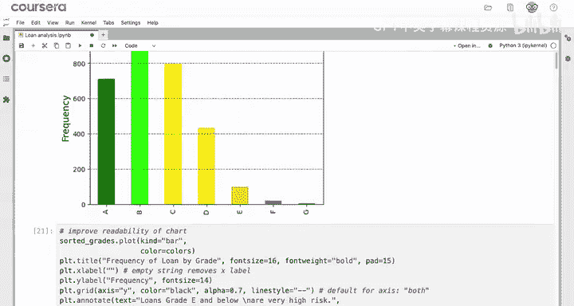

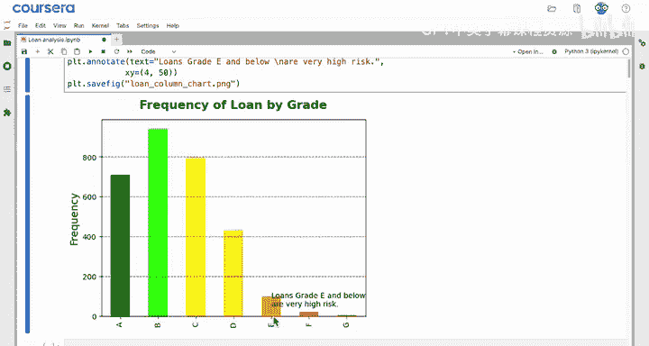

*   `text`：标注的文本内容。
*   `xy`：标注所指向的数据点坐标（元组形式）。
*   `xytext`：标注文本本身的坐标（元组形式）。
*   `textcoords`：定义 `xytext` 参数的坐标系。

**初始代码示例：**
```python
plt.annotate(text='Loans grade E and below\nare very high risk',
             xy=(4, 50), # 指向第5个柱（E等级，索引为4），Y轴高度约50
             xytext=(4, 50)) # 文本初始位置与指向点相同
```
此时标注文本可能会与数据柱重叠，影响可读性。

---

## 🎯 调整标注位置与箭头

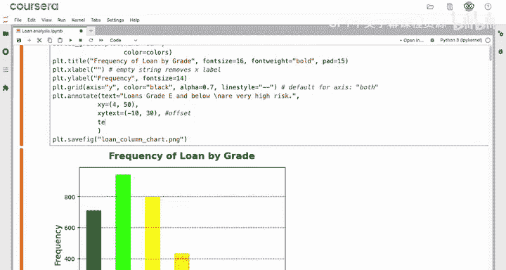

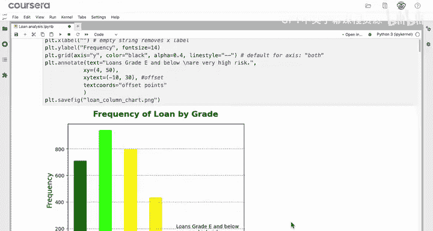

为了使标注更清晰，我们需要将文本移动到合适的位置，并可以添加箭头指向具体数据点。

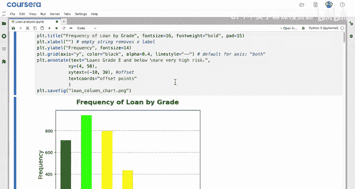

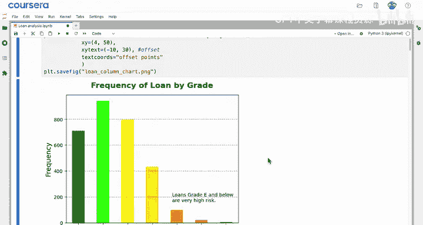

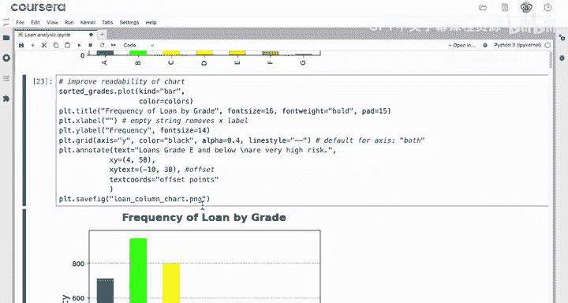

我们可以将 `xytext` 参数视为相对于 `xy` 点的偏移量，并通过设置 `textcoords='offset points'` 来明确这一点。同时，使用 `arrowprops` 参数添加箭头。

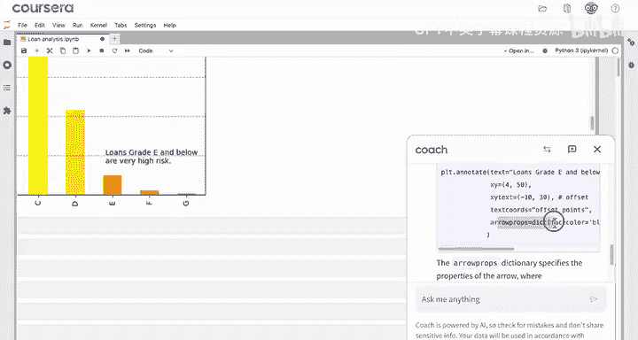

**优化后的代码示例：**
```python
plt.annotate(text='Loans grade E and below\nare very high risk',
             xy=(4, 50), # 指向点不变
             xytext=(-10, 30), # 文本向左偏移10点，向上偏移30点
             textcoords='offset points', # xytext 为偏移量
             arrowprops=dict(arrowstyle='->', color='black')) # 添加黑色箭头
```
为了让标注更易读，还可以调浅网格线颜色：`plt.grid(alpha=0.3)`。

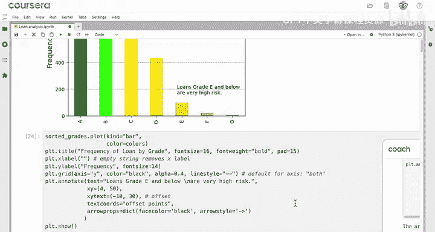

---

## 🔢 为柱状图添加数据标签

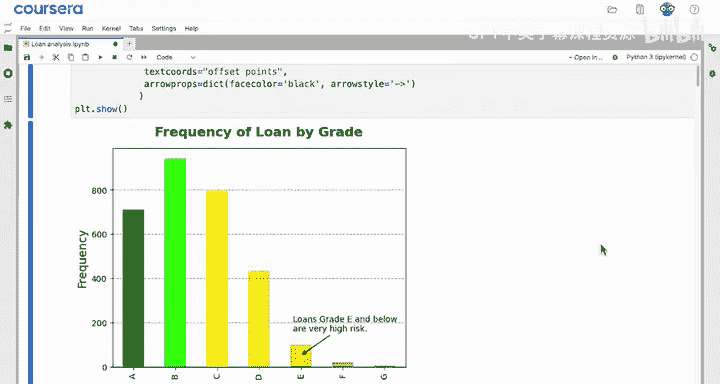

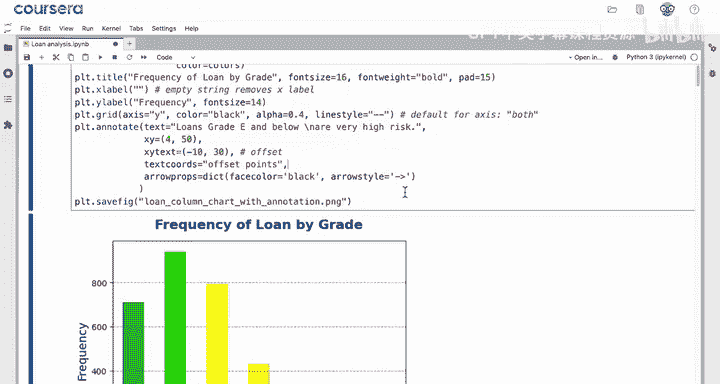

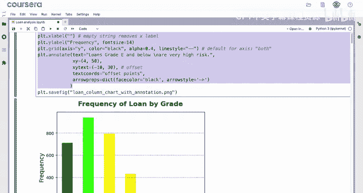

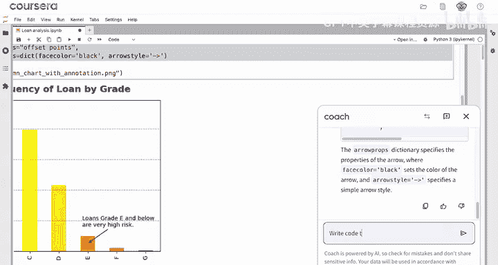

在柱状图中，一个常见的需求是在每个柱子的顶部显示其具体数值。这可以通过循环和 `plt.text()` 函数实现。

以下是实现方法：

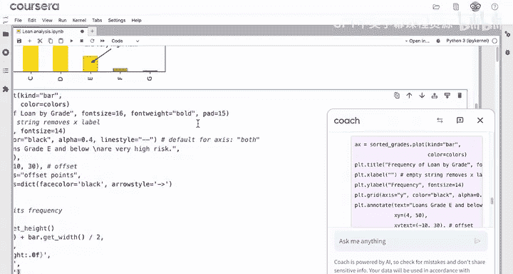

1.  遍历每个柱子的位置和高度。
2.  在每个柱子的顶部中心位置添加文本标签。

**代码示例：**
```python
# 假设 bars 是柱状图对象，heights 是各柱子高度
for i, height in enumerate(heights):
    plt.text(x=i, # X坐标：柱子索引
             y=height + 1, # Y坐标：柱子高度加一小段偏移
             s=str(height), # 文本内容：高度值
             ha='center', # 水平对齐方式：居中
             va='bottom') # 垂直对齐方式：底部对齐
```
这样，图表就通过柱高和顶部标签实现了数据的“双重编码”，更加清晰直观。

---

## 📚 本节总结

本节课中我们一起学习了如何美化 Matplotlib 图表的文本并添加信息标注。

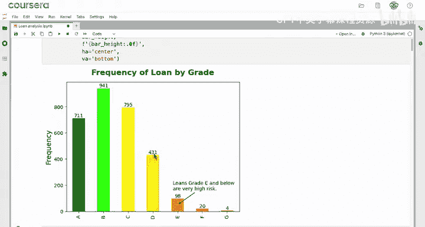

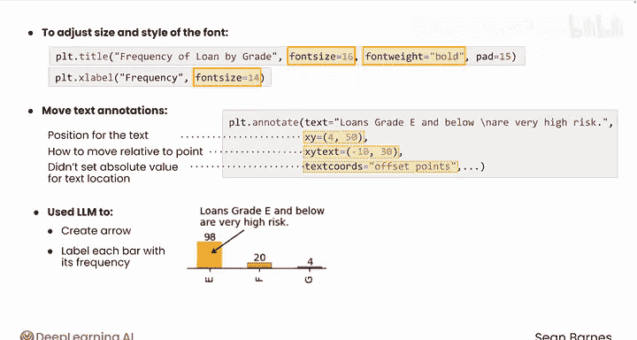

*   我们学习了使用 `fontsize`、`fontweight`、`pad` 等参数控制标题、坐标轴标签的样式。
*   我们掌握了使用 `plt.annotate()` 函数添加文本标注的方法，并通过 `xy` 参数指定标注点。
*   我们了解到可以使用 `xytext` 和 `textcoords='offset points'` 将标注文本独立于标注点进行定位。
*   我们使用 `arrowprops` 参数为标注添加了指向箭头。
*   我们学习了通过循环和 `plt.text()` 为柱状图的每个柱子添加数据标签。

完成图表的文本标注和美化后，下一步是自定义坐标轴以更好地展示数据。让我们进入下一节课继续学习。