# 048：P48 - 自定义刻度与轴线

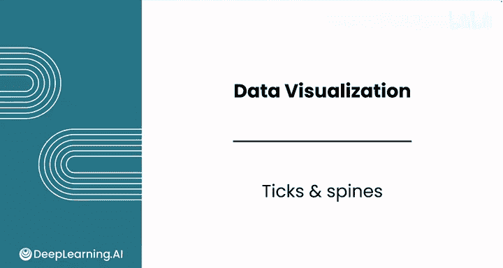

在本节课中，我们将学习如何使用Matplotlib自定义图表的边界，即通常所说的轴。我们将重点学习如何调整刻度标签、添加次要刻度、修改轴线（spines）以及创建更简洁、专业的图表。

---

## 概述：图表的边界与轴线

Matplotlib提供了多种选项来格式化图表的边界，这些选项包括对**刻度**和**轴线**的自定义。上一节我们创建了基础图表，本节中我们来看看如何通过调整这些元素来提升图表的可读性和美观度。

假设你正在处理一个简单的条形图，但对其旋转的X轴标签感到不满意。


你可以使用 `plot.xticks` 函数来调整这些标签。从设置 `rotation=0` 开始，这会让标签恢复水平显示，看起来更清晰。

---

## 保存图表对象以便后续修改

在之前LLM生成的代码中，图表被保存到了一个名为 `ax` 的变量中。这是一种在Matplotlib中非常常见的模式。

**代码示例：**
```python
ax = df.plot(...)  # 将绘图结果保存到变量ax中
```
`ax` 代表“坐标轴”。在Matplotlib中，一个Axes对象本质上就是一个单独的图表。这种策略允许你访问和修改正在处理的图表的特定属性和方法。

运行单元格后，图表会正常显示，但现在你可以更轻松地修改图表的各个方面。

---

## 添加次要刻度以增强可读性

如果你的客户需要从图表中读取更精确的数值，你可能希望在每1000个频率值处添加额外的刻度。

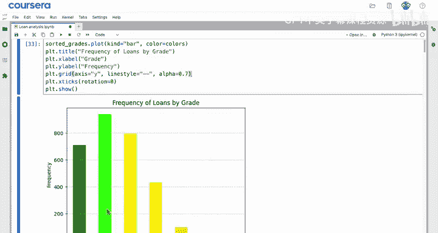

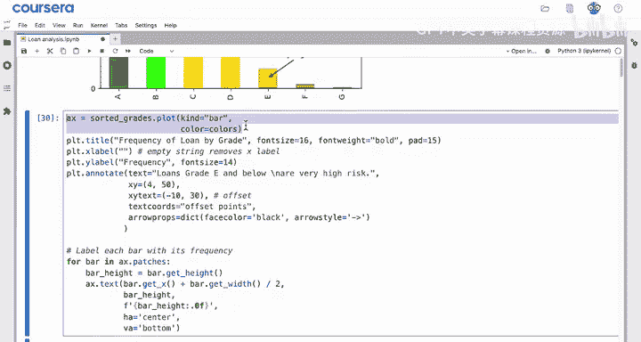

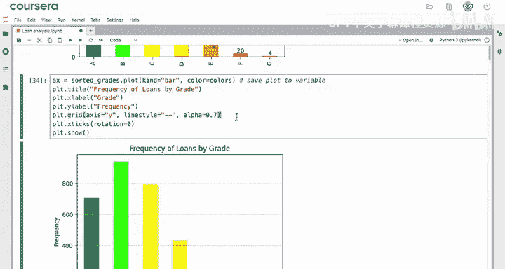

以下是添加次要刻度的步骤：

首先，从 `matplotlib.ticker` 模块导入 `AutoMinorLocator` 工具。这种导入方式只从模块中获取一个特定的项目。

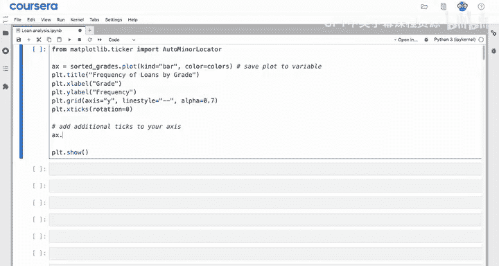

**代码示例：**
```python
from matplotlib.ticker import AutoMinorLocator
```

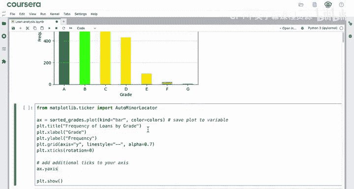

接着，使用你的图表对象 `ax` 来修改Y轴。你可以使用 `ax.yaxis.set_minor_locator()` 这个方法。

**方法解析：**
*   `set_`：表示你正在设置或改变轴上的某些内容，而不仅仅是获取信息。
*   `minor`：指的是次要刻度标记。
*   `locator`：意味着你想要改变信息显示的位置。

在这个方法中，你将使用 `AutoMinorLocator(2)` 作为参数，表示将每个主刻度区间分成两等份。

**完整代码示例：**
```python
ax.yaxis.set_minor_locator(AutoMinorLocator(2))
```

尝试运行它，现在你得到了间距均匀的刻度线，其中较短的线就是次要刻度。


注意，新的次要刻度位置并没有自动生成网格线。如果你想为次要刻度也添加网格线，可以在 `grid` 函数中添加一个新的命名参数 `which='both'`。

**代码示例：**
```python
ax.grid(which='both')
```
这将会同时为主刻度和次要刻度创建网格线。

---

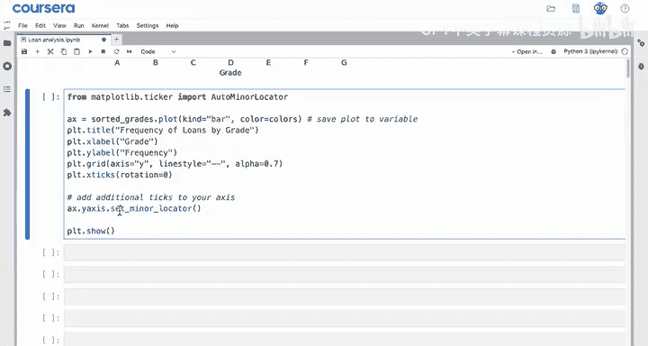

## 寻求帮助：理解代码

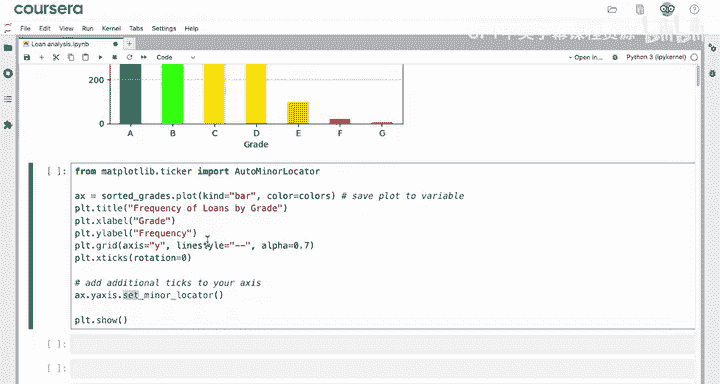

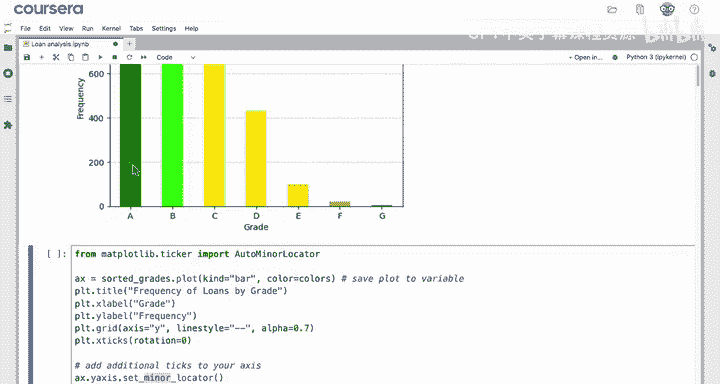

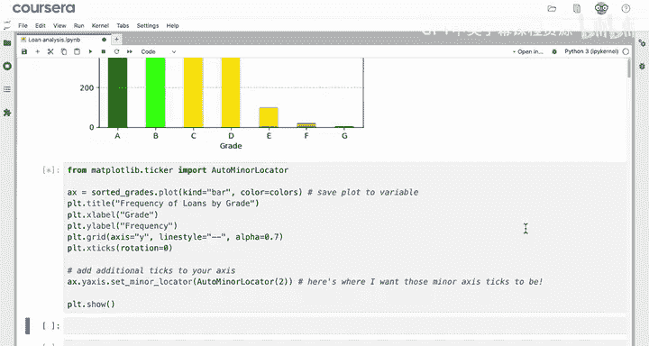

当你遇到新代码时，可以随时向LLM（大型语言模型）寻求帮助来解释它。

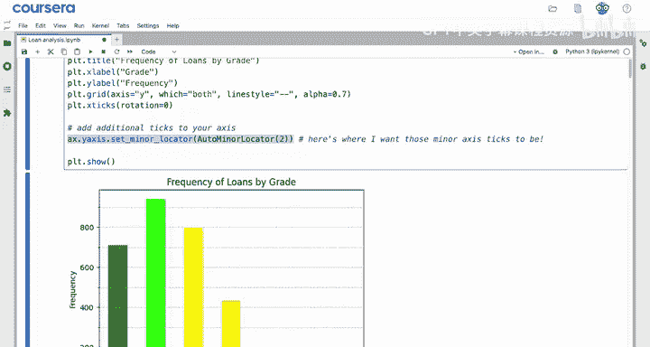

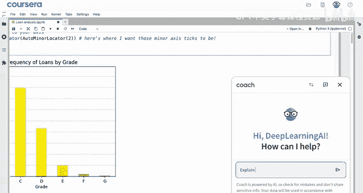

例如，你可以提问：“用简单的语言逐行解释这段代码”，然后粘贴你的代码。LLM会从解释导入语句开始，然后逐一解释代码单元中的每一行。

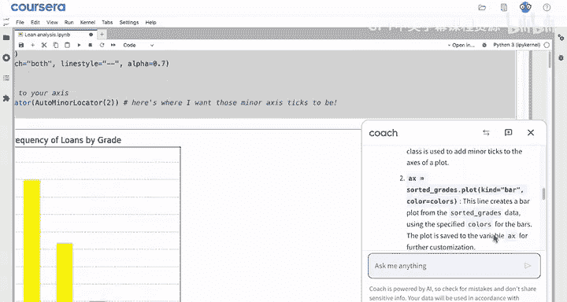


---

## 创建极简主义图表：移除轴线和标签

现在，假设你正在处理一个更简约的图表，你可能想进一步修改它，移除这里的轴线（边界）以及Y轴标签。

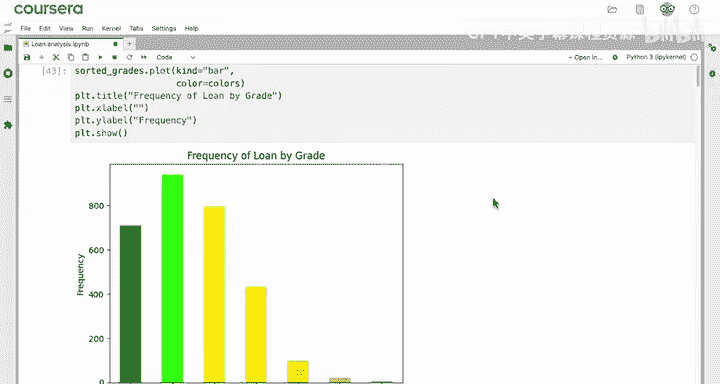

你已经知道如何移除Y轴标签：只需将 `ylabel` 的值设置为空字符串。

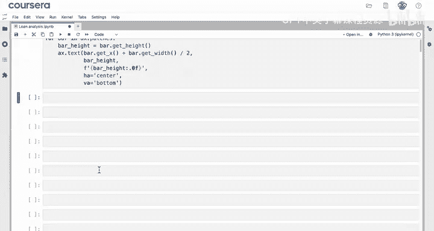

**代码示例：**
```python
ax.set_ylabel('')
```

要移除轴线（spines），请确保你的图表已保存为 `ax` 变量，然后使用 `ax.spines`。`spines` 代表图表的四个边界：`left`、`right`、`top` 和 `bottom`。

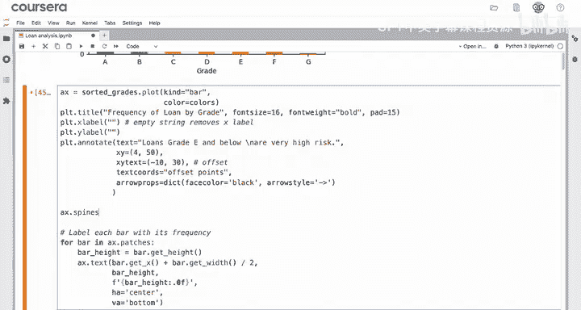

你可以像从数据框中选择列一样选择它们，并使用 `.set_visible(False)` 方法。

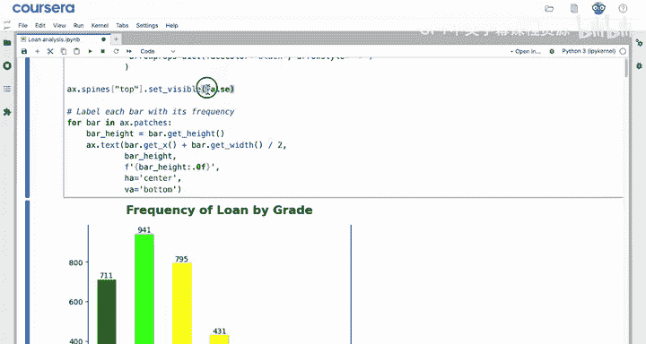

**代码示例：**
```python
ax.spines['top'].set_visible(False)  # 移除顶部轴线
```
运行此命令将移除顶部轴线。你可以对右侧和左侧轴线进行同样的操作。

**代码示例：**
```python
ax.spines['right'].set_visible(False)
ax.spines['left'].set_visible(False)
```

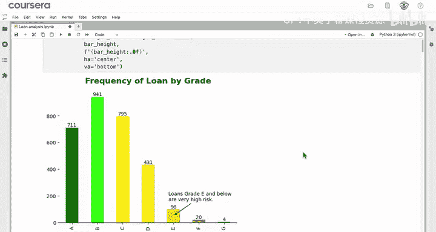

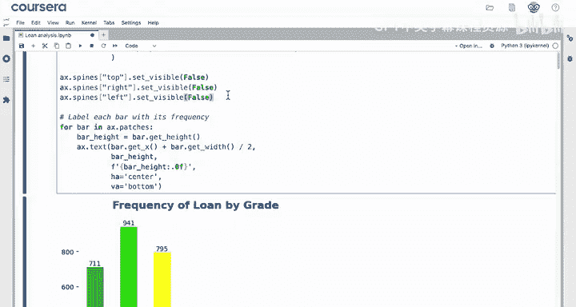

最后，还剩下这些刻度线。要移除它们，可以使用 `ax.yaxis.set_ticks()` 并传入一个空列表作为参数。空列表用一对空的方括号 `[]` 表示。

**代码示例：**
```python
ax.yaxis.set_ticks([])
```

运行这些代码后，你将得到一个非常简洁的图表，有助于向利益相关者清晰地传达重要信息。

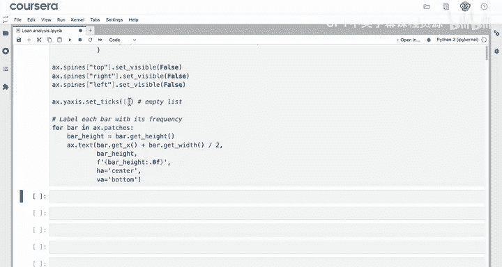

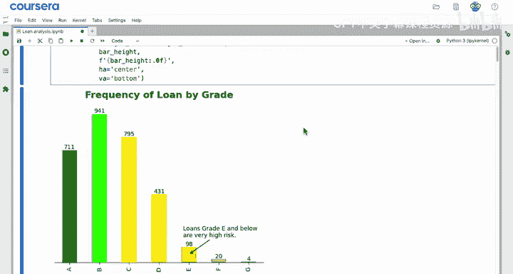


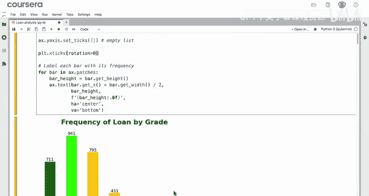

还有一件事，让我们把X轴标签旋转回水平方向。

**代码示例：**
```python
ax.set_xticklabels(ax.get_xticklabels(), rotation=0)
```

---

## 总结

本节课中我们一起学习了如何精细控制Matplotlib图表的边界元素：

1.  你学会了使用 `plot.xticks` 方法来旋转X轴标签。
2.  你学会了如何将绘图方法的结果保存到变量（通常称为 `ax`）中，以便后续修改图表的各个方面。
3.  你可以使用这个 `ax` 变量来访问图表的各个部分，如Y轴或轴线。
4.  你使用了Matplotlib的 `AutoMinorLocator` 工具为图表添加更多刻度，从而增强了图表的可读性。
5.  你学会了如何提示LLM帮助你解释代码，以便更好地理解它。
6.  最后，你使用了诸如 `ax.spines[‘left’].set_visible(False)` 等命令来移除图表的轴线或外边界。

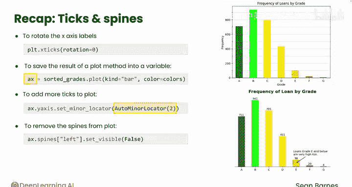

通过这些技巧，你已经能够创建外观更专业、信息更清晰的图表。


你已经学习了许多Matplotlib的功能。为了解锁更复杂的图表，你需要熟悉如何重塑数据，换句话说，即为绘图准备正确的行和列。请跟随下一个视频，学习如何使用分组柱状图来实现这一点。