# 049：分组柱状图教程

在本节课中，我们将学习如何使用Python的Pandas和Matplotlib库创建分组柱状图。分组柱状图允许我们在多个分类变量之间比较一个数值特征。我们将通过一个具体的案例，分析美国三个州（哥伦比亚特区、阿拉斯加和夏威夷）不同信用等级的贷款平均金额，来掌握这一可视化技巧。

## 概述

在探索性数据分析和可视化过程中，创建分组柱状图前需要先对数据进行适当的设置。本教程将引导你完成从数据筛选、分组聚合到最终绘制并美化图表的全过程。

## 数据准备步骤

以下是创建分组柱状图前需要完成的数据准备步骤。

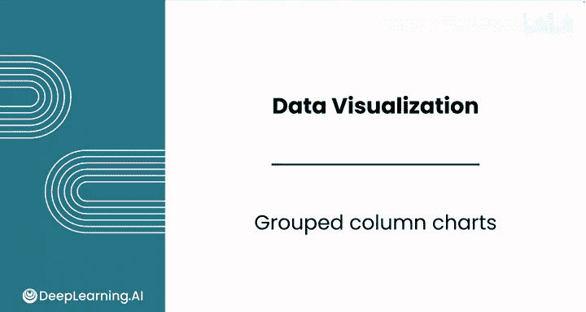

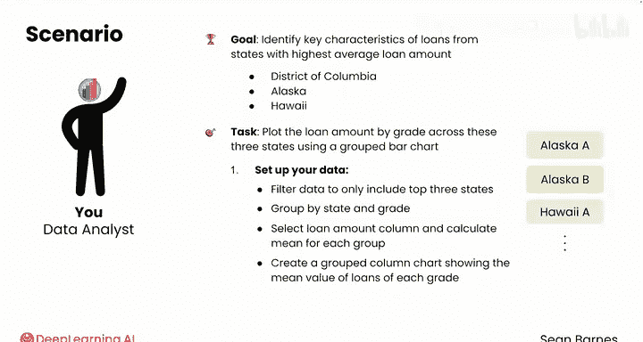

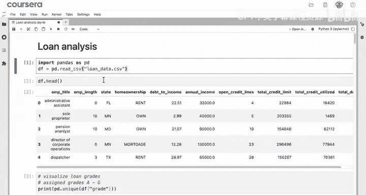

1.  **筛选数据**：首先，我们需要将数据框（DataFrame）筛选到只包含我们感兴趣的三个州。
    ```python
    states_of_interest = ['DC', 'AK', 'HI']
    filtered_df = df[df['state'].isin(states_of_interest)]
    ```

2.  **分组聚合**：接下来，我们需要按“州”（state）和“信用等级”（grade）对数据进行分组，并计算每个分组的“贷款金额”（loan amount）的平均值。
    ```python
    grouped_data = filtered_df.groupby(['state', 'grade'])['loan_amnt'].mean()
    ```
    执行此操作后，我们会得到一个具有**多级索引**的Series。

3.  **数据重塑**：为了正确绘制分组柱状图，我们需要使用`.unstack()`方法将多级索引的第二层（grade）转换为列。
    ```python
    unstacked_data = grouped_data.unstack()
    ```
    现在，数据框的索引是“州”，列是各个“信用等级”，单元格值是对应的平均贷款金额。

## 绘制基础图表

数据准备就绪后，我们可以开始绘制基础的分组柱状图。

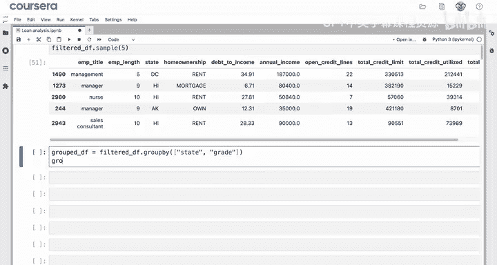

```python
unstacked_data.plot(kind='bar')
plt.show()
```

然而，直接绘制的图表在可读性上存在不足，例如图例位置不当、坐标轴标签不清晰等。

## 美化图表

上一节我们绘制了基础图表，本节中我们来看看如何通过添加标题、调整图例和坐标轴来美化它，使其更具可读性和专业性。

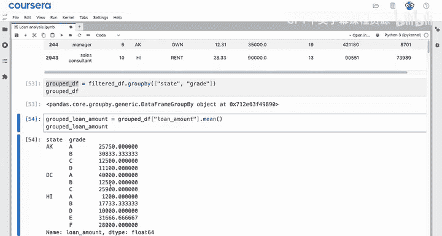

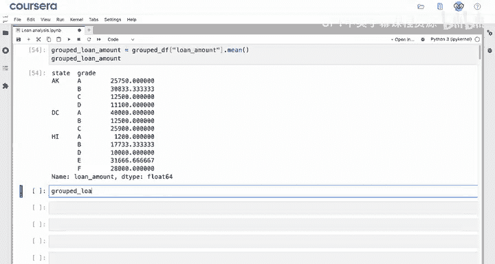

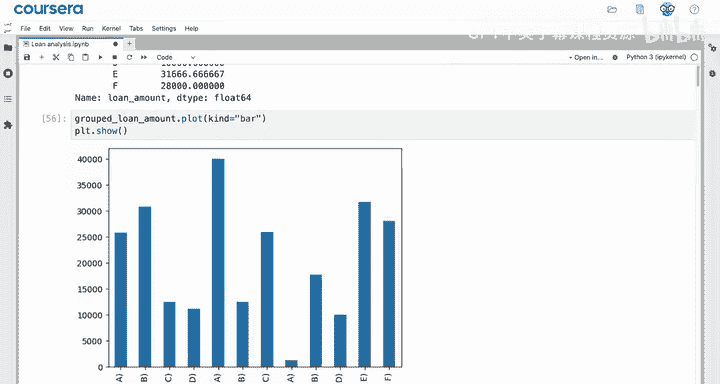

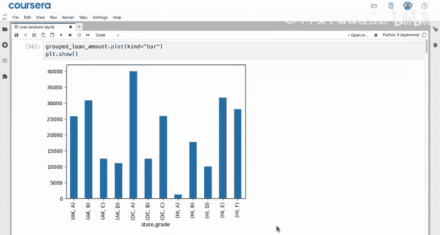

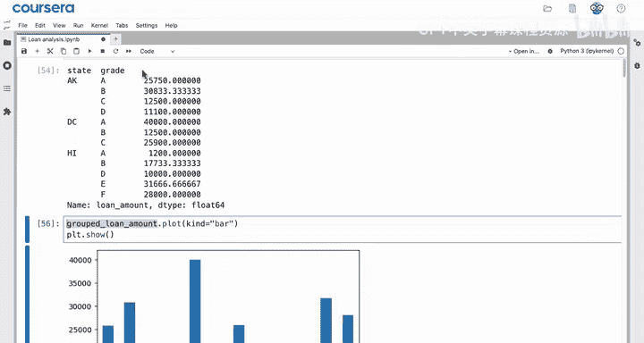

以下是美化图表的关键步骤：

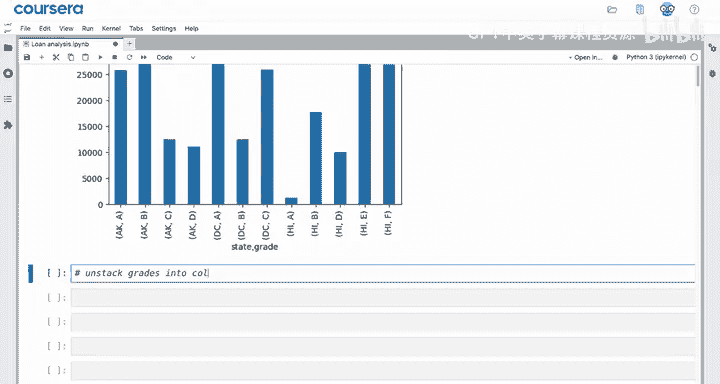

*   **添加标题和坐标轴标签**：使用`plt.title()`、`plt.xlabel()`和`plt.ylabel()`函数。
*   **旋转X轴刻度标签**：使用`plt.xticks(rotation=0)`使标签水平显示。
*   **调整图例位置**：使用`plt.legend(bbox_to_anchor=(1.05, 1))`将图例移动到图表右外侧，避免遮挡数据。
*   **应用网格和颜色**：使用`plt.grid(True)`添加网格线，并使用合适的配色方案。

让我们将这些改进应用到图表上：

```python
# 绘制分组柱状图
ax = unstacked_data.plot(kind='bar')

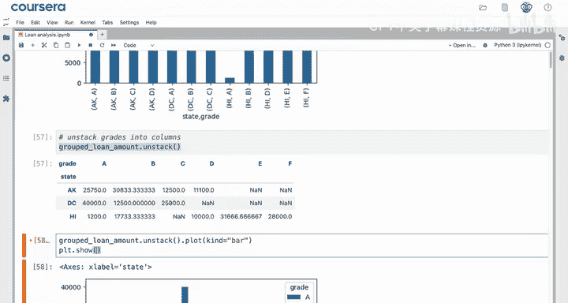

# 设置图表标题和坐标轴标签
plt.title('各州不同信用等级的平均贷款金额')
plt.xlabel('州')
plt.ylabel('平均贷款金额')

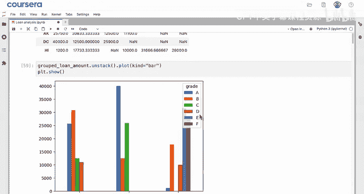

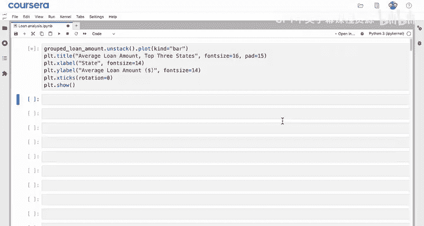

# 旋转X轴刻度标签为水平
plt.xticks(rotation=0)

# 将图例移动到图表右外侧
plt.legend(title='信用等级', bbox_to_anchor=(1.05, 1))

# 添加网格线
plt.grid(True, axis='y', linestyle='--', alpha=0.7)

# 显示图表
plt.tight_layout()
plt.show()
```

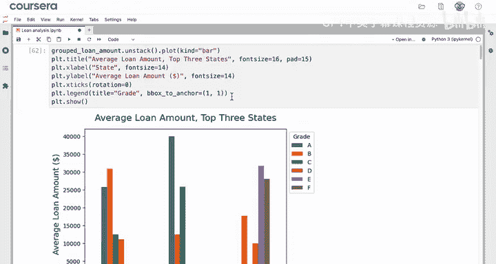

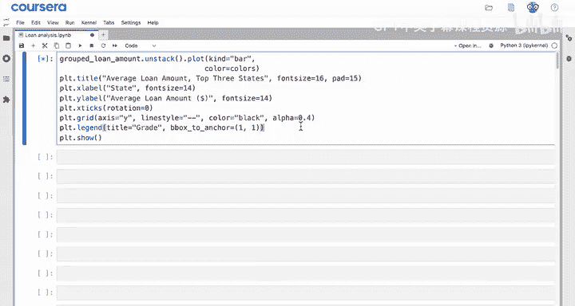

## 结果解读与保存

完成图表美化后，我们可以对可视化结果进行解读。

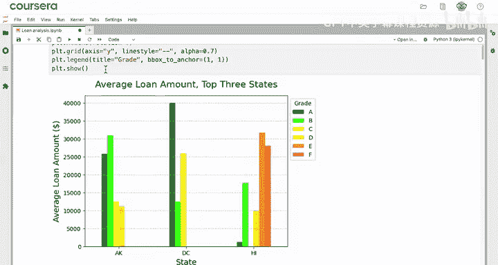

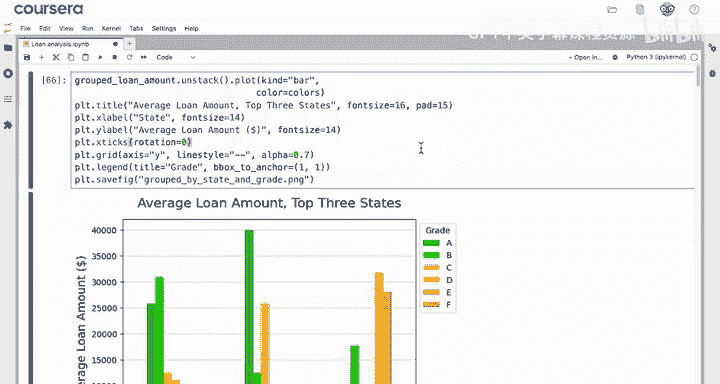

从生成的分组柱状图中，我们可以观察到一些有趣的模式：夏威夷（HI）的贷款模式与阿拉斯加（AK）和哥伦比亚特区（DC）明显不同。阿拉斯加和哥伦比亚特区主要以低风险（A级）贷款为主，而夏威夷则有大额但风险较高（如C、D级）的贷款。此外，哥伦比亚特区的A级贷款平均金额很高，这可能为你的客户提供了一个有利可图的策略线索。

最后，你可以使用`plt.savefig()`函数将图表保存为图片文件，以便将其包含在给客户的报告中。

```python
plt.savefig('grouped_bar_chart.png', dpi=300, bbox_inches='tight')
```

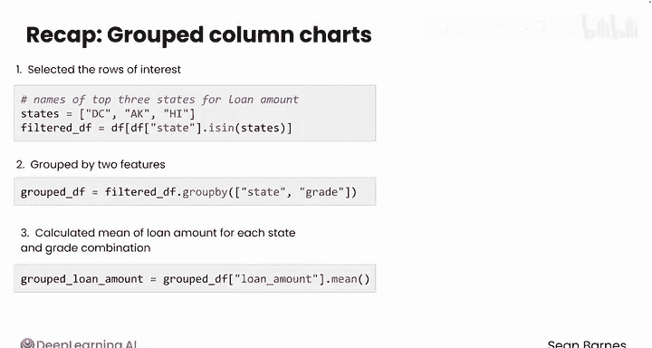

## 总结

本节课中我们一起学习了创建分组柱状图的完整流程。

1.  **核心步骤**：我们首先筛选了目标数据，然后按两个分类变量（州和信用等级）进行分组并计算均值，得到了一个具有多级索引的Series。
2.  **关键操作**：为了正确绘图，我们使用了`.unstack()`方法将多级索引的第二层转换为数据框的列，从而完成了数据重塑。
3.  **可视化与美化**：我们使用`.plot(kind=‘bar’)`绘制了基础图表，并通过添加标题、调整图例位置、设置坐标轴标签和网格线等方法美化了图表，使其更加清晰易懂。
4.  **公式/代码核心**：整个过程的核心代码链可以概括为：`df[筛选].groupby([列1， 列2])[数值列].mean().unstack().plot(kind=‘bar’)`。

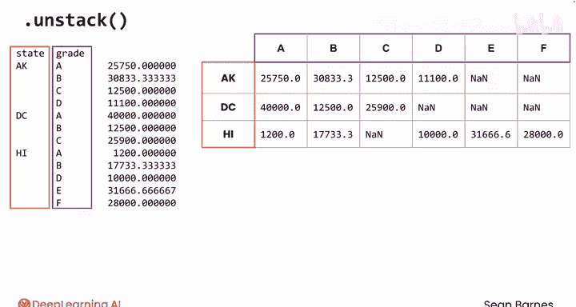

分组柱状图是进行多维度对比的强大工具。掌握了它的创建方法后，学习堆叠柱状图将不再复杂，因为它们所需的数据准备工作是相似的。