# 050：Python数据分析（第3课）｜堆叠柱状图

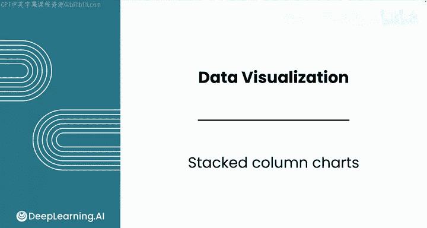

在本节课中，我们将学习如何创建堆叠柱状图。堆叠柱状图非常适合展示不同类别数据在总量中的构成比例。我们将从数据准备开始，逐步完成图表的创建与美化，并最终生成可用于报告的图表。

## 数据准备

上一节我们介绍了分组柱状图，本节中我们来看看堆叠柱状图。与分组柱状图类似，大部分工作在于数据准备。

假设我们想探索不同信用等级（grade）和房屋所有权状态（home ownership）下的贷款总额。这个分析有助于理解贷款风险状况是否会影响房屋所有权构成的差异。我们特别希望突出每个信用等级中租房者（RENT）的比例。

堆叠柱状图是理想的选择，因为它可以比较每个信用等级内部贷款金额的构成。

以下是创建堆叠柱状图所需的数据准备步骤：

1.  导入必要的模块并读取数据。
2.  按“grade”和“home_ownership”对数据进行分组。
3.  选择“loan_amnt”列进行汇总。
4.  使用`sum`方法计算每个分组内的贷款总额。
5.  使用`unstack`方法将数据重塑为适合绘制的格式。

```python
import pandas as pd
import matplotlib.pyplot as plt

# 读取数据
df = pd.read_csv('your_data.csv')

# 数据分组、聚合与重塑
stack_data = df.groupby(['grade', 'home_ownership'])['loan_amnt'].sum().unstack()
```

## 创建基础堆叠柱状图

数据准备完成后，创建堆叠柱状图就非常简单了。我们使用`plot`方法，并设置参数`kind='bar'`和`stacked=True`。

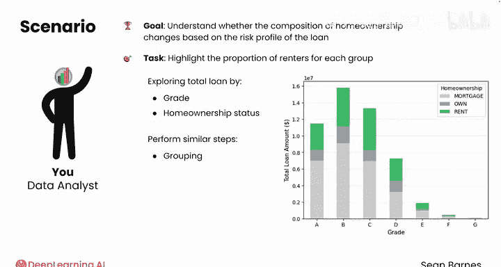

```python
# 创建堆叠柱状图
stack_data.plot(kind='bar', stacked=True)
plt.show()
```

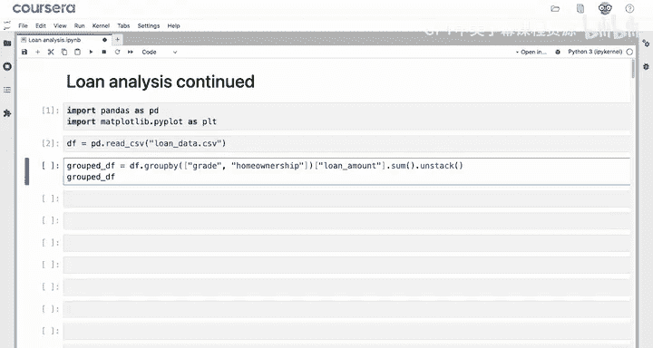

运行代码后，你将得到一个清晰的堆叠柱状图。从图中可以看出，“OWN”类别的占比最小，大多数客户拥有抵押贷款（MORTGAGE）。

## 美化图表

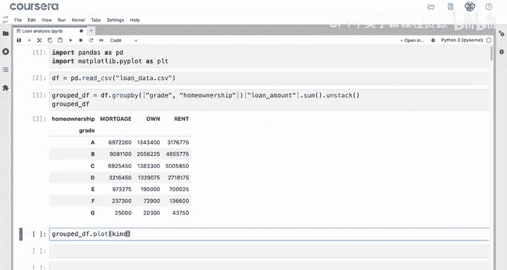

基础的图表已经能传达信息，但我们可以进一步修改它以提升可读性。

以下是美化图表的几个选项：

*   **添加标题和轴标签**：使图表意图更明确。
*   **为不同类别设置颜色**：突出显示“RENT”类别。
*   **调整X轴刻度标签旋转角度**：避免重叠。
*   **为Y轴添加网格线**：便于读取数值。
*   **修改图例标题**：使其更规范（如首字母大写）。

```python
# 美化堆叠柱状图
ax = stack_data.plot(kind='bar', stacked=True, color=['#1f77b4', '#ff7f0e', '#2ca02c'])

# 设置标题和标签
ax.set_title('贷款总额构成（按信用等级与房屋所有权）')
ax.set_xlabel('信用等级 (Grade)')
ax.set_ylabel('贷款总额 (Loan Amount)')

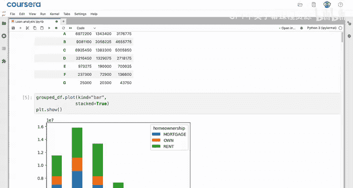

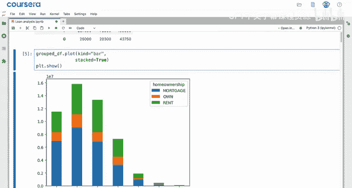

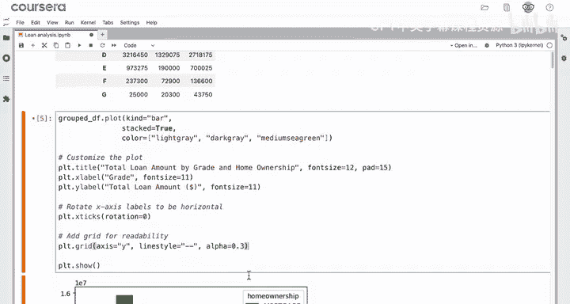

# 调整X轴标签
ax.set_xticklabels(ax.get_xticklabels(), rotation=0)

# 添加网格线
ax.yaxis.grid(True, linestyle='--', alpha=0.7)

# 修改图例标题
ax.legend(title='房屋所有权', loc='upper left')

plt.tight_layout()
plt.show()
```

## 创建百分比堆叠柱状图

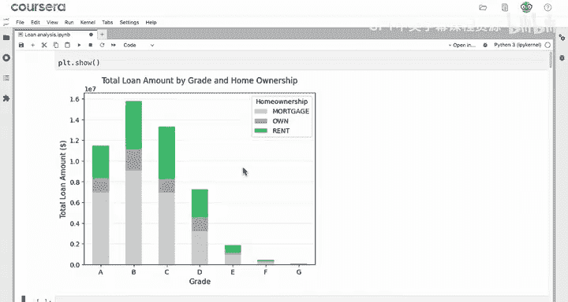

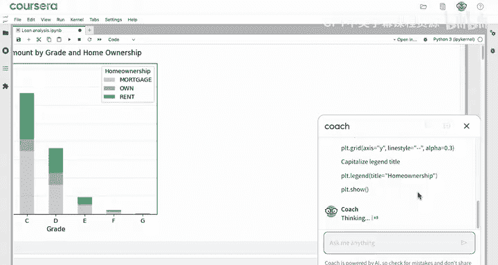

为了进行更直接的跨类别比较，我们可以创建百分比堆叠柱状图。在这种图表中，每个柱子的高度相同（100%），直观显示了各部分在组内的占比。

创建百分比堆叠柱状图需要进行数据标准化处理。我们可以借助大语言模型（LLM）来生成相关代码。

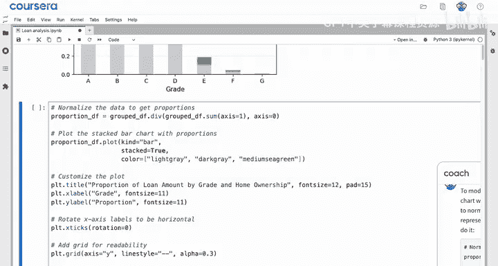

```python
# 计算每个信用等级下各类别的百分比
percentage_data = stack_data.div(stack_data.sum(axis=1), axis=0) * 100

# 创建百分比堆叠柱状图
ax = percentage_data.plot(kind='bar', stacked=True, color=['#1f77b4', '#ff7f0e', '#2ca02c'])

ax.set_title('贷款总额构成百分比（按信用等级）')
ax.set_xlabel('信用等级 (Grade)')
ax.set_ylabel('构成比例 (%)')
ax.set_xticklabels(ax.get_xticklabels(), rotation=0)
ax.yaxis.grid(True, linestyle='--', alpha=0.7)

# 将图例移到图表外部
ax.legend(title='房屋所有权', bbox_to_anchor=(1.05, 1), loc='upper left')

plt.tight_layout()
plt.show()
```

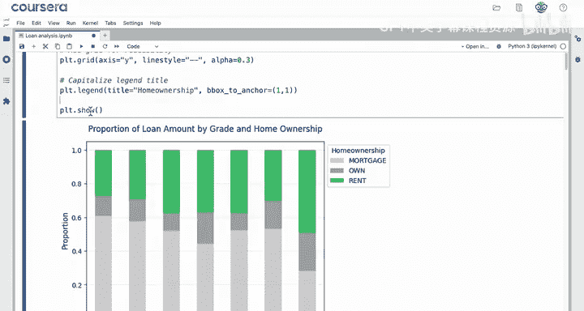

从生成的百分比堆叠图中，你可能会注意到租房者（RENT）的比例在A、B等级中相对稳定，但在C和E等级中有所增加。这可以为你的客户提供关于不同等级贷款客户可能拥有的抵押品类型的洞察。

## 保存图表

最后，将制作好的图表保存为图片文件，以便插入到报告中。

```python
# 保存图表为PNG格式
plt.savefig('stacked_bar_chart.png', dpi=300, bbox_inches='tight')
```

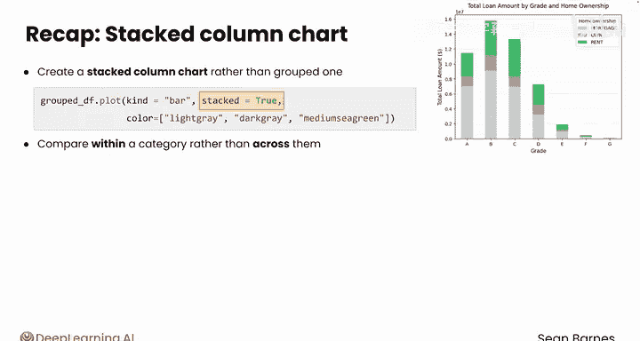

## 课程总结

本节课中我们一起学习了堆叠柱状图的创建与应用。

*   我们了解到，在`plot`方法中设置参数`stacked=True`即可创建堆叠柱状图而非分组柱状图。当我们的目标是比较类别内部的构成而非跨类别比较时，这种图表非常有用。
*   我们完成了从数据分组、聚合到绘制和美化堆叠柱状图的完整流程。
*   我们还借助大语言模型创建了百分比堆叠柱状图，这使得跨不同类别的比较变得更加容易。

现在，通过对柱状图的深入学习，你已经掌握了在Python中创建美观且功能强大的可视化图表所需的大部分工具。然而，我们还需要掌握散点图、箱线图和直方图，它们各自都有独特的选项和用途。请跟随我进入下一个视频，学习如何创建散点图。