# 051：使用Matplotlib绘制散点图 📊

在本节课中，我们将学习如何使用Matplotlib库创建高度定制化的散点图，以探索数据集中特征之间的关系。我们将从基础绘图开始，逐步添加标题、坐标轴标签，并学习如何调整标记样式、透明度以及设置坐标轴范围。最后，我们还会学习如何在图表中添加参考线来突出显示特定数据部分。

---

## 创建基础散点图

上一节我们介绍了数据分析的背景，本节中我们来看看如何创建散点图。假设你已经研究了数据集中多个特征之间的相关性，并发现年收入与总信用额度之间存在中等程度的正相关关系（皮尔逊相关系数为0.55）。为了帮助客户理解其客户的收入分布如何影响应提供的信用额度，散点图是一个合适的图表类型，因为它可以可视化两个数值特征之间的关系。

以下是创建基础散点图的步骤：

1.  导入必要的模块并读取数据。
2.  使用 `plt.scatter()` 函数，并传入两个参数：`df['annual_income']` 和 `df['total_credit_limit']`。
3.  调用 `plt.show()` 来显示图表。

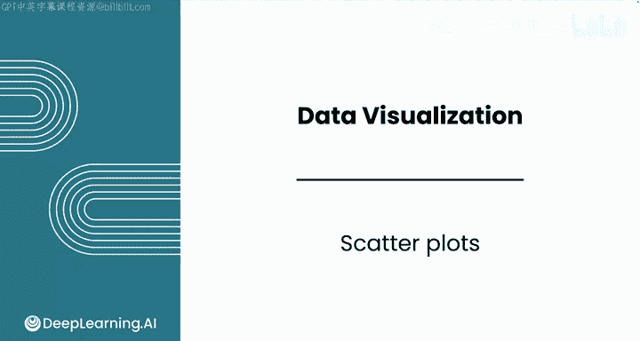

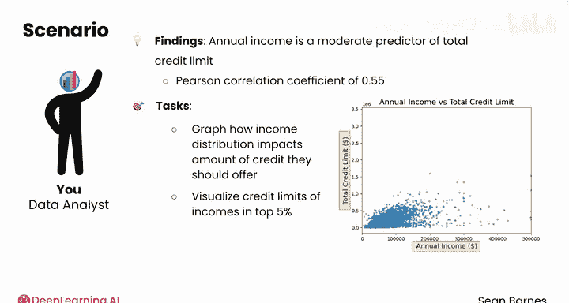

```python
import matplotlib.pyplot as plt
import pandas as pd

# 假设df是包含数据的DataFrame
plt.scatter(df['annual_income'], df['total_credit_limit'])
plt.show()
```

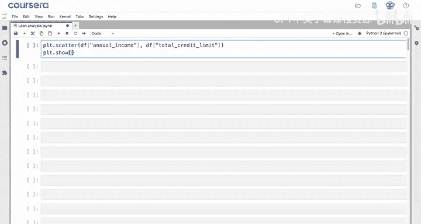

执行上述代码后，你将看到一个基础散点图，它展示了年收入与总信用额度之间的关系。

---

## 增强图表可读性

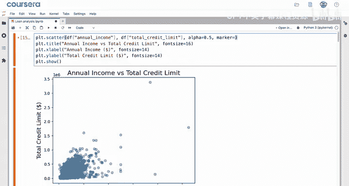

基础图表通常需要增强可读性。我们可以添加标题和坐标轴标签，让图表传达的信息更清晰。

以下是增强图表可读性的方法：


*   使用 `plt.title()` 添加图表标题。
*   使用 `plt.xlabel()` 和 `plt.ylabel()` 添加X轴和Y轴标签。

```python
plt.scatter(df['annual_income'], df['total_credit_limit'])
plt.title('年收入 vs. 总信用额度')
plt.xlabel('年收入')
plt.ylabel('总信用额度')
plt.show()
```

---

## 自定义散点标记

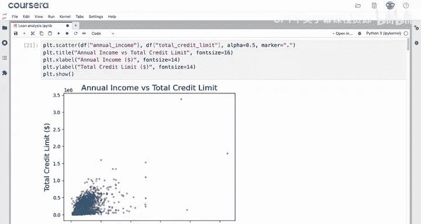

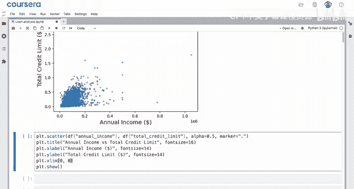

对于像本例这样包含超过3000个数据点的密集图表，我们可以通过调整标记的透明度和样式来改善可视化效果。

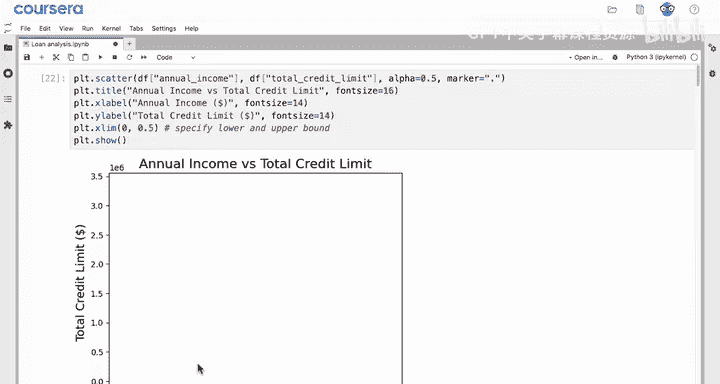

以下是自定义散点标记的选项：

*   **透明度 (`alpha`)**：设置为0.5可以让你更清楚地看到数据点更密集的区域。
*   **标记样式 (`marker`)**：默认是圆形 (`‘o’`)。你可以使用 `‘^’` 表示三角形，`‘.’` 表示点，或者 `‘8’` 表示八边形（仅用于示例，可能不清晰）。

```python
# 使用三角形标记并设置透明度
plt.scatter(df['annual_income'], df['total_credit_limit'], alpha=0.5, marker='^')
plt.title('年收入 vs. 总信用额度 (三角形标记)')
plt.xlabel('年收入')
plt.ylabel('总信用额度')
plt.show()
```

---

## 调整坐标轴范围（缩放）

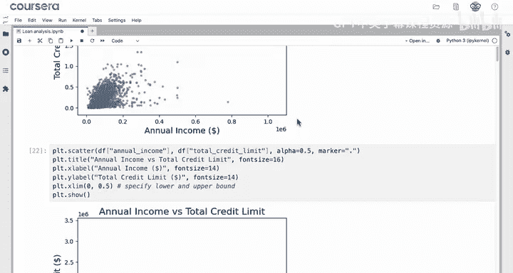

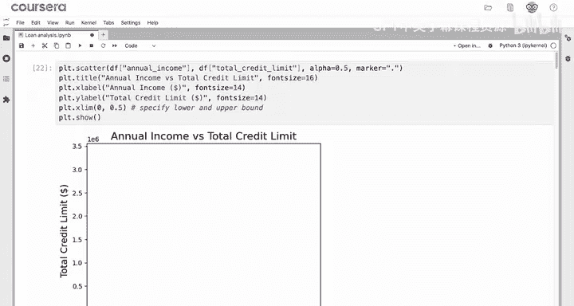

观察图表，你会发现大部分数据点集中在左下角，只有少数异常值分布在远处。为了更清晰地观察主要数据集群，我们可以调整坐标轴的范围。

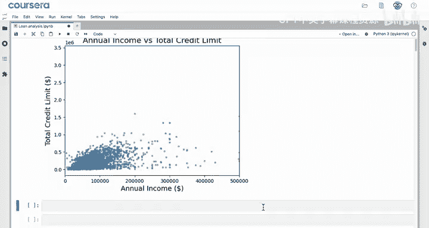

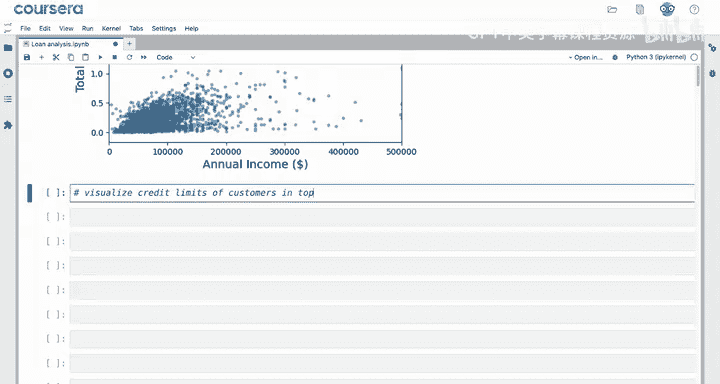

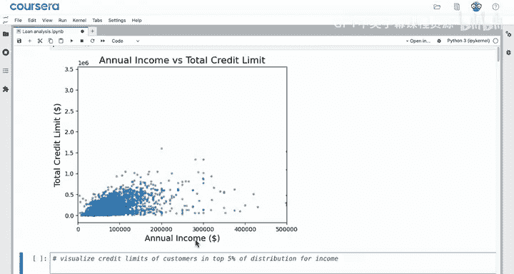

使用 `plt.xlim()` 和 `plt.ylim()` 函数可以设置X轴和Y轴的显示范围，这相当于对图表的特定区域进行缩放。

**重要提示**：在设置范围时，务必注意数据的实际单位。例如，如果X轴标签显示为 `1e6`（科学计数法，表示1,000,000），那么设置 `plt.xlim(0, 0.5)` 实际上是在查看0到0.5美元之间的数据，这会导致图表空白。正确的做法是理解数据单位后设置合适的范围。

```python
# 假设我们想查看年收入在0到50万美元之间的数据
plt.scatter(df['annual_income'], df['total_credit_limit'], alpha=0.5)
plt.xlim(0, 500000)  # 设置X轴范围
plt.title('年收入 vs. 总信用额度 (缩放视图)')
plt.xlabel('年收入')
plt.ylabel('总信用额度')
plt.show()
```

---

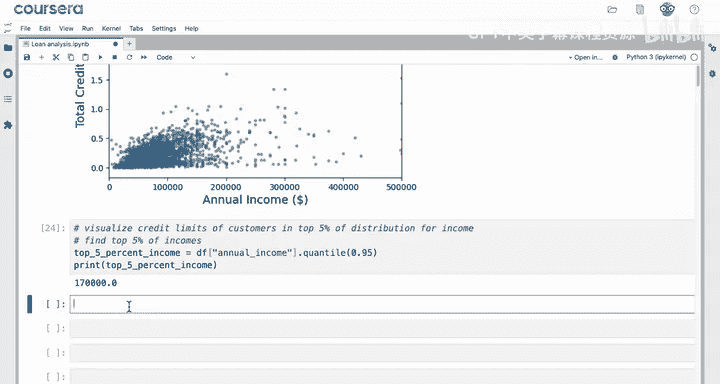

## 添加参考线

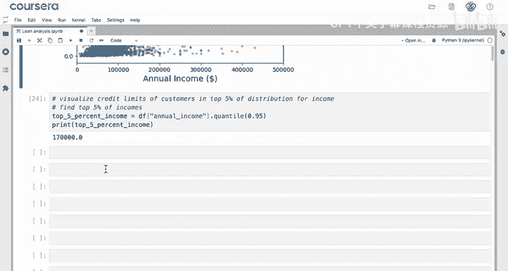

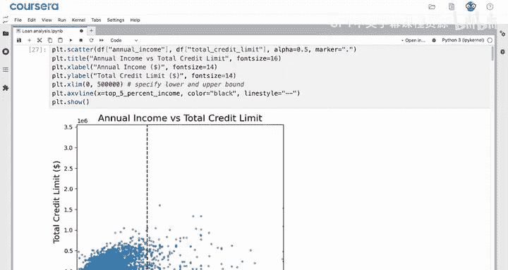

假设我们特别关注收入分布中前5%的客户。我们可以在散点图上添加一条垂直参考线，直观地将这部分客户与其他客户区分开来。

以下是添加垂直参考线的步骤：

1.  计算数据集中年收入列的95%分位数，这个值代表了前5%收入的起始点。
2.  使用 `plt.axvline()` 函数在计算出的值处绘制一条垂直线。
3.  可以通过参数（如 `color=’black’`, `linestyle=’—‘`）自定义线条的样式。

```python
# 计算年收入的前5%分界点
top_5_percent_income = df['annual_income'].quantile(0.95)

plt.scatter(df['annual_income'], df['total_credit_limit'], alpha=0.5)
plt.axvline(x=top_5_percent_income, color='black', linestyle='--', label='前5%收入分界线')
plt.title('年收入 vs. 总信用额度 (含前5%分界线)')
plt.xlabel('年收入')
plt.ylabel('总信用额度')
plt.legend()
plt.show()
```

**补充**：如果你想添加一条水平参考线，可以使用 `plt.axhline()` 函数。

---

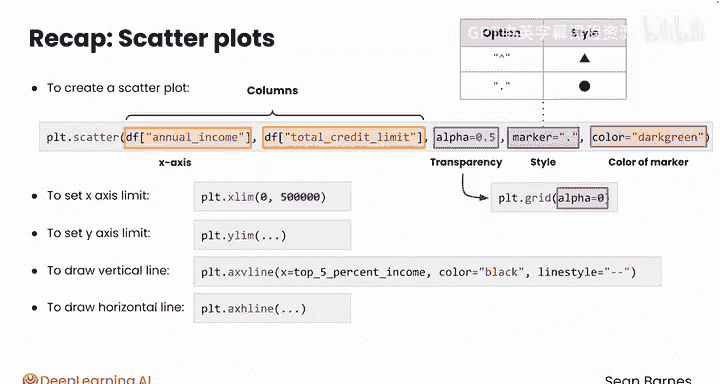

## 总结

本节课中我们一起学习了如何使用Matplotlib创建和定制散点图。我们首先使用 `plt.scatter()` 函数创建了基础图表，然后通过添加标题和坐标轴标签增强了可读性。接着，我们探索了如何通过 `alpha` 参数控制标记透明度，以及通过 `marker` 参数改变标记样式。为了聚焦于主要数据，我们学习了使用 `plt.xlim()` 和 `plt.ylim()` 来调整坐标轴范围。最后，我们使用 `plt.axvline()` 在图表中添加了垂直参考线来突出显示特定数据分区（对应的水平线函数是 `plt.axhline()`）。

由于散点图涉及大量的定制化和数据操作，创建高质量的散点图通常需要编写多行代码，但最终的成果是值得的。