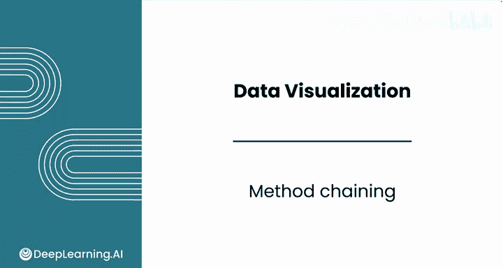
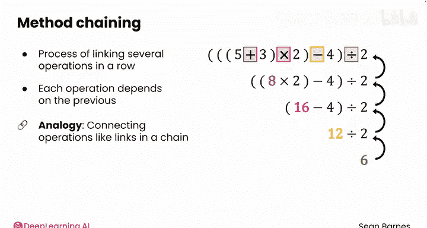
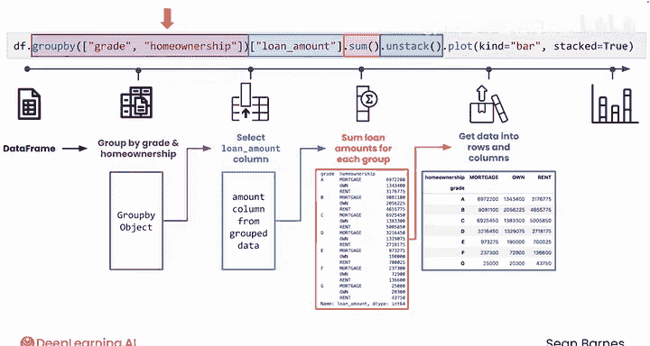
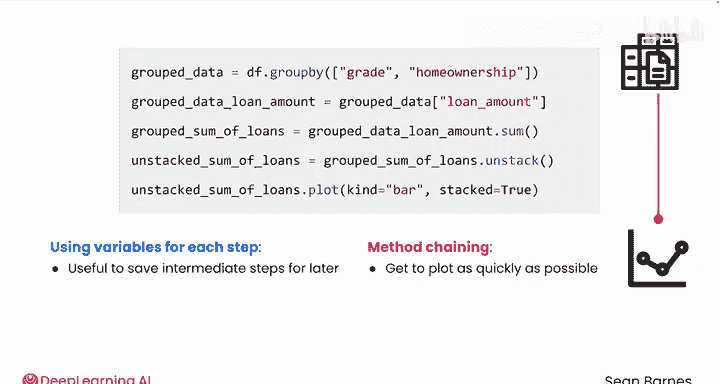

# 052：方法链式调用 🔗



在本节课中，我们将要学习一个在Python数据分析中非常常见且高效的编程技巧——方法链式调用。我们将通过类比数学运算和分解代码步骤，来理解如何将多个操作串联起来，以及这种方式的优缺点。

---

在之前的几节视频中，你看到了一些涉及连续调用多个方法的长代码行。


随着你继续使用Python，你会经常看到这种被称为“方法链式调用”的策略。

为了理解链式调用，我们先来看一个数学表达式，你会如何计算它？

`(5 + 3) * 2 - 4 / 2`



你需要完成四个运算。你必须先解决加法运算，然后才能进行其他操作。所以，5加3等于8。你简化了这个表达式，现在可以继续乘法运算：8乘以2等于16。同样，你又解决了一个复杂度层级，现在可以减去4得到12，再除以2得到最终结果6。

在代码中，这种将多个操作串联起来的过程，其中每个操作都依赖于前一个操作的结果，就称为**方法链式调用**。之所以称为“链式”，是因为你将操作像链条中的环节一样连接起来，每一环都依赖于前一环。


上一节我们介绍了链式调用的基本概念，本节中我们来看看一个具体的代码示例。

让我们一起来分解这行你在之前关于堆叠条形图的视频中看到的代码。当你阅读和理解这行代码时，请从左到右思考，并尝试关注数据类型。

```python
df.groupby(['grade', 'home_ownership'])['loan_amnt'].sum().unstack().plot(kind='bar', stacked=True)
```

这行代码的全部目的是获取一些数据，对其执行一系列命令，并最终得到某种结果——在本例中是一个可视化图表。你从最左边的数据类型（一个数据框`df`）开始，以最右边命令的输出（一个图表`plot`）结束。

这行代码包含四个步骤，每一步都需要在进入下一步之前完成。

以下是每个步骤的详细分解：

**第一步：按指定列分组**
输入是数据框`df`和要分组的列名列表`[‘grade‘, ‘home_ownership‘]`。
输出是一个`GroupBy`对象，其结构类似于按`grade`和`home_ownership`分组后的数据框。例如，有5个等级和3种房屋所有权类别，总共形成15个组。

**第二步：选择特定列**
输入是上一步的`GroupBy`对象。
输出是一个`GroupBy Series`，即仅包含`loan_amnt`列并按那两个列分组的数据。此时你仍然看不到这个数据结构，直到你对其进行聚合。

**第三步：对每个组进行聚合计算**
输入是上一步的`GroupBy Series`。
输出是一个`Series`。这个`Series`有15行，并使用一个多级索引（`MultiIndex`）——由一对值作为索引。对于每个多级索引值，你都有该组所有贷款的总金额。

**第四步：重塑数据格式**
使用`.unstack()`方法将数据转换为行和列的形式，而不是多级索引。
输入是上一步带有多级索引的求和`Series`。
输出是转换为行列表格形式的求和结果。

**第五步：创建可视化图表**
输入是上一步的`Series`。
输出是一个可以显示的堆叠条形图。

每一步都接收上一步的数据并对其进行进一步转换。

---

上一节我们分解了链式调用的步骤，本节中我们来看看实现同一目标的另一种写法。

你也可以使用变量来分步编写这段代码：

```python
grouped_data = df.groupby(['grade', 'home_ownership'])
grouped_loan_amount = grouped_data['loan_amnt']
sum_of_loans = grouped_loan_amount.sum()
unstacked_sums = sum_of_loans.unstack()
unstacked_sums.plot(kind='bar', stacked=True)
```

如果你需要为后续步骤保存这些中间结果，所有这些变量都可能有用。例如，你可能想计算每个组的贷款金额的中位数和标准差。




但并非每次都需要保存这些中间步骤。

---

我们可以将方法链式调用比作乘坐**特快列车**。在这种情况下，从数据框`df`直达图表`plot`。你买票（写代码），在数据框站上车，直接到达目的地——图表站。如果你只是想尽快得到图表，这很棒。但这种方法灵活性较低，因为如果你后来意识到想在中间站下车（使用中间结果），你将无法做到。

而使用变量的方法更像是**每站都停的慢车**。它更灵活，但耗时更长。你可以在任何需要的站点下车，例如，如果你想计算每个组贷款金额的中位数和标准差。但如果你不需要在任何地方停留，方法链式调用可以快速完成任务。

链式方法起初可能难以阅读，但你用得越多，就越能理解它们。它们可以使你的编码快速高效，尤其是在你不需要存储中间结果的情况下。

---

本节课中我们一起学习了方法链式调用。我们通过类比数学运算理解了其核心思想，即像链条一样连接依赖的操作。我们分解了一个实际代码示例，了解了每一步的数据转换过程。最后，我们对比了链式调用（特快列车）与分步变量赋值（慢车）的优缺点：前者高效直接，后者灵活可控。

掌握这一技巧将帮助你编写更简洁、更高效的数据分析代码。




接下来，请完成本课的练习作业和实践实验室。

完成后，欢迎进入下一课，学习使用流行的Python库Seaborn创建更美观的可视化图表和分布图。