# 053：Python数据分析（第3课）｜Python for Data Analytics
## 课程编号：P53 - Seaborn可视化 📊

在本节课中，我们将要学习一个强大的数据可视化工具——Seaborn。我们将了解它的主要优势，并通过与Matplotlib的对比，掌握如何使用Seaborn快速创建美观且信息丰富的图表。

---

### 概述

到目前为止，你已经接触了多种图表，并学习了如何使用Matplotlib为这些图表进行自定义设置。现在，你需要学习另一个数据可视化工具：Seaborn。Seaborn是一个可以导入到代码中的可视化工具，它与Matplotlib配合良好。它的主要优势在于提升视觉吸引力、简化数据分组与汇总操作，以及提供Matplotlib中没有的额外图表类型。

### Seaborn的优势

上一节我们介绍了Seaborn的基本概念，本节中我们来看看它的具体优势。Seaborn在以下两个方面特别出色：

1.  **提升视觉吸引力**：Seaborn的默认样式比Matplotlib更美观。
2.  **简化数据操作**：它内置了数据分组和汇总功能，无需手动预处理。
3.  **提供额外图表类型**：它包含一些Matplotlib中没有的、更高级的图表。

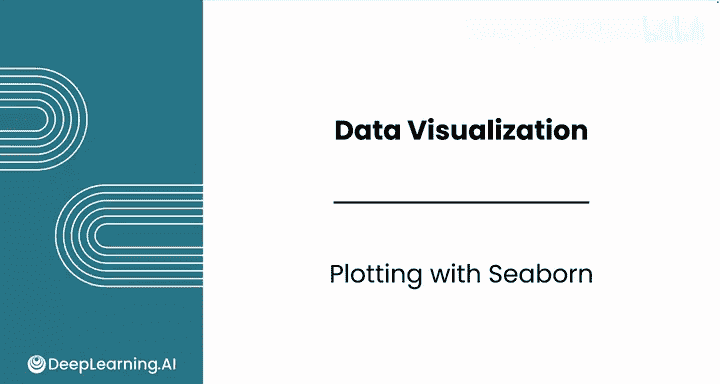

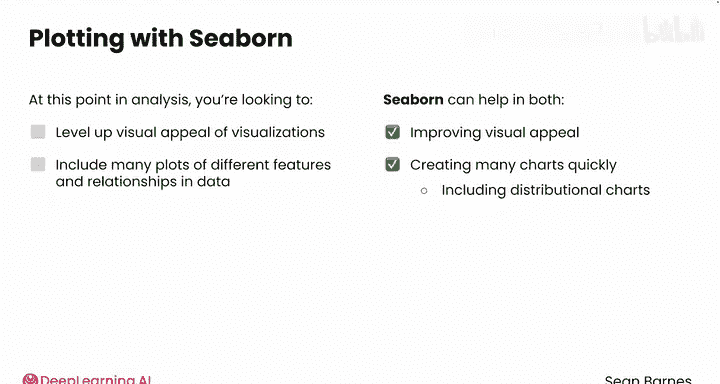

### 对比：Matplotlib vs. Seaborn

为了直观感受Seaborn的强大，让我们比较一下在Matplotlib和Seaborn中创建分组条形图的差异。

首先，在一个新的笔记本中导入所有必要的模块：

```python
import pandas as pd
import matplotlib.pyplot as plt
import seaborn as sns  # Seaborn的常用昵称
import numpy as np
```

然后，读取数据并筛选出我们感兴趣的三个州的数据：

```python
df = pd.read_csv('your_data.csv')
filtered_df = df[df['state'].isin(['CA', 'NY', 'TX'])]
```

**使用Matplotlib创建分组条形图**，需要大量数据操作：

```python
# 需要手动分组、聚合和调整数据格式
grouped = filtered_df.groupby(['state', 'grade'])['loan_amnt'].mean().unstack()
grouped.plot(kind='bar')
plt.show()
```

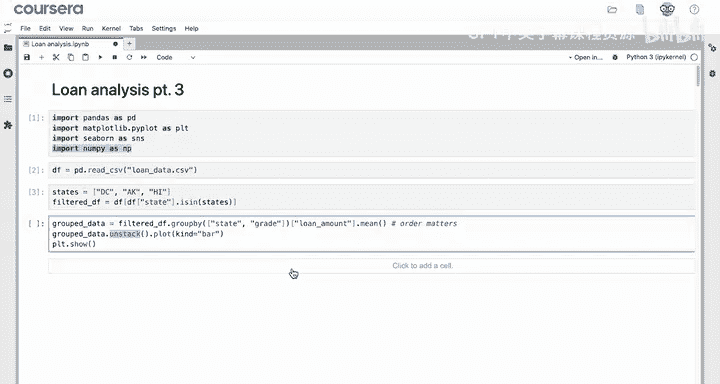

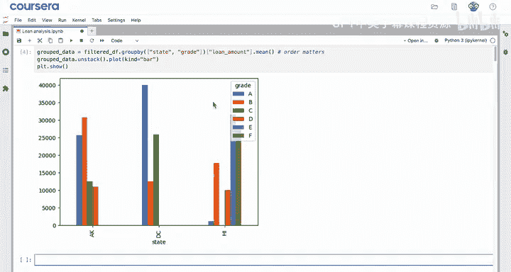

这种方法有两个令人困扰的地方：图表不够美观，并且需要大量繁琐的数据操作才能生成这种常见的图表。

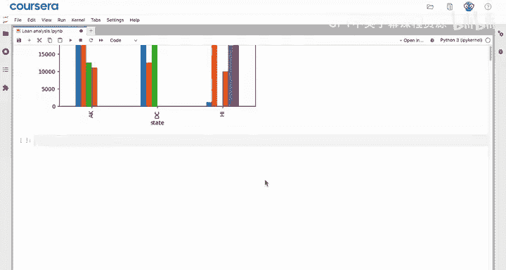

**使用Seaborn创建相同的图表**则简单得多：

```python
sns.barplot(data=filtered_df, x='state', y='loan_amnt')
plt.show()
```

代码 `sns.barplot(data=filtered_df, x='state', y='loan_amnt')` 直接使用原始数据框，Seaborn会自动计算每个州的平均贷款金额并绘制条形图，无需预先分组。

### 添加分组维度（Hue参数）

上面的图表展示了各州的平均贷款额。如果我们还想按贷款等级（grade）进一步细分，该怎么办呢？在Seaborn中，这非常简单。

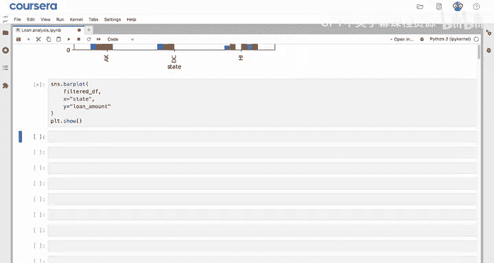

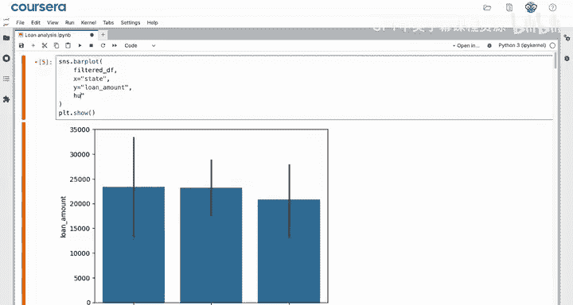

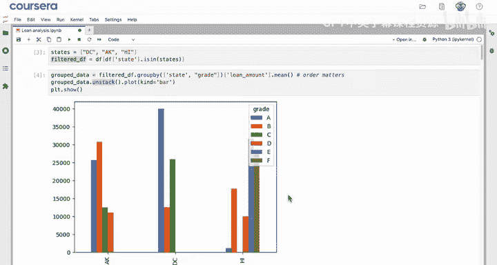

以下是使用`hue`参数添加分组的方法：

```python
sns.barplot(data=filtered_df, x='state', y='loan_amnt', hue='grade')
plt.title('Average Loan Amount by State and Grade')
plt.xlabel('State')
plt.ylabel('Average Loan Amount')
plt.legend(title='Grade', bbox_to_anchor=(1.05, 1), loc='upper left') # 将图例移到图表外
plt.show()
```

参数 `hue='grade'` 告诉Seaborn使用颜色来区分不同的贷款等级。这样，我们就得到了一个带有误差条和标签的、外观精美的分组条形图。这就是Seaborn的力量：以极少的努力获得非常美观的图表。

### 结合Matplotlib进行自定义

由于Seaborn构建在Matplotlib之上，因此可以完美地结合两者的命令。你可以像上面例子中那样，在Seaborn绘图后，继续使用Matplotlib的`plt.title()`、`plt.xlabel()`、`plt.ylabel()`等函数来添加或修改图表元素。

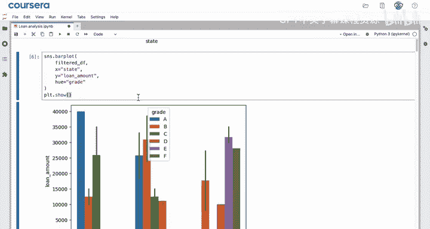

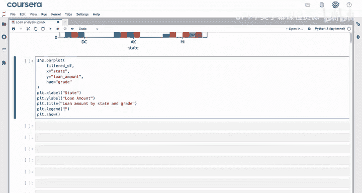

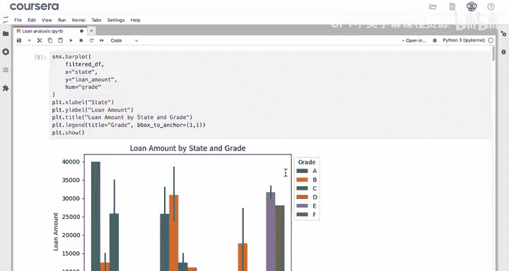

### 快速尝试其他度量和图表

Seaborn的设置也使得快速尝试其他度量指标变得容易。例如，如果你想可视化利率而不是贷款金额，只需更改`y`参数：

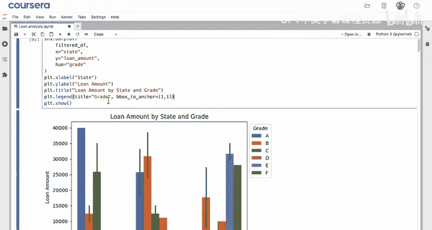

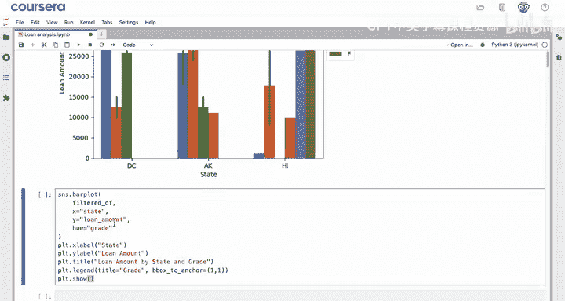

```python
sns.barplot(data=filtered_df, x='state', y='int_rate', hue='grade')
plt.show()
```

默认情况下，`barplot`函数绘制的是均值（`np.mean`）。但你可以使用其他估计量（estimator）。

以下是更改估计量的方法：

```python
# 使用最大值作为估计量
sns.barplot(data=filtered_df, x='state', y='int_rate', hue='grade', estimator=np.max)

# 使用数据点数量作为估计量
sns.barplot(data=filtered_df, x='state', y='int_rate', hue='grade', estimator=len)
```

你可以使用`np.max`、`np.std`（标准差）或`len`（计数）等。选择哪种估计量取决于你希望向客户传达什么信息。

### Seaborn的核心能力总结

本节课中我们一起学习了Seaborn的核心能力，让我们来总结一下：

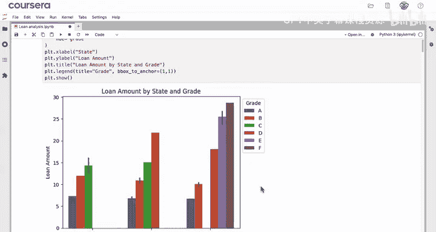

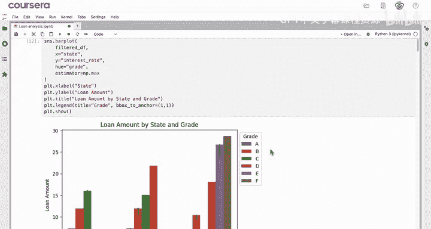

1.  **提供额外的绘图函数**：如`barplot`、`lineplot`、`regplot`等。
2.  **自动数据汇总**：无需手动进行`groupby`和汇总步骤，默认使用`np.mean`。
3.  **灵活的估计量**：可以通过`estimator`参数轻松切换为`np.max`、`np.size`、`np.std`等。
4.  **美观的默认样式**：快速生成具有专业外观的图表。

总而言之，Seaborn的核心价值在于：它能让你在快速创建美观图表的同时，省去将数据精细处理成合适格式的麻烦。在接下来的视频中，你将学习如何进一步自定义图表的外观。

---

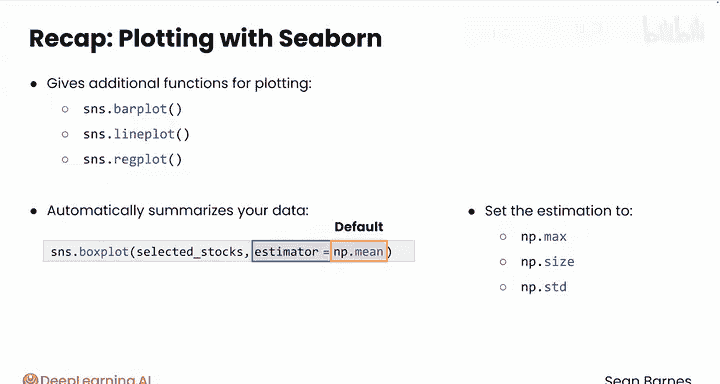

**总结**：本节课我们介绍了数据可视化库Seaborn。我们学习了它的主要优势，并通过实例对比了其与Matplotlib在创建分组条形图时的差异。我们掌握了使用`barplot`函数和`hue`参数来创建分组图表，以及如何结合Matplotlib命令进行自定义和切换不同的数据估计量。Seaborn是一个能极大提升数据分析效率和图表美观度的强大工具。