# 054：Python数据分析 - P54 主题与调色板 🎨

在本节课中，我们将学习如何使用Seaborn库来美化数据可视化图表。我们将重点掌握两个核心工具：**主题**和**调色板**。通过它们，你可以轻松地改变图表的默认样式和颜色方案，从而创建出更具视觉吸引力和专业感的图表。

---

## 概述

上一节我们介绍了如何创建基础的柱状图。本节中，我们来看看如何通过调整主题和调色板来提升图表的视觉效果。我们将使用一个关于各州贷款平均利率的图表作为示例，并逐步对其进行美化。

## 设置主题

在样式和颜色方面，Seaborn比Matplotlib提供了更多开箱即用的选项。你用于样式化的两个主要工具是**主题**和**调色板**。

首先，你可以使用Seaborn的 `set_theme` 函数。这个函数只需调用一次，之后创建的所有图表都会应用这个主题设置。你仍然可以修改图表的其他方面，本质上你只是选择了一套不同的默认样式。


假设你已经导入了必要的模块并将数据读取到了名为 `df` 的DataFrame中。同时，你已经基于之前的视频内容，创建了一个展示“贷款金额最高州”的“各信用等级平均利率”图表。

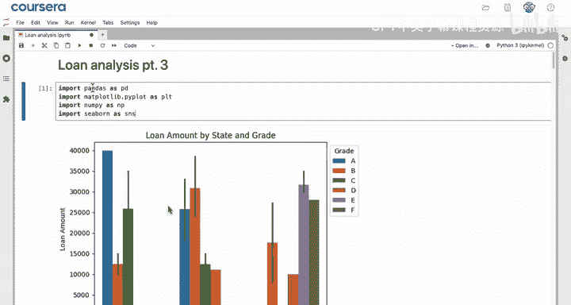

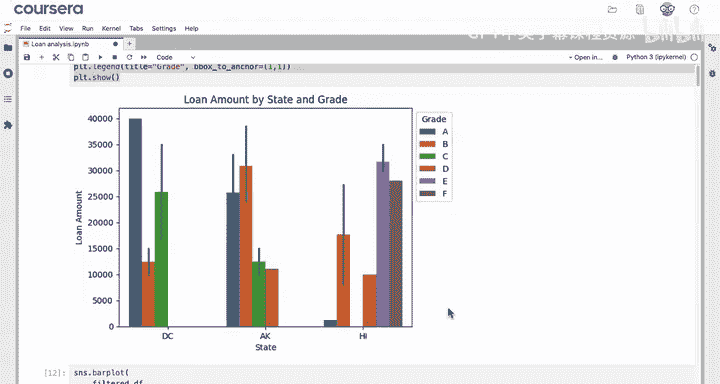

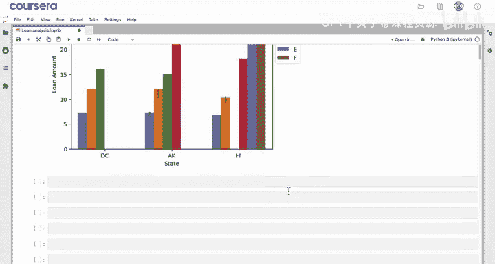

为了提升其视觉吸引力以便纳入报告，第一步就是设置主题。

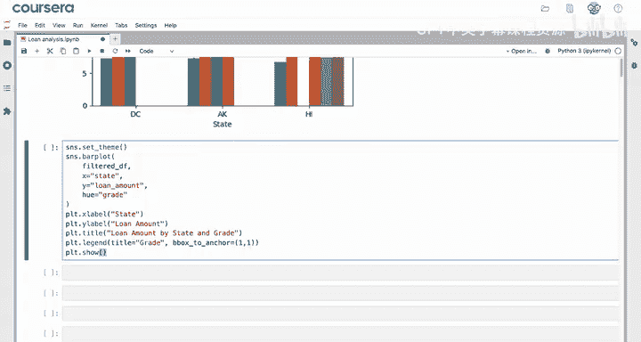

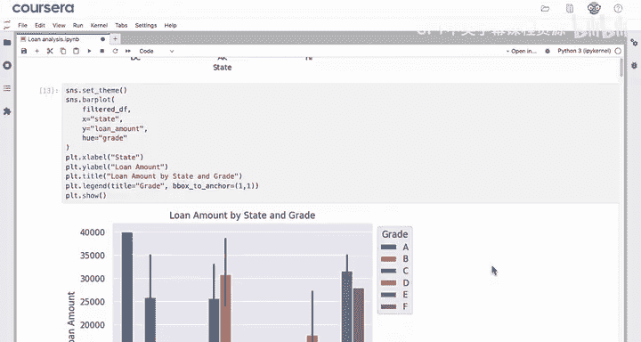

```python
import seaborn as sns
sns.set_theme()
```

调用 `set_theme()` 后，再创建与之前相同的图表，你会发现它的外观已经改变了。每个柱状图现在都有了白色边框，整个图表背景颜色更深，坐标轴线（spines）变为白色或不可见。这是一个非常棒的主题。

请注意，如果你在新的代码单元中再次创建同一个图表，这个主题设置依然有效。

## 调整样式

`set_theme` 函数有一个名为 `style` 的参数，允许你为图表选择更合适的样式。

如果你想将主题重置回Matplotlib的基础样式，可以将 `style` 参数设置为 `'white'`。对于像分组柱状图这样信息密集的图表，`'white'` 样式是一个很好的选择。

```python
sns.set_theme(style='white')
```

## 使用调色板

你也可以改变图表中的颜色方案，这是Seaborn最酷的功能之一。目前，你的图表使用的是包含多种不同颜色的分类调色板。

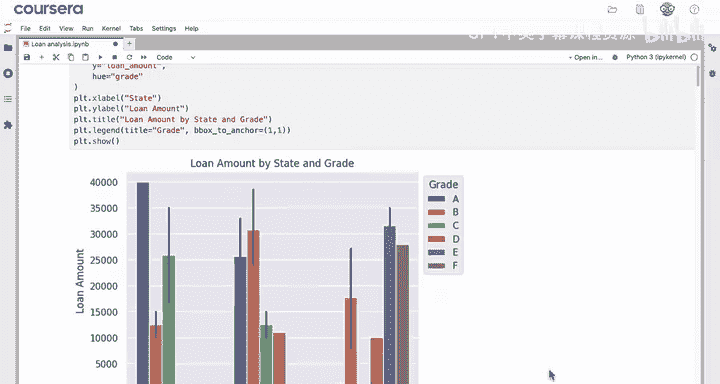

但是，一个像之前用过的从绿色到红色的**渐变调色板**，能更好地强调这张图表中的洞察。

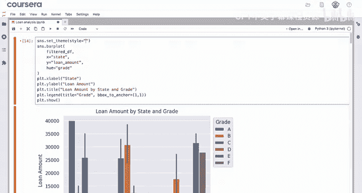

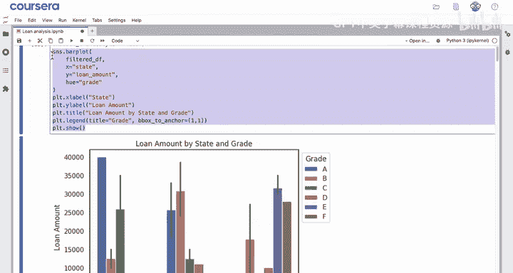

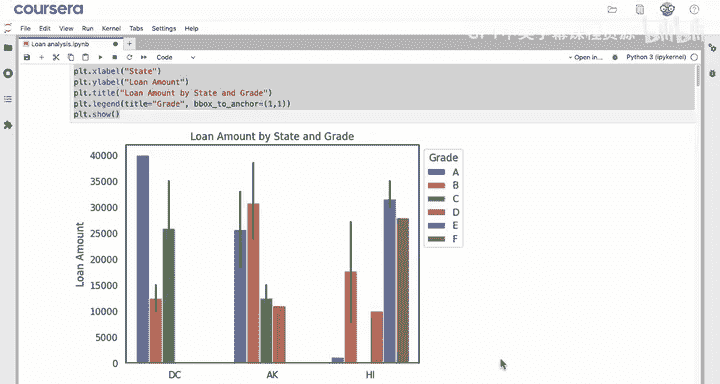

你需要在绘图函数中添加一个名为 `palette` 的参数。这个参数的值应该是一个颜色调色板的名称。Seaborn提供了大量可用的调色板，但你需要查询它们的名称。

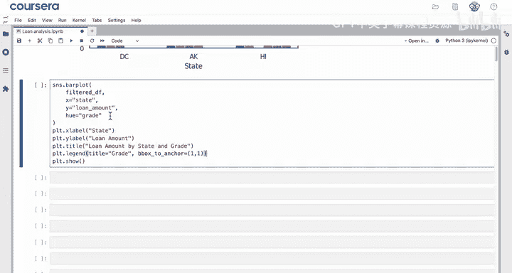

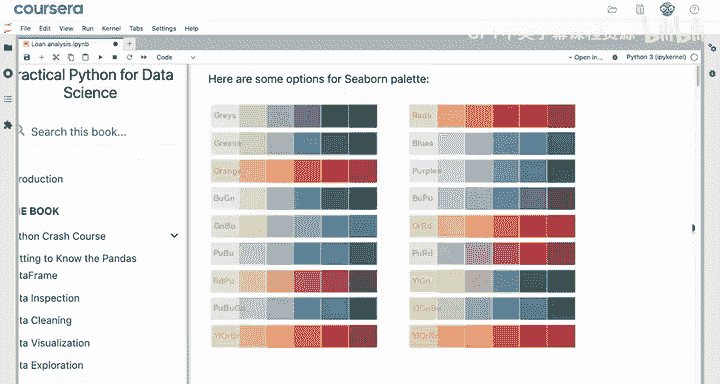

例如，在“实用Python数据科学”网站上列出了可用的调色板。你有诸如 `'Blues'` 或 `'Blues_r'`（反向）等选项。

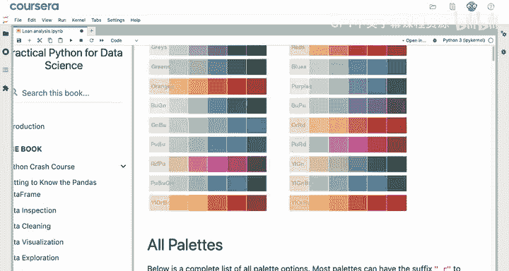

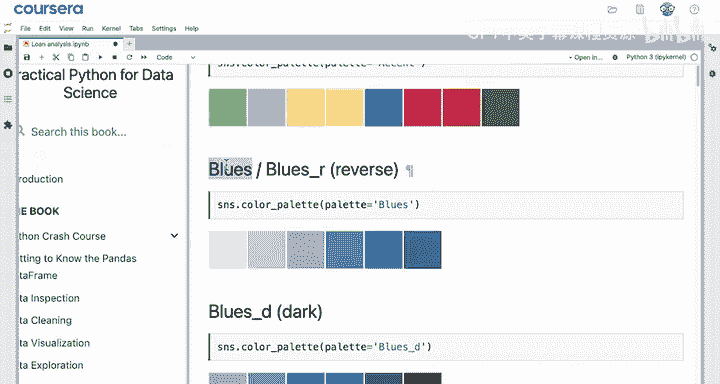

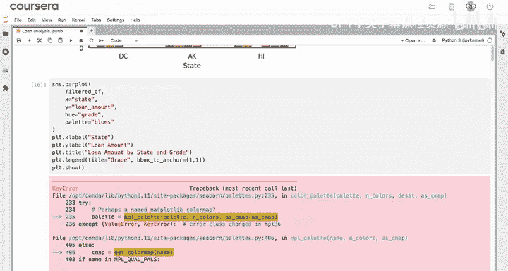

现在，尝试将 `'blues'` 调色板添加到你的代码中。

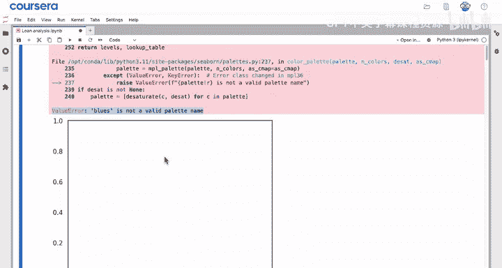

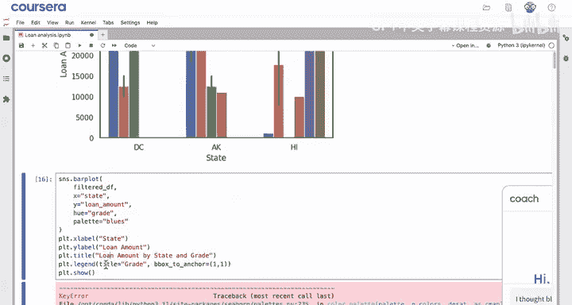

```python
# 示例代码，假设绘图函数是 barplot
sns.barplot(x='grade', y='int_rate', hue='addr_state', data=df, palette='blues')
```

运行后你可能会遇到一个错误，得到一个空白图表和 `ValueError: 'blues' is not a valid palette name` 的提示。

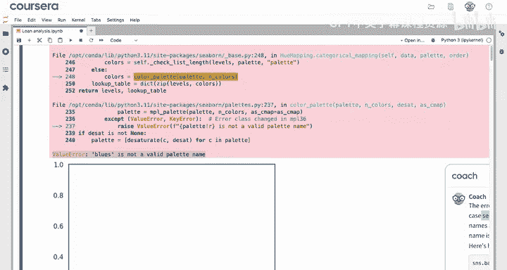

让我们向大语言模型（LLM）咨询一下。我认为 `'blues'` 是一个有效的调色板名称。

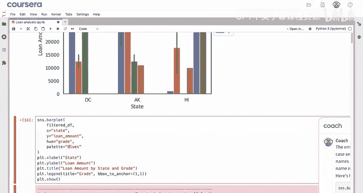

大语言模型会告诉你，这个错误很可能是因为大小写敏感问题。正确的调色板名称是 `'Blues'`，首字母B需要大写。

所以，让我们将 `'blues'` 改为 `'Blues'`：

```python
sns.barplot(x='grade', y='int_rate', hue='addr_state', data=df, palette='Blues')
```

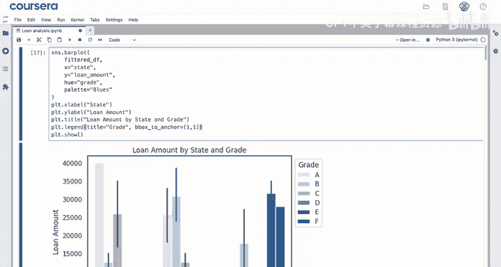

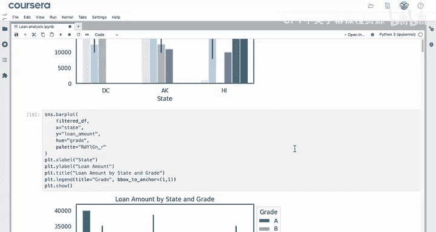

现在图表看起来很棒了！请记住，计算机通常对大小写很敏感。如果你遇到错误，可以随时向LLM寻求调试帮助。

`'Blues'` 看起来不错，但作为一个**顺序调色板**，它不如一个包含从绿色到红色多种颜色的调色板那样能突出关键洞察。

要获得之前那种从绿到红的效果，你可以使用 `'RdYlGn_r'` 调色板（Red-Yellow-Green反向）。

```python
sns.barplot(x='grade', y='int_rate', hue='addr_state', data=df, palette='RdYlGn_r')
```

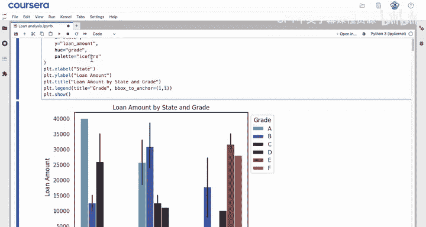

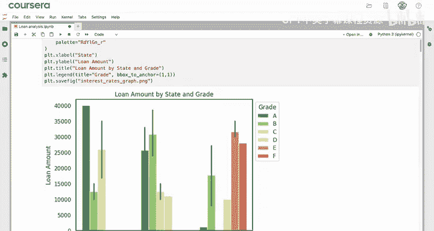

其他选项包括，如果你需要制作色盲友好的图表，可以使用从紫色到黄色的 `'plasma'` 调色板，或者从蓝色到橙色的 `'icefire'` 调色板。

我们暂时坚持使用 `'RdYlGn_r'` 调色板。现在，这个图表就可以分享给你的客户了。他们可以利用它来理解在这三个贷款平均金额最高的州中，利率是如何变化的。

## 总结

本节课中我们一起学习了如何使用Seaborn美化图表。

*   我们首先介绍了 `sns.set_theme()` 函数，用于改变图表的默认样式。
*   接着，我们探讨了如何使用 `style` 参数选择样式，其中 `style='white'` 可以将图表恢复为默认的Matplotlib外观。
*   最后，我们重点学习了**调色板**的使用。通过 `palette` 参数，并选择如 `'Blues'`、`'RdYlGn_r'` 等选项，我们可以显著提升图表的美学效果。

使用调色板可以避免为图表手动选择颜色的麻烦。创建如此具有视觉吸引力的图表可以带来很多乐趣，Seaborn非常适合进行各种实验。

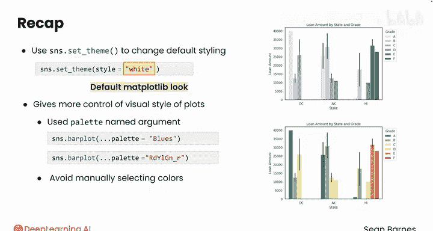

请跟随我进入下一个视频，学习如何从箱线图开始，创建视觉冲击力强的分布图。