# 055：使用Seaborn绘制箱线图 📊

在本节课中，我们将学习如何使用Seaborn库创建箱线图。箱线图是探索性数据分析中一种强大的工具，它能直观地展示数据的分布情况，包括中位数、四分位数和异常值。与Matplotlib相比，Seaborn使创建箱线图变得更加简单。

## 概述与数据准备

上一节我们介绍了数据可视化的重要性。本节中，我们来看看如何使用Seaborn绘制箱线图来探索数据分布。

我们使用的数据集包含个人特征（如职业和贷款历史）以及贷款特征（如贷款金额和利率）。在开始之前，我们已经导入了必要的模块并将数据读取到了名为`df`的DataFrame中。

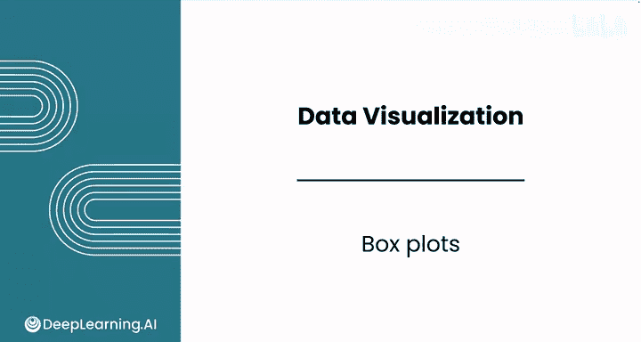

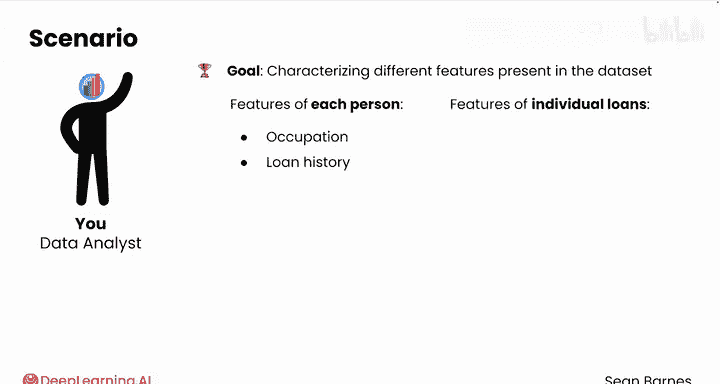

## 绘制基础箱线图

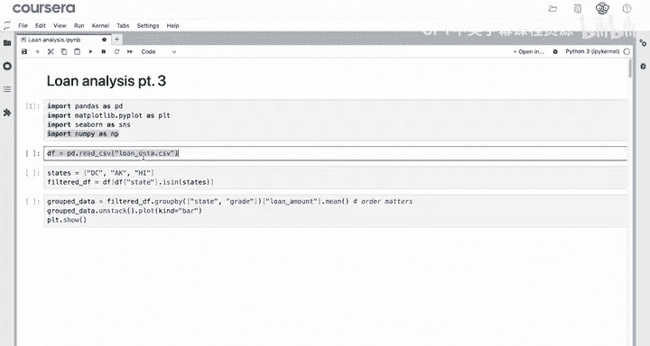

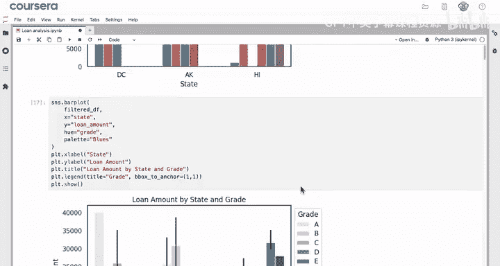

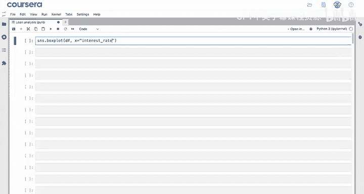

Seaborn的`sns.boxplot()`函数使得创建箱线图非常容易。以下是创建一个基础箱线图的步骤。

首先，假设我们想查看数据集中所有贷款的利率分布。我们可以使用`sns.boxplot()`函数，并指定数据源和要绘制的变量。

以下是绘制利率水平箱线图的代码：
```python
sns.boxplot(data=df, x='interest_rate')
plt.show()
```

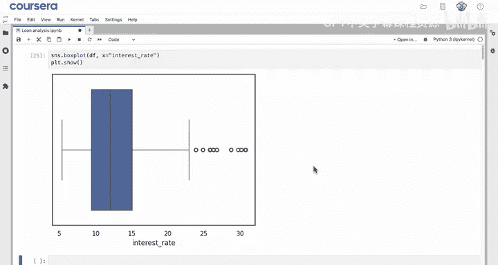


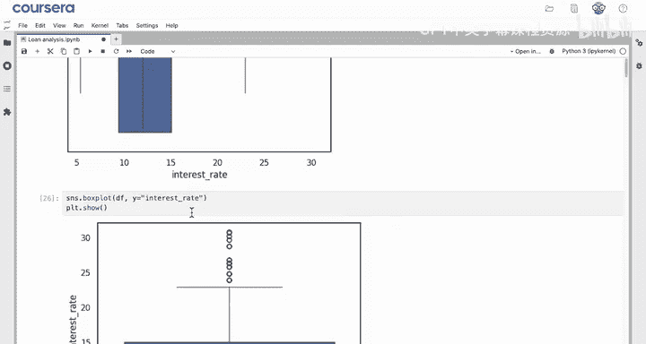

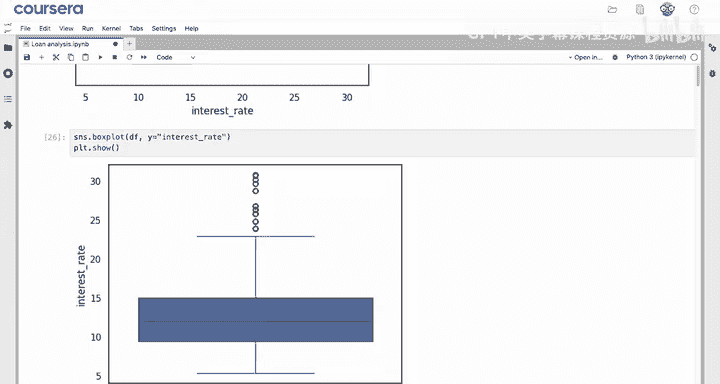

生成的图表显示了利率的偏态分布，中位数利率约为12%。这个分布图有助于我们理解这些贷款的典型利率水平。

## 调整箱线图方向与添加标签

箱线图可以是水平或垂直的，这主要取决于个人偏好和展示需求。

如果将变量赋值给`y`参数，则会得到一个垂直的箱线图。在解读上，两者没有本质区别。
```python
sns.boxplot(data=df, y='interest_rate')
```

为了提升图表的可读性，我们通常需要添加标题和轴标签。
```python
plt.title('Distribution of Loan Interest Rates')
plt.ylabel('Interest Rate (%)')
```


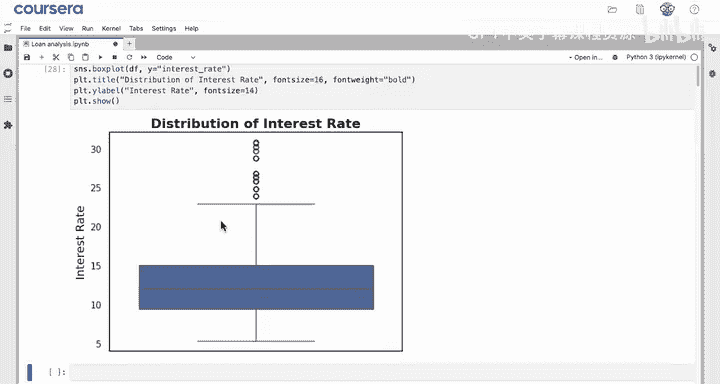

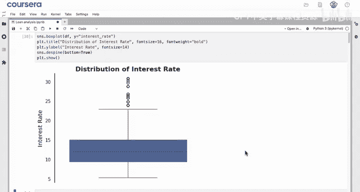

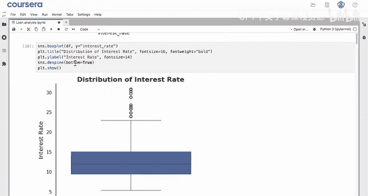

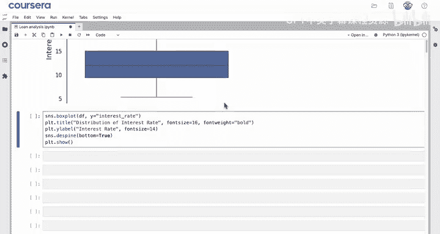

## 自定义图表样式：移除边框

在单个垂直箱线图中，X轴通常没有具体含义，移除不必要的边框可以使图表更简洁，提高“数据-墨水比”。

Seaborn提供了`sns.despine()`函数来轻松移除图表边框。默认情况下，它会移除顶部和右侧的边框。
```python
sns.despine()
```
如果想移除底部边框，可以设置参数`bottom=True`。这里的`True`表示“同意移除”。
```python
sns.despine(bottom=True)
```
应用后，图表会变得更加清晰，去除了不必要的边界。

## 绘制分组箱线图

箱线图的一个强大功能是可以按另一个变量进行分组，以比较不同类别间的分布差异。

例如，我们可以按贷款等级来分段查看利率分布，只需在`boxplot`函数中同时指定`x`和`y`参数。
```python
sns.boxplot(data=df, x='grade', y='interest_rate')
```

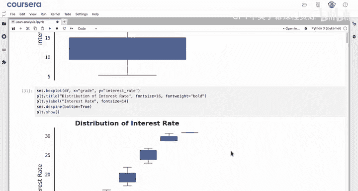

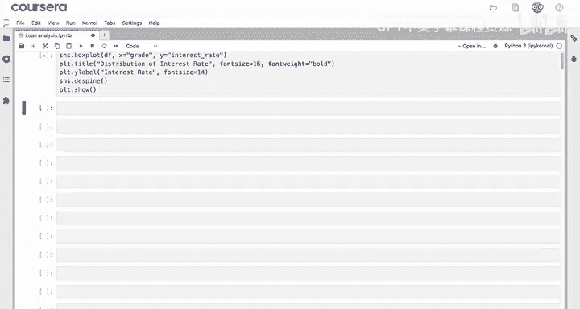


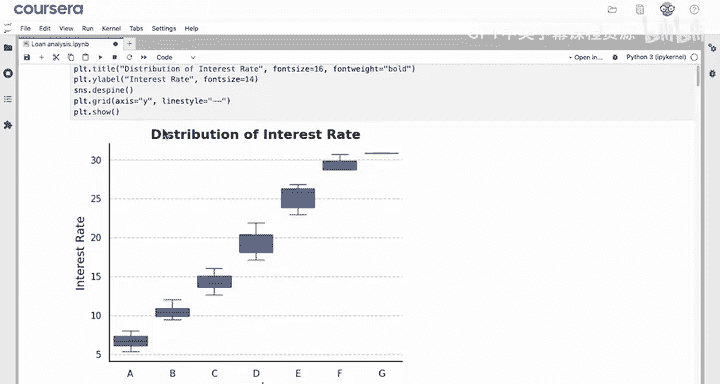

从图中可以清晰地看到，利率随着贷款等级下降而显著上升。A级贷款的利率在个位数，而E、F、G级贷款的利率则在20%左右。这种图表可以帮助客户理解不同风险等级贷款的盈利情况。

由于此时X轴（贷款等级）包含重要信息，我们应该恢复底部边框。
```python
sns.despine(bottom=False) # 或直接不设置bottom参数
```

## 进一步美化：添加网格与调色板

为了使一系列图表风格统一，便于客户阅读，我们可以添加Y轴网格线。
```python
plt.grid(axis='y', alpha=0.5)
```

我们还可以为不同组别分配颜色。为了保持与之前图表的一致性，可以使用相同的调色板。
```python
sns.boxplot(data=df, x='grade', y='interest_rate', palette='RdYlGn_r')
```


> **注意**：你可能会看到一个关于`palette`参数的警告。这不是错误，而是模块开发者的提示，表明未来版本中某些用法可能会改变。在当前版本，如果同时使用`x`和`palette`参数，可能会收到警告。你可以尝试使用`hue`参数来代替`x`进行分组，但这样可能会使图例仅靠颜色区分，降低可读性。因此，根据你的Seaborn版本，可以选择保留`x`参数。

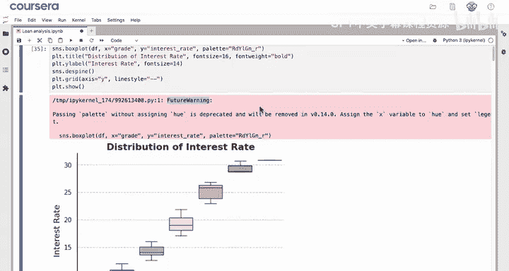

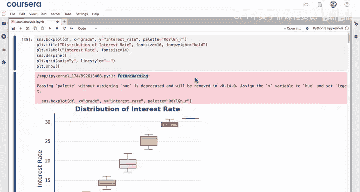

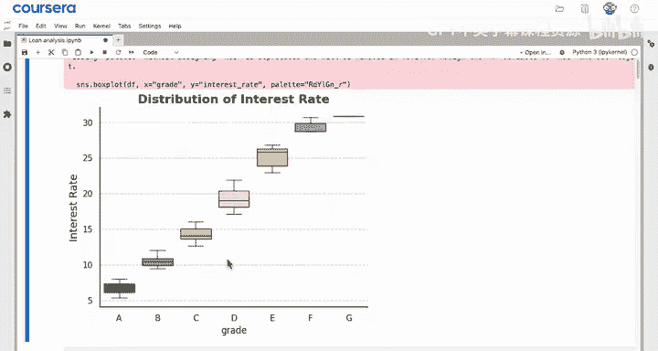

## 调整图表尺寸

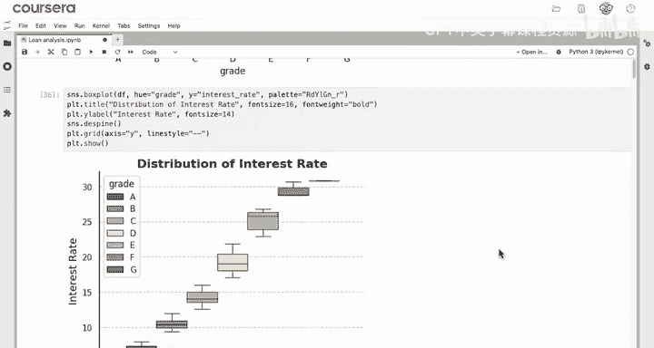

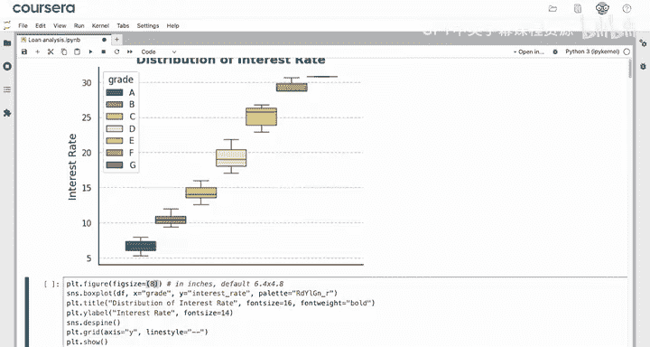

当图表中包含大量信息时，增大图表尺寸可以提升可读性。我们可以在创建图表之前使用`plt.figure()`来设置画布大小。
```python
plt.figure(figsize=(8, 6)) # 宽度和高度，单位为英寸
sns.boxplot(data=df, x='grade', y='interest_rate')
```
默认的图形尺寸约为6.4 x 4.8英寸（约16 x 12厘米）。将尺寸设置为8 x 6英寸是一个不错的增大选择。

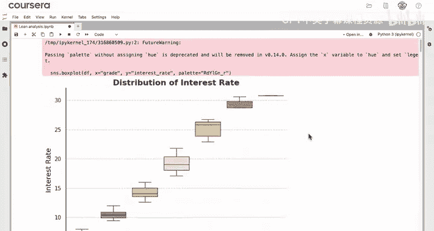


## 总结 📝

本节课中我们一起学习了如何使用Seaborn创建和定制箱线图。

以下是本课的核心要点总结：
*   **创建箱线图**：使用 `sns.boxplot(data=df, x='column')` 或 `sns.boxplot(data=df, y='column')` 来创建水平或垂直箱线图。
*   **分组比较**：通过同时设置 `x` 和 `y` 参数，可以按另一个变量（如`grade`）分段查看分布。
*   **简化边框**：使用 `sns.despine()` 可以移除图表的顶部和右侧边框，使用 `bottom=True` 等参数可以移除其他边框。
*   **调整尺寸**：在绘图前使用 `plt.figure(figsize=(width, height))` 可以调整图表的整体大小，尺寸单位为英寸。

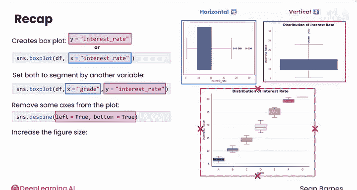


箱线图是可视化数据分布的重要工具之一。在接下来的课程中，我们将学习如何在Seaborn中创建直方图，这是另一种分析数据分布的强大方法。