# 056：Python数据分析（第3课）｜直方图绘制教程

在本节课中，我们将学习如何使用Seaborn库绘制直方图，以可视化数据特征的分布情况。直方图是数据分析中常用的图表类型，能够帮助我们快速识别数据中的模式和异常。

---

## 🎯 概述：直方图的基本概念

直方图是一种用于展示数据分布的图表类型。它通过将数据分成多个区间（称为“箱”或“bin”），并统计每个区间内数据点的数量，从而形成一系列柱状图。直方图特别适用于观察数据的集中趋势、离散程度以及异常值。

在数据分析中，直方图常用于探索性数据分析（EDA），帮助分析师理解数据的整体特征。例如，在贷款数据中，直方图可以揭示贷款金额的常见区间和频率分布。

---

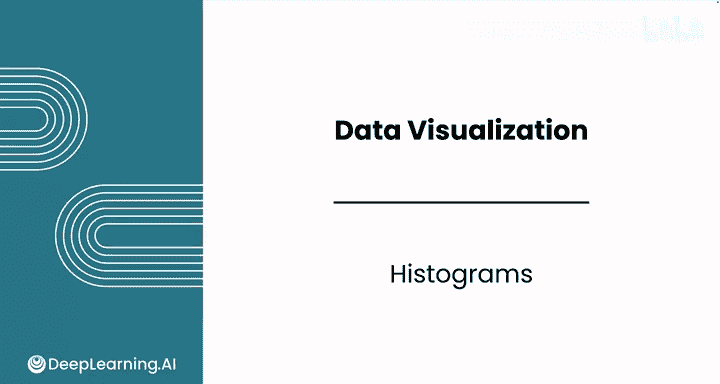

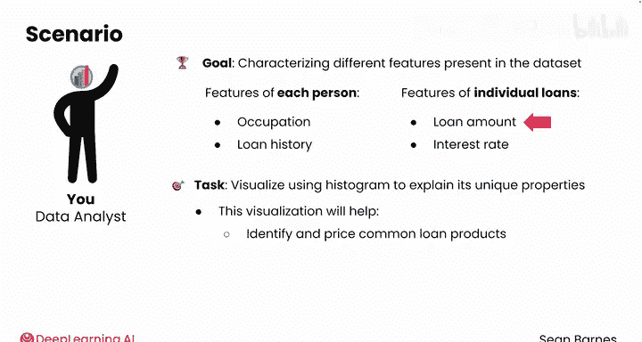

## 📈 绘制基础直方图

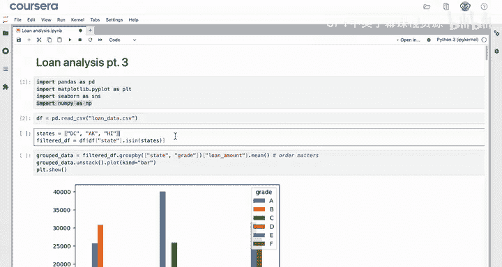

上一节我们介绍了直方图的基本概念，本节中我们来看看如何使用Seaborn绘制一个基础的直方图。Seaborn库提供了简洁的API，能够生成美观的图表，并且可以与Matplotlib结合使用进行进一步的自定义。

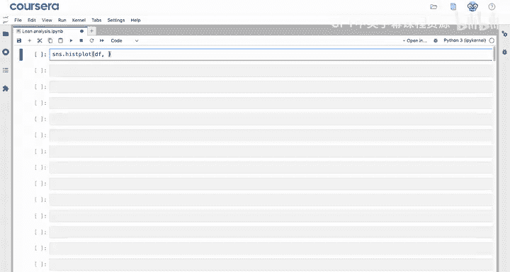

假设我们已经导入了必要的模块并读取了数据，数据存储在变量`df`中。我们想要可视化“贷款金额”这一特征的分布情况。

以下是绘制基础直方图的步骤：

1.  导入Seaborn和Matplotlib库。
2.  使用`sns.histplot()`函数，并指定数据框和要绘制的列。
3.  调用`plt.show()`显示图表。

对应的代码如下：

```python
import seaborn as sns
import matplotlib.pyplot as plt

# 假设df是包含数据的数据框
sns.histplot(data=df, x='loan_amount')
plt.show()
```

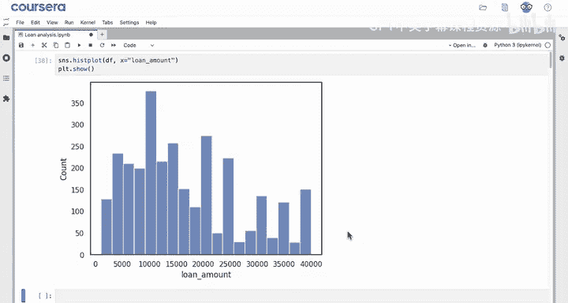

执行上述代码后，你将得到一个展示贷款金额分布的直方图。从图中可以观察到，频率的峰值出现在一些整数值上，例如10,000、20,000、25,000等。这种模式值得进一步研究，以帮助客户理解不同金额贷款背后的心理因素和市场需求。

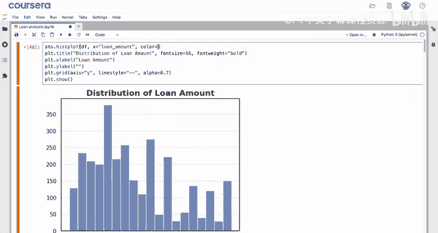

---

## 🎨 自定义直方图外观

基础图表已经能够展示数据分布，但为了提升可读性和专业性，我们通常需要添加标题、坐标轴标签和网格线，并调整颜色。

以下是自定义直方图外观的步骤：

1.  使用`plt.title()`添加图表标题。
2.  使用`plt.xlabel()`和`plt.ylabel()`设置坐标轴标签（本例中可以移除Y轴标签，因为它通常不言自明）。
3.  使用`plt.grid(True)`添加网格线。
4.  在`sns.histplot()`中使用`color`参数更改柱子的颜色。

对应的代码如下：

```python
sns.histplot(data=df, x='loan_amount', color='rosybrown')
plt.title('贷款金额分布直方图')
plt.xlabel('贷款金额')
plt.ylabel('频率')
plt.grid(True)
# 移除Y轴标签，因为“频率”通常不需要特别标注
plt.gca().set_ylabel('')
plt.show()
```

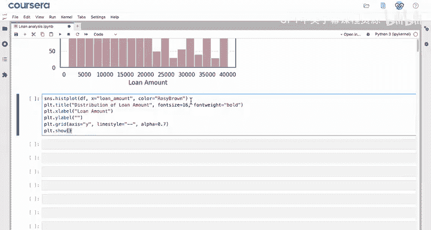

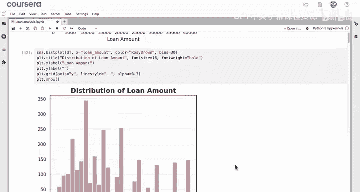

通过这些调整，图表变得更加清晰易懂，便于向客户展示关键信息。

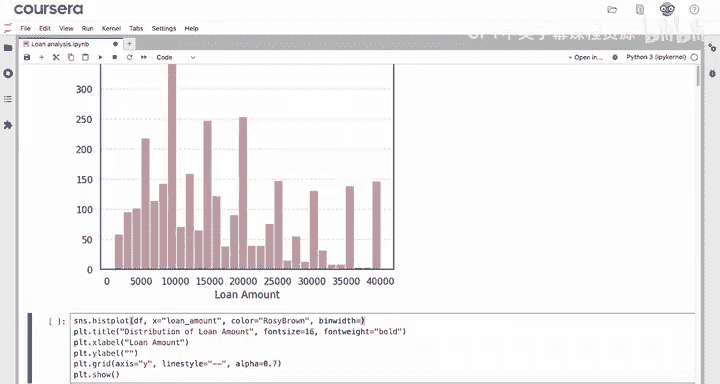

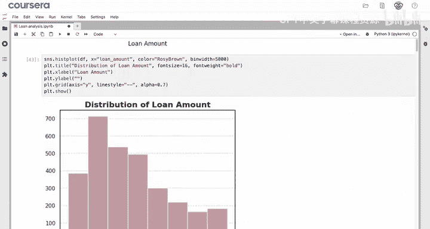

---

## ⚙️ 调整箱体（Bins）参数

为了更清晰地显示数据中的峰值（例如5,000处的峰值），我们可以调整直方图的箱体（bins）参数。箱体决定了数据被分成的区间数量和宽度。

以下是调整箱体参数的两种方法：

1.  **设置箱体数量**：使用`bins`参数，例如`bins=30`，将数据分成30个等宽的区间。
2.  **设置箱体宽度**：使用`binwidth`参数，例如`binwidth=5000`，指定每个箱体的宽度为5000美元。**注意**：`binwidth`参数会覆盖`bins`参数，两者只需使用一个。

对应的代码如下：

```python
# 方法一：设置箱体数量
sns.histplot(data=df, x='loan_amount', bins=30, color='rosybrown')
plt.title('贷款金额分布 (30个箱体)')
plt.xlabel('贷款金额')
plt.grid(True)
plt.show()

# 方法二：设置箱体宽度
sns.histplot(data=df, x='loan_amount', binwidth=5000, color='rosybrown')
plt.title('贷款金额分布 (箱体宽度: $5,000)')
plt.xlabel('贷款金额')
plt.grid(True)
plt.show()
```


设置箱体宽度后，图表的可解释性更强，因为每个箱体代表一个明确的金额范围。例如，客户可以轻松看出5,000到10,000美元范围内的贷款数量大约是20,000到25,000美元范围的两倍。

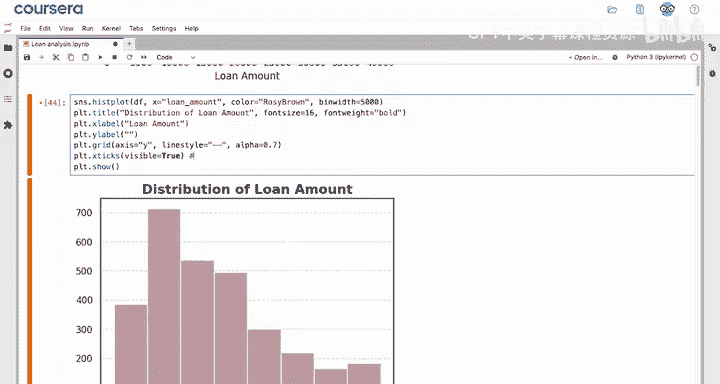

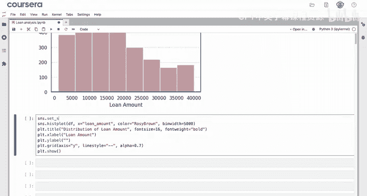

---

## 🔧 解决主题样式导致的显示问题

在使用Seaborn的某些主题样式时，你可能会遇到坐标轴刻度线不显示的问题。这是一个由主题设置引起的常见视觉问题，并非代码错误。

解决方法是使用Seaborn的`set_style()`函数来调整主题组件。要显示刻度线，可以运行以下代码：

```python
sns.set_style("ticks")
```

运行这行代码后，再重新绘制图表，X轴和Y轴的刻度线就会正常显示。这个例子说明，作为数据分析师，除了会使用工具，还需要具备一定的库知识来解决问题。与AI协作是过程，但理解底层原理同样重要。

---

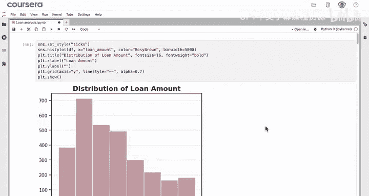

## 📊 添加核密度估计（KDE）曲线

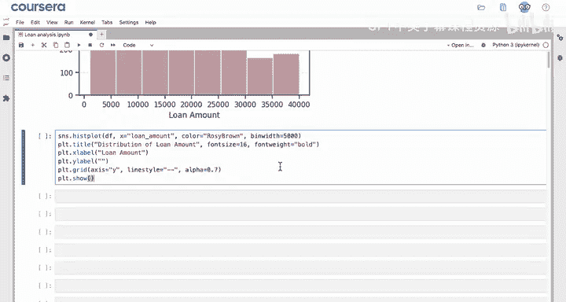

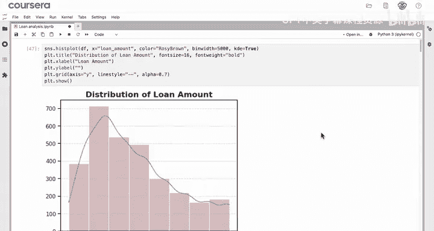

除了观察频率分布，我们有时还想了解数据的概率密度分布。这时可以在直方图上叠加一条核密度估计（Kernel Density Estimate， KDE）曲线。

KDE曲线通过平滑技术估计数据的概率密度函数，帮助我们洞察整个分布范围内的相对概率。

添加KDE曲线非常简单，只需在`sns.histplot()`函数中设置参数`kde=True`即可。

对应的代码如下：

```python
sns.histplot(data=df, x='loan_amount', binwidth=5000, color='rosybrown', kde=True)
plt.title('贷款金额分布与密度曲线')
plt.xlabel('贷款金额')
plt.grid(True)
sns.set_style("ticks")
plt.show()
```

现在，直方图上多了一条平滑的曲线，它展示了贷款金额的概率密度估计，为数据分布提供了另一个视角。

---

## 📝 本节总结

本节课中我们一起学习了如何使用Seaborn绘制和自定义直方图：

*   **核心函数**：使用`sns.histplot()`可以快速绘制直方图。通过`x`或`y`参数可以指定绘制垂直或水平方向的直方图。
*   **关键参数**：
    *   `bins`：用于设置箱体的数量。
    *   `binwidth`：用于设置每个箱体的宽度（会覆盖`bins`参数）。
    *   `kde`：设置为`True`时，会在直方图上叠加核密度估计曲线。
*   **自定义与调试**：我们学习了如何添加标题、标签、网格和更改颜色。同时也了解到，图表的一些显示问题（如刻度线不显示）可能源于Seaborn的主题设置，可以使用`sns.set_style()`进行调整。

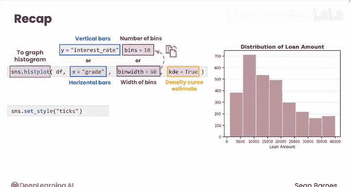

直方图是数据可视化中最核心的图表类型之一。掌握了柱状图、散点图和直方图，你已经能够完成绝大部分的数据可视化工作。在接下来的课程中，我们将探索Seaborn库中其他更多样化的图表类型。