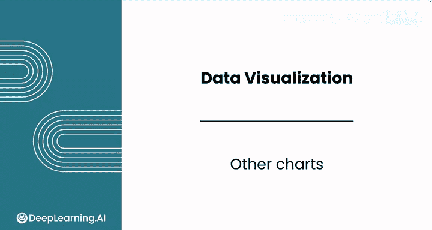
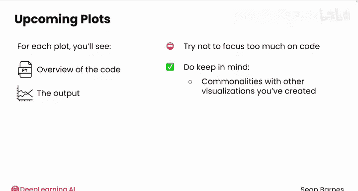
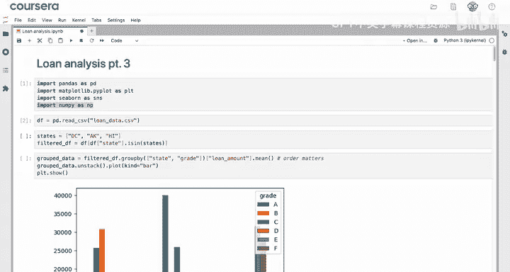
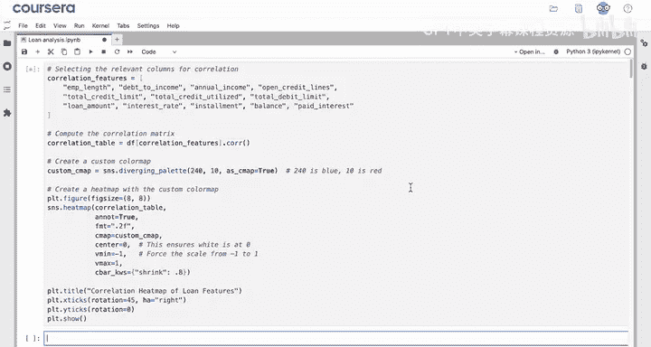
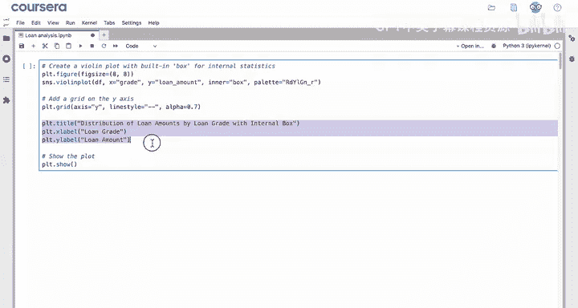
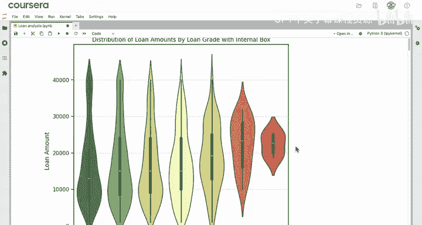
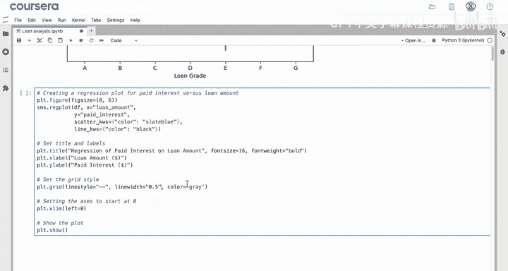
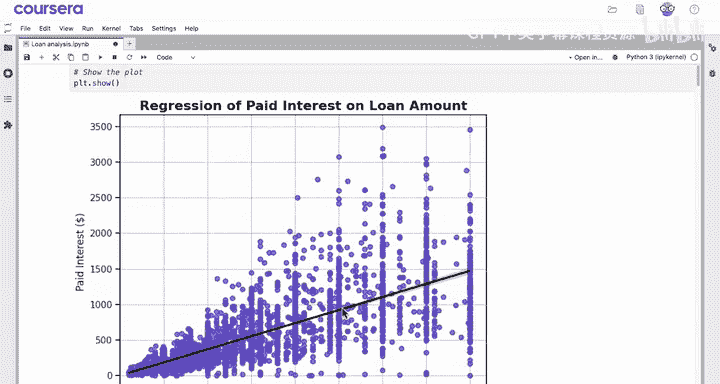

# 057：其他图表类型

在本节课中，我们将要学习Seaborn库中除柱状图和分布图之外的其他几种强大的图表类型。我们将重点介绍热力图、小提琴图和回归图，了解它们的用途、基本代码结构以及如何解读其结果。

---

## 🔥 热力图

上一节我们介绍了基础的分布图表，本节中我们来看看如何用热力图直观地展示数据间的相关性。

热力图非常适合用于可视化相关系数矩阵，它能将枯燥的数字表格转化为色彩丰富的图形，使正负相关关系一目了然。







以下是创建热力图的核心步骤：

1.  **计算相关系数矩阵**：使用Pandas DataFrame的 `.corr()` 方法。
    ```python
    corr_matrix = df.corr()
    ```
2.  **创建自定义色彩映射**：使用 `sns.diverging_palette()` 定义色彩。
3.  **设置图形尺寸**：使用 `plt.figure(figsize=(...))`。
4.  **绘制热力图**：使用 `sns.heatmap()` 函数，并传入相关系数矩阵和色彩映射。
5.  **添加标题和刻度标签**：使用 `plt.title()`, `plt.xticks()`, `plt.yticks()` 进行美化。
6.  **显示图形**：使用 `plt.show()`。

运行代码后，你将得到一个展示不同特征间相关性的热力图。与纯数字表格相比，热力图能清晰显示：负相关用渐深的蓝色表示，正相关用红色表示。例如，你可能会发现“利率”和“总债务限额”之间存在最强的负相关关系。

这种可视化结果可以直接分享给项目相关方，帮助他们理解特征间的关系，从而识别预测“已付利息”的机会，或筛选出最有利可图的贷款。你也可以据此决定后续需要绘制哪些散点图进行深入分析。

---



## 🎻 小提琴图

了解了展示相关性的热力图后，我们再来看看另一种展示数据分布的图表——小提琴图。它结合了箱形图和核密度估计图的优点。

小提琴图类似于箱形图，可以展示数据分布，但它还能额外揭示数据在何处更为密集。每个“小提琴”内部都包含了一个箱形图。

以下是绘制小提琴图的关键代码结构：
```python
sns.violinplot(x='grade', y='loan_amnt', data=df, palette='RdYlGn')
```

通过观察生成的小提琴图，你可以比较不同贷款等级（A到G）的贷款金额分布。例如，虽然A到D级贷款的中位数金额相似，但随着等级变差，数据的“主体”逐渐上移。A级贷款中位数约为12500，且呈明显的右偏（正偏）分布；而D级贷款的偏度较小，中位数约为15000；E级贷款分布更对称；F级贷款则呈现左偏（负偏）分布。

总之，不同等级贷款的集中趋势、变异程度和偏度都存在差异。



---



## 📈 回归图

最后，我们来探讨一种能直观展示变量间关系并拟合趋势线的图表——回归图。它特别适合用于初步探索两个连续变量之间的线性关系。

观察以下代码，你认为它会生成什么样的图形？一个实用技巧是将代码复制到大型语言模型（LLM）中，让它简洁地解释代码功能。LLM可能会告诉你，这段代码使用Seaborn库创建了一个回归图，用于可视化“已付利息”和“贷款金额”之间的关系，并添加了特定的注释。




运行代码后，你会得到一个散点图，并叠加了一条自动生成的最佳拟合线。这条线是由 `sns.regplot()` 函数自动计算的。

图中显示了一个较强的正相关关系，这与之前热力图中观察到的结果一致（两者的相关系数约为0.71）。你还可以看到数据在某些贷款金额（如35000和40000）周围形成了聚集。

这种图表可以帮助相关方理解“已付利息”与“贷款金额”之间的关系。同时需要注意，贷款金额只能解释已付利息约71%的变异性。例如，在25000美元的贷款中，有些贷款的已付利息为0（可能是新贷款），而大部分则聚集在1000美元左右。因此，要更准确地估计不同贷款的盈利性，还需要考虑利率、贷款期限等其他特征。

---

## ✅ 课程总结



本节课中我们一起学习了Seaborn库中三种高级图表：
1.  **热力图**：用于直观展示特征间的相关性矩阵。
2.  **小提琴图**：结合箱形图与密度图，深入展示数据分布形态。
3.  **回归图**：在散点图基础上自动拟合趋势线，揭示变量间关系。

以上仅是Seaborn众多强大绘图功能中的三个例子。你已在本课程中探索了从箱形图、直方图到色彩映射、主题设置等多种图表和定制方法。

接下来，你将通过练习作业和实践实验室来巩固本课的绘图技能。完成后，请跟随进入下一节课，我们将学习如何同时绘制多个图表。下节课见！